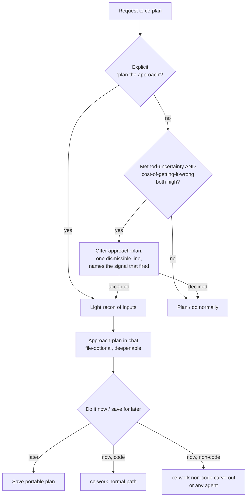

# ce-plan approach altitude：把 plan-for-a-plan 作为一等形态

## Summary

给 `ce-plan` 一个明确的 "approach altitude"：当问题很难时，先上提一层回答，产出 grounded *deliverable 将如何被制作* 的 plan，再 commit 到 deliverable 本身。入口可以是 explicit（"plan for a plan"），也可以很少见地 proactive offer。Approach-plan 先落在 chat 中（file-optional、可 deepen）；在 checkpoint，用户选择现在执行或以后执行。Non-code deliverable 的执行 route 到 lightweight `ce-work` carve-out（或任何 agent，因为 plan 保持 portable）；code execution 仍走 `ce-work` 正常路径。`ce-plan` 永远不 execute，它保持 planning / knowledge-structuring skill 的边界。

---

## Problem Frame

用户已经开始要求 `ce-plan` 产出一个 *intermediate* plan：先说明 agent 将如何 approach 一个 hard problem，然后再执行它。Canonical case 是 "Margolis" request：

> "Make a plan for the plan. I'm about to hand you two things: a book as a PDF, and the two-hour transcript of the meeting I just had with the author. I want a thoughtful plan for how my business problem, that conversation, and the lessons in the book come together into something I can actually use. Do not write that document now. Writing it is the work. Right now I only want the plan for how you'll read the book, mine the transcript, and produce a great document."

这是为了在 hard work 上先获得 **certainty and structure**，而不是 zero-shot 一个 fragile final deliverable。今天它会失败，逐句追踪这个 prompt 可以看到原因：

- `ce-plan` 的 non-software path 强制二选一：**plan-seeking**（保存 plan）或 **answer-seeking**（交付 answer，丢弃 scaffold）。这个请求都不是。它要的是 *现在有 approach plan，稍后产出真正 deliverable* 的两步形态。Classifier 可能开始 synthesize document，也可能 answer-seek toward it，而不是停在 approach。用户必须花三句强调 "Do not write that document now..."，这正是缺失 shape 的症状。
- **第二阶段没有 home。** 即使有完美 approach-plan，"now go do it" 也无处落地。`ce-work` 是 code-only，而 non-software handoff 没有 execution。用户自发想出的 `ce-plan -> ce-work` chain 失败，不是因为 two skills 错了，而是 `ce-work` 不能正确处理这种 plan。
- **Approach-plan 不会被 grounded。** 要为 *specific* transcript 结合 *specific* book 做好 mining plan，需要看它们。今天的 research 偏 repo / web，没有 "ingest 用户 heavy inputs 来 shape approach" 的步骤，所以 output 会是 generic methodology，而不是值得 approval 的 plan。

同一 pattern 也适用于 knowledge work 之外：*"before you write the implementation plan, plan how you'll investigate the codebase."* Executor 是 human 还是 agent 并不重要，portable plan 都应该读起来一样。缺失的是 altitude、hold，以及 execution 的 home。

---

## Key Decisions

- **真正边界是 code vs. knowledge-work，不是 plan vs. execute。** `ce-plan` 已经在执行 knowledge work：answer-seeking disposition 会读取 sources、analyze，并交付 produced result。产出 synthesis document 是同一行为，只是 output 更大。因此 planning、answering 和 synthesizing deliverable 都属于 `ce-plan` 的 knowledge-work remit；只有 **code** 需要 `ce-work` lifecycle。把线画在 code 上，既保留 sacred boundary（no code、no execution-time discovery），也允许 non-code deliverables 流动。

- **General capability，但 trigger high-precision / low-recall。** 能力是 domain-general，但 *proactive* offer 很少触发。因为 explicit path 永远可用，错误不对称：missed offer 很便宜，用户直接提出即可；wrong offer 是 nag。命名的敌人是 new-hammer failure mode：每个 `ce-plan` turn 都以 "want me to plan the approach first?" 开头。Borderline 时保持沉默。

- **Execution 不进 `ce-plan`；`ce-work` 增加 non-code carve-out。** 不让 planning skill 执行（那会感觉错位），也不把 document-production plan 塞进 `ce-work` code lifecycle（那会扭曲它），而是给 `ce-work` 加一个 minimal non-code branch。`ce-work` 仍然是 execution skill，不管 domain；`ce-plan` 仍然负责 planning。

- **Light recon，two-stage grounding。** 一个便宜 heuristic（request shape + input metadata）决定是否 *offer*；只有用户接受后才做 light recon（skim/sample，不 deep-read）。这样 approach-plan 足够具体，可供判断，又不会提前支付 deliverable 的全部成本。

- **Separate but coordinated，不重构已有 mechanics。** 已有三种 in-chat "approach" surfaces：answer-seeking 的 plan-of-attack、Phase 0.7 scoping synthesis、deepening pass。Approach-altitude 作为自己的 surface 建立，firing rules 要避免与它们重叠，而不是统一成一个概念或扰动已经工作的 skills。成本转移到 boundary-drawing：必须清楚说明 approach-altitude 何时触发、何时由已有 mechanic 处理。

---

## Flow

---

## Actors

- A1. **User**：发起 request，接受或拒绝 proactive offer，并在 checkpoint 做决定。
- A2. **`ce-plan`**：识别或 offer approach altitude，做 light recon，产出 approach-plan，并 route execution。绝不写 code，也不自己 execute non-code deliverable。
- A3. **`ce-work`（及其 non-code carve-out）**：执行 deliverable。任何 agent 都可以替代它，因为 plan 是 portable 的。

---

## Key Flows

- F1. **Explicit approach-plan**
  - **Trigger:** 用户请求 approach（"plan for a plan"、"plan how you'll do it"、"don't do it yet"）。
  - **Steps:** `ce-plan` 对 provided inputs 做 light recon -> 在 chat 中产出 grounded approach-plan -> checkpoint -> 按选择 route execution。
  - **Covered by:** R1, R5, R7, R8。

- F2. **Proactive offer**
  - **Trigger:** Plain request 没有 approach language，但 method-uncertainty 和 cost-of-getting-it-wrong 都高。
  - **Steps:** Cheap heuristic 触发 -> `ce-plan` 只 offer 一次，dismissible，且命名触发信号 -> 如果接受，从 recon 继续 F1；如果拒绝，正常 plan/do。
  - **Covered by:** R2, R3, R6。

- F3. **Execution routing**
  - **Trigger:** 用户在 checkpoint 选择 "do it now"。
  - **Steps:** Code deliverable -> `ce-plan` 产出 implementation plan 并把 code 交给 `ce-work` 正常路径。Non-code deliverable -> route 到 `ce-work` non-code carve-out（跳过 code lifecycle）或把 portable plan 交给任何 agent。
  - **Covered by:** R9, R10, R11, R12。

---

## Requirements

**Recognition and triggering**

- R1. `ce-plan` 识别 explicit approach-plan request，并始终遵守，不受 proactive heuristic gate 限制；它停在 approach，不开始 deliverable。
- R2. `ce-plan` 只有当 method-uncertainty 和 cost-of-getting-it-wrong 都高时，才 proactive offer approach-plan；任一低时保持沉默，正常 plan/do。
- R3. Proactive offer 是一句 lightweight、dismissible line，命名触发的 specific signal（"why it helps"）；绝不是 blocking ceremony。
- R4. 该能力是 domain-general：software 和 knowledge-work requests 都可使用，不关心 executor 是 human 还是 agent。
- R16. Approach-altitude 与已有三种 in-chat approach mechanics（answer-seeking 的 plan-of-attack、scoping synthesis、deepening pass）保持 distinct；其 firing rules 不与它们重叠或重复。

**Approach-plan production**

- R5. 产出 approach-plan 前，agent 对 provided inputs 做 light recon（skim/sample），用具体信息 ground approach；full ingestion defer 到 execution。
- R6. Offer/no-offer decision 是基于 request shape 和 input metadata 的 cheap heuristic；只有用户接受后才支付 recon 成本。
- R7. Approach-plan chat-first 且 file-optional；用户可以选择 persist 和 deepen。

**Checkpoint and execution routing**

- R8. Approach-plan 之后，用户在 checkpoint 决定：现在执行，或保存到以后。
- R9. Code execution 留在 `ce-work` 正常路径；`ce-plan` 永远不写 code。
- R10. Non-code deliverable execution route 到 `ce-work` non-code carve-out，或交给任何 agent 执行 portable plan。
- R11. `ce-plan` 自己不 execute deliverable；它产出 approach-plan 并 hand off。

**`ce-work` non-code carve-out**

- R12. `ce-work` input triage 识别 non-code plan（显式 signal），并 route 到跳过 code lifecycle 的分支（没有 branch/worktree、Test Discovery、commit/PR/CI）。
- R13. Carve-out 执行 production plan：读取 sources、synthesize、产出并保存 deliverable，报告落点。
- R14. Carve-out 是 code path 旁边的 minority-case branch，不是 co-equal mode，且不得扰动 code path。

**Portability**

- R15. Approach-plan / production-plan 保持 agent-agnostic：不把 `ce-work`-specific choreography 写进 body，所以交给任何 agent 都能执行。

---

## Acceptance Examples

- AE1. **Covers R1.** 给定 "plan for a plan" 或 "don't write it yet -- plan the approach"，`ce-plan` 产出 approach-plan，不开始 deliverable，不受 proactive heuristic 影响。
- AE2. **Covers R2, R3.** 给定 method 明确的 plain request，即使范围很大，`ce-plan` 不 offer approach-plan，而是正常 plan/do。
- AE3. **Covers R2, R3, R6.** 给定 heavy disparate inputs 和 vague outcome（"something I can actually use"），`ce-plan` 只 offer 一次，dismissible，并命名 signal；若被拒绝，继续正常流程且不重复询问。
- AE4. **Covers R9, R10.** 给定用户批准执行 *software* approach-plan，`ce-plan` 产出 implementation plan 并把 code 交给 `ce-work`。给定 *knowledge-work* approach-plan，execution route 到 `ce-work` carve-out（或任何 agent）。
- AE5. **Covers R12, R13.** 给定 `ce-work` carve-out 收到 non-code plan，它跳过 branch/test/commit/CI，改为读取 sources、synthesize 并写出 deliverable。

---

## Scope Boundaries

**Deferred for later**

- 完整的 non-software `ce-work` mode。Carve-out 有意保持 minimal；构建 co-equal knowledge-work execution engine 不在本轮范围内。
- Produced deliverable 的 git/save behavior（commit vs. plain write、保存位置）在 planning 时决定。
- 重命名 `ce-plan` 来反映它可以产出非 plan output。目前接受这个 naming oddity；answer-seeking disposition 已经存在类似情况。

**Outside this capability's identity**

- `ce-plan` 写或运行 code。Code 始终属于 `ce-work`。Approach altitude 绝不跨进 code execution。
- 没有 checkpoint 就自动 execute deliverable。停住正是这个 feature 的意义。

---

## Dependencies / Assumptions

- 基于 `plugins/compound-engineering/skills/ce-plan/references/universal-planning.md` 中已有 answer-seeking disposition：`ce-plan` 已经可以执行 knowledge work 并产出 result，而不仅是 plan。
- Light recon 假设 inputs 在 approach-plan time 可用。如果 inputs 稍后到达，recon 会 graceful degrade 到 propose-from-request（较少 grounded，并明确标注）。
- Approach-altitude decision 必须位于 `ce-plan` software/non-software split 之上，才能保持 domain-general，而不是被困在 universal path。

---

## Outstanding Questions

**Deferred to planning**

- 保持 approach-altitude 不与三种现有 in-chat approach mechanics 重叠的 crisp firing boundaries：何时由它触发，何时由 answer-seeking plan-of-attack、scoping synthesis 或 deepening pass 处理。已确认 reconciliation decision（separate but coordinated），boundary-drawing 是 planning-time design task，需要 grounded reading 现有 mechanics 的触发方式。
- `ce-plan` 如何向 `ce-work` carve-out signal "non-code plan"：plan metadata、absence of implementation units，还是 explicit flag。
- Explicit-trigger phrase set，以及 recognition 如何保持 robust 而不提高 proactive offer 触发率。
- 每种 input type（PDF、transcript、codebase）的 "light recon" 到底多轻，以及如何 bound 使 checkpoint 保持 cheap。

---

## Sources / Research

- `plugins/compound-engineering/skills/ce-plan/SKILL.md`：planning/execution boundary（"does not implement code... belongs in `ce-work`"）、Core Principle 6（keep the plan portable）、Phase 0.7 solo-mode scoping synthesis（已有 approach-checkpoint 形态）。
- `plugins/compound-engineering/skills/ce-plan/references/universal-planning.md`：plan-seeking vs. answer-seeking dispositions；answer-seeking flow 已经执行 knowledge work 并交付 produced result。
- `plugins/compound-engineering/skills/ce-work/SKILL.md`：code-only Phase 0 triage（files to change、test files）、Phase 1 branch/worktree setup、从 implementation units 构建 task list；证明今天 `ce-work` 会误处理 non-code plan。
- `plugins/compound-engineering/skills/ce-work/references/shipping-workflow.md`：carve-out 必须跳过的 commit -> PR -> CI lifecycle。
- Motivating example："Margolis" request（book PDF + two-hour transcript -> synthesis document），作为 canonical knowledge-work case。
