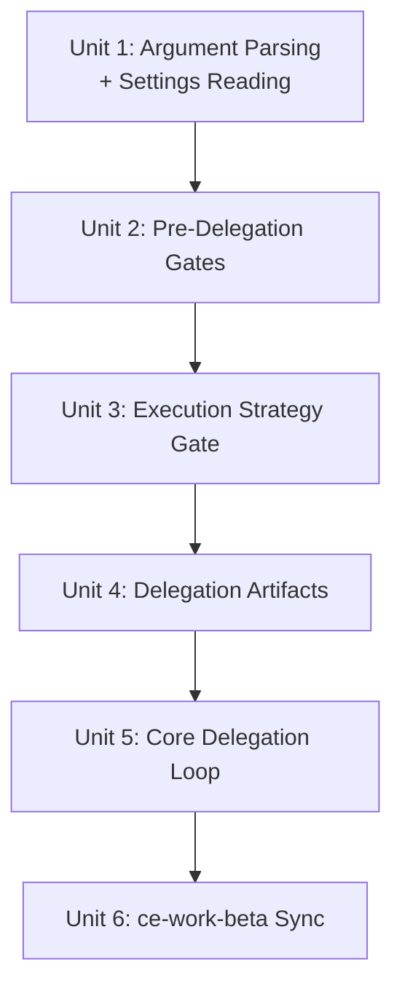

# feat: 为 ce:work 添加 Codex delegation mode

## 概览

为 ce:work 添加 optional Codex delegation mode，使用具体 bash templates 将 code-writing 委托给 Codex CLI（`codex exec`）。当该模式携带 plan file active 时，每个 implementation unit 都会以 structured prompt 和 result schema 发送给 Codex，然后被 classified、verified，并 commit 或 rollback。这替换了 ce-work-beta 中 prose-based delegation（PR #364），后者会导致 non-deterministic CLI invocations。

> **实现备注 (2026-03-31):** 最终 rollout 被重定向到 `ce:work-beta`，使 stable `ce:work` 在 beta 期间保持不变。`ce:work-beta` 必须手动 invoke；`ce:plan` 和其他 workflow handoffs 在 promotion 前仍指向 stable `ce:work`。

## 问题框架

从 Claude Code（或其他 non-Codex agents）运行 ce:work 的用户，希望将 token-heavy implementation work 委托给 Codex：可能为了更好的 code quality，也可能为了 token conservation。PR #364 的方案失败了，因为 agent 每次都会 improvises CLI syntax。ce-work-beta 有一个 structured 7-step External Delegate Mode，包含有用 patterns（environment guards、circuit breaker），但 CLI invocation step 本身是 prose-based。本 plan 移植这些 structural patterns，并用具体、tested bash templates 替换 prose invocations。（见 origin: docs/brainstorms/2026-03-31-codex-delegation-requirements.md）

## 需求追踪

- R1. ce:work 内 optional mode，不是 separate skill；ce-work-beta superseded
- R2. 解析链: argument > local.md > hard default (off)
- R3-R4. `delegate:codex` / `delegate:local` canonical tokens，带 bounded imperative fuzzy matching
- R5. Plan-only delegation（仅 plan delegation）；per-unit eligibility pre-screening（out-of-repo checks、trivial-work exclusions）
- R6-R7. Environment guard（Codex sandbox detection）；skill-level logic，无 converter changes
- R8-R9. Availability check；无 version gating
- R10-R13. Interactive ce:work execution 中一次性 consent，带 sandbox mode selection
- R14. Concrete bash invocation template（通过 live CLI testing validated）
- R15. User-selected sandbox: `--yolo`（default）或 `--full-auto`
- R16. 所有 units serial execution；delegation 和 swarm mode mutually exclusive；delegated execution 需要 clean working tree，并将 failed units rollback 到 `HEAD`
- R17. Prompt template 写入 `.context/compound-engineering/codex-delegation/`；XML-tagged sections
- R18. Circuit breaker（断路器）：3 consecutive failures -> standard mode fallback
- R19. Multi-signal failure classification（多信号 failure 分类：CLI fail / result absent / task fail / partial / verify fail / success）
- R20. `--output-schema` 用于 structured result JSON；已知 gpt-5-codex model bug
- R21. 通过 prompt constraint 做 repo-root restriction；out-of-repo discovery 时 complete-and-report
- R22. `.claude/compound-engineering.local.md` 中的 settings: `work_delegate`, `work_delegate_consent`, `work_delegate_sandbox`

## 范围边界

- 无 app-server integration（仅 bare `codex exec`）
- 无 ad-hoc delegation（必须有 plan file）
- 无 minimum version gating
- 无 periodic re-consent
- 无 converter changes
- v1 无 timeout
- 无 out-of-repo detection（只用 prompt constraint + pre-screening）
- delegated mode 不自动 preserve pre-existing dirty state
- Delegation 和 swarm mode（Agent Teams）mutually exclusive

## 背景与调研

### 相关代码和模式

- `plugins/compound-engineering/skills/ce-work/SKILL.md` - target file；Phase 1 Step 4（execution strategy，lines 126-144）和 Phase 2 Step 1（task loop，约 line 159）是 insertion points
- `plugins/compound-engineering/skills/ce-work-beta/SKILL.md` - External Delegate Mode（lines 413-474）提供被移植的 structural pattern（guards、circuit breaker、prompt file writing）
- `plugins/compound-engineering/skills/ce-review/SKILL.md`（lines 19-33）- 带 token table、strip-before-interpret、conflict detection 的 canonical argument parsing pattern
- `plugins/compound-engineering/skills/ce-plan/SKILL.md`（lines 167-176, 352-356, 495）- 当前 `Execution target: external-delegate` posture signal，需要作为 supersession work 的一部分移除
- `~/.claude/plugins/marketplaces/cli-printing-press/skills/printing-press/SKILL.md` - proven codex delegation via `codex exec --yolo -`，带 3-failure circuit breaker
- `~/.claude/plugins/marketplaces/openai-codex/plugins/codex/skills/gpt-5-4-prompting/` - Codex prompt best practices：XML-tagged blocks、`<completeness_contract>`、`<verification_loop>`、`<action_safety>`

### 组织内 learnings

- **Git workflow skills need explicit state machines** (`docs/solutions/skill-design/git-workflow-skills-need-explicit-state-machines.md`): 每次 git transition 都重新读取 state；用 `git status` 而不是 `git diff HEAD` 判断 cleanliness；将 non-zero exits 建模为 state transitions
- **Pass paths, not content, to sub-agents** (`docs/solutions/skill-design/pass-paths-not-content-to-subagents.md`): Orchestrator discover paths；sub-agent 读取 content；instruction phrasing 会影响 tool call count
- **Beta promotion must update callers atomically** (`docs/solutions/skill-design/beta-promotion-orchestration-contract.md`): 添加 new invocation semantics 时，在同一 PR 中更新所有 callers
- **Compound-refresh mode detection** (`docs/solutions/skill-design/compound-refresh-skill-improvements.md`): Mode 必须通过 arguments explicit opt-in，而不是从 environment auto-detected

## 关键技术决策

- **Insertion point:** Delegation routing gate 放在 Phase 1 Step 4（execution strategy selection）；per-unit delegation branch 放在 Phase 2 Step 1 line ~159（"Implement following existing conventions"）。这让 delegation 成为现有 execution flow 内的 task-level modifier，而不是 separate phase。
- **Argument parsing pattern:** 遵循 ce:review 的 canonical pattern：token table、strip-before-interpret、graceful fallback。引入 `delegate:` 作为与 `mode:` 分离的新 namespace。不作为该 feature 的一部分给 ce:work 添加 non-interactive mode；该 skill 仍是 interactive。更新 `argument-hint` frontmatter。
- **Fuzzy matching boundary:** 仅支持 imperative execution-intent phrases 的 fuzzy activation，例如 "use codex"、"delegate to codex" 或 "codex mode"。Bare mention "codex" 或关于 Codex 本身的 prompts 不得 activate delegation。
- **Prompt template format:** 使用 XML-tagged blocks，遵循 codex `gpt-5-4-prompting` skill guidance：`<task>`、`<files>`、`<patterns>`、`<approach>`、`<constraints>`、`<verify>`、`<output_contract>`。这比 printing-press 的 flat format 更结构化，并匹配 Codex/GPT-5.4 models parse instructions 的方式。
- **Settings parsing:** 当前无 utility。Skill 包含 inline instructions，要求 agent 读取 `.claude/compound-engineering.local.md`，提取 `---` delimiters 之间的 YAML，并解释 keys。写入时 read-modify-write 并显式处理：(1) file 不存在则创建，带 YAML frontmatter wrapper；(2) file 存在且有 valid frontmatter，则 merge new keys 并 preserve existing keys；(3) file 存在但无 frontmatter 或 malformed frontmatter，则 prepend valid frontmatter block，并在 closing `---` 下 preserve existing body content。Cross-platform path rewriting 由 converters 处理（`.claude/` -> `.codex/` -> `.opencode/`）。
- **Circuit breaker resets on success, persists across units:** 成功 delegation 将 counter reset 到 0。Consecutive failures 在单次 plan execution 的 units 间累计。如果 delegation 持续失败，很可能是 environmental（codex auth、model issues），而不是 unit-specific。
- **Delegation takes precedence over swarm:** delegation active 时强制 serial execution 并 suppress swarm mode。即使 slfg 或用户显式请求 swarm mode 也如此。Delegation 是更高优先级 execution constraint，因为它要求 serial execution。未来可重新评估 swarm mode，但 delegation support 当前更重要。
- **Delegated execution safety model:** 不 auto-stash pre-existing user changes。Delegated execution 只能从当前 checkout 或当前 worktree 的 clean working tree 开始。如果 tree dirty，停止并告诉用户 commit、显式 stash，或继续 standard mode。这让 rollback-to-`HEAD` 安全，并避免把用户数据藏进 automation-owned stash entries。
- **Partial result policy:** 将 `status: "partial"` 视为 handoff，而不是 completed unit。保留 diff，立即切换到 local completion 完成同一 unit，verify 并 commit 后再继续，并将其计入 circuit breaker。如果 local completion 失败，将该 unit rollback 到 `HEAD`。
- **ce-work-beta disposition:** 将 Frontend Design Guidance（lines 266-272）作为 separate Phase 2 addition 移植到 ce:work。完全 supersede External Delegate Mode section，并在同一 PR 中移除 ce:plan / ce-work-beta 中旧的 `Execution target: external-delegate` execution-note contract。ce-work-beta 其余部分暂时保留；删除是 separate cleanup task。

## 开放问题

### 规划期间已解决

- **Optimal prompt template structure (R17):** 按 codex `gpt-5-4-prompting` guidance 使用 XML-tagged blocks。Sections: `<task>`、`<files>`、`<patterns>`、`<approach>`、`<constraints>`（包含 repo-root restriction 和 mandatory result reporting）、`<verify>`、`<output_contract>`。
- **ce:work Phase 2 中的 insertion point (R14):** Phase 1 Step 4 作为 routing/strategy gate；Phase 2 Step 1 line ~159 作为 per-unit delegation branch。
- **Circuit breaker reset semantics (R18):** Per-plan，成功时 reset 到 0。理由：repeated failures 更可能是 environmental，而不是 unit-specific。
- **如何解析 local.md YAML (R22):** Inline skill instructions - agent 读取文件，提取 `---` delimiters 之间的 YAML，并解释 keys。无 utility；构建 general-purpose utility out of scope。
- **--output-schema 失败时的 fallback (R20):** 如果 result JSON absent 或 malformed，按 R19 classify as task failure。Agent 继续下一个 unit 或触发 circuit breaker。

### 延后到实现阶段

- **Exact prompt wording:** XML-tagged template structure 已定义；每个 section 中的 exact prose 会在 implementation 中基于 representative plan units testing refine。
- **Consent flow UX copy:** Consent warning content（R10）- 具体如何描述 `--yolo`、如何呈现 sandbox choice，最好在 implementation 中结合真实 interaction testing refine。
- **Frontend Design Guidance port quality:** Beta 的 Frontend Design Guidance section 是否可干净 port，还是需要适配 ce:work structure。

## 高层技术设计

> *这说明预期做法，并作为 review 的方向性指导，而不是实现规范。实现 agent 应把它当作上下文，而不是要逐字复刻的代码。*

Delegation mode 向 ce:work 的 SKILL.md 添加三段：

```
┌─────────────────────────────────────────────────────────────┐
│ SKILL.md Structure (additions marked with +)                │
├─────────────────────────────────────────────────────────────┤
│                                                             │
│ + ## Argument Parsing                                       │
│   Parse delegate:codex / delegate:local tokens              │
│   Read local.md for work_delegate fallback                  │
│   Resolve delegation state: on/off + sandbox mode           │
│                                                             │
│   ## Phase 0: Input Triage (existing)                       │
│                                                             │
│   ## Phase 1: Quick Start (existing)                        │
│   + Step 4 modification: if delegation on + plan present,   │
│     force serial execution, block swarm mode                │
│                                                             │
│   ## Phase 2: Execute (existing)                            │
│   + Step 1 modification: if delegation on for this unit,    │
│     branch to Codex Delegation section instead of           │
│     "implement following existing conventions"              │
│                                                             │
│ + ## Codex Delegation Mode                                  │
│   + Pre-delegation checks (env guard, availability,         │
│     consent)                                                │
│   + Prompt template builder (XML-tagged)                    │
│   + Result schema definition                                │
│   + Execution loop (exec -> classify ->                     │
│     local-complete/commit/rollback-to-HEAD)                 │
│   + Circuit breaker logic                                   │
│                                                             │
│   ## Phase 3: Quality Check (existing, unchanged)           │
│   ## Phase 4: Ship It (existing, unchanged)                 │
│   ## Swarm Mode (existing, + mutual exclusion note)         │
│                                                             │
│ + ## Frontend Design Guidance (ported from ce-work-beta)    │
│                                                             │
└─────────────────────────────────────────────────────────────┘
```

## 实现单元



---

- [x] **Unit 1：Argument parsing 和 settings reading**

**目标：** 向 ce:work 添加 `delegate:codex` / `delegate:local` token parsing，以及读取 local.md settings 的 resolution chain。

**需求：** R2, R3, R4, R22

**依赖：** None

**文件：**
- 修改：`plugins/compound-engineering/skills/ce-work/SKILL.md`
- 测试：`tests/pipeline-review-contract.test.ts`
- 测试：使用 `delegate:codex`、`delegate:local` 和 fuzzy variants 做 manual invocation testing

**做法：**
- 在 `## Phase 0: Input Triage` heading 前（opening narrative 后）添加 `## Argument Parsing` section，遵循 ce:review 的 canonical pattern（token table、strip-before-interpret）。Cross-reference High-Level Technical Design diagram for placement。
- Token table：`delegate:codex`（activate）、`delegate:local`（deactivate），再加 bounded fuzzy recognition for delegate activation phrases。此处不添加 `mode:headless`；ce:work 仍是 interactive workflow。
- Token extraction 后，读取 `.claude/compound-engineering.local.md` 中的 `work_delegate`、`work_delegate_consent`、`work_delegate_sandbox` keys
- 实现 resolution chain：argument flag > local.md `work_delegate` > hard default `false`
- 将 resolved delegation state（on/off）和 sandbox mode 存入 skill-level variables，供 downstream consumption
- 更新 `argument-hint` frontmatter，加入 `delegate:codex` 以提升 discoverability
- 遵循 learning：mode 必须通过 arguments explicit opt-in，而不是 auto-detected（compound-refresh pattern）

**遵循的模式：**
- `plugins/compound-engineering/skills/ce-review/SKILL.md` lines 19-33 - token table、strip-before-interpret、conflict detection
- `plugins/compound-engineering/skills/ce-compound-refresh/SKILL.md` line 13 - simple token stripping
- YAML frontmatter parsing：agent 读取文件，提取 `---` delimiters 之间的 content，并解释 keys

**测试场景：**
- Happy path：arguments 中的 `delegate:codex` 将 delegation on，使用 default yolo sandbox
- Happy path：arguments 中的 `delegate:local` 即使 local.md 有 `work_delegate: codex` 也将 delegation off
- Happy path：无 delegate token 但 local.md 中有 `work_delegate: codex` 时 activate delegation
- Happy path：无 delegate token 且无 local.md setting 时 delegation defaults off
- Edge case：`delegate:codex` 与 plan file path 同时存在；两者都正确 parsed，plan path preserved
- Edge case：Fuzzy variant "use codex for this work" 被识别为 delegation activation
- Edge case：Bare prompt "fix codex converter bugs" 不 activate delegation
- Edge case：Missing 或 empty local.md file；gracefully fallback to hard defaults
- Edge case：Malformed YAML frontmatter in local.md；treated as if settings are absent，不 fatal

**验证：**
- Delegation state 对 argument + local.md + default 的全部组合 resolve 正确
- Token stripping 不破坏 plan file paths
- Argument-hint frontmatter 包含 delegate:codex
- Contract tests 覆盖新 token/wording expectations

---

- [x] **Unit 2：Pre-delegation gates（delegation 前 gates：environment guard + availability + consent）**

**目标：** 添加 delegation proceed 前运行的 checks：environment detection、CLI availability 和一次性 consent with sandbox mode selection。

**需求：** R6, R7, R8, R10, R11, R12, R13

**依赖：** Unit 1（delegation state must be resolved）

**文件：**
- 修改：`plugins/compound-engineering/skills/ce-work/SKILL.md`
- 测试：`tests/pipeline-review-contract.test.ts`
- 测试：在 Codex sandbox vs normal environment 中做 manual invocation testing

**做法：**
- 在新的 Codex Delegation Mode section 内添加 `### Pre-Delegation Checks` subsection
- **Environment guard：** 检查 `$CODEX_SANDBOX` 和 `$CODEX_SESSION_ID`。如设置，则 disable delegation。仅当用户通过 argument 显式请求 delegation 时 notify；当 delegation 仅由 local.md default enabled 时 silent proceed to fallback。
- **Availability check：** `command -v codex`。找不到时通知并 fall back to standard mode。
- **Consent flow：** 如果 local.md 中 `work_delegate_consent` 不是 `true`：
  - 显示一次性 warning 解释 `--yolo`，呈现 sandbox mode choice（yolo recommended，full-auto option），将 decision 写入 local.md
- **Consent decline path：** 询问是否完全 disable delegation；若 yes，则在 local.md 中设置 `work_delegate: false`
- 遵循 learning：每个 transition 都 re-read git/file state，而不是 caching（state machine pattern）

**遵循的模式：**
- ce-work-beta External Delegate Mode lines 436-445 - environment guard structure（environment guard 结构）
- Platform-agnostic tool references（跨平台 tool references）："Use the platform's blocking question tool (AskUserQuestion in Claude Code, request_user_input in Codex)"

**测试场景：**
- 成功路径：Codex 外部、CLI 可用、已授予 consent；继续 delegation
- 成功路径：首次 consent flow；显示 warning，user accepts yolo，settings written to local.md
- 成功路径：首次 consent；user chooses full-auto，setting stored correctly
- 错误路径：Codex sandbox 内带显式 `delegate:codex` argument；notification emitted，falls back to standard mode
- 错误路径：Codex sandbox 内只有 local.md default；silent fallback，无 notification
- 错误路径：`codex` CLI 不在 PATH 上；notification emitted，falls back to standard mode
- 错误路径：User declines consent；asked about disabling；如 yes，set `work_delegate: false`
- 边界情况：Delegation enabled via local.md default on first invocation（无 delegate:codex argument）；consent flow 正常显示，因为 R10 在 "first time delegation activates" 时触发，无论 activation source

**验证：**
- Environment guard 正确检测 Codex sandbox 并 fallback
- Missing codex CLI 产生 notification 和 graceful fallback
- Consent state 通过 local.md 跨 invocations persist
- Consent flow 只在 ce:work 现有 interactive execution model 中 prompt

---

- [x] **Unit 3: Execution strategy gate 和 swarm exclusion**

**目标:** 修改 Phase 1 Step 4，在 delegation active 时强制 serial execution 并 block swarm mode selection。

**需求:** R5, R16

**依赖:** Unit 1（delegation state）

**文件:**
- 修改: `plugins/compound-engineering/skills/ce-work/SKILL.md`
- 测试: `tests/pipeline-review-contract.test.ts`
- 测试: delegation + swarm mode request 的 manual testing

**做法:**
- 在 Phase 1 Step 4（"Choose Execution Strategy"）添加 routing gate：如果 delegation active 且 plan file present，override strategy 为 serial execution
- 添加 explicit note：delegation mode 和 swarm mode（Agent Teams）mutually exclusive
- **Delegation takes precedence over swarm mode.** 当 delegation active（通过 Unit 1 resolution chain resolved）时，强制 serial execution 并 suppress swarm mode - 即使 user 或 caller（例如 slfg）请求 swarm mode。Delegation 需要 serial execution，机械上与 swarm incompatible。如果 delegation on 且 swarm mode 原本会 activate，emit notification: "Delegation mode active — serial execution enforced, swarm mode unavailable." 该 gate 在 argument parsing 完成后，于 execution-strategy level（Phase 1 Step 4）运行。
- 在 Swarm Mode section 添加 mutual exclusivity constraint 的简短 note
- Enforce plan-only delegation：如果 delegation active 但没有 plan file（bare prompt），以 brief note fall back to standard mode

**遵循的模式:**
- Existing Phase 1 Step 4 execution strategy decision tree（现有 execution strategy decision tree）
- Beta promotion learning：添加 new invocation semantics 时 atomically update all callers

**测试场景:**
- 成功路径: Delegation active with plan file - serial execution enforced
- 成功路径: Delegation off - existing execution strategy selection unchanged
- 边界情况: Delegation active but bare prompt（无 plan）- falls back to standard mode
- 边界情况: slfg requests swarm mode but local.md has `work_delegate: codex` - delegation wins，serial execution enforced，swarm mode suppressed with notification
- 边界情况: User explicitly passes `delegate:codex` AND requests swarm mode - delegation wins，swarm suppressed with notification

**验证:**
- Delegation active with plan 时 serial execution enforced
- Delegation active 时 swarm mode suppressed，并有 notification
- Bare prompts regardless of delegation setting 都使用 standard mode
- local.md 启用 delegation 的 slfg invocations 结果是 serial execution，而不是 swarm mode

---

- [x] **Unit 4：Delegation artifacts（delegation 产物：prompt template + result schema）**

**目标:** 定义每次 delegation invocation 前写入 `.context/compound-engineering/codex-delegation/` 的 prompt template builder 和 result schema。

**需求:** R17, R20, R21

**依赖:** Unit 2（consent + sandbox mode resolved）

**文件:**
- 修改: `plugins/compound-engineering/skills/ce-work/SKILL.md`
- 测试: manual inspection of generated prompt files and schema

**做法:**
- 在 Codex Delegation Mode section 内添加 `### Prompt Template` subsection
- 按 `gpt-5-4-prompting` best practices 定义 XML-tagged prompt structure：
  - `<task>` - implementation unit 的 goal
  - `<files>` - implementation unit 的 file list
- `<patterns>` - relevant code context（CURRENT PATTERNS）
  - `<approach>` - implementation unit 的 approach
- `<constraints>` - no git commit、repo-root restriction、scoped changes、line limit、mandatory result reporting
  - `<verify>` - project 的 test/lint commands
- `<output_contract>` - result reporting instructions（status/files_modified/issues/summary）
- 将 result schema JSON（per R20）定义为 static file，写入 `.context/compound-engineering/codex-delegation/result-schema.json`
- 将 `.context/compound-engineering/codex-delegation/` directory creation 纳入 setup contract
- Prompt files: `prompt-<unit-id>.md` - successful unit 后 cleanup
- Result files: `result-<unit-id>.json` - successful unit 后 cleanup
- 遵循 learning：pass paths, not content, to sub-agents - prompt template 为 CURRENT PATTERNS 包含 file paths，让 codex 自己读取

**遵循的模式:**
- `gpt-5-4-prompting` skill - XML-tagged blocks、`<completeness_contract>`、`<action_safety>`
- Printing-press skill - TASK/FILES TO MODIFY/CURRENT CODE/EXPECTED CHANGE/CONVENTIONS/CONSTRAINTS/VERIFY structure（结构）
- AGENTS.md scratch space convention（scratch space 约定）：`.context/compound-engineering/<workflow-or-skill-name>/`

**测试场景:**
- 成功路径: Prompt file generated，且 all XML sections 从 plan implementation unit populated
- 成功路径: Result schema file created as valid JSON matching R20 schema definition
- 边界情况: Implementation unit 无 VERIFY commands - `<verify>` section 包含 fallback instruction（"Run any available test suite or lint"）
- 边界情况: Implementation unit 无 CURRENT PATTERNS - `<patterns>` section 说明 absence，而不是 empty
- 集成: Prompt file 可由 `codex exec - < prompt-file.md` 读取 - 在 brainstorm CLI testing 中 validated

**验证:**
- Generated prompt files 包含全部 required XML sections
- Result schema validates against R20 中的 JSON schema definition
- Scratch directory created at `.context/compound-engineering/codex-delegation/`（scratch directory 已创建）
- Files 在 successful delegation 后 cleanup

---

- [x] **Unit 5：Core delegation execution loop（核心 delegation execution loop）**

**目标:** 实现 per-unit delegation execution：clean-baseline preflight、codex exec invocation、result classification、commit 或 rollback-to-`HEAD`，以及 circuit breaker。

**需求:** R14, R15, R16, R18, R19

**依赖:** Unit 3（serial execution enforced）、Unit 4（prompt template + schema available）

**文件:**
- 修改: `plugins/compound-engineering/skills/ce-work/SKILL.md`
- 测试: `tests/pipeline-review-contract.test.ts`
- 测试: 使用真实 plan file 做 manual end-to-end delegation testing

**做法:**
- 在 Codex Delegation Mode 内添加 `### Execution Loop` subsection
- **Clean-baseline preflight:** 在第一个 delegated unit 前，要求当前 checkout/worktree 的 working tree clean（`git status --short` empty）。如果 dirty，停止并指示用户 commit、显式 stash，或继续 standard mode。不要 auto-stash user changes。
- **Per-unit eligibility check (R5):** delegation 前，agent 依据 R5 评估 unit 是否 eligible：(a) 不要求修改 repository root 之外的内容，且 (b) 不是 trivially small（single-file config change、simple substitution，delegation overhead 超过实际工作）。如果 ineligible，则在执行前说明原因，并用 standard mode 本地执行。
- **Codex exec invocation:** R14 中 verbatim bash template：
  ```
  codex exec $SANDBOX_FLAG --output-schema <schema-path> -o <result-path> - < <prompt-path>
  ```
- **Result classification（结果分类，R19）：** Multi-signal approach（多信号方法）：
  1. Exit code != 0 -> CLI failure -> rollback current unit to `HEAD`，然后 hard fall back to standard mode for all remaining units
  2. Exit code 0，result JSON missing/malformed -> task failure（任务失败）-> rollback current unit to `HEAD` + circuit breaker
  3. `status: "failed"` -> task failure（任务失败）-> rollback current unit to `HEAD` + circuit breaker
  4. `status: "partial"` -> keep diff，立即切换到 standard-mode completion 完成同一 unit，verify + commit 后再继续，且出于 circuit-breaker 目的计为 delegation failure
  5. `status: "completed"` + VERIFY fails -> verify failure（验证失败）-> rollback current unit to `HEAD` + circuit breaker
  6. `status: "completed"` + VERIFY passes -> success（成功）-> commit
- **Rollback:** `git checkout -- . && git clean -fd` back to `HEAD`。只有因为 delegated mode 从 clean baseline 开始且从不 auto-stash user-owned local changes，该操作才被允许。
- **Commit on success:** 每个 successful unit 后 mandatory commit（为下一个 unit 强制 clean working tree）
- **Circuit breaker (R18):** Counter 在一次 plan execution 内跨 units persist。成功时 reset 到 0。3 consecutive failures 后，通知并为所有 remaining units fall back to standard mode。
- **Partial success handling:** `partial` 是当前 unit 的 local handoff，而不是继续 dirty tree 的 permission。Main agent 必须本地完成同一 unit、verify 并 commit 后，才能 dispatch 下一个 unit。如果 local completion 失败，将该 unit rollback 到 `HEAD`。

**遵循的模式:**
- ce-work-beta External Delegate Mode 7-step workflow（7 步 workflow，lines 447-465）
- Printing-press skill codex invocation + circuit breaker pattern（Codex invocation 与 circuit breaker pattern）
- Git state machine learning：每个 transition 重新读取 state；将 non-zero exits 建模为 expected state transitions

**测试场景:**
- 成功路径: Unit delegated，codex succeeds，result schema says "completed"，VERIFY passes - changes committed
- 成功路径: Delegation 在 already-isolated clean worktree 内运行 - 不需要额外 worktree
- 成功路径: Multiple units delegated serially - 每个都在 prior commit 后的 clean working tree 开始
- 成功路径: Circuit breaker 在 failure 之后出现 success 时 reset
- 错误路径: 第一个 delegated unit 前 working tree dirty - stop 并让用户 clean/stash/commit 或 continue in standard mode
- 错误路径: codex exec returns exit code != 0 - classified as CLI failure，rollback to `HEAD`，all remaining units use standard mode
- 错误路径: Result JSON missing after successful exit code - classified as task failure，rollback to `HEAD`，circuit breaker increment
- 错误路径: Result schema reports "failed" - rollback to `HEAD`，circuit breaker increment
- 错误路径: Result schema reports "completed" but VERIFY fails - rollback to `HEAD`，circuit breaker increment
- 错误路径: 3 consecutive failures - circuit breaker triggers，remaining units fall back to standard mode with notification
- 边界情况: Result schema reports "partial" - changes kept，同一 unit 本地完成、verified、committed 后再进入下一 unit
- 边界情况: Unit pre-screened as ineligible（out-of-repo）- executed locally，不 delegated
- 边界情况: Unit pre-screened as trivially small - executed locally，不 delegated
- 集成: Contract tests assert delegated-mode clean-baseline and supersession wording stays in sync

**验证:**
- Delegation 产生 deterministic CLI invocations（无 agent improvisation）
- Failed delegation cleanly rollback 到 `HEAD`，不触碰 pre-existing user changes
- Circuit breaker 在 3 consecutive failures 后 activate
- Partial success 在当前 unit 本地完成并 commit 前绝不 advance 到 next unit
- 每个 successful delegation 后都 commit，再进入 next unit

---

- [x] **Unit 6：ce-work-beta sync（移植 non-delegation features 并 supersede）**

**目标:** 将 ce-work-beta 的 Frontend Design Guidance port 到 ce:work，将旧 delegation section 标为 superseded，并移除 obsolete `external-delegate` execution-note contract。

**需求:** R1

**依赖:** Unit 5（delegation fully implemented in ce:work）

**文件:**
- 修改: `plugins/compound-engineering/skills/ce-work/SKILL.md`
- 修改: `plugins/compound-engineering/skills/ce-work-beta/SKILL.md`
- 修改: `plugins/compound-engineering/skills/ce-plan/SKILL.md`
- 测试: `tests/pipeline-review-contract.test.ts`
- 测试: verify Frontend Design Guidance triggers correctly in ce:work

**做法:**
- **Port Frontend Design Guidance**（ce-work-beta lines 266-272）到 ce:work Phase 2，作为新 numbered step："For UI tasks without Figma designs, load the `frontend-design` skill before implementing"
- **Supersede ce-work-beta delegation:** 在 ce-work-beta 的 External Delegate Mode section 顶部添加 note，说明它已由 ce:work 的 Codex Delegation Mode superseded。不要删除该 section - 将其保留为 prior approach 的 documentation。
- **Remove obsolete execution-note contract:** 从 ce:plan 删除 `Execution target: external-delegate` guidance 和 examples，并移除 ce-work-beta 中消费该 tag 的 activation path。此 change 后，delegation 仅由 ce:work resolution chain 控制。
- **Mixed-Model Attribution:** 将 PR attribution guidance（ce-work-beta lines 467-473）port 到 ce:work 的 Codex Delegation Mode section - 当部分 tasks delegated、部分 local 时，PR 应 credit both models。
- **Caller update check:** 确认 removal 后无其他 skills 仍引用 `Execution target: external-delegate`。按 beta promotion learning，atomic delete old contract，避免留下 dual semantics。

**遵循的模式:**
- ce-work-beta Frontend Design Guidance（前端设计指导 section，lines 266-272）
- ce-work-beta Mixed-Model Attribution（混合模型归因 section，lines 467-473）
- Beta promotion learning：update orchestration callers atomically（原子更新 orchestration callers）

**测试场景:**
- 成功路径: ce:work 中无 Figma design 的 UI task - Frontend Design Guidance triggers correctly
- 成功路径: Mixed delegation/local execution - PR attribution credits both models
- 成功路径: ce:plan 不再 emit `Execution target: external-delegate`
- 边界情况: 直接 invoke ce-work-beta - 看到 supersession note，delegation section 仍存在供 reference

**验证:**
- Frontend Design Guidance 在 ce:work Phase 2 functional
- ce-work-beta delegation section marked superseded（标记为 superseded）
- `external-delegate` references 从 live skills 中移除
- 因 skill content changed，`bun test` 和 `bun run release:validate` pass

## 系统级影响

- **Interaction graph:** ce:work 的 Phase 2 task execution loop 增加 delegation branch。Phase 1 Step 4 增加 routing gate。Swarm Mode section 增加 mutual exclusivity note。Phase 3 不变。Phase 4 仅增加从 ce-work-beta carry over 的 mixed-model attribution guidance。
- **Error propagation:** CLI failures 将当前 delegated unit rollback 到 `HEAD`，并对所有 remaining units hard fallback to standard mode。Task/verify failures 计入 circuit breaker，并触发 per-unit rollback。Partial success 是 handoff path：本地完成同一 unit，然后 commit 再继续。
- **State lifecycle risks:** Delegated mode 现在拒绝从 dirty tree 开始，包括 existing worktree checkout。这是 deliberate safety tradeoff，可避免 automation-owned stash state，并保持 `HEAD` rollback 安全。每个 successful 或 locally-completed partial unit 后 mandatory commit，防止 cross-unit entanglement。
- **API surface parity:** `delegate:codex` 是新 argument namespace。Converters 将 local.md references 中的 `.claude/` paths 改写为 platform equivalents（`.codex/`、`.opencode/`）。旧 `Execution target: external-delegate` contract 从 live skills 中移除。不引入新的 ce:work-wide non-interactive mode。
- **Integration coverage:** Delegation flow 跨越 ce:work -> bash（codex exec）-> codex CLI -> file system（result JSON、prompt files）-> git。End-to-end testing 需要 working codex CLI installation。
- **Unchanged invariants:** 保留 ce:work 对 file paths 和 bare prompts 的现有 argument handling。未 enable delegation 的用户没有 behavioral change。Phase 3 保持不变；Phase 4 保持现有 ship flow，仅增加 mixed-model attribution guidance。

## 风险与依赖

| 风险 | 缓解 |
|------|------|
| `--output-schema` 只适用于 gpt-5 family models（bug #4181） | Document model constraint；将 absent/malformed result JSON classify 为 task failure |
| Codex CLI flags future releases 中变化 | Invocation 是一条 concrete bash line - 会 loud failure，easy to fix |
| Delegated mode 在 dirty trees 上停止，可能比 standard mode 更严格 | Prompt 中显式说明：current checkout/worktree 可以，但 delegated execution 开始前必须 clean |
| Consent flow complexity in a skill that has no prior interactive prompting | 遵循 ce:review 的 platform-agnostic question tool usage pattern |
| local.md YAML parsing 无 utility，agent 必须 inline parse | 提供 clear parsing instructions；malformed YAML treated as absent（graceful degradation） |
| slfg interaction: delegation active 时 swarm mode suppressed | Delegation takes precedence；serial execution enforced。启用 delegation 的 slfg users 不会获得 swarm mode - emit notification |
| `partial` results 可能让 loop 处于 ambiguous state | 将 `partial` 视为同一 unit 的 local handoff，要求 verify + commit 后再继续，并计入 circuit breaker |

## 来源与参考

- **Origin document（来源 document）：** [docs/brainstorms/2026-03-31-codex-delegation-requirements.md](docs/brainstorms/2026-03-31-codex-delegation-requirements.md)
- 相关 PR: #364（ce-work-beta sandbox options - superseded）
- 相关 PR: #363（ce-work-beta original delegation - superseded）
- Codex prompting（Codex prompting 参考）：`~/.claude/plugins/marketplaces/openai-codex/plugins/codex/skills/gpt-5-4-prompting/`
- Printing-press pattern（Printing-press pattern 参考）：`~/.claude/plugins/marketplaces/cli-printing-press/skills/printing-press/SKILL.md`
- Git state machine learning（Git state machine 经验）：`docs/solutions/skill-design/git-workflow-skills-need-explicit-state-machines.md`
- Beta promotion learning（Beta promotion 经验）：`docs/solutions/skill-design/beta-promotion-orchestration-contract.md`
- Pass paths learning（pass paths 经验）：`docs/solutions/skill-design/pass-paths-not-content-to-subagents.md`
