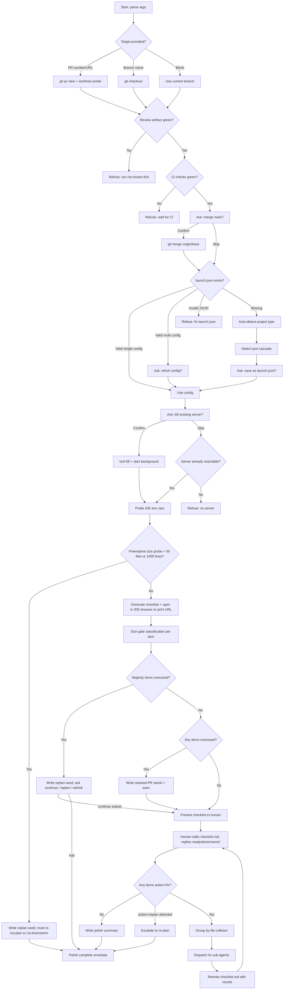

# feat: 添加用于 merge 前 human-in-the-loop 打磨的 `/ce:polish` skill

## 概览

在 `plugins/compound-engineering/skills/ce-polish/SKILL.md` 添加一个新的 workflow skill，实现“polish phase”：在 `/ce:review`（tests + review green）之后、merge 之前运行的 human-in-the-loop refinement 步骤。Polish 是一个基本自动化流程中的第二个人类介入节点；第一个是 `/ce:brainstorm`（构建什么）。Polish 回答的问题是：*这对真实用户来说感觉对吗？*

该 skill 接受 PR number、URL 或 branch name（空值 → 当前分支），验证 review 已成功完成，在用户确认后把最新 `main` merge 到该分支，从用户编写的 `.claude/launch.json` 启动本地 dev server（按 framework auto-detect 作为 fallback），可用时在宿主 IDE 的内置浏览器中打开应用（Claude Code desktop、Cursor，未来的 Codex），否则打印 URL；随后从 diff 和 PR body 生成面向终端用户可测试的 checklist，并 dispatch polish sub-agents（design iterators、frontend race reviewers、simplicity reviewers）修复人类标记的问题。如果 polish batch 超过一个“focus area”（多于一个 component、跨切面文件，或无法作为单一 user flow 测试），该 skill 会拒绝 batch-fix，并输出 stacked-PR hand-off artifact。

按 beta-skills framework 先以 `ce:polish-beta` 发布；收到使用反馈后再 promote 为 stable。

## 问题框架

compound-engineering plugin 已经自动化了大部分端到端开发流程（`/ce:ideate → /ce:brainstorm → /ce:plan → /ce:work → /ce:review`）。目前在 review green 与 merge 之间没有结构化步骤，因此出现两个缺口：

1. **Craft/UX 从未以终端用户视角被体验。** Review 会捕获 correctness、security 和结构问题，但不会捕获“这个动画卡顿”、“empty state 不好看”或“这个响应感觉慢”。这些必须由人真正使用功能才能发现。
2. **Polish work 容易意外变成 scope creep。** 当人真正开始 polish 时，很容易不断往同一个 PR 里加东西，直到它大到难以理解或再次 review，最终 polish 也无法干净 ship。

Polish 需要一个独立成形的步骤：有边界、由人驱动，但修复本身由自动化辅助。它还需要显式 size gate，让超出原 PR 的 polish tasks 被拆成 stacked PRs，而不是让原 PR 膨胀。

触发本计划的 transcript 将 polish 定义为“第二个人类介入节点”，有意与 brainstorm 分别放在自动化中段的两端。

## 需求追踪

来自 feature description（10 个 deliverables）：

- **R1.** Command 作为 skill 位于 `plugins/compound-engineering/skills/ce-polish-beta/SKILL.md`，frontmatter 包含 `name`、`description`、`argument-hint`、`disable-model-invocation: true`，并在 beta-first convention 下匹配 canonical `ce:review` / `ce:work` / `ce:brainstorm` 形态（在 follow-up PR 中 promote 到 `skills/ce-polish/`）。
- **R2.** Skill SKILL.md 按 progressive disclosure 组织：正文约 500 行以内，按 framework 的 dev-server recipes 与 checklist/dispatch templates 提取到 `references/`，deterministic classifiers 放入 `scripts/`。
- **R3.** `$ARGUMENTS` 解析 PR number、PR URL、branch name，或空值 → 当前分支；同时支持在解释 target 前剥离的命名 tokens：`mode:headless`（给 LFG/pipelines 的 machine envelope）和 `trust-fork:1`（显式 fork-PR trust override）。其他 tokens（`mode:report-only`、`mode:autonomous`）推迟到 follow-up PR，让 surface 诚实反映实际实现内容。
- **R4.** Dev-server lifecycle 由 config 驱动，并带 auto-detect fallback。主来源是 repo root 的 `.claude/launch.json`（Claude Code 的 launch-config convention）；缺失或不完整时，fallback 到按 framework auto-detection（Rails / Next.js / Vite / Procfile / Overmind），并提供写入最小 `launch.json` stub 的选项，供用户确认并保存以便未来运行。Kill 和 restart 会显示 PID 与 log path，让用户能重新取得控制。
- **R4b.** 在带 embedded browser 的 IDE 内运行时（Claude Code desktop、Cursor、未来 Codex），在该浏览器中打开 polish URL；否则打印 URL 供用户手动打开。Detection 尽力而为且非阻塞；无法 detect IDE 时始终 fallback 到打印 URL。
- **R5.** Skill 拒绝 polish 未测试或未 review 的工作，基于两个信号：最新 `.context/compound-engineering/ce-review/<run-id>/` artifact 的 verdict，以及 `gh pr checks` green。
- **R6.** Test checklist 从 diff、PR body 以及（如果可用）通过 `plan:<path>` 引用的 plan 生成，绝不通过询问人类“你想测试什么？”来生成。
- **R7.** Polish sub-agents 通过 fully qualified names dispatch（`compound-engineering:design:design-iterator`、`compound-engineering:review:julik-frontend-races-reviewer` 等）。少于 5 items 时 sequential dispatch，超过时 parallel dispatch，但不变量是触及同一路径的 items 永不并发运行。
- **R8.** “too big” detector 分两层运行。Per-item：超过 file-count、cross-surface 或 diff-line thresholds 的 items 被拒绝并路由到 stacked-PR hand-off artifact。Per-batch：当整体 polish run 显示 PR 过大（多数 items oversized、用户反复触发 `replan` actions，或 checklist generation 前的预检查 diff-size probe）时，polish 升级到 re-planning：写入指回原始 brainstorm/plan 的 `replan-seed.md`，并把用户路由到 `/ce:plan` 或 `/ce:brainstorm`。两层 size gate 都是 load-bearing，不是装饰。
- **R9.** `/ce:polish` 在 workflow 中位于 `/ce:review` 与 `/git-commit-push-pr` 之间。`/ce:work` Phase 3 在 `/ce:review` 完成后将 polish 作为下一步提供。`mode:headless` variant 存在，以便 LFG 和未来 pipelines 串联。
- **R10.** 本工作的 feature branch：`feat/ce-polish-command`。PR 中不 bump release-owned versions。

## 范围边界

**范围内：**
- 新 beta skill `skills/ce-polish-beta/`（按 beta-skills framework 在 follow-up PR 中 promote 到 `skills/ce-polish/`）
- `.claude/launch.json` reader + auto-detect fallback + stub-writer；按 framework 的 dev-server recipes（Rails、Next.js/Node、Vite、Procfile/Overmind）作为 fallback path
- 用于 embedded-browser handoff 的 IDE detection（Claude Code、Cursor、未来 Codex）；这是 progressive enhancement，绝不是 gate
- 通过 `.context/compound-engineering/ce-polish/<run-id>/checklist.md` 实现 edit-file-then-ack human interaction loop
- 两层 size gate：per-item（stacked-PR seed）和 per-batch（replan escalation 回到 `/ce:plan` 或 `/ce:brainstorm`）
- Entry gate 的 fork-PR trust boundary check（cross-repository PRs 需要 `trust-fork:1` token）
- 复用 `resolve-base.sh`（按“no cross-directory references”规则复制到新 skill 的 `references/`）
- 编排现有 design 和 review agents 的 sub-agent orchestration，本 PR 不创建新 agents
- README.md component count update（作者编辑，不属于 release-owned）

**范围外：**
- 创建新的 “copy/microcopy polish” sub-agent，超出范围；作为未来考虑项提出。v1 中 copy polish 并入 `design-iterator` loop。
- 修改 `/ce:work` 或 `/ce:review` 以自动 chain 到 `/ce:polish`。首个 release 在 `/ce:review` 后手动调用。待 beta usage 证明形态后，automatic chaining 属于 follow-up PR。
- bump `plugins/compound-engineering/.claude-plugin/plugin.json` 或 `.claude-plugin/marketplace.json` 中的 version，或手写 `CHANGELOG.md` entries；这些由 release-please automation 拥有（按 `plugins/compound-engineering/AGENTS.md`）。
- 为 polish note-taking 添加 web UI / browser-extension annotation layer。Transcript 提到在浏览器中 annotate；v1 中 notes 作为 plain prose input 捕获到 skill，再由 skill dispatch fixes。Browser-side annotation 是 follow-up。

## 上下文与调研

### 相关代码与模式

- **Skill-as-slash-command pattern：** 自 v2.39.0 起，原 `/command-name` slash commands 位于 `plugins/compound-engineering/skills/<command-name>/SKILL.md`（见 `plugins/compound-engineering/AGENTS.md`）。不存在 `commands/` 目录。Polish 遵循该模式。
- **Argument parsing（token-based）：** `plugins/compound-engineering/skills/ce-review/SKILL.md:19-33` 定义 canonical `mode:*`、`base:*`、`plan:*` token-stripping pattern。Polish 为未来扩展原样采用。
- **可交互调用 workflow skills 的 frontmatter：** `plugins/compound-engineering/skills/ce-review/SKILL.md:1-5` 和 `plugins/compound-engineering/skills/ce-work/SKILL.md:1-5`：`name: ce:<verb>`，description 包含 natural-language trigger phrases，`argument-hint`，stable workflow skills 不设置 `disable-model-invocation`。
- **Beta-first convention：** `plugins/compound-engineering/skills/ce-work-beta/` 展示 beta pattern。Frontmatter：`name: ce:<verb>-beta`，description 前缀为 `[BETA]`，`disable-model-invocation: true`。Convention 记录在 `docs/solutions/skill-design/beta-skills-framework.md`。
- **Branch / PR acquisition：** `plugins/compound-engineering/skills/ce-review/SKILL.md:184-267`：通过 `git status --porcelain` 做 clean-worktree check，然后 PR 使用 `gh pr checkout <n>`，branch 使用 `git checkout <branch>`，共享 `resolve-base.sh` helper 来解析 base branch。
- **Port detection cascade：** `plugins/compound-engineering/skills/test-browser/SKILL.md:97-143`：CLI flag → `AGENTS.md`/`CLAUDE.md` → `package.json` dev-script → `.env*` → default `3000`。Polish 原样复用该 cascade。
- **Review artifact location and envelope：** `plugins/compound-engineering/skills/ce-review/SKILL.md:509-516`（headless envelope 暴露 `Artifact: .context/compound-engineering/ce-review/<run-id>/`）以及 `SKILL.md:675-680`（写入内容）。Polish 读取该 artifact 作为 entry gate。
- **Scratch space convention：** `.context/compound-engineering/<workflow>/<run-id>/`，使用 `RUN_ID=$(date +%Y%m%d-%H%M%S)-$(head -c4 /dev/urandom | od -An -tx1 | tr -d ' ')`。ce-review、ce-optimize、ce-plan-deepening 已使用。
- **Sub-agent dispatch：** `plugins/compound-engineering/skills/resolve-pr-feedback/SKILL.md:135-164` 是 canonical parallel-dispatch pattern。`plugins/compound-engineering/skills/ce-review/references/subagent-template.md` 是 canonical sub-agent prompt shape。Fully qualified names 是强制要求；tool calls 省略 `mode`，以尊重用户 permission settings。
- **Polish 相关的 existing agents：** `agents/design/design-iterator.md`、`agents/design/design-implementation-reviewer.md`、`agents/design/figma-design-sync.md`、`agents/review/code-simplicity-reviewer.md`、`agents/review/maintainability-reviewer.md`、`agents/review/julik-frontend-races-reviewer.md`。全部通过 fully qualified `compound-engineering:<category>:<name>` 引用。
- **Complexity / focus-area heuristic：** `plugins/compound-engineering/skills/ce-work/SKILL.md:36-42`（Trivial / Small / Large matrix）和 `plugins/compound-engineering/skills/ce-work/references/shipping-workflow.md:25-30, 108-112`（Tier 1 single-concern criteria）。Polish 的 "too big" detector 扩展这些规则。
- **Mode detection and headless envelope：** `plugins/compound-engineering/skills/ce-review/SKILL.md:36-72`：mode table、headless rules，以及 terminal `Review complete` signal。Polish 用 `Polish complete` 镜像该形态。

### 机构经验

- **`docs/solutions/skill-design/git-workflow-skills-need-explicit-state-machines.md`** — Branch/PR-switching skills 必须建模为 explicit state machines，并在每次 transition 后重新 probe。Polish 在每次 checkout 或 kill 后重新读取 `git branch --show-current`、server PID 和 PR number。绝不在 prose 中沿用旧值。
- **`docs/solutions/skill-design/compound-refresh-skill-improvements.md`** — Question-before-evidence 是 anti-pattern。Polish 先生成 test checklist，再问 human 要测试什么；human 编辑 generated list，而不是从零编写。所有 confirmations 都包含具体 command/port/PID，让 human 无需追问即可判断。
- **`docs/solutions/skill-design/pass-paths-not-content-to-subagents.md`** — Orchestrator 只把 paths 传给 sub-agents；sub-agents 自己读取内容。Polish 传递 diff file list、review artifact path 和 PR number，绝不 inline diff content。
- **`docs/solutions/best-practices/codex-delegation-best-practices.md`** — 约 5-7 个 units 是 parallel dispatch 的 crossover；"never split units that share files." Polish 少于 5 items 时 sequential，超过时 parallel，并带 same-file collision guard。
- **`docs/solutions/skill-design/script-first-skill-architecture.md`** — Deterministic classification（project-type、file-to-surface mapping、oversize detection）属于 bundled scripts，不属于 model。可减少 60-75% tokens。
- **`docs/solutions/workflow/todo-status-lifecycle.md`** — Status fields 只有 downstream consumer 会基于它 branch 时才有价值。Polish 的 per-item `status: {manageable | oversized}` 是 load-bearing 字段，dispatcher 会基于它分支（`manageable` → fix，`oversized` → stacked-PR seed）。
- **`docs/solutions/developer-experience/branch-based-plugin-install-and-testing.md`** — Shared checkout 不能同时服务两个 branches。如果用户已经在 target PR 的 worktree 上，就 attach；不要静默 re-checkout primary。
- **`docs/solutions/skill-design/beta-skills-framework.md`** + `.../ce-work-beta-promotion-checklist.md` — 新 workflow skills 先以 `-beta` 和 `disable-model-invocation: true` 发布。后续 promotion 需要在同一个 PR 中更新每个 caller。

### 外部参考

无需外部参考。Repo patterns 和 institutional learnings 已覆盖所有决策；不存在需要争议的外部 framework 行为。（对于 cross-platform “按 port kill process”，`lsof -i :$PORT -t | xargs -r kill` 在 macOS/Linux 上可移植；在 dev-server reference file 中内联记录。）

## 关键技术决策

- **先以 beta 发布（`skills/ce-polish-beta/`、`name: ce:polish-beta`）。** Polish 是新的 human-in-the-loop workflow skill，包含多个新模式（dev-server lifecycle、CI-check verification、checklist generation、stacked-PR hand-off）。按 `beta-skills-framework.md`，新的 workflow skills 先以 beta 形态发布，并设置 `disable-model-invocation: true`。真实使用验证形态后，再在 follow-up PR promote 到 `ce:polish`。*理由：下面列出的每个新模式都可能在首次设计时偏离实际；beta 控制 blast radius，并明确传达“这个形态尚未最终定型”。*
- **遵循 `ce:review` 的 token-based argument parsing，而不是 `ce:work` 的 `<input_document>` wrapper。** Polish 需要把 structured flags（`mode:*`，未来可能有 `focus:*`、`skip-server-restart`）与 free-form target（PR/branch/blank）组合起来。`ce:review` 的 table-based token stripping 是合适模式。*理由：该模式已在 plugin 中 flag 最多的 skill 里验证过。*
- **Config-first dev-server，`.claude/launch.json` 作为 primary source。** Polish 首先读取 repo root 的 `.claude/launch.json`。Schema：VS Code-compatible `version` + `configurations[]` array，每个 entry 包含 `name`、`runtimeExecutable`、`runtimeArgs`、`port`、`cwd`、`env`。如果存在多个 configurations，让用户选择。没有 `launch.json` 时 fallback 到 per-framework auto-detect。auto-detect 成功后，提供把最小 `launch.json` stub 写回磁盘的选项，使未来运行 deterministic。*理由：user-authored config 是比从 checked-out branch 自动执行 `bin/dev` 更干净的 trust boundary，也复用 Claude Code / VS Code / Cursor 用户已经在采用的标准，并消除 monorepos 或异常项目布局下的 detection ambiguity。该标准尚未在所有 IDE 间完全统一；这里优先使用 `.claude/launch.json`，因为它是 Claude Code native path；其他 IDE 用户仍可自行编写。*
- **复用 `test-browser` 的 port-detection cascade 作为 auto-detect fallback。** 当 `launch.json` 缺失时，cascade 为：CLI flag → `AGENTS.md`/`CLAUDE.md` → `package.json` dev-script → `.env*` → default `3000`。不要发明新的 cascade。*理由：保持 plugin 内一致性；在用户尚未编写显式 config 时，该 cascade 已覆盖项目约定的长尾。*
- **IDE-aware browser handoff。** Server reachable 后，通过 environment variables（`CLAUDE_CODE`、`CURSOR_TRACE_ID`、`TERM_PROGRAM=vscode`、未来 Codex signals）探测 host IDE。如果运行在带 embedded browser 的 IDE 中，emit 该 IDE 能理解的 open-in-browser instruction；否则在 interactive summary 中打印 `http://localhost:<port>`。Detection failure 保持 silent，始终 fall through 到打印 URL。*理由：polish 本质是 iterative，内置浏览器能让循环留在编辑器内。但 IDE detection 在不同工具中会变化，所以只能作为 progressive enhancement，不能成为 gate。*
- **Kill-by-port 使用 `lsof -i :$PORT -t | xargs -r kill`，并由用户确认 gate。** 该命令在 macOS/Linux 上可移植。确认步骤是强制的：plugin 在其他地方的姿态是“让用户做 environment setup”（见 `test-browser`，它要求用户手动启动 server，而不是自己启动）。Polish 只在用户显式同意时打破该姿态，并且 kill step 和 start step 都在执行前询问。*理由：这是对用户本地 processes 的破坏性操作；用户 consent 不可协商。*
- **通过 background task 启动 dev server，并报告 PID + log-path。** 使用平台的 `run_in_background` + Monitor 等价能力（Claude Code 中为 `Bash(..., run_in_background=true)`），捕获 PID，并打印 log tail file path，便于用户自行 `tail -f`。*理由：dev servers 会比 polish run 活得更久；用户必须能重新取得控制。*
- **Entry gate 读取最新 `ce-review` artifact，而不是只看 CI。** Polish 按 mtime 排序查看 `.context/compound-engineering/ce-review/*/`，要求 verdict 为 `Ready to merge` 或 `Ready with fixes`。*此外* 运行 `gh pr checks <pr> --json bucket,state` 作为 CI green signal。如果任一 gate 失败，用明确 routing message 拒绝（“先运行 `/ce:review`”或“等待 CI”）。*理由：review artifact 是 plugin 中 canonical “review done” signal；CI green 是 canonical “tests passed” signal。两者都需要。*
- **经用户确认后把 `main` merge 回 branch，而不是 rebase。** Clean-worktree check 后运行 `git fetch origin && git merge origin/<base>`。使用 merge 而不是 rebase，因为 polish 处理的 PR 可能已有绑定到 commits 的外部 review comments；rebase 会让这些 anchors 失效。*理由：保留 review-thread anchoring。*
- **Test checklist generation 在模型中使用 bundled prompt template；classification（file → surface、item → oversized）在 scripts 中完成。** Checklist 是 judgment artifact（什么值得作为用户体验去测试）；classification 是 deterministic。按 `script-first-skill-architecture.md` 拆分。
- **通过 deterministic rules + diff signal 选择 sub-agent。** Script 检查 diff 并输出 proposed agent set：如果 `.erb`/`.tsx`/`.vue`/`.svelte`/`.css`/`.scss` 文件变更，则使用 design agents；如果检测到 `stimulus`/`turbo`/`hotwire` 或 async JS patterns，则使用 frontend-races reviewer；所有 polish runs 都用 simplicity/maintainability reviewer 做 sanity pass。*理由：agents-as-personas pattern 与 `ce:review` 一致；orchestrator 不凭空猜测。*
- **Size gate 是 load-bearing。** 每个 checklist item 携带 `status: {manageable | oversized}`。Dispatcher 分支：`manageable` → dispatch fix sub-agent；`oversized` → 拒绝修复，写入 stacked-PR seed 到 `.context/compound-engineering/ce-polish/<run-id>/stacked-pr-<n>.md`，并向用户输出 guidance 和 proposed branch name。*理由：如果没有 branching consumption，size gates 会退化成装饰（按 `todo-status-lifecycle.md`）。*
- **Worktree-aware checkout。** 在 `gh pr checkout` 之前，通过 `git worktree list --porcelain` probe PR branch。如果找到，就 attach（cd 到该 worktree），而不是切换用户 primary checkout。*理由：在 running server + shared checkout 上 silent branch switch 会导致痛苦的误行为（见 `branch-based-plugin-install-and-testing`）。*
- **v1 起支持 `mode:headless`。** Emit structured completion envelope，包含 `Polish complete` terminal signal、artifact path 和 pending-stacked-PR list，镜像 `ce:review` headless。*理由：LFG 和未来 pipelines 需要 machine-consumable completion shape；后补比一开始建进去更难。*

## 开放问题

### 规划期间已解决

- *polish 应该先 stable 还是 beta？* **Beta（`ce:polish-beta`）。** 依据 `beta-skills-framework.md` learning 解决；多个 novel patterns 值得先用 beta containment。Promotion follow-up PR 会切换名称并更新 callers。
- *polish 在哪里验证 "review done"？* 最新 `.context/compound-engineering/ce-review/<run-id>/` artifact verdict + `gh pr checks`。二者都必须通过。
- *polish 自己管理 dev server，还是让用户管理？* Polish 自己管理（kill + restart），每一步都要求用户确认。这是对 `test-browser` posture 的有意打破，理由是 polish 本质上是紧密 iterate-and-see loop，而手动 server juggling 正是 polish 要消除的摩擦。
- *拉取最新 main 时 rebase 还是 merge？* Merge。Rebase 会让已有 PR review-thread anchors 失效。
- *polish dispatch 哪些 agents？* 现有 design 和 review agents（`design-iterator`、`design-implementation-reviewer`、`figma-design-sync`、`code-simplicity-reviewer`、`maintainability-reviewer`、`julik-frontend-races-reviewer`）。本 PR 不新增 agents。
- *sub-agents 并行运行时，容易发生 file collision 的 items 怎么处理？* 触及重叠 file paths 的 items 无论总数多少都始终 sequential。dispatcher 先按 file-path intersection 分组，再决定 parallel 或 sequential。

### 推迟到实现阶段

- *"oversized" 的精确 file-count / line-count thresholds。* classifier script 应从保守值开始（例如单个 polish item >5 个 distinct file paths、>2 个 distinct surface categories，或 >300 diff lines），并在 first beta runs 后调优。不要在 plan 阶段假装 thresholds 已经精确。
- *stacked-PR seed artifact 的准确格式。* 最小内容：target branch name suggestion、description seed、file list、指向 review artifact 的 references。更详细 schema 应在 downstream consumer（未来的 `/ce:stack-pr`？）更清楚后实现。
- *各平台使用哪种 log-tail strategy。* Rails `bin/dev` 写 stdout；Next.js `npm run dev` 写 stdout；Procfile/Overmind 写 overmind socket。具体 tail capture 放进对应 framework 的 `references/dev-server-*.md`。
- *`/ce:work` 是否应在 review 完成后 auto-chain 到 `/ce:polish`。* 推迟到 follow-up PR。首个 release 由用户手动调用；等 beta usage 证明形态正确后再集成 chain。
- *如果用户在 git worktree 中，但 PR 没有 checkout 到任何 worktree，会怎样？* 推荐行为是提供 `git worktree add`，但 UX 需要在实现时用真实 worktree 场景设计。

## 高层技术设计

> *此处展示 intended approach，并为 review 提供方向性 guidance，不是 implementation specification。实现 agent 应把它视为 context，而不是要照抄的 code。*

### 状态机



### Skill 目录形态

```
skills/ce-polish-beta/
├── SKILL.md                              # <500 lines, orchestrator logic
├── references/
│   ├── resolve-base.sh                   # duplicated from ce-review per no-cross-dir rule
│   ├── launch-json-schema.md             # .claude/launch.json schema + stub template
│   ├── ide-detection.md                  # env-var probe table for Claude/Cursor/Codex
│   ├── dev-server-detection.md           # port cascade (duplicated from test-browser)
│   ├── dev-server-rails.md               # bin/dev, Procfile.dev, port conventions (fallback)
│   ├── dev-server-next.md                # npm run dev, turbopack flags (fallback)
│   ├── dev-server-vite.md                # vite dev, --host, --port (fallback)
│   ├── dev-server-procfile.md            # overmind, foreman, socket handling (fallback)
│   ├── checklist-template.md             # prompt scaffold for checklist generation
│   ├── subagent-dispatch-matrix.md       # file-pattern -> agent-type rules
│   ├── stacked-pr-seed-template.md       # format for oversized-item hand-offs
│   └── replan-seed-template.md           # format for batch-level replan escalation
├── scripts/
│   ├── detect-project-type.sh            # signature-file glob -> type string
│   ├── read-launch-json.sh               # .claude/launch.json parser w/ sentinels
│   ├── extract-surfaces.sh               # diff -> file:surface JSON
│   ├── classify-oversized.sh             # per-item -> {manageable|oversized}
│   └── parse-checklist.sh                # edited checklist.md -> action JSON
```

### Headless completion envelope（镜像 ce:review）

```
Polish complete (headless mode).

Scope: <pr-or-branch>
Review artifact: <path-to-ce-review-run-dir>
Dev server: <pid> on :<port> (logs: <path>)
IDE browser: <opened-in:claude-code|cursor|none>
Checklist items: <n> total (<k> fixed, <m> skipped, <j> stacked, <r> replan)
Stacked PRs: <list-or-none>
Replan seed: <path-or-none>
Escalation: <none|replan-suggested|replan-required>
Artifact: .context/compound-engineering/ce-polish/<run-id>/

Polish complete
```

## 实施单元

- [ ] **Unit 1：Skill skeleton、frontmatter 和 argument parsing**

  **目标：** 创建 `skills/ce-polish-beta/SKILL.md`，包含 frontmatter、argument-parsing table、mode detection，以及只抵达 entry gate、但不尝试任何 state changes 的 input-triage phase。

  **需求：** R1, R2, R3, R10

  **依赖：** 无

  **文件：**
  - 新增： `plugins/compound-engineering/skills/ce-polish-beta/SKILL.md`
  - 测试： `tests/fixtures/sample-plugin/skills/ce-polish-beta/SKILL.md`（converter tests 的 fixture）以及 `tests/converter.test.ts` 中的 converter coverage

  **方法：**
  - Frontmatter：`name: ce:polish-beta`，description 以 `[BETA] ...` 开头，`argument-hint: "[PR number, PR URL, branch name, or blank for current branch]"`，`disable-model-invocation: true`。
  - 通过 `ce:review` 风格 token table 解析 `$ARGUMENTS`：`mode:headless`、`trust-fork:1`。剥离 tokens，将剩余内容解释为 PR number / URL / branch / blank。（`mode:report-only` 和 `mode:autonomous` deferred，等 downstream consumer 需要时在 follow-up PR 添加。）
  - 检测 conflicting mode token；停止并 emit 一个镜像 `ce:review` Stage 6 的 envelope。
  - 本 unit 只实现 Phase 0（Input Triage）；后续 units 扩展 behavior。

  **遵循的模式：**
  - Frontmatter 范例： `plugins/compound-engineering/skills/ce-review/SKILL.md:1-5`
  - Argument table 范例： `plugins/compound-engineering/skills/ce-review/SKILL.md:19-33`
  - Beta skill posture 范例： `plugins/compound-engineering/skills/ce-work-beta/SKILL.md` frontmatter
  - Cross-platform tool-selection rules：`plugins/compound-engineering/AGENTS.md` 中的 tool selection section

  **测试场景：**
  - 正常路径：`$ARGUMENTS="123"` → 解析为 PR number 123，无 mode flags。
  - 正常路径：`$ARGUMENTS=""` → 解析为“use current branch”。
  - 正常路径：`$ARGUMENTS="mode:headless 123"` → headless mode，PR 123。
  - 正常路径：`$ARGUMENTS="https://github.com/foo/bar/pull/42"` → 解析为 PR URL 42。
  - 边界情况：`$ARGUMENTS="feat/my-branch"` → 解析为 branch name。
  - 正常路径：`$ARGUMENTS="trust-fork:1 123"` → 设置 trust-fork flag，PR 123；Unit 3 的 fork-PR check 会 honor it。
  - 错误路径：`$ARGUMENTS="mode:headless mode:autonomous"` → unknown-mode-token envelope（v1 只实现 `mode:headless`），不继续 dispatch。
  - 集成：converter test 确认该 skill 可被 discovered，并且在 `install --to opencode` 和 `install --to codex` 下 YAML frontmatter 正常解析，没有 colon-unquoting bug（见 `plugin.compound-engineering/AGENTS.md` YAML rule）。

  **验证：** 无参数调用 `/ce:polish-beta` 会打印 parsed target，并在 Phase 0 结束处 cleanly exit，不尝试 checkout、server work 或 sub-agent dispatch。

- [ ] **Unit 2：带 worktree awareness 的 Branch / PR acquisition**

  **目标：** 安全 check out 请求的 PR 或 branch。探测 existing worktree；可行时 attach，而不是 re-checkout。working tree dirty 时以清晰 message 拒绝。

  **需求：** R3, R4

  **依赖：** Unit 1

  **文件：**
  - 修改： `plugins/compound-engineering/skills/ce-polish-beta/SKILL.md` (new phase)
  - 新增： `plugins/compound-engineering/skills/ce-polish-beta/references/resolve-base.sh`（从 `plugins/compound-engineering/skills/ce-review/references/resolve-base.sh` verbatim copy）
  - 测试：扩展 `tests/converter.test.ts`，确认 conversion 后 duplicated script 包含在 skill 的 output tree 中。

  **方法：**
  - 通过 `git status --porcelain` 做 clean-worktree probe。非空 → emit 与 `ce-review` 相同的 message；不继续。
  - 对 PR number/URL：运行 `gh pr view <n> --json url,headRefName,baseRefName,headRepositoryOwner,state,mergeable`，然后运行 `git worktree list --porcelain` 并 grep head branch。如果已存在于某个 worktree，则 cd 到该 worktree path 并宣布 attach；否则运行 `gh pr checkout <n>`。
  - 对 branch name：做相同 worktree probe；若不在 worktree 中，则 `git checkout <branch>`。
  - 对 blank：使用 current branch，运行 `resolve-base.sh` 找 base。
  - 任意 checkout 后重新读取 `git branch --show-current`（来自 `git-workflow-skills-need-explicit-state-machines` 的 state-machine discipline）。

  **遵循的模式：**
  - Branch/PR acquisition block 范例：`plugins/compound-engineering/skills/ce-review/SKILL.md:184-267`
- State-machine discipline（state-machine 纪律）：`docs/solutions/skill-design/git-workflow-skills-need-explicit-state-machines.md`

  **测试场景：**
  - 正常路径：clean worktree，提供 PR number，PR 不在任何 worktree 中 → 执行 `gh pr checkout`，branch 匹配 `headRefName`。
  - 正常路径：clean worktree，提供 PR number，PR 已在 `../polish-pr-123` worktree 中 → attach（打印 worktree path），不运行 `gh pr checkout`。
  - 边界情况：dirty worktree → emit uncommitted-changes message，exit without checkout。
  - 边界情况：PR state 为 `MERGED` 或 `CLOSED` → emit "PR not open, nothing to polish" 并 exit。
  - 错误路径：`gh pr view` 因 `gh` 未认证而失败 → 向用户 surface actual error；不要 swallow（按 AGENTS.md “no error suppression” rule）。
  - 集成：在之前已通过 `gh pr checkout` checkout 的 PR branch 上运行 skill，应通过 `git branch --show-current` 重新确认并继续，不 re-checkout。

  **验证：** 当 PR 已有 worktree 时，skill 永不静默切换用户 primary checkout；working tree dirty 时永不越过 Phase 1。

- [ ] **Unit 3：Entry gate — fork-PR trust check、review artifact、CI check 与 merge-main**

  **目标：** 在采取任何进一步动作前，验证 work 确实 ready（且 safe）to polish。如果 PR 来自 fork 且没有 explicit trust、review 不是 green、或 CI failing，则 cleanly refuse。经用户确认后提供把 latest `main` merge 进来的选项。

  **需求：** R5, R10

  **依赖：** Unit 2

  **文件：**
  - 修改： `plugins/compound-engineering/skills/ce-polish-beta/SKILL.md` (new phase)
  - 修改： `plugins/compound-engineering/skills/ce-review/SKILL.md` — finalize phase 中添加单个 additive step：在现有 synthesized-findings file 旁写入 `metadata.json`，内容为 `{branch, head_sha, created_at}`。不改变其它 ce-review behavior。这是 polish SHA-binding reader 对应的 writer。
  - 测试：在 `tests/fixtures/sample-plugin/.context/compound-engineering/ce-review/20260415-120000-abcd/` 下添加 fixture，包含一个 "ready to merge" 和一个 "not ready" synthesized-findings file，二者都带 matching `metadata.json`，用于覆盖两种 gate outcomes 和 SHA-binding paths。另加一个无 `metadata.json` 的 fixture artifact，用于覆盖 pre-metadata.json fallback。

  **方法：**
  - **Fork-PR trust check（本 phase 第一件事）：** 对 PR-number 和 PR-URL targets，运行 `gh pr view <n> --json isCrossRepository,headRepositoryOwner,author`。如果 `isCrossRepository=true`，除非 `$ARGUMENTS` 包含显式 token `trust-fork:1`，否则拒绝。拒绝 message 打印 PR author、head repo，以及带 trust-fork token 重新调用的说明。对 branch-name 和 blank targets，跳过此 check（用户已经把 code 放在本地磁盘上，用户本身就是 trust boundary）。
  - **Branch + SHA binding（读取 artifact verdict 前）：** 计算 `current_branch = git branch --show-current` 和 `current_sha = git rev-parse HEAD`。entry gate 必须验证即将读取的 ce-review artifact 是针对 **this branch** 的 **this SHA** 或 ancestor SHA 生成的。Binding logic：
    - 按 mtime 排序读取 `.context/compound-engineering/ce-review/*/metadata.json`；选择最新且 `branch` 匹配 `current_branch` 的 artifact。如果没有匹配，emit "No review artifact found for branch `<current_branch>` — run `/ce:review` first." 并 exit。
    - 如果 matching artifact 的 `head_sha` 等于 `current_sha`，bind 成功。
    - 如果 `current_sha` 是 artifact `head_sha` 的 descendant（测试：`git merge-base --is-ancestor <artifact_head_sha> <current_sha>`），warn "review covers `<artifact_head_sha>`; you have N additional commits — re-run /ce:review to cover them"；除非 `$ARGUMENTS` 包含 `accept-stale-review:1`，否则拒绝。永不静默接受 partial-coverage artifact。
    - 如果 `current_sha` 既不相等，也不是 artifact `head_sha` 的 descendant（不同 branch lineage、force-push 或 reset），无条件拒绝并提示 "review artifact is not an ancestor of HEAD; re-run /ce:review."
    - `metadata.json` 是 ce-review 随现有 artifact 写入的小型 additive file（见 Unchanged Invariants：ce-review 增加一个小 additive field，不改变 behavior）。如果唯一匹配的是 pre-metadata.json artifact，则 fallback 到 mtime-vs-HEAD-commit-time heuristic：如果 `current_branch` 上任何 commit 比 artifact mtime 更新，就 warn 并要求 `accept-stale-review:1`。fallback 仅用于 rollout 窗口内的 backwards-compatibility，并记录为 fallback；它不是 preferred path。
  - 读取 matching artifact，解析 verdict。接受 `Ready to merge` 和 `Ready with fixes`；拒绝 `Not ready`。
  - 运行 `gh pr checks <pr-or-branch> --json bucket,state --jq '.[] | select(.state != "SUCCESS" and .state != "SKIPPED")'`。非空 → "CI not green" 并 exit（headless mode emit structured failure envelope；interactive 提供 wait-and-retry）。
  - 通过 platform blocking question tool（Claude Code 的 `AskUserQuestion`、Codex 的 `request_user_input`、Gemini 的 `ask_user`）提供 "Merge latest `main` into this branch?"，并带 numbered-options fallback。确认后：`git fetch origin && git merge origin/<base>`，其中 `<base>` 来自 `resolve-base.sh`。
  - Merge conflict → stop，不尝试 resolution；告知用户手动 resolve 并重新 invoke。

  **遵循的模式：**
  - Artifact reading 范例：`plugins/compound-engineering/skills/ce-review/SKILL.md:509-516, 675-680`
- Question-tool pattern（question-tool 模式）：`plugins/compound-engineering/AGENTS.md` Cross-Platform User Interaction rules
  - State-machine：merge 后重新读取 branch。

  **测试场景：**
  - 正常路径（fork + trust）：PR 来自 fork，存在 `trust-fork:1` token → fork check pass，继续到 review-artifact gate。
  - 错误路径（fork without trust）：PR 来自 fork，无 `trust-fork:1` token → refusal message 打印 PR author + head repo，并在任何 server command 运行前 exit。
  - 正常路径（same-repo）：PR 来自同 repo（`isCrossRepository=false`）→ fork check no-op，继续。
  - 正常路径（SHA binding exact match）：artifact 的 `metadata.json` 有 `branch: feat/x`、`head_sha: abc123`；current branch `feat/x`，current SHA `abc123` → bind 成功，继续 verdict parse。
  - 正常路径（SHA binding ancestor-with-warning-accepted）：artifact at `abc123`，current SHA `def456` 是 `abc123` 的 descendant，存在 `accept-stale-review:1` token → warn "2 commits newer than review," 并继续。
  - 错误路径（SHA binding ancestor-without-accept）：相同场景但无 `accept-stale-review:1` → refuse，并提示 "re-run /ce:review to cover N additional commits."
  - 错误路径（SHA binding diverged）：artifact at `abc123`，current SHA `zzz999` 位于不同 lineage（force-push 或不同 branch）→ 无条件拒绝。
  - 错误路径（branch mismatch）：artifact metadata 显示 `branch: feat/a`，current branch 是 `feat/b` → 拒绝并提示 "no review artifact found for branch `feat/b`."
  - 正常路径（pre-metadata.json fallback）：artifact 没有 `metadata.json`（由旧 ce-review 生成），artifact mtime 比 HEAD commit time 更新 → warn 但继续。
  - 边界情况（pre-metadata.json fallback, stale）：artifact 没有 `metadata.json`，HEAD commit 比 artifact mtime 更新 → 要求 `accept-stale-review:1`，否则拒绝。
  - 正常路径：latest artifact 为 "Ready to merge"，`gh pr checks` 全部 `SUCCESS`，用户确认 merge → clean merge 并继续。
  - 正常路径：用户跳过 merge-main → 不 merge 并继续。
  - 边界情况：磁盘上没有 review artifact → 以 routing message 拒绝。
  - 边界情况：latest review artifact 早于 branch 上 latest commit → warn "review may be stale; re-run /ce:review"（不 hard-refuse；用户可能只做了 polish-intent commits，但需要标记）。
  - 错误路径：`gh pr checks` 显示 failing job → 用 job name 拒绝。
  - 错误路径：`git merge origin/<base>` 产生 conflict → surface conflict file list，exit without attempting resolution。
  - 集成：设置 `mode:headless` 时，gate messages 正确流入 headless envelope。

  **验证：** 在没有 review artifact 或 CI failing 的 branch 上运行 `/ce:polish-beta`，会在 touching dev server 或 generating checklist 之前 exit。

- [ ] **Unit 4：Dev-server lifecycle（dev-server 生命周期：launch.json-first、auto-detect fallback、IDE browser handoff）**

  **目标：** 当 `.claude/launch.json` 存在时，从中解析 dev-server start command；缺失时 fallback 到 per-framework auto-detect，并提供写入 `launch.json` stub 的选项；可选 kill target port 上的 existing listener；后台启动 server；detect host IDE，并在可用时用其 embedded browser 打开 polish URL，否则打印 URL。

  **需求：** R4, R4b

  **依赖：** Unit 3

  **文件：**
  - 修改： `plugins/compound-engineering/skills/ce-polish-beta/SKILL.md` (new phase)
  - 新增： `plugins/compound-engineering/skills/ce-polish-beta/scripts/detect-project-type.sh`
  - 新增： `plugins/compound-engineering/skills/ce-polish-beta/scripts/read-launch-json.sh` — 解析 `.claude/launch.json`，在 stdout 输出 selected configuration JSON；失败时输出 `__NO_LAUNCH_JSON__` / `__INVALID_LAUNCH_JSON__` sentinel
  - 新增： `plugins/compound-engineering/skills/ce-polish-beta/references/launch-json-schema.md` — 记录 polish 读取的 schema、fallback 时写入的 stub template，以及 Rails / Next / Vite / Procfile 的 worked examples
  - 新增： `plugins/compound-engineering/skills/ce-polish-beta/references/ide-detection.md` — env-var probe table（`CLAUDE_CODE`、`CURSOR_TRACE_ID`、`TERM_PROGRAM`、future Codex signals）和各 IDE 的 browser-open command
  - 新增： `plugins/compound-engineering/skills/ce-polish-beta/references/dev-server-detection.md`
  - 新增： `plugins/compound-engineering/skills/ce-polish-beta/references/dev-server-rails.md`
  - 新增： `plugins/compound-engineering/skills/ce-polish-beta/references/dev-server-next.md`
  - 新增： `plugins/compound-engineering/skills/ce-polish-beta/references/dev-server-vite.md`
  - 新增： `plugins/compound-engineering/skills/ce-polish-beta/references/dev-server-procfile.md`
  - 测试： `tests/skills/ce-polish-beta-dev-server.test.ts` — 覆盖 `read-launch-json.sh`（valid single-config、valid multi-config、missing file、invalid JSON）和 `detect-project-type.sh`（每个 framework 的 signature tree，以及 `unknown`）。

  **方法：**
  - **Step 1 — 解析 start command，config-first：**
    - 在 repo root 运行 `read-launch-json.sh`。如果返回 valid configuration object，就使用它：`runtimeExecutable` + `runtimeArgs` + `port` + `cwd` + `env`。如果定义了 multiple configurations，通过 platform blocking question tool 让用户选择。
    - 如果返回 `__NO_LAUNCH_JSON__`，fall through 到 Step 2（auto-detect）。
    - 如果返回 `__INVALID_LAUNCH_JSON__`，带指向该文件的 clear parse-error message 停止；不要 silently fall back，broken config 应被修复，而不是绕过。
  - **Step 2 — launch.json 缺失时 auto-detect fallback:**
    - Script `detect-project-type.sh` 检查 signature files：`bin/dev` 和 `Gemfile` → `rails`；`next.config.js`/`next.config.mjs` → `next`；`vite.config.*` → `vite`；`Procfile` / `Procfile.dev` → `procfile`；否则 `unknown`。
    - Port detection：原样复用 `test-browser` cascade（CLI flag → `AGENTS.md`/`CLAUDE.md` → `package.json` dev-script → `.env*` → default `3000`）。将相关 prose 复制进 `references/dev-server-detection.md`（no cross-skill references）。
    - 对 multi-signature（monorepo-ish）：询问用户 disambiguate。对 `unknown`：明确询问用户 start command；不要 guess。
  - **Step 3 — 提供持久化 launch.json stub（仅 fallback path）：**
    - auto-detect（或用户 prompt）产生 working command + port 后，通过 platform blocking question tool 询问用户："Save this as `.claude/launch.json` for future runs?"。确认后：用 resolved values 渲染 `references/launch-json-schema.md` stub template，并写到 repo root。拒绝后：不写入并继续；未来 runs 会再次 auto-detect。
  - **Step 4 — 带 consent kill target port 上的 existing listener：**
    - 使用 `AskUserQuestion` / numbered-options fallback 询问："Kill existing listener on port `<port>` (PID `<pid>`, command `<name>`)?"。确认后：`lsof -i :$PORT -t | xargs -r kill`；1s 后 re-probe；如果仍在 listening，第二次确认后 `kill -9`。
  - **Step 5 — 后台启动 server：**
    - 通过平台 background-command primitive 启动（Claude Code 中是 `Bash(..., run_in_background=true)`；其他平台等价）。对没有 background primitive 的平台（当前 Codex），fallback 为让用户在另一个 terminal 中启动 server 并 paste back PID + port。
    - 将 stdout+stderr redirect 到 `.context/compound-engineering/ce-polish/<run-id>/server.log`。
    - Reachability probe：最多 30s 运行 `curl -sfI http://localhost:<port>`。打印 PID 和 log path。
  - **Step 6 — Host IDE detection 和 browser handoff：**
    - 加载 `references/ide-detection.md`。按顺序 probe env vars：`CLAUDE_CODE`（Claude Code desktop）、`CURSOR_TRACE_ID`（Cursor）、future Codex signal、`TERM_PROGRAM=vscode`（plain VS Code）。positive match 时，emit IDE 对 `http://localhost:<port>` 的 open-in-browser instruction。无 match 时，在 interactive summary 中打印 URL。Detection failure 永不 fatal。

  **遵循的模式：**
  - Port cascade 范例：`plugins/compound-engineering/skills/test-browser/SKILL.md:97-143`
- Script-first architecture（script-first 架构）：`docs/solutions/skill-design/script-first-skill-architecture.md`
  - Pre-resolution sentinel pattern（用于 `read-launch-json.sh`）： `plugins/compound-engineering/AGENTS.md` pre-resolution exception rule
  - No error suppression / no shell chaining in SKILL.md bodies（按 `plugins/compound-engineering/AGENTS.md`）

  **测试场景：**
  - 正常路径（launch.json, single config）：`.claude/launch.json` 带一个 Rails configuration → `read-launch-json.sh` 返回它，skill 原样使用，不 invoke auto-detect。
  - 正常路径（launch.json, multi-config）：`.claude/launch.json` 带 `web` + `worker` configurations → skill 在继续前 prompt 用户选择。
  - 正常路径（no launch.json, Rails auto-detect）：fixture 有 `bin/dev` + `Gemfile`，无 `.claude/launch.json` → auto-detect 返回 `rails`，skill 提供写 stub。
  - 正常路径（stub accepted）：auto-detect 成功，用户对 "save launch.json?" 说 yes → 在 `.claude/launch.json` 写入正确 schema，后续 run 无需 re-prompt 即使用它。
  - 正常路径（Next.js auto-detect）：fixture 有 `next.config.mjs`，无 launch.json → detect 到 `next`。
  - 正常路径（Procfile/Overmind auto-detect）：fixture 有 `Procfile.dev`，无 launch.json → detect 到 `procfile`。
  - 正常路径（IDE detect — Claude Code）：设置 `CLAUDE_CODE` env var → emit browser-open instruction。
  - 正常路径（IDE detect — Cursor）：设置 `CURSOR_TRACE_ID` env var → emit Cursor browser-open instruction。
  - 正常路径（IDE detect — terminal）：无 IDE env vars → 打印 URL，不尝试 browser-open。
  - 边界情况（invalid launch.json）：`.claude/launch.json` 存在但 JSON malformed → skill 停止并用 parse-error 指向文件，不 silently fall back。
  - 边界情况（multi-signature auto-detect）：`bin/dev` + `next.config.mjs`（monorepo-ish）→ skill 询问用户 disambiguate。
  - 边界情况（unknown auto-detect）：无 signatures、无 launch.json → skill prompt 用户提供 start command。
  - 错误路径：port in use，用户拒绝 kill → skill cleanly exit，并提示 "cannot continue without dev server."
  - 错误路径：kill 成功但 server 30s 内未启动 → 打印 log tail 后 exit。
  - 错误路径（no background primitive）：Codex 或其他无 background-command support 的平台 → skill 要求用户手动启动 server 并 paste PID + port。
  - 集成：server PID/log path 传播进 run artifact，让用户在 polish run 结束后可以 tail logs；first run 写入的 `launch.json` 会被 next run 使用，不 re-prompt。

  **验证：** `launch.json` 是第一个被检查的 source；只有缺失时才运行 auto-detect；接受 stub offer 的用户会得到 durable config，使后续 runs deterministic。对每个 supported project type，skill 会在正确 port 启动 reachable dev server，并报告 PID + log path。在 Claude Code / Cursor 中运行时，polish URL 会在 embedded browser 中打开；其他环境打印 URL。

- [ ] **Unit 5：Checklist generation、size gate 和 sub-agent dispatch**

  **目标：** 从 diff + PR body +（可选）plan 生成 end-user-testable checklist，将每个 item 分类为 `manageable` 或 `oversized`，把 `oversized` items 路由到 stacked-PR seed files，并对 `manageable` items 以 file-collision-safe grouping dispatch polish sub-agents。

  **需求：** R6, R7, R8

  **依赖：** Unit 4

  **文件：**
  - 修改： `plugins/compound-engineering/skills/ce-polish-beta/SKILL.md` (new phase — the core of polish)
  - 新增： `plugins/compound-engineering/skills/ce-polish-beta/scripts/extract-surfaces.sh`
  - 新增： `plugins/compound-engineering/skills/ce-polish-beta/scripts/classify-oversized.sh`
  - 新增： `plugins/compound-engineering/skills/ce-polish-beta/scripts/parse-checklist.sh` — 解析 edited `checklist.md`，输出 `{id, action, files, surface, status, notes}` 的 JSON array；在 stderr 中带 line numbers 报告 parse errors
  - 新增： `plugins/compound-engineering/skills/ce-polish-beta/references/checklist-template.md` — markdown scaffold，包含 per-item schema、field descriptions 和 allowed-action list
  - 新增： `plugins/compound-engineering/skills/ce-polish-beta/references/subagent-dispatch-matrix.md`
  - 新增： `plugins/compound-engineering/skills/ce-polish-beta/references/stacked-pr-seed-template.md`
  - 测试： `tests/skills/ce-polish-beta-size-gate.test.ts` — 覆盖 `classify-oversized.sh`（manageable + oversized fixture items）、`parse-checklist.sh`（well-formed + malformed files + unknown actions），以及 dispatcher 按 action branching。

  **方法：**
  - `extract-surfaces.sh` 读取 `git diff --name-only <base>...HEAD`，并基于 path heuristics 输出 JSON，将每个 file 映射到 `{view, controller, model, api, config, asset, test, other}` 之一（Rails 匹配 `app/views/`、`app/controllers/` 等；Next 匹配 `pages/`/`app/`；Vite 匹配 `src/components/`）。
  - Model 使用 `references/checklist-template.md` 作为 scaffold 合成 checklist：diff + PR body + plan → per-item markdown sections list。每个 item 是顶层 `## Item N — <title>` block，带 YAML-ish fields：`action:`（默认 `keep`）、`files:`、`surface:`、`status:`（来自 `classify-oversized.sh`）、`notes:`（block scalar）。template 解释允许的 `action` values，并说明编辑 `action` 是唯一 input channel。
  - `classify-oversized.sh` 读取每个 checklist item 的 file-path list，并基于以下条件返回 `status: manageable` 或 `status: oversized`：
    - >5 distinct file paths，或
    - >2 distinct surface categories，或
    - >300 lines of diff spanned（该 item files 的 `git diff --numstat <base>...HEAD` 总和）。
  - Thresholds 明确是 conservative starting points；在 beta runs 后 revisit。
  - 对每个 `oversized` item：使用 `references/stacked-pr-seed-template.md` 写入 `.context/compound-engineering/ce-polish/<run-id>/stacked-pr-<n>.md`。在 checklist file 中，oversized items 会被包含，但标记为 `status: oversized` 和 `action: stacked`（immutable；用户若编辑 oversized item 的 `action`，下次 re-read 时会被拒绝，并指向 stacked seed）。
	  - **Human interaction loop（人工交互循环，edit-file-then-ack）：**
    1. Polish 写入 `.context/compound-engineering/ce-polish/<run-id>/checklist.md`，所有 items 处于默认状态（`action: keep`，oversized 除外，它们 pinned 为 `action: stacked`）。
    2. Polish 宣布 file path、item count 和 stacked count 的短摘要、dev-server URL（以及是否已在 IDE browser 中打开），然后返回用户 prompt，只给一条 instruction：*"Test the app, edit `action:` on each item to `keep` / `skip` / `fix` / `note`, add prose under `notes:` as needed, then reply `ready` to dispatch or `done` to finish."*
    3. 用户在自己选择的 editor 中编辑该文件（通常就是已打开的 IDE）。用户也可以为 generated checklist 漏掉的内容 **添加新的 `## Item N — ...` sections**；polish 会在下一次 parse 时对 added items 重新运行 size classification。
    4. 用户回复 `ready` 时：`parse-checklist.sh` 读取文件。Unknown action values、malformed YAML-ish fields，或对 pinned `status: oversized / action: stacked` items 的 edits 会产生 structured error；polish 打印带 line number 的 error，要求用户修复文件，不 dispatch。
    5. clean parse 后，polish 按 action dispatch：
       - `keep` → 记录到 `dispatch-log.json`，不使用 sub-agent
       - `skip` → 记录到 `dispatch-log.json`，不使用 sub-agent
       - `fix` → 使用该 item 的 `notes:` block 作为 fix directive dispatch sub-agent（按下方 dispatch matrix rules）
       - `note` → 记录到 `dispatch-log.json`，不使用 sub-agent
       - `stacked` → 已在 classification 阶段处理，绝不 dispatch
       - `replan` → escalate：该 item 超出 polish 能处理的范围。Polish 写入 `.context/compound-engineering/ce-polish/<run-id>/replan-seed.md`，捕获该 item 的 `notes:`、file list，以及 originating brainstorm/plan path（若提供 `plan:<path>` argument 则使用它，否则使用 `docs/plans/` 最近匹配）。run 以 routing message halt，建议通过 `/ce:plan <path>` revise plan 或通过 `/ce:brainstorm` rethink scope。
  - **Escalation thresholds（batch-level replan）：** 除 per-item `replan` action 外，当以下任一条件触发时，polish auto-suggests（不 auto-execute）batch-level replan：
    - 超过一半 generated items 被分类为 `oversized`（PR 整体过大，而不只是 individual items）
    - 用户在单轮中将超过 3 个 items 标记为 `replan`
    - checklist generation 前，initial diff against base 超过 >30 files 或 >1000 lines；polish 会完全 preempt loop，在写 `checklist.md` 前 emit escalation message，避免用户在本不该进入 polish 的 scope 上做 exploratory testing
    任何 threshold 触发时，polish 写入 `replan-seed.md`，暂停 loop，并通过 platform blocking question tool 询问用户：(a) continue polishing manageable subset，(b) halt and re-plan via `/ce:plan`，(c) halt and rethink via `/ce:brainstorm`。用户答案是 durable 的；polish 将其记录在 artifact 中，后续 runs 不再 re-prompt。
    6. dispatch 后，polish in place 重写 `checklist.md`：每个之前为 `fix` 的 item 现在显示 `result: {fixed | failed}`、一行 summary，以及（对 fixed items）commit SHA 或 pending diff 的链接。其他 items 保留 prior state。Polish 宣布 updated file 并等待下一次 reply。
    7. 用户回复 `done` 时：polish 停止 loop，进入 Unit 6（envelope + artifact write）。
    8. 用户回复 `cancel` 时：polish 停止，不 dispatch remaining actions，在 artifact 中记录 partial state，然后进入 Unit 6。
	  - Dispatch rules（dispatch 规则，来自 `references/subagent-dispatch-matrix.md`）：
    - `asset`/`view` files → `compound-engineering:design:design-iterator`
    - 如果 PR body 中有 Figma link → 也运行 `compound-engineering:design:design-implementation-reviewer`
    - Async JS / `stimulus_*` / `turbo_*` files → `compound-engineering:review:julik-frontend-races-reviewer`
    - 每次 polish run → 对 dispatched items 运行 `compound-engineering:review:code-simplicity-reviewer` + `compound-engineering:review:maintainability-reviewer` 作为 sanity pass（不是 blanket run，只覆盖 touched files）。
  - 按 file-path intersection 对 `fix`-action items 分组。共享任意 file 的 items 在单个 agent invocation 中 sequentially run；disjoint items 可以 parallel run。
  - 仅当 disjoint `fix` groups 数量 >=5 时 parallelize（来自 `codex-delegation-best-practices` 的 crossover rule）。低于 5 时 sequential run，overhead 不值得。
  - **Headless mode behavior（headless mode 行为）：** `mode:headless` 不能使用 edit-file-then-ack loop（没有人编辑文件）。headless mode 下，polish 生成 `checklist.md`，emit 带 item list 和 stacked seeds 的 structured envelope，并以 `Polish complete` exit；它不会等待 user edits，也不会 dispatch fixes。downstream caller 可重新 interactively invoke 来完成 loop。Unit 6 中记录此行为。

  **遵循的模式：**
  - Parallel dispatch 范例：`plugins/compound-engineering/skills/resolve-pr-feedback/SKILL.md:135-164`
	  - Sub-agent template（sub-agent 模板）：`plugins/compound-engineering/skills/ce-review/references/subagent-template.md`
	  - Fully qualified agent names（完全限定 agent 名称）：`plugins/compound-engineering/AGENTS.md`
  - Pass paths not content（传路径而非内容）：`docs/solutions/skill-design/pass-paths-not-content-to-subagents.md`
  - Load-bearing status fields（关键 status fields）：`docs/solutions/workflow/todo-status-lifecycle.md`

  **测试场景：**
  - 正常路径（manageable）：3 items，跨 2 surfaces 共 4 files → 全部 `manageable`，用户标记 2 个 `fix` + 1 个 `keep`，sequential dispatch（低于 5-group crossover）。
  - 正常路径（oversized）：1 个 item 触及 8 files、4 surfaces → `oversized`，写入 stacked-PR seed，item pinned in checklist.md，用户不能修改其 action。
  - 正常路径（parallel）：6 个 disjoint items 全部标记 `fix` → parallel dispatch。
  - 正常路径（edit-ack round-trip）：polish 写 checklist.md，用户将 2 个 items 改为 `fix`，回复 `ready`，polish dispatch，带 results 重写 checklist.md，用户回复 `done` → clean exit。
  - 边界情况（file collision）：5 items 中 2 个共享一个 file，全部 `fix` → 前 4 个 parallel run，两个共享 file 的 item serialize 到一个 sub-agent。
  - 边界情况（human-added item oversized）：人类添加一个跨 many files 的 free-form `## Item N` section → size gate 在下一次 parse 重新运行，item 变为 `oversized` 并 pinned；polish warn。
  - 边界情况（one item replan action）：用户标记 1 个 item 为 `replan` → polish 写 replan-seed.md，halt，route 到 `/ce:plan`，不 dispatch 同一轮 remaining `fix` items。
  - 边界情况（batch-level preemptive replan）：diff 触及 45 files / 1500 lines → polish 在 checklist generation 前 preempt，写 replan-seed.md，并询问 continue-subset / halt-for-replan / halt-for-brainstorm。
  - 边界情况（majority-oversized）：8 个 generated items 中 5 个被分类为 `oversized` → polish 写 replan-seed.md 并 prompt 用户 continue-subset / halt。
  - 边界情况（单轮 3+ replan actions）：用户在一轮中标记 4 个 items 为 `replan` → 即使没有 preemptive signal，也 escalation。
  - 错误路径（malformed checklist）：用户引入 unknown `action:` value 或破坏 item header format → parse-checklist.sh 报告 line number，polish 要求用户修复文件，不 dispatch。
  - 错误路径（editing pinned oversized item）：用户把 `status: oversized` item 的 action 改为 `fix` → parse 拒绝该 edit，并指向 stacked-PR seed file。
  - 错误路径（sub-agent fails）：sub-agent 未能产生 fix → 在 updated checklist.md 中记录为 `result: failed`，dispatch-log.json 捕获 full error，polish 不自动 retry。
  - 错误路径（diff empty）：polish invoked with no changes vs base → 以 "nothing to polish." 拒绝。
  - 错误路径（cancel mid-loop）：用户在 round 1、fixes in flight 后回复 `cancel` → polish 停止 dispatch，记录 partial state，进入带 partial summary 的 envelope。
  - Headless：`mode:headless` 生成 checklist.md，emit 带 item list + stacked seeds + replan flag（如有）的 envelope，并以 `Polish complete` exit；永不等待 user ack，永不 dispatch。
  - 集成：checklist + dispatch + artifact writing 通过 run artifact round-trip；后续同一 PR 的 `/ce:polish` runs 可看到 prior run output。

  **验证：** 对一个含 4 个 polish items（1 oversized，3 manageable 且共享一个 file）的 PR，skill 会写入 1 个 stacked-PR seed，在 `checklist.md` 中 pin oversized item；用户将三个 manageable items 中的两个改为 `fix`；polish 通过单个 sequential sub-agent invocation dispatch 它们（file collision），带 results 重写 `checklist.md`；用户回复 `done` 后，生成 summary record：`fixed: 2`、`kept: 1`、`stacked: 1`、`replanned: 0`。对一个触及 50 files 和 5 surfaces 的 PR diff，polish 在 checklist generation 前 preempt，并将用户 route 到 `/ce:plan`。

- [ ] **Unit 6：Headless envelope、run artifact 和 workflow stitching**

  **目标：** Emit structured completion envelopes（interactive + headless），写入 canonical run artifact，并记录 `/ce:polish` 在 overall workflow 中的位置。

  **需求：** R9

  **依赖：** Unit 5

  **文件：**
  - 修改： `plugins/compound-engineering/skills/ce-polish-beta/SKILL.md` (final phase + workflow-integration prose)
  - 修改： `plugins/compound-engineering/README.md` — 将 `ce:polish-beta` 添加到 Skills table；更新 skill count（注意：这是 substantive doc update，不是 release-owned count change；它反映真实新增 file，不是 release version bump）。
  - 测试： `tests/skills/ce-polish-beta-envelope.test.ts` — 对 interactive 和 headless completion output 做 snapshot tests。

  **方法：**
  - 在 `.context/compound-engineering/ce-polish/<run-id>/` 写入 per-run artifact，包含：`checklist.md`（跨 rounds in place 演进）、`dispatch-log.json`（agent assignments + outcomes + classifier decisions，供 threshold tuning）、`stacked-pr-<n>.md` files、`replan-seed.md`（仅 escalation fired 时存在）、`server.log`（来自 Unit 4）、`summary.md`。
  - Interactive mode：打印 human-readable summary；如果存在 stacked-PR seeds，提供在新 branch 中通过 `gh pr create` 创建它们的选项，或停止并让用户自己运行 `/git-commit-push-pr`。
  - Headless mode：emit High-Level Technical Design section 中的 envelope shape，terminal signal 为 `Polish complete`。
  - Skill prose 包含 “Where this fits” section，链接 upstream `/ce:review` 和 downstream `/git-commit-push-pr`。按 cross-platform reference rules 使用 semantic wording（"load the `git-commit-push-pr` skill"）。

  **遵循的模式：**
  - Headless envelope 范例：`plugins/compound-engineering/skills/ce-review/SKILL.md:509-516`
  - Run artifact shape 范例：`plugins/compound-engineering/skills/ce-review/SKILL.md:675-680`
  - Cross-platform reference wording（跨平台引用措辞）：`plugins/compound-engineering/AGENTS.md` Cross-Platform Reference Rules

  **测试场景：**
  - 正常路径（interactive）：successful polish run 以 2 fixes 和 1 stacked 结束 → summary 正确打印，用户被 prompt 关于 stacked PR creation。
  - 正常路径（headless）：同一场景在 `mode:headless` 下 → envelope byte-for-byte 匹配 documented shape，`Polish complete` 是最后一行。
  - 边界情况（0 items fixed）：skill cleanly exit，envelope 报告 `Checklist items: 0 fixed`。
  - 边界情况（only oversized items）：skill 报告 all items stacked，无 fixes dispatched，server 仍已启动。
  - 集成：本 unit 后 `bun run release:validate` 仍通过（无 release-owned file changes）。
  - 集成：README skill table 包含 `ce:polish-beta` 及正确 description；`bun test` converter tests 通过。

  **验证：** `mode:headless` consumer（例如 future LFG chain）可以 parse envelope、detect `Polish complete`，并可靠读取 artifact path。`README.md` 反映新 skill。`bun run release:validate` 在没有 release-owned version changes 的情况下通过。

## 系统级影响

- **交互图：** `/ce:polish-beta` 通过 sub-agent dispatch 调用六个 existing agents（design-iterator、design-implementation-reviewer、figma-design-sync、code-simplicity-reviewer、maintainability-reviewer、julik-frontend-races-reviewer）。它读取 `/ce:review` run-artifact directory，并写入自己的 artifact。它不修改任何 existing skill behavior；与 `/ce:work` 的 integration（auto-chain）刻意 deferred。
- **错误传播：** Gate failures（无 review artifact、failing CI、dirty worktree、merge conflict、no dev server）都在 phase boundary cleanly exit，并带 actionable message。无 silent skipping。Sub-agent failures 记录在 artifact 中并 surface 给用户；polish 永不假装 failed fix 已 succeeded。
- **状态生命周期风险：** dev server 会比 polish run 活得更久。PID + log path 必须写入 artifact 和 final summary。否则 session 结束后用户没有 clean way reclaim 或 kill server。每次 checkout 后必须 re-probe worktree state（state-machine discipline）。
- **API surface parity：** `mode:headless` envelope shape 镜像 `ce:review`，使 downstream consumers 可用相同 logic parse 二者。未来 `/ce:polish`（stable）promotion 必须精确保留该 envelope。
- **集成覆盖：** 仅靠 unit tests 无法覆盖 “review artifact + CI check + merge-main + server lifecycle + sub-agent dispatch” 作为单一 flow 的 cross-layer behavior。真实 PR 上的 beta usage 是 v1 的 integration test。
- **不变不变量：**
  - `/ce:review` 的 synthesis、finding taxonomy 和 headless envelope 不变。
  - `/ce:work` 的 shipping workflow 不变。
  - `/git-commit-push-pr` 不变。
  - 不修改 existing agents。
  - 不 touch release-owned files（`.claude-plugin/plugin.json`、`.claude-plugin/marketplace.json`、root `CHANGELOG.md`）。
- **对 `/ce:review` artifact shape 的 additive change：** `/ce:review` 为每个 run artifact 增加一个小的 additive `metadata.json` file，包含 `{branch, head_sha, created_at}`。Unit 3 的 SHA-binding entry gate 需要它，以便 polish 能拒绝 stale review artifacts。该 change 是纯 additive；existing artifact consumers 不受影响，已写文件其余 shape 保持当前形态，并通过 mtime 与 HEAD commit time 比较的 fallback path 处理 pre-metadata.json artifacts。`/ce:review` skill edit 限定为 finalize phase 中的单个 write step，不改变 finding synthesis 或 envelope output。

## 风险与依赖

| 风险 | 缓解措施 |
|------|------------|
| Dev-server lifecycle 是新领域；per-framework recipes 可能漏掉 edge cases（monorepos、custom scripts、non-standard ports）。 | 优先使用 user-authored `.claude/launch.json`，为 opt-in 用户完全绕过 detection。Auto-detect 保留为 fallback。以 beta（`ce:polish-beta`）和 `disable-model-invocation: true` 发布。`unknown` project type 始终 fallback 为询问用户 start command。首次 beta runs 后 revisit thresholds 和 recipes。 |
| `.claude/launch.json` 在 Claude Code / Cursor / VS Code / Codex 之间并非完全标准化 format。把它放在首位可能让期待 `.vscode/launch.json` 或 `tasks.json` 的其他 IDE 用户意外。 | 在 `references/launch-json-schema.md` 中记录 polish 读取的 schema，并提供 worked examples。缺失时，auto-detect 仍覆盖多数 cases。如果 beta 后出现清晰 cross-IDE standard，再 revisit；config format 可替换而不触碰 skill 其余部分。 |
| IDE detection（Claude Code / Cursor / future Codex）是 moving target；env-var signals 会随 release 变化。 | 将 IDE detection 视为 progressive enhancement。Detection failure 永不 block，始终 fall through 到打印 URL。把 env-var table 编码在 `references/ide-detection.md` 中，使更新成为 single-file change。 |
| fork PR checkout 后的 `.claude/launch.json` 由 attacker 控制；在 maintainer shell 中 auto-executing 其 `runtimeExecutable` + `runtimeArgs` 等同 arbitrary code execution。 | Entry gate probe `gh pr view --json isCrossRepository,headRepositoryOwner`。对 fork PRs 默认拒绝，要求显式 `trust-fork:1` argument token，并在任何 server command 运行前打印 PR author + repo。与 review-artifact 和 CI check 一起记录在 Unit 3 entry gate。 |
| 对 port 执行 `lsof` kill 可能终止用户关心的 server（不是预期 dev server）。 | 询问前始终打印 PID 和 process name，让用户确认 kill。没有 consent 永不 kill。graceful kill 失败后，没有 second confirmation 永不使用 `kill -9`。 |
| `git merge origin/<base>` 可能 conflict，使 branch 处于 half-merged state。 | conflict 时 clean exit，并带 conflict file list；不尝试 resolution。用户手动 resolve 后重新 invoke。 |
| active `bin/dev` / `npm run dev` 期间 silent primary-checkout switches 可能 serve wrong branch assets。 | `gh pr checkout` 前 worktree probe：若 PR 已 checkout 在 worktree 中，则 attach。每次 checkout 后，在 checklist 呈现前 dev server 总是 killed+restarted。 |
| “oversized” classifier thresholds（per-item >5 files、>2 surfaces、>300 diff lines；batch preempt >30 files / >1000 lines）是初始估计。过度触发会造成 friction，触发不足会削弱 guard。 | Thresholds 通过 classifier script 可配置。先 ship conservative defaults，并记录 “revisit after beta runs”。size gate 在 dispatcher 中 load-bearing，因此错误 thresholds 会产生用户可报告的 visible friction。run artifact 必须记录每个 classifier decision（item file count、surface count、diff-line count、classification result、user override 如有），以便 empirical tuning。 |
| Polish escalation 到 re-planning（写 `replan-seed.md` 并 route 到 `/ce:plan` 或 `/ce:brainstorm`），但自身不能 invoke 那些 skills。用户如果 dismiss escalation 并继续，会产生 stacked-PR path 无法 safely absorb 的 work。 | Replan escalation 通过 platform blocking question tool 呈现，并记录 durable answer。显式提供 `continue subset`，让用户在承认 replan-seed 的情况下继续处理适合 polish 的部分。seed file 持久存在，summary 标记它，使后续 reviewer 看见用户 consciously deferred a replan。 |
| 并行运行的 sub-agents 可能在 file writes 上 collide。 | Dispatcher 按 file-path intersection 对 items 分组；colliding items serialize。任何 item 永不同时 dispatch 给两个 agents。 |
| skill 假定 `.context/compound-engineering/ce-review/` 存在。fresh clone 或从未运行 `/ce:review` 的新 branch 上，gate 会因 “no review artifact” fail。 | Gate refusal message 明确 route 用户先运行 `/ce:review`。无 silent fallback。 |
| 对刚创建且 CI 未启动的新 PR，`gh pr checks` 可能不返回 results。 | Interactive mode：提供 30s 间隔的 wait-and-retry；用户可 cancel。Headless mode：视为 non-green，并 emit failure envelope。 |
| 从 beta promotion 到 stable 需要在同一 PR 更新每个 orchestration caller；遗漏一个会留下 stale references。 | Implementation Unit 6 catalog integration points（`README.md`、未来 `/ce:work` auto-chain、潜在 LFG integration）。Promotion PR 遵循 `ce-work-beta-promotion-checklist` precedent。 |
| human-in-the-loop step 在 headless mode 中如果 caller 没预期，可能无限暂停 automation。 | `mode:headless` 永不 interactively prompt；如果需要 human judgment（oversized items、ambiguous project type、kill confirmation），headless fast fail，并带 structured "human input required" envelope，不 hang。 |

## 安全考虑

`/ce:polish-beta` 会在 maintainer shell 中、local network port 上运行 attacker-influenced code（checked-out branch 的 dev server、`launch.json` 和 diff）。各项 guardrails 分布在 Units 3-5；本 section 汇总 threat model，使 skill 演进时 boundaries 保持明确。

| 关注点 | 信任边界 | 控制措施 | Unit |
|---------|---------------|---------|------|
| Fork-PR `launch.json` 由 attacker 编写，其 `runtimeExecutable` + `runtimeArgs` 会在 maintainer shell 中运行。 | Cross-repo PR code 默认不受信任。 | Entry gate probe `gh pr view --json isCrossRepository,headRepositoryOwner`。Fork PRs 除非传入 `trust-fork:1`，否则无条件拒绝；任何 server command 运行前都会打印 PR author + source repo。Headless mode 从不 auto-trust fork。 | Unit 3 |
| 如果 same-repo branch 由受损 contributor 编写，其中的 `launch.json` 仍可能恶意。 | Trusted repo 中的 user-authored config 是 trust boundary。调用 `/ce:polish-beta` 的用户必须信任自己 repo 的 branches。 | 在 `references/launch-json-schema.md` 中记录 trust model。不增加单独 guard；这与任何执行 `.vscode/launch.json` 的 IDE 的 trust model 一致。 | Unit 4 |
| Kill 绑定到项目 dev-server port 的 process，可能终止用户关心的无关 server。 | 每次 kill 都需要用户显式 consent。 | 打印 PID + process name，并通过平台 blocking question tool 询问；没有确认绝不 kill；graceful kill 失败后，未二次确认绝不使用 `kill -9`；headless mode 除非传入 `allow-port-kill:1`，否则拒绝 kill。 | Unit 4 |
| Dev server 绑定到 `0.0.0.0` 会把 attacker-influenced code 暴露到网络。 | Dev server 应只监听 localhost。 | 所有 framework recipes 和 `launch.json` schema document 默认使用 `localhost`/`127.0.0.1` host binding。除非用户显式 override，否则拒绝配置为 `0.0.0.0` 的 host。 | Unit 4 |
| 跨 branches 复用 stale `/ce:review` artifact（例如用户在 branch A 跑 review，然后 checkout branch B 并调用 polish）会让 polish 基于错误 verdict gate。 | Review artifact 只对它计算时的 exact SHA（以及用户确认的 descendants）可信。 | SHA-binding check：`metadata.json` 必须匹配 current branch 和 SHA，或在传入 `accept-stale-review:1` 时作为 ancestor 接受，否则拒绝。Pre-metadata.json fallback 使用 mtime-vs-commit-time，并沿用相同 accept-token。 | Unit 3 |
| 写入 `.context/compound-engineering/ce-polish/<run-id>/` 的 artifact files 可能被其他 skills 读取，或被意外 commit。 | Artifacts 仅限本地，绝不提交。 | `.context/` 已在 repo root gitignored；polish 从不写出该目录。Run IDs 按 run 生成，因此并发 invocations 不会交织。 | Unit 6 |
| Sub-agent dispatch 会把用户提供的 `notes:` text 作为 fix directives。恶意 notes 可能尝试对 sub-agent 做 prompt injection。 | 编写 `notes:` 的用户就是调用 polish 的用户；notes 不是外部输入。 | 不增加单独 guard；它与用户直接给 agent 输入 directive 的 trust level 相同。在 `references/checklist-template.md` 中记录 `notes:` 会被解释为 directive。 | Unit 5 |

该表是完整 surface area：除 (a) fork-PR contents、(b) same-repo branch contents、(c) port-binding process table、(d) 磁盘上的 review artifact，以及 (e) user-typed notes 外，没有其他 untrusted inputs 进入 polish。

## 文档与运维说明

- `README.md` skill table 为 `ce:polish-beta` 增加一行。Count update 是 substantive doc edit，不是 release-owned version bump。
- 本 PR 不需要 `CHANGELOG.md` entry；release-please 会从 conventional commit（`feat(ce-polish): add /ce:polish-beta skill for human-in-the-loop refinement`）生成。
- Feature branch name：`feat/ce-polish-command`。
- beta PR merge 后，在约 2 周 active use 中监控 usage feedback，再打开 promotion PR。Promotion criteria：beta usage 中无 P0/P1 issues，`unknown` fall-back rate <20% runs，stacked-PR-seed path 至少 exercised 一次。
- Beta-to-stable promotion PR checklist 位于 `docs/solutions/skill-design/ce-work-beta-promotion-checklist.md`，按类比应用。

## 来源与参考

- Motivating transcript：user-provided polish-phase description（附在本 planning run 的 `/modify-plugin` invocation 上）。
- 本 planning run 咨询的 research agents：
  - `compound-engineering:research:repo-research-analyst`：patterns、architecture、directory layout、frontmatter conventions、existing agent inventory。
  - `compound-engineering:research:learnings-researcher`：`docs/solutions/` 中的 institutional findings。
- 相关代码（全部为 repo-relative）：
  - `plugins/compound-engineering/skills/ce-review/SKILL.md`（argument table、branch/PR acquisition、headless envelope）
  - `plugins/compound-engineering/skills/ce-work/SKILL.md`（complexity matrix、phase structure）
  - `plugins/compound-engineering/skills/ce-brainstorm/SKILL.md`（interactive posture baseline）
  - `plugins/compound-engineering/skills/test-browser/SKILL.md`（port detection cascade、framework-agnostic probing）
  - `plugins/compound-engineering/skills/resolve-pr-feedback/SKILL.md`（parallel sub-agent dispatch pattern）
  - `plugins/compound-engineering/skills/ce-work-beta/SKILL.md`（beta posture）
  - `plugins/compound-engineering/skills/ce-review/references/resolve-base.sh`（base-branch resolver：duplicated, not referenced）
  - `plugins/compound-engineering/skills/ce-review/references/subagent-template.md`（sub-agent prompt shape）
  - `plugins/compound-engineering/agents/design/ce-design-iterator.agent.md`
  - `plugins/compound-engineering/agents/design/ce-design-implementation-reviewer.agent.md`
  - `plugins/compound-engineering/agents/design/ce-figma-design-sync.agent.md`
  - `plugins/compound-engineering/agents/review/ce-code-simplicity-reviewer.agent.md`
  - `plugins/compound-engineering/agents/review/ce-maintainability-reviewer.agent.md`
  - `plugins/compound-engineering/agents/review/ce-julik-frontend-races-reviewer.agent.md`
- 组织内 learnings：
  - `docs/solutions/skill-design/git-workflow-skills-need-explicit-state-machines.md`
  - `docs/solutions/skill-design/compound-refresh-skill-improvements.md`
  - `docs/solutions/skill-design/research-agent-pipeline-separation.md`
  - `docs/solutions/skill-design/pass-paths-not-content-to-subagents.md`
  - `docs/solutions/best-practices/codex-delegation-best-practices.md`
  - `docs/solutions/developer-experience/branch-based-plugin-install-and-testing.md`
  - `docs/solutions/best-practices/conditional-visual-aids-in-generated-documents.md`
  - `docs/solutions/workflow/todo-status-lifecycle.md`
  - `docs/solutions/skill-design/script-first-skill-architecture.md`
  - `docs/solutions/skill-design/beta-skills-framework.md`
  - `docs/solutions/skill-design/ce-work-beta-promotion-checklist.md`
- 全程应用的 Project AGENTS.md rules：
  - `AGENTS.md`（repo root）— branching、commit conventions、release versioning、file reference rules
  - `plugins/compound-engineering/AGENTS.md` — skill compliance checklist、cross-platform rules、reference file inclusion、tool selection
