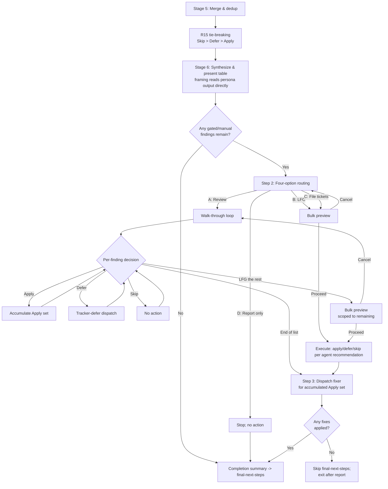

# feat: 为 ce:review 添加 interactive judgment loop

## 概览

重新设计 `ce:review` Interactive mode 的 post-review flow。当前 single bucket-level policy question（Review and approve specific gated fixes / Leave as residual work / Report only）替换为四选项 routing question（**Review** walk-through / **LFG** / **File** tickets / **Report** only）。Review path 会逐个 walk findings，以 plain-English framing 和 per-finding actions（Apply / Defer / Skip / LFG the rest）呈现。LFG、File-tickets 和 LFG-the-rest paths 在执行前展示 compact plan preview（Proceed / Cancel）。Defer actions 会在 project tracker 中 file tickets（reasoning-based detection，fallback 到 GitHub Issues 或 harness task primitive）。

对 shared reviewer subagent template 做一个小的 framing-guidance upgrade，确保每个 user-facing surface（walk-through、bulk preview、ticket bodies）都用 plain English、observable behavior first，而不是 code structure，解释 findings。该 upgrade 通过单个 file change 应用于全部 16+ persona agents，同时修复 adversarial 和 api-contract 中观察到的 null-`why_it_matters` schema violations，以及 correctness 和 maintainability 中观察到的 code-structure-first framing。

所有其他 `ce:review` modes（Autofix、Report-only、Headless），以及 existing merge/dedup pipeline、persona dispatch、safe_auto fixer flow 都保持不变。

## 问题框架

今天的 Interactive mode 大多退化为 rubber-stamping 或 wholesale deferral：

1. **Judgment calls 很难做。** 当 finding 需要 human judgment 时，今天的 pipe-delimited table row 很少提供足够 context 让人 confidently decide。user 被要求 approve 或 defer 一整桶 findings，而不是逐个理解。
2. **High-volume feedback 难以逐条 reasoning。** 8-12 findings 的 review 会变成 scrolling table。没有办法 meaningful 地响应单个 items，只能 "approve the whole bucket" 或 "defer the whole bucket"。

结果是：schema 中的 `gated_auto` / `manual` routing tiers 在实践中从未真正 per-finding exercise。完整 problem frame 见 origin document。

## 需求追踪

### `safe_auto` fixes 后的 routing 路由

- R1. 四选项 routing question 替换今天的 bucket-level policy question（见 origin）
- R2. Zero-findings path 跳过 routing question，并展示 completion summary
- R3. Routing question 只有在 detection high-confidence 时才 inline 命名 detected tracker
- R4. 四个 options：`Review each finding one by one...`、`LFG. Apply the agent's best-judgment action per finding`、`File a [TRACKER] ticket per finding...`、`Report only...`
- R5. Routing option C 是 batch-defer shortcut：不同于 walk-through 的 per-finding Defer

### Per-finding walk-through 逐条走查

- R6. Walk-through 按 severity order 逐个呈现 findings，并带 position indicator
- R7. Per-finding question content 包含：plain-English problem、severity、confidence、proposed fix、reasoning
- R8. Per-finding options 为：Apply / Defer / Skip / LFG the rest
- R9. Advisory-only findings 用 `Acknowledge — mark as reviewed` 替代 option A
- R10. Override = 选择不同 preset action；不支持 inline freeform custom fixes
- N=1 adaptation：walk-through wording adapts，并 suppress `LFG the rest`

### LFG path 路径

- R11. LFG applies the per-finding action the agent would recommend；区分 top-level scope 与 walk-through D scope
- R12. 任意 LFG execution 后提供 single completion report with required fields

### Bulk action preview 批量操作预览

- R13. 每个 bulk action（LFG、File tickets、LFG the rest）前展示 compact preview，带 `Proceed` / `Cancel`
- R14. Preview content 按 intended action 分组；每个 finding 用 compressed framing-quality form 一行显示

### Recommendation tie-breaking 推荐动作裁决

- R15. 当 reviewers 对 per-finding action 意见不同时，synthesis 使用 `Skip > Defer > Apply` 选择最 conservative

### Defer behavior 和 tracker detection

- R16-R21. Defer 在 project's tracker 中 file tickets；minimal reasoning-based detection；fallback 到 GitHub Issues 再到 harness task primitive；failure inline surface；no-sink 时完全 omit Defer；internal `.context/` todo system 明确不在 fallback chain

### Framing quality（cross-cutting）表达质量

- R22-R26. 所有 user-facing finding surfaces（walk-through questions、LFG completion reports、ticket bodies、bulk-preview lines）都以 plain English、observable-behavior-first、tight 2-4 sentences 解释。Planning 结论：通过对 shared reviewer subagent template 做小的 framing-guidance upgrade（Unit 2）交付，一次性在 source 处修正，而不是 downstream rewrite。shared template 之外的 per-persona file edits defer 为 follow-up。

### Mode boundaries 模式边界

- R27. 只有 Interactive mode 改变 behavior。Autofix / Report-only / Headless 不变
- R28. Final-next-steps flow（push / PR / exit）仅在一个或多个 fixes landed in the working tree 时运行

## 范围边界

- 不新增 `ce:fix` skill。所有 changes 位于 `ce:review` 内。
- 不改变 findings schema、merge/dedup routing（除了 R15 recommended-action tie-breaking）、或 autofix-mode residual-todo creation。
- 对 shared reviewer subagent template 做小的 framing-guidance updates 在 scope 内（见 Unit 2）。Per-persona file edits 不在 v1 scope：shared-template change 一次性影响全部 personas，这是刻意选择的 "small upgrade"，优于 synthesis-time rewrite pass。
- Walk-through 中不支持 inline freeform fix authoring：walk-through 是 decision loop，不是 pair-programming surface。
- "approve intent, write a variant" case 在 v1 不支持；user 选择 Skip 后 hand-edit。
- 不改变 Autofix、Report-only 或 Headless mode behavior。
- Pre-menu findings table format（pipe-delimited、severity-grouped）保持不变。
- 当前 bucket-level policy question wording 完全移除，不做 backward-compatibility shim。

### 推迟到单独任务

- **Shared template 之外的 per-persona file edits：** deferred。Unit 2 更新 shared subagent template，添加 R22-R25 framing guidance，适用于所有 personas。若 post-ship sampling 显示特定 personas 仍产生 weak framing，再做 targeted per-persona file upgrades。
- **逐步废弃 internal `.context/compound-engineering/todos/` todo system 和 `/todo-create`、`/todo-triage`、`/todo-resolve` skills：** origin 中已承认长期方向。Separate cleanup。
- **tracker defer dispatch 和 bulk preview rendering 的 script-first architecture：** planning 期间考虑过。defer 到 v2：当前 ce:review 完全是 prose-based orchestration；新增 scripts 会扩大 redesign footprint 和 cross-language test surface。基于 usage data 再重新评估。

## 上下文与调研

### 相关代码和模式

**要修改的当前 `ce:review` structure：**
- `plugins/compound-engineering/skills/ce-review/SKILL.md`：single orchestrator，744 lines。After Review section at lines 603-715 是 primary edit target。
- 当前 bucket policy question 位于 `plugins/compound-engineering/skills/ce-review/SKILL.md:615-640`。Stem 违反 AGENTS.md third-person rule（"What should I do..."）；redesign 会修复。
- Stage 5 merge pipeline 位于 `plugins/compound-engineering/skills/ce-review/SKILL.md:451-479`。line 471 existing "most conservative route" rule 会为 R15 扩展。
- Headless detail-tier enrichment 位于 `plugins/compound-engineering/skills/ce-review/SKILL.md:568-572`。Walk-through 会 verbatim 复用该 exact matching rule。
- Safe_auto fixer dispatch 位于 `plugins/compound-engineering/skills/ce-review/SKILL.md:664-671`（"Spawn exactly one fixer subagent..."）。walk-through 的 Apply actions 会 accumulate，并在 walk-through 末尾 dispatch，以保留 "one fixer, consistent tree" guarantee。
- Findings schema 位于 `plugins/compound-engineering/skills/ce-review/references/findings-schema.json`。No schema changes；R15 tie-breaking 操作 existing fields。

**要 mirror 的 patterns：**
- Four-option menu format：`plugins/compound-engineering/skills/ce-ideate/references/post-ideation-workflow.md:137-150`。前置区分词、自包含 labels、third-person agent voice。
- 带 progress header 的 per-item walk-through：`plugins/compound-engineering/skills/todo-triage/SKILL.md:20-29`。使用 numbered chat prompts；ce:review walk-through 必须升级到 `AskUserQuestion`。
- 带 Accept / Reject / Discuss 的 per-agent review loop：`plugins/compound-engineering/skills/ce-plan/references/deepening-workflow.md:195-216`。
- Pre-menu 的 pipe-delimited findings table rhythm：`plugins/compound-engineering/skills/ce-review/references/review-output-template.md`。

**会 materially shape 本 plan 的 AGENTS.md rules：**
- `plugins/compound-engineering/AGENTS.md:122-134`：Interactive Question Tool Design（4-option cap；self-contained labels；third-person agent voice；front-loaded distinguishing words；target-named when ambiguous）
- `plugins/compound-engineering/AGENTS.md:117-119`：Cross-platform question tool phrasing。每个 new question 使用 "the platform's blocking question tool (`AskUserQuestion` in Claude Code, `request_user_input` in Codex, `ask_user` in Gemini)" 并带 fallback path。
- `plugins/compound-engineering/AGENTS.md:109-114`：Rationale discipline。将 walk-through、bulk preview、tracker defer flows 抽到 `references/`，因为它们是 conditional（仅 Interactive mode），否则会给每次 invocation 增加约 200 行。
- `plugins/compound-engineering/AGENTS.md:155-165`：Platform-specific variables in skills。walk-through state file path 从 existing run-id pattern pre-resolved。

### 机构经验

- `docs/solutions/skill-design/compound-refresh-skill-improvements.md`：Interactive-question-tool references 使用 platform-agnostic phrasing（"`AskUserQuestion` in Claude Code, `request_user_input` in Codex"），并明确 "stop to wait for the answer" language。新 interactive surfaces 通过 explicit `mode:interactive`（existing default）gate，永不基于 "no question tool = headless" auto-detection。
- `docs/solutions/skill-design/beta-promotion-orchestration-contract.md`：Mode contracts 是 load-bearing。`tests/review-skill-contract.test.ts` assert ce:review mode surface；任何 behavior change 必须在同一 PR 中 ship contract test update。
- `docs/solutions/workflow/todo-status-lifecycle.md`：Interactive mode 中 Apply outcomes 必须继续 route 通过 existing `ready` todo pipeline（preserving `downstream-resolver` contract）。Defer route 到 new tracker path。Skip 不产生 downstream artifact。不要 invent new `pending`-producing path。
- `docs/solutions/skill-design/git-workflow-skills-need-explicit-state-machines.md`：Stateful per-item walkthroughs 需要 explicit transitions。walk-through 的 "no more findings" 和 "LFG the rest" 是不同 terminal transitions；应分别 encode，而不是 collapse。
- `docs/solutions/best-practices/codex-delegation-best-practices.md`：Skill body size 是 multiplicative cost driver。将 Interactive-mode detail 移到 `references/`，因为它只在少数 invocations 上运行。
- `docs/solutions/skill-design/pass-paths-not-content-to-subagents.md`：如果 Defer 为 ticket composition invoke sub-agent，传 paths（到 merged findings artifact）而不是 content。此外："per-item walk" phrasing 在 Claude Code 中相较 "bulk find, then filter" 会导致 7x tool-call amplification；walk-through spec 会 iterate merged findings in memory，而不是每个 finding 重新 scan。

### 外部参考

未使用。Local patterns 足够强；没有 framework/security/compliance unknowns。

## 关键技术决策

- **将 walk-through、bulk preview 和 tracker defer 提取到 `references/` files。** SKILL.md 已有 744 行；这三个 surfaces 是 conditional（Interactive mode 且 gated/manual findings remain），如果 inline 会让每次 invocation 都支付约 200 行 body cost。遵守 `plugins/compound-engineering/AGENTS.md:109-114`。

- **R15 tie-breaking 扩展 existing Stage 5 "most conservative route" rule。** `SKILL.md:471` 上的 rule 已对 `autofix_class` / `owner` 做了这个。R15 对 recommended *action*（Apply / Defer / Skip）添加同样 discipline，使用顺序 `Skip > Defer > Apply`。同一 Stage 5 sub-step，同一 philosophy；不新增 architectural seam。

- **R22-R25 framing quality 通过 shared reviewer subagent template 的小 framing-guidance upgrade 交付，而不是 synthesis-time rewrite pass。** Planning-phase sampling 对 5 个 personas 的 15+ recent review artifacts 展示了两个不同 gaps：
  1. *Consistency gap:* `adversarial-reviewer` 和 `api-contract-reviewer` 在至少一次 recent run 中每个 finding 都产出 `why_it_matters: null`（schema violation：field required）。
  2. *Quality gap:* `correctness-reviewer` 和 `maintainability-reviewer` 会填 `why_it_matters`，但以 code-structure-first framing 开头；observable-behavior-first（R23）在 sampled 7 个 findings 中约 5 个失败。

  考虑过的 options：(a) synthesis-time rewrite pass（new Stage 5b with per-finding model dispatch）：拒绝，因为对该 gap 过度设计、增加 recurring per-review cost、且只是掩盖 schema violation 而非修复；(b) 对 5 personas 做 per-persona file upgrades：拒绝，因为 v1 scope inflation；(c) shared-template upgrade：选择。一个 file change（persona subagent template）添加每个 dispatched persona 都会收到的 framing guidance，在 source 处修复两个 gaps，scope 有界。如果 post-ship sampling 显示特定 personas 仍失败，再做 targeted per-persona edits。

- **Walk-through 中的 Apply actions 会 accumulate，并在末尾 dispatch。** walk-through 在 memory 中收集 Apply decisions，loop exit 后为完整 accumulated set dispatch 一个 fixer subagent。User 体验上的 trade-off：fix failure 会在 walk-through 末尾 surface，而不是 decision moment。替代方案，即 per-finding fixer dispatch，会产生 per-finding fixer overhead、spawn racey mid-walk-through processes，并复杂化 user model（Apply 什么时候 "real"？）。unified end-of-walk-through dispatch 也意味着 fixer 一次看到整个 set，可以在一轮中处理 inter-fix dependencies（两个 Applies 触及 overlapping regions），而不是 sequentially。existing Step 3 fixer prompt 需要小更新，以承认 heterogeneous queue（gated_auto + manual mix，不只是 safe_auto）；记录在 Unit 3。

- **Tracker detection 按 R14 / R17 保持 reasoning-based。** 不列 enumerated checklist of files。Agent 读取 `CLAUDE.md` / `AGENTS.md` 和它认为相关的任何内容。evidence ambiguous 时，label generic（"File an issue per finding"），且 agent 在执行任何 Defer 前向 user confirm tracker。GitHub Issues 是 spec 中唯一 concrete fallback；harness task primitive 是 last-resort，并带 clear durability warning。

- **v1 保持 prose-based，而不是 script-first。** Deterministic logic（preview rendering、tracker dispatch）按 `docs/solutions/skill-design/script-first-skill-architecture.md` 是 script-first candidate。defer 到 v2：当前 ce:review 完全是 prose-based orchestration；新增两个 scripts 会扩大 redesign footprint 并引入 cross-language test surface。基于 usage data 再 revisit。

- **Walk-through state 只在 memory 中，不按 decision persist。** walk-through 将 Apply / Defer / Skip / Acknowledge decisions accumulate 在 orchestrator memory 中。Formal cross-session resumption 不在 scope；interrupted walk-through 只会丢失 in-flight state（prior Applies 尚未 dispatch，因为 Apply 在末尾 batch）。避免 state-file schema design、external-edit staleness detection 和 `.context/` lifecycle management 的复杂度，因为 inspectable partial state 没有 consumer。

- **Tracker-availability probes 每个 session 最多运行一次，并 cache 到 run 结束。** routing question 需要决定是否 offer option C 及 tracker name 时，才运行单个 probe sequence（例如 read `CLAUDE.md` / `AGENTS.md`，再按需 `gh auth status`，再做 MCP-tracker availability checks）。`{ tracker_name, confidence, sink_available }` tuple 被 cached；同一 session 中后续 Defer actions reuse，不 re-probe。Probes 仅当 routing question 即将被问时触发，不在 review 开始时 speculative run。

- **所有 new question stems 和 labels 使用 third-person voice。** 当前 bucket question stem（"What should I do..."）违反 `plugins/compound-engineering/AGENTS.md:127`。redesign 对 new surfaces 使用 "What should the agent do next?" style 修复。

## 开放问题

### 规划期间已解决

- **Reviewer personas 今天能否可靠产出 framing-quality `why_it_matters`？** 不可靠，有两个 failure modes：(a) `adversarial` 和 `api-contract` 在一个 recent run 中每个 finding 都产出 `why_it_matters: null`（schema violation）；(b) `correctness` 和 `maintainability` 会填该 field，但 7 个 sampled findings 中有 5 个以 code structure 而不是 observable behavior 开头。Resolution：对 shared reviewer subagent template 做小 framing-guidance upgrade（Unit 2），在 source 处处理两个 gaps：single file change、universal effect across all personas。Schema-violation bug inline 修复；不需要 separate deferred item。
- **Walk-through 中的 Apply：per-finding 还是 batched？** 在 walk-through 末尾 batch。User experience：fix results 在末尾 surface。fixer 也能一次看到完整 Apply set，支持 dependency-aware application。existing Step 3 fixer prompt 需要小更新以承认 heterogeneous queue（Unit 3 tracking）。
- **Tracker dispatch 和 preview 是否 script-first？** Deferred to v2。本工作保持 prose-based，以匹配 existing ce:review shape。
- **R15 tie-breaking 落在 pipeline 哪里？** 在 Stage 5 merge 中，作为 existing conservative-route rule 的 extension，紧跟 current step 7（"Normalize routing"）之后。
- **是否将 new logic 提取到 `references/`？** 是：三个 new reference files（walk-through、bulk preview、tracker defer）。

### 推迟到实现阶段

- **`LFG the rest` 和相关 bail-out moments 的 exact `AskUserQuestion` label wording。** Requirements pin semantics（"LFG the rest — apply the agent's best judgment to this and remaining findings"），但 harness-specific label truncation behavior 可能要求 authoring 时微调 phrasing。Implementation 期间对每个 target platform validate。
- **Subagent template 的 exact framing-guidance prose（Unit 2）。** Block 必须 tight（加一两段，不是几页），包含 positive/negative example pair，并强化 required-field constraint。Implementation 时结合 recent artifacts wording。
- **GitHub Issues availability check command。** 按 R14 / R17 交给 runtime agent reasoning（例如 `gh auth status` + `gh repo view --json hasIssuesEnabled`，或 cheaper signal）。不预先指定。
- **Heterogeneous Apply queue 的 fixer subagent prompt updates。** 今天 Step 3 fixer prompt scoped to safe_auto queue。walk-through 的 Apply set 可能包含 gated_auto 或 manual findings，其 suggested_fix 需要同样 execution care。Unit 3 authoring 期间迭代 prompt；可能成为 ce-review SKILL.md 中的一个 small prompt edit。
- **Reviewer-name attribution 是否保留在 per-finding questions 中。** Origin document 将此 defer 为 validation question。v1 implementation 保留，并在 ship 后通过 usage validate。

## 高层技术设计

> *这说明 intended flow，是给 review 的 direction guidance，不是 implementation specification。*



Diagram 展示 conceptual flow；exact prose sub-steps 和 `references/` delegation 在下面 implementation units 中落地。

## 实施单元

- [ ] **Unit 1：向 Stage 5 merge 添加 recommended-action tie-breaking**

**目标：** 扩展 existing Stage 5 "most conservative route" rule，将 conflicting per-finding recommendations（Apply / Defer / Skip）合并为每个 merged finding 的单一 deterministic value，使 LFG 和 walk-through Apply/Defer/Skip decisions 可 audit。

**需求：** R15

**依赖：** 无

**文件：**
- 修改： `plugins/compound-engineering/skills/ce-review/SKILL.md`（Stage 5，after existing step 7）
- 测试： `tests/review-skill-contract.test.ts`：添加 assertion，检查 Stage 5 prose 提到 tie-breaking rule 和顺序 `Skip > Defer > Apply`

**方法：**
- 在 existing "Normalize routing" step（`SKILL.md:471`）后立即添加 new sub-step（例如 "7b. Recommended-action tie-breaking"）
- 原样声明 rule：when merged findings carry conflicting recommendations, pick the most conservative using `Skip > Defer > Apply`
- Reference existing same-philosophy rule for `autofix_class`，让 extension 读起来像 continuation，而非 novelty

**遵循的模式：**
- `plugins/compound-engineering/skills/ce-review/SKILL.md:98` 和 `:471` 的 existing conservative-route prose
- schema 的 `_meta.return_tiers` structure，说明 merged finding carry 什么

**测试场景：**
- 正常路径：reviewer A recommends Apply，reviewer B recommends Defer on a merged finding -> merged recommendation is Defer
- 正常路径：reviewer A Defer，reviewer B Skip -> merged recommendation is Skip
- 正常路径：所有 contributing reviewers recommend Apply -> merged recommendation is Apply
- 边界情况：single reviewer（未发生 merge）-> 该 reviewer recommendation 原样 pass through
- 边界情况：finding 只有 `autofix_class: advisory`，没有 apply/defer/skip recommendation：tie-breaking rule 是 no-op（不是 error）

**验证：**
- SKILL.md Stage 5 section 命名该 rule 和顺序。
- `bun test tests/review-skill-contract.test.ts` passes。

---

- [ ] **Unit 2：用 R22-R25 framing guidance 升级 shared reviewer subagent template**

**目标：** 向 shared reviewer subagent template 的 `why_it_matters` field 添加 framing guidance，让所有 persona agents 产出 observable-behavior-first framing（修复 correctness 和 maintainability 中观察到的 R23 gap），并永不 emit null `why_it_matters`（修复 adversarial 和 api-contract 中观察到的 schema violation）。一个 file change，universal effect across all 16+ persona agents。

**需求：** R22, R23, R24, R25, R26

**依赖：** 无（可与 Unit 1 并行 author）

**文件：**
- 修改： `plugins/compound-engineering/skills/ce-review/references/subagent-template.md`：为 `why_it_matters` field 添加 dedicated framing-guidance block
- 测试： `tests/review-skill-contract.test.ts`：添加 assertions，检查 framing-guidance block 及其 key constraints 存在

**方法：**
- 当前 subagent template 已指示 personas 按 schema 返回 JSON，但除了 schema 的一行描述（"Impact and failure mode -- not 'what is wrong' but 'what breaks'"）外，没有指导 *如何* 写 `why_it_matters`。
- 向 template 添加新的 `why_it_matters` guidance block，orchestrator 会 verbatim dispatch 给每个 persona。Content：
  - 以 observable behavior 开头（user、attacker 或 operator 会看到什么），不要以 code structure 开头。Function 和 variable names 仅在 reader 需要定位 issue 时出现。
  - 解释 *why* recommended fix works，而不只是 what it changes。当 codebase 其他地方存在 similar pattern 时，reference 它，使 recommendation grounded。
  - Tight：约 2-4 sentences，加上 grounding 所需最少 code。更长是 regression。
  - `why_it_matters` 是 schema required。Empty、null 或 single-phrase entries 是 validation failures：必须始终产出 grounded in evidence 的 substantive content。
- 包含 positive/negative example pair，为 personas 提供 concrete calibration anchor。
- 因 shared template 会被每个 dispatched persona verbatim loaded，该 change 在 source 处用一个 edit 修复两个 gaps，无需 per-persona file editing。

**遵循的模式：**
- `plugins/compound-engineering/skills/ce-review/references/subagent-template.md` 的 existing structure（canonical template 通过 `plugins/compound-engineering/skills/ce-review/SKILL.md:405-445` dispatch path 传给所有 personas）。
- 来自 `docs/brainstorms/2026-04-17-ce-review-interactive-judgment-requirements.md`（R22-R25 section）的 illustrative framing pair。可 verbatim reuse 或 tight paraphrase。

**测试场景：**
- Template structure：subagent template 包含 dedicated section，指导 personas 如何做 `why_it_matters` framing（observable-behavior-first、2-4 sentences、grounded in evidence、required field）。
- Template example：template 包含 positive/negative framing example pair。
- 集成（post-merge sampling）：template change 落地后，从 correctness、maintainability、adversarial、api-contract、security、reliability 各 sample 一个 fresh review artifact。确认 `why_it_matters` populated（never null），且多数 cases 以 observable behavior 开头。
- 边界情况：某 persona 仍在一部分 findings 中产出 weak framing：这不是本 unit regression；作为 per-persona follow-up track。

**验证：**
- subagent template 包含 framing-guidance block、required-field reminder 和 example pair。
- fresh review run 的 artifact files 中每个 finding 都有 populated `why_it_matters`（无 null values）。
- Spot-check 5+ fresh findings 的 `why_it_matters` first sentence：每个都以 observable behavior 开头，而非 code structure。

---

- [ ] **Unit 3：编写 per-finding walk-through**

**目标：** `Review each finding one by one` path：逐个呈现 findings，包含 required per-finding content（R7）、options（R8-R10）、advisory variant（R9）、mode+position indicator（R6）、N=1 adaptation、R15 conflict surfacing、no-sink handling。Loop 末尾将 Apply decisions 作为 batch hand off 给 existing fixer subagent。实现 R6-R12（walk-through scope）。

**需求：** R6, R7, R8, R9, R10, R11（walk-through scope of LFG）, R12（completion report for walk-through's Apply / Defer / Skip decisions）

**依赖：** Unit 2（walk-through display 直接读取 persona-produced `why_it_matters`；upgraded template 确保 content 满足 R22-R25 quality）

**文件：**
- 新增： `plugins/compound-engineering/skills/ce-review/references/walkthrough.md`
- 修改： `plugins/compound-engineering/skills/ce-review/SKILL.md`：在 After Review Step 2 下添加 sub-step（例如 Step 2c），delegate 到 reference
- 测试： `tests/review-skill-contract.test.ts`：assert `references/walkthrough.md` 存在，以及 per-finding questions 的 four-option label set

**方法：**
- Walk-through 按 severity order（P0 → P3）iterate merged findings，直接从 persona artifact 读取每个 finding 的 `why_it_matters` 和 evidence（与 `SKILL.md:568-572` headless mode 使用的 lookup rule 相同）。Unit 2 template upgrade 确保 persona output 满足 framing bar；这里不做 synthesis-time rewrite。
- 每个 question 使用平台 blocking question tool（`AskUserQuestion` / `request_user_input` / `ask_user`），包含：
  - Stem：以 mode+position indicator 开头（"Review mode — Finding 3 of 8 (P1):"），然后展示 persona-supplied plain-English problem 和 proposed fix
  - 当 R15 tie-breaking 缩窄 reviewer conflict 时，stem 简短 surface 该 context（例如 "Correctness recommends Apply; Testing recommends Skip. Agent's recommendation: Skip."），让 user 同时看到 orchestrator final call 和 disagreement context。orchestrator recommendation 在 option set 中标记为 "recommended"。
  - 四个 options（R8）：`Apply the proposed fix` / `Defer — file a [TRACKER] ticket` / `Skip — don't apply, don't track` / `LFG the rest — apply the agent's best judgment to this and remaining findings`
  - 对 advisory-only findings：option A 变为 `Acknowledge — mark as reviewed`（R9）。其余 options 不变。
- Per-finding routing：逐项路由
  - Apply -> 将 finding id accumulate 到 in-memory Apply set；advance
  - Defer -> invoke tracker-defer flow（见 Unit 5）；success 时记录 tracker URL；failure 时 present Retry / Fall back / Convert-to-Skip。walk-through position indicator 在该 sub-flow 中保持 current finding。
  - Skip -> record Skip；前进到下一项
  - Acknowledge -> record Acknowledge；前进到下一项（advisory-only path）
  - LFG the rest -> exit walk-through loop；dispatch bulk preview（Unit 4），scope 到 remaining findings，并 inline already-decided count。如果 preview Cancel，返回当前 finding 的 per-finding question（不是 routing question）。
- Walk-through state 仅 in-memory（不写 disk）。interrupted walk-through 丢弃 in-flight decisions；因为 Apply 在 end-of-walk-through batch dispatch 前不会执行，所以 prior Applies 尚未 dispatch。
- walk-through loop terminate 后（all findings decided，或 user 选择 LFG-the-rest Proceed，或全部 decisions 都 non-Apply），本 unit hand off 到 end-of-walk-through dispatch：一个 fixer subagent 接收 accumulated Apply set；Defer set 已 inline executed；Skip / Acknowledge no-op。Existing Step 3 fixer subagent prompt 需要小更新，说明 queue 是 heterogeneous（gated_auto + manual mix，不只是 safe_auto）；虽然 prompt 今天在本 plan edit surface 之外，但本 unit approach 会追踪它。
- N=1 adaptation：当只剩一个 gated/manual finding，header wording 使用 "Review the finding"，而不是 "Review each finding one by one"；`LFG the rest` 从 option set 中 omit（三个 options）。
- No-sink adaptation：当 Unit 5 detection 返回 `sink_available: false`，per-finding question 中 omit option B（"Defer — file a ticket"）。Stem 告知 user 原因（"Defer unavailable on this platform — no tracker or task-tracking primitive detected."）。
- Override clarification（R10）：选择 Defer 或 Skip 而不是 Apply 就是 "override"；不支持 inline freeform fix authoring；想要 variant 的 users 选择 Skip 后 hand-edit。

**Completion report（与 Unit 4 按 T5 shared）：** 当 walk-through 终止，或任意 bulk action（LFG / File tickets / LFG the rest）执行完成，或 zero-findings path 运行时，按 R12 minimum fields emit 一个 unified completion report：per-finding entries（title、severity、action taken、Deferred 的 tracker URL、Skipped 的 one-line reason）、按 action 的 summary counts、explicit failure callouts，以及 existing end-of-review verdict。不同 paths 使用同一 report structure，只是 data 不同。

**Execution note：** walk-through 在操作上 read-only，除了两个允许 writes：in-memory Apply-set accumulator，以及 tracker-defer dispatch（Unit 5）。Persona agents 保持 strict read-only。

**遵循的模式：**
- `plugins/compound-engineering/skills/todo-triage/SKILL.md:20-29`：per-item prompt 和 progress header（model upgrade：使用 `AskUserQuestion` 而非 numbered chat options）
- `plugins/compound-engineering/skills/ce-review/SKILL.md:568-572`：persona-produced `why_it_matters` 和 evidence 的 artifact lookup
- `plugins/compound-engineering/skills/ce-plan/references/deepening-workflow.md:195-216`：带 third-person agent voice 的 per-agent loop
- `plugins/compound-engineering/skills/ce-review/references/review-output-template.md`：severity-grouped rhythm（与 menu 前 table 一致）

**测试场景：**
- 正常路径：3-finding review，user 逐个选择 Apply / Defer / Skip -> walk-through completes；end-of-walk-through fixer dispatch 收到 1-element Apply set；file 一个 Linear ticket；completion report 显示 1 applied / 1 deferred with URL / 1 skipped
- 正常路径 N=1：1-finding review，question wording adapts 且 `LFG the rest` suppressed（三个 options）
- Advisory variant：advisory-only finding -> option A 显示 `Acknowledge — mark as reviewed`
- LFG the rest：finding 2 of 5 时，user 选择 LFG the rest -> walk-through exits，bulk preview scoped 到 findings 2-5，并带 "1 already decided" note；preview Cancel 返回 finding 2，而不是 routing question
- Override：user 在有 concrete proposed fix 的 finding 上选择 Skip -> walk-through records Skip（not Apply）
- R15 conflict surface：reviewers 推荐不同 actions 的 finding -> walk-through stem surface conflict 和 orchestrator final recommendation；user 选择 orchestrator recommendation 并继续
- Defer failure mid-walk-through：user 在 finding 3 of 5 选择 Defer；`gh issue create` 返回 403；Retry / Fall back / Convert-to-Skip sub-question 出现；user 选择 Convert-to-Skip；position indicator 保持 3 of 5；completion report 的 failure callout 命名 finding 和 reason
- 边界情况（interruption）：user 中途 cancel AskUserQuestion -> prior in-memory Apply/Defer/Skip decisions lost；已经执行的 Defers 仍保留在 tracker（external side effects 不可 rollback）；Skip/Acknowledge/Apply-pending states 被丢弃；不运行 end-of-walk-through fixer dispatch
- No-sink：detection 返回 `sink_available: false` -> per-finding question 展示三个 options（无 Defer）；stem 解释原因
- 集成：walk-through Apply action 将 finding 加到 Apply set；walk-through complete 后，Step 3 fixer subagent 接收 accumulated set，并带 prompt update 说明 heterogeneous queue

**验证：**
- 在 3+ finding fixture 上运行 `ce:review` interactive，每个 question 都正确展示 mode+position + framing + options。
- end-of-walk-through fixer dispatch 只运行一次，包含全部 Apply decisions；loop 期间没有 per-finding fixer calls。
- 每个 terminal path 都 emit unified completion report（walk-through complete、LFG-rest Proceed、LFG-rest Cancel 后 user 选择 Stop）。

---

- [ ] **Unit 4：编写 bulk action preview**

**目标：** 每个 bulk action 前展示 compact plan preview（top-level LFG、top-level File tickets、walk-through `LFG the rest`）。实现 R13-R14 和 LFG half of R12（post-execution completion report 与 Unit 3 shared）。

**需求：** R13, R14（R12 completion report 与 Unit 3 按 T5 shared）

**依赖：** Unit 2（preview lines 直接以 compressed form 读取 persona-produced `why_it_matters`；upgraded subagent template 确保 content 满足 framing bar）

**文件：**
- 新增： `plugins/compound-engineering/skills/ce-review/references/bulk-preview.md`
- 修改： `plugins/compound-engineering/skills/ce-review/SKILL.md`：After Review Step 2 为 options B 和 C dispatch 到该 reference；Unit 3 walk-through 为 `LFG the rest` dispatch
- 测试： `tests/review-skill-contract.test.ts`：assert reference 存在，且 preview contract 只使用 `Proceed` / `Cancel`

**方法：**
- Preview 按 agent intends to take 的 action grouping render findings：`Applying (N):`、`Filing [TRACKER] tickets (N):`、`Skipping (N):`、`Acknowledging (N):`
- 每个 finding line：severity tag + file:line + compressed plain-English summary + action phrase。每个 finding 一行，max 约 80 columns
- Compressed framing 遵循 R22-R25 spirit：observable behavior 优先于 code structure；除非需要 locate，否则不使用 function/variable names。来自 persona-produced `why_it_matters`（post-Unit 2 template upgrade）的 condensed form；preview line 本质上是 finding framing 的 first sentence
- 对 `LFG the rest`：preview header 读作 "LFG plan — N remaining findings (K already decided)"；already-decided findings 不包含在 preview 中
- Question：`AskUserQuestion` / `request_user_input` / `ask_user`，恰好两个 options：
  - `Proceed`
  - `Cancel — back to routing`（top-level）或 `Cancel — back to walk-through`（LFG the rest）
- Cancel 返回 originating question，不改变 state
- Proceed 执行 plan：Apply set -> Step 3 fixer；Defer set -> tracker-defer flow（Unit 5）；Skip/Acknowledge -> no action；然后流入 completion report

**技术设计：** *(directional)*

Preview layout：预览布局

```
LFG plan — 8 findings (tracker: Linear):

Applying (4):
  [P0] orders_controller.rb:42 — Add ownership guard before order lookup
  [P1] webhook_handler.rb:120 — Raise on unhandled error instead of swallowing
  [P2] user_serializer.rb:14 — Drop internal_id from serialized response
  [P3] string_utils.rb:8 — Rename ambiguous helper for clarity

Filing Linear tickets (2):
  [P2] billing_service.rb:230 — N+1 on refund batch (no concrete fix)
  [P2] session_helper.rb:12 — Session reset behavior needs discussion

Skipping (2):
  [P2] report_worker.rb:55 — Recommendation is speculative; low confidence
  [P3] readme.md:14 — Style preference, subjective

A) Proceed
B) Cancel
```

**遵循的模式：**
- `plugins/compound-engineering/skills/ce-review/references/review-output-template.md` 的 compact tabular rhythm
- `plugins/compound-engineering/AGENTS.md:122-134` 中的 third-person labels 和 front-loaded distinguishing words
- `docs/solutions/best-practices/conditional-visual-aids-in-generated-documents.md` 中的 conditional visual aid guidance

**测试场景：**
- 正常路径（LFG, top-level）：8 findings mixed across actions -> preview 显示 grouped buckets 和 correct counts；Proceed 进入 dispatch；Cancel 返回 routing
- 正常路径（File tickets, top-level）：无论 agent natural recommendation 如何，每个 finding 都出现在 `Filing [TRACKER] tickets (N):` 下，因为 option C 是 batch-defer
- 正常路径（LFG the rest）：walk-through 已 decided 3 findings；preview scopes to 5 remaining，header 中带 "3 already decided"
- 边界情况：bucket 中 zero findings -> preview 中 omit 该 bucket header（无 empty `Skipping (0):` line）
- 边界情况：所有 findings map 到 single bucket -> preview 仍显示 bucket header；仍 offer Proceed/Cancel
- Advisory preview：advisory-only findings 出现在 `Acknowledging (N):` 下，action phrase 是 "Mark as reviewed"
- Cross-platform：平台没有 blocking question tool 时，preview fallback 到 numbered options 并等待 user input

**验证：**
- 三个 call sites（Step 2 option B、Step 2 option C、walk-through `LFG the rest`）都正确 render preview。
- Cancel 返回 originating question；Proceed 执行 plan。
- Preview lines 都满足 compressed framing bar。

---

- [ ] **Unit 5：编写 tracker detection 和 defer execution**

**目标：** Tracker detection、fallback chain、ticket body composition、failure path 和 no-sink case。实现 R16-R21 以及 R3 的 tracker-name-inline-when-confident rule。

**需求：** R3（partial：tracker naming）、R13（partial：preview 中 tracker name）、R16、R17、R18、R19、R20、R21

**依赖：** 无（可与 Units 3 和 4 并行 author）

**文件：**
- 新增： `plugins/compound-engineering/skills/ce-review/references/tracker-defer.md`
- 修改： `plugins/compound-engineering/skills/ce-review/SKILL.md`：After Review Step 2 reference 该 file，用于 tracker-name-in-label logic 和 Defer execution
- 测试： `tests/review-skill-contract.test.ts`：assert reference 存在，并且 R21 的 "internal `.context/` todos out of fallback chain" 在 prose 中明确

**方法：**
- **Detection（reasoning-based per R14 / R17）：** Agent 读取 project documentation，主要是 `CLAUDE.md` / `AGENTS.md`，并根据明显 evidence 判断 tracker。不列 enumerated checklist。Tracker 可以通过 MCP tool（例如 Linear MCP）、CLI（例如 `gh`）或 direct API surface；都 acceptable。当 tracker 被明确命名（如 "issues go in Linear"、Linear URL、project board link），confidence high。信号冲突或缺失时，confidence low。
- **Probe timing and caching（T3）：** Availability probes（例如 `gh auth status`、MCP-tracker reachability）每 session 最多运行一次，且只在 routing question 即将被问时运行：不在 review start speculative run，不 per-Defer，不 per-walk-through-finding。结果 `{ tracker_name, confidence, sink_available }` tuple 在本 run 剩余时间里保存在 orchestrator memory。如果 named tracker 的 availability 单凭 docs 不确定（提到 tracker 但 agent 看不到 MCP/CLI invocation），probe 一次 resolve uncertainty。
- **Label logic（R3）：** 如果 confidence high 且 tracker sink available，routing question 和 walk-through Defer label 会 verbatim 包含 tracker name（例如 `File a Linear ticket per finding`）。如果 confidence low 或 sink uncertain，labels 读 generic（`File an issue per finding`），且 agent 在执行任何 Defer 前与 user confirm tracker。
- **Fallback chain（R18 principle-based）：** durable external trackers 优先于 in-session-only primitives。Concrete fallbacks 顺序：named tracker（MCP / CLI / API the agent can invoke）-> GitHub Issues via `gh` if authenticated and repo has issues enabled -> harness task-tracking primitive（Claude Code 中 `TaskCreate`，Codex 中 `update_plan`），并向 user 明确 durability notice。永不 fallback 到 `.context/compound-engineering/todos/`（R21，explicit out-of-scope）。
- **No-sink case（R20）：** 当没有 detectable external tracker 且没有 harness primitive（例如 CI、无 task binding 的 converted targets），不提供 Defer menu option。Routing option C omitted；walk-through option B omitted；agent 告诉 user 原因。
- **Ticket composition:** Title = merged finding's title。Body 使用 persona-produced `why_it_matters` 和 evidence（通过与 `SKILL.md:568-572` headless enrichment 相同 rule 从 per-agent artifact 读取），并附 severity、confidence、reviewer attribution、finding_id。当 tracker 支持 labels 时，labels 包含 severity tag。
- **Failure path（R19）：** Ticket-creation failure 时，通过 blocking question inline surface error：`Retry` / `Fall back to next available sink` / `Convert to Skip (record the failure)`。Completion report 记录 failure。当 high-confidence named tracker 在 execution 时失败，invalidate session cached `sink_available`，使 same session 中后续 Defers fall through 到 next tier，而不是 retry confirmed-broken sink。
- **Once-per-session confirmation:** 当 fallback 到 harness task primitive 时，在 first Defer action 前每 session confirm 一次："No documented tracker and `gh` unavailable — will create in-session tasks that won't survive this session. Proceed for this and subsequent Defer actions?"

**遵循的模式：**
- `plugins/compound-engineering/skills/report-bug-ce/SKILL.md:104-122`：唯一 existing `gh issue create` usage；optional labels 和 fallback body pattern
- `plugins/compound-engineering/skills/ce-debug/SKILL.md:40-42`：通过 MCP tools 或 URL fetching consume tracker URLs（Linear / Jira）；将 "try, fall back, ask" style 转置到 write-path
- `plugins/compound-engineering/AGENTS.md:117-119`：failure-path follow-up 和 harness-fallback confirmation 的 cross-platform question phrasing
- `docs/solutions/integrations/cross-platform-model-field-normalization.md`：per-tracker behavior matrix，作为明确说明 Linear / GitHub Issues / harness primitive / no-tracker behavior 的 model

**测试场景：**
- 正常路径, named tracker：`CLAUDE.md` 提到 "file bugs in Linear" -> routing label 读 "File a Linear ticket per finding"；Defer dispatch 创建 Linear ticket
- 正常路径, GitHub Issues fallback：无 documented tracker，`gh` authenticated 且 issues enabled -> Defer 创建 GitHub issue；label 读 "File an issue per finding"；agent 执行前 confirm tracker choice
- 正常路径, harness fallback：无 documented tracker，`gh` unavailable -> once-per-session confirmation with durability warning；Defer 按 platform 调用 `TaskCreate` / `update_plan`
- No-sink：无 tracker、无 `gh`、无 harness primitive -> routing option C omitted；walk-through option B omitted；在 routing question stem 中告知 user 原因
- Failure path：`gh issue create` 返回 403 -> inline `Retry / Fall back / Convert to Skip` question；completion report 记录 failure
- Label confidence：`CLAUDE.md` 写 "bugs in Linear, features in GitHub Issues" -> ambiguous。label generic；agent dispatch 前 confirm
- 集成：ticket body 使用 post-Unit 2 template upgrade 后的 persona-produced `why_it_matters`；包含 reviewer attribution 和 finding_id
- Probe timing：routing question skipped 的 review（R2 zero-findings case）不触发 tracker probes；probe 只有 option C 是候选时运行
- 边界情况：ticket body 超过 tracker max length -> truncate with "…(continued in ce-review run artifact: <path>)"，并包含 finding_id 供 reference

**验证：**
- Reference file 按顺序覆盖 detection、label logic、fallback chain、failure path、no-sink、harness-fallback confirmation。
- 在 documented Linear 的 repo 上运行 Interactive mode，routing label 命名 Linear，并在 Defer 时创建 Linear-shaped ticket。

---

- [ ] **Unit 6：将 After Review Step 2 重构为 four-option routing**

**目标：** 用 four-option routing question 替换当前 bucket-level policy question，并 dispatch 到 walk-through（Unit 3）、bulk preview（Unit 4）或 tracker-defer（Unit 5）。实现 R1-R5 和 R27（mode boundary：only Interactive changes）。

**需求：** R1, R2, R3, R4, R5, R27

**依赖：** Units 3, 4, 5（routing dispatches to all three）

**文件：**
- 修改： `plugins/compound-engineering/skills/ce-review/SKILL.md`：After Review section（lines ~603-715）；完全替换 current Step 2
- 测试： `tests/review-skill-contract.test.ts`：添加 assertions，覆盖 four-option set、stem voice 和 tracker-name-conditional behavior；保留 Autofix / Report-only / Headless behavior 的 existing assertions

**方法：**
- 只重写 Interactive mode 的 "Choose policy by mode" subsection。Autofix / Report-only / Headless prose 不变
- 新的 Interactive mode flow：
  1. 自动 apply `safe_auto -> review-fixer` findings，不询问（unchanged）
  2. **R2 zero-check:** safe_auto 后若没有 remaining `gated_auto` / `manual` findings，展示 one-line completion summary（"All findings resolved — N safe_auto fixes applied."），并 proceed to Step 5（final-next-steps）
  3. **R3 tracker pre-detection:** Dispatch 到 `references/tracker-defer.md` 的 tracker detection logic；接收 `{ tracker_name, confidence, sink_available }` tuple
  4. **R1 routing question**，通过平台 blocking question tool：
	     - Stem（third-person，按 AGENTS.md:127）："What should the agent do with the remaining N findings?"
	     - 四个 options（R4）：仅展示有 sink 的 options（R20）：
	       - (A) `Review each finding one by one — accept the recommendation or choose another action`（逐条 review 每个 finding，接受 recommendation 或选择其他 action）
	       - (B) `LFG. Apply the agent's best-judgment action per finding`（LFG：按 agent 对每条 finding 的最佳判断执行 action）
	       - (C) `File a [TRACKER] ticket per finding without applying fixes`（不应用 fixes，为每条 finding 创建一个 [TRACKER] ticket；仅当 confidence high 时使用 concrete tracker name；否则读 "File an issue per finding"；`sink_available == false` 时完全 omit）
	       - (D) `Report only — take no further action`（仅报告，不采取进一步 action）
  5. 按 selection dispatch：
     - A -> `references/walkthrough.md`，进入逐项 walk-through
     - B -> `references/bulk-preview.md`（LFG plan scoped to all gated/manual findings）-> Proceed 后，Apply set via Step 3，Defer set via Unit 5，Skip/Acknowledge no-op
     - C -> `references/bulk-preview.md`（all findings under `Filing [TRACKER] tickets`）-> Proceed 后，对每个 finding via Unit 5 执行 Defer set；不 apply fixes
     - D -> skip to Step 5（final-next-steps），不执行 action
- 完全移除 current bucket policy question 和 its routing blocks（no shim：origin document Scope Boundary "no backward-compatibility shim"）

**遵循的模式：**
- Four-option routing label patterns：来自 `plugins/compound-engineering/skills/ce-ideate/references/post-ideation-workflow.md:137-150`
- Existing After Review mode-routing structure：位于 `plugins/compound-engineering/skills/ce-review/SKILL.md:615-662`（replace Interactive branch；leave Autofix / Report-only / Headless branches untouched）
- Cross-platform question phrasing：来自 `plugins/compound-engineering/AGENTS.md:117-119`

**测试场景：**
- 正常路径：review with 5 gated/manual findings and Linear tracker detected -> routing question shows all four options，option C 读 "File a Linear ticket per finding"，stem 是 third-person
- R2 zero-case：所有 findings 被 safe_auto resolved -> routing question skipped；展示 completion summary；Step 5 runs
	- R3 low-confidence tracker：ambiguous documentation -> option C label generic（"File an issue per finding"）；option C selection 时 agent 先 confirm tracker
- R20 no-sink：无 tracker、无 gh、无 harness primitive -> option C omitted；展示三个 options 而非四个
- Option A：dispatch walk-through，范围为全部 findings
- Option B：dispatch bulk preview，范围为全部 findings；Proceed executes
- Option C：dispatch bulk preview，全部 findings 放入 Filing bucket
- Option D：Step 5 在不执行 action 的情况下运行
- Third-person voice：stem 使用 "the agent"，而非 "I" / "me"
- Mode isolation（R27）：同一 fixture 在 `mode:autofix` / `mode:report-only` / `mode:headless` 下 behavior unchanged

**验证：**
- `bun test tests/review-skill-contract.test.ts` 通过 new assertions。
- After Review section 不再包含 old bucket policy question wording。
- 明确 dispatch 到 `references/walkthrough.md`、`references/bulk-preview.md` 和 `references/tracker-defer.md`。

---

- [ ] **Unit 7： 让 Step 5 final-next-steps 以 applied fixes 为条件**

**目标：** Existing "final next steps" flow（push fixes / create PR / exit）只在至少一个 fix landed in the working tree 时运行。对 option C、D 以及没有 Apply action 的 LFG / walk-through completions 跳过。实现 R28。

**需求：** R28

**依赖：** Unit 6（routing flow 必须 track 是否有 fix applied）

**文件：**
- 修改： `plugins/compound-engineering/skills/ce-review/SKILL.md`：Step 5（lines ~697-715）
- 测试： `tests/review-skill-contract.test.ts`：assert Step 5 gating prose

**方法：**
- Unit 6 routing resolve 且 Unit 3 / Unit 4 / Unit 5 execute 后，flow track `fixes_applied_count`（当 Step 3 fixer 成功处理任意 Apply decision 时 increment）
- Gate Step 5 existing prompt：如果 `fixes_applied_count == 0`，完全 skip Step 5，并在 completion report 后退出 skill
- 显式 skip conditions：
  - Option C ran（File tickets per finding）：没有 fixes landed；skip Step 5
  - Option D ran（Report only）：没有 fixes landed；skip Step 5
  - LFG ran 但 agent recommendations 没有 Apply：没有 fixes landed；skip Step 5
  - Walk-through completed with all Skip / Defer / Acknowledge：没有 fixes landed；skip Step 5
- 当 fixes landed 时，Step 5 完全按 today 运行：PR mode / branch mode / on-main mode

**遵循的模式：**
- `plugins/compound-engineering/skills/ce-review/SKILL.md:697-715` 的 existing Step 5 mode-aware phrasing

**测试场景：**
- 正常路径：walk-through 有 2 Apply decisions -> fixer runs -> Step 5 runs（offer push/PR/exit）
- Option D：Report only -> Step 5 skipped；skill 在 report 后退出
- Option C：File tickets -> tickets filed，no fixes applied -> Step 5 skipped（创建 tickets、不应用 fixes，因此跳过 Step 5）
- LFG with zero Applies：全部 recommendations 是 Defer 或 Skip -> Step 5 skipped
- Walk-through all Skip：无 Apply decisions -> Step 5 skipped
- Mixed walk-through：1 Apply + 2 Defer + 1 Skip -> Step 5 runs（混合 walk-through，有 Apply 因此运行 Step 5）

**验证：**
- SKILL.md Step 5 section 命名 gating condition。
- `bun test tests/review-skill-contract.test.ts` 通过 new gating assertions。
- Interactive mode 选择 option D 或 C 时，report 后 exit；带 Apply decisions 时，像 today 一样 offer Step 5。

---

- [ ] **Unit 8：更新 orchestration contract test**

**目标：** `tests/review-skill-contract.test.ts` 编码 updated ce:review contract for all modes，确保 callers（`lfg`、`slfg`、future orchestrator）保持 validated。

**需求：** R27（mode boundary assertions），以及 Units 1、2、3、4、5、6、7 的 contract assertions

**依赖：** Units 1-7

**文件：**
- 修改： `tests/review-skill-contract.test.ts`
- 验证（no change）：`plugins/compound-engineering/skills/ce-review/SKILL.md`（已由 Units 1-7 更新）

**方法：**
- 添加 **structural assertions**（检查 landmarks 和 files 是否存在，不锁 exact copy）：
  - Stage 5 prose 提到 conflicting recommendations 的 tie-breaking rule（Unit 1）。Assert Stage 5 中存在三个 action tokens（`Skip`、`Defer`、`Apply`）和单词 `conservative`；不要锁它们之间的 exact punctuation，方便 future clarity edits。
  - `references/walkthrough.md` exists（Unit 3）。
  - `references/bulk-preview.md` exists（Unit 4）。
  - `references/tracker-defer.md` exists，并声明 `.context/compound-engineering/todos/` 不在 fallback chain（Unit 5）。
  - `references/subagent-template.md` 包含针对 `why_it_matters` 的 framing-guidance block（Unit 2）。Assert 存在 "observable behavior" 和 required-field reminder；不要锁 example pair exact copy。
  - After Review Step 2（Interactive branch）呈现四个 options（Unit 6）。Assert 四个 distinguishing words 作为 standalone tokens 出现（`Review`、`LFG`、`File`、`Report`）；不要锁完整 option label copy。
  - After Review Step 2 stem 不包含 first-person "I" / "me"（Unit 6，AGENTS.md:127）。
  - Step 5 prose gate on fixes-applied（Unit 7）。Assert presence of conditional landmark；不要锁 exact phrasing。
- 保留 Autofix / Report-only / Headless mode prose 的 existing assertions（R27）。这些 branches 不被本工作改变；test 要锁定这一点。
- 确认 fallback chain 中没有 reference legacy `todos/`。
- **Philosophy:** contract test 是 regression guard，不是 authoring ossification。Assert stable landmarks（file paths、required tokens、mode branches），而非 exact prose。Future PRs 改善 wording 不应 break test。

**遵循的模式：**
- `tests/review-skill-contract.test.ts:1-257` 中 existing assertion style
- `bun:test` conventions 和 existing `parseFrontmatter` helper

**测试场景：**
- 正常路径：Units 1-7 landed 后，`bun test tests/review-skill-contract.test.ts` passes
- Regression guard：完全移除一个 routing option（丢掉四个 distinguishing words 之一）会 fail；为 clarity re-word label 不 fail
- Regression guard：在 Step 2 stem 中重新引入 first-person "I" / "me" 会 fail
- Mode isolation：移除或修改 Autofix / Report-only / Headless prose 会 fail（确保 R27 在 contract 中被 enforce）

**验证：**
- 全部 units 落地后 test suite passes。
- Test file 是 Interactive-mode contract shape 的 single source of truth。

## 系统级影响

- **交互图：** 新 After Review Step 2 dispatch 到三个 new reference files（`walkthrough.md`、`bulk-preview.md`、`tracker-defer.md`）。Framing quality 由 shared subagent template upstream 交付（Unit 2），不新增 orchestrator-owned inline stage。Existing Step 3 fixer subagent 在 Apply accumulation 末尾（walk-through path）或 Proceed 后（LFG path）调用一次。Step 5 变为 conditional on `fixes_applied_count > 0`。
- **错误传播：** Tracker failures 通过 Retry / Fallback / Convert-to-Skip follow-up question inline surface。当 high-confidence named tracker execution fail 时，其 cached sink-available state 在 session 剩余时间中 invalidate。Fixer failures 继续使用 today 的 bounded-rounds retry。
- **状态生命周期风险：** Walk-through state 仅 in-memory；interrupted walk-through 丢弃 in-flight decisions，且不运行 fixer dispatch。walk-through 中已经执行的 Defer actions 仍在 tracker 中（external side effects 不能 rollback）。Tracker-detection tuple 在本 run 的 orchestrator memory 中 cached。
- **API surface parity：** 所有 new questions 使用 `AskUserQuestion` / `request_user_input` / `ask_user`，并为缺少该 tool 的平台提供 fallback prose。Third-person agent voice 统一应用。
- **集成覆盖：** `lfg`、`slfg` 和其他 ce:review callers 使用 `mode:autofix`、`mode:report-only` 或 `mode:headless`；三者均不变。Unit 8 contract test 明确 assert。
- **不变不变量：** Findings schema、persona dispatch（Stage 3-4）、除 R15 外的 merge pipeline routing logic、safe_auto fixer flow、run-id generation、headless output envelope、headless detail-tier artifact enrichment rule、existing bucket policy question behavior under modes other than Interactive（该问题被移除，但它只存在于 Interactive branch，所以这是 in-mode change）、以及 pre-menu findings table format。

## 风险与依赖

| 风险 | 缓解措施 |
|------|------------|
| Unit 2 template upgrade 未达到预期 framing quality（personas 仍产出 code-structure-first `why_it_matters`） | 单 file edit，迭代 prose 成本低。Post-merge sampling 验证 uptake；若特定 personas 仍失败，targeted per-persona edits 作为 follow-up（deferred-tasks list） |
| Unit 2 template change 导致其他 review fields 出现 unintended behavior changes | framing guidance 限定于 `why_it_matters`。其他 schema fields（title、severity、evidence 等）在 template edit 中不触碰。Contract test assert 其他 fields existing instructions preserved |
| Tracker detection runtime 时 confidently names wrong tracker | R3 label-confidence qualifier：只有 detection high-confidence 且 sink-available 时才 inline 命名 tracker。Execution failure 时，cached sink-available state invalidate，下一次 Defer 走 fallback，而不是 retry confirmed-broken sink。Failure path 总为 user 提供出口（Retry / Fall back / Skip） |
| Tracker probes 在 routing question 前增加 latency | Probes 每 session 最多运行一次，且只在 option C 是 candidate 时运行（zero-findings path skipped）。可接受 added latency：一个 `gh auth status` call 加 MCP dispatch checks |
| Walk-through 的 Apply set 是 heterogeneous（gated_auto + manual），不同于 fixer 原设计的 safe_auto queue | Unit 3 明确 Step 3 fixer prompt 需要小更新，承认 heterogeneous queue。Prompt iteration 与 Unit 3 一起 land |
| Scope 横跨 8 units、SKILL.md、shared subagent template 和 3 new reference files | Unit boundaries 让 individual changes 聚焦。Units 1、2、3、4、5 可 parallel author；Unit 6 是依赖 3/4/5 的 integration point；Units 7/8 follow。鉴于 scope 已缩小（无 Stage 5b），single-PR shipping 可接受 |
| `tests/review-skill-contract.test.ts` 因 prose-wording improvements 产生 cross-platform test regression | Unit 8 使用 structural assertions（landmarks、file paths、required tokens、mode branches），而非 exact prose。Future PRs 的 wording improvements 不应 break test（unit approach 中记录 philosophy） |
| "approve intent, write a variant" edge case 在 v1 中造成 user friction | 已在 Scope Boundaries 和 walk-through override rule（R10）记录。作为 v2 candidate track |
| Four-option routing menu 没有未来第五个 intent 的空间 | 已在 Dependencies / Assumptions 中记录。未来 fifth intent 需要 promote follow-up sub-question 或 demote 四个 options 之一，两者都可作为 follow-up cost |

## 文档与运维说明

- 如果 redesign 改变 skill 的 externally visible capabilities，更新 `plugins/compound-engineering/README.md`（routing question stem 和 options 会出现在 user-facing help 中）。README change defer 到 end-of-PR unit；skill-level docs 是 source of truth。
- 不需要 rollout、feature flag 或 monitoring changes：这是 `mode:interactive`（default）背后的 prose-level skill authoring change。使用其他 modes 的 callers 不受影响。
- Verification 中运行 `bun run release:validate`；本工作不改变 plugin.json descriptions/counts，但 validator 可捕获意外 regressions。

## 来源与参考

- **来源文档：** [docs/brainstorms/2026-04-17-ce-review-interactive-judgment-requirements.md](../brainstorms/2026-04-17-ce-review-interactive-judgment-requirements.md)
- Primary edit targets：`plugins/compound-engineering/skills/ce-review/SKILL.md`（After Review section、Stage 5）和 `plugins/compound-engineering/skills/ce-review/references/subagent-template.md`（framing guidance for `why_it_matters`）
- 新增 reference files：`plugins/compound-engineering/skills/ce-review/references/{walkthrough.md,bulk-preview.md,tracker-defer.md}`
- Findings schema：`plugins/compound-engineering/skills/ce-review/references/findings-schema.json`（no changes，无变更）
- Contract test（契约测试）：`tests/review-skill-contract.test.ts`
- Project standards：`plugins/compound-engineering/AGENTS.md`（§Interactive Question Tool Design、§Cross-Platform User Interaction、§Rationale Discipline）
- 机构 learnings：`docs/solutions/skill-design/compound-refresh-skill-improvements.md`、`beta-promotion-orchestration-contract.md`、`workflow/todo-status-lifecycle.md`、`skill-design/git-workflow-skills-need-explicit-state-machines.md`、`best-practices/codex-delegation-best-practices.md`、`skill-design/pass-paths-not-content-to-subagents.md`
- 相关 prior work：`plugins/compound-engineering/skills/todo-triage/SKILL.md`（per-item walk-through precedent）、`plugins/compound-engineering/skills/ce-ideate/references/post-ideation-workflow.md`（four-option menu precedent）、`plugins/compound-engineering/skills/ce-plan/references/deepening-workflow.md`（per-agent loop precedent）
