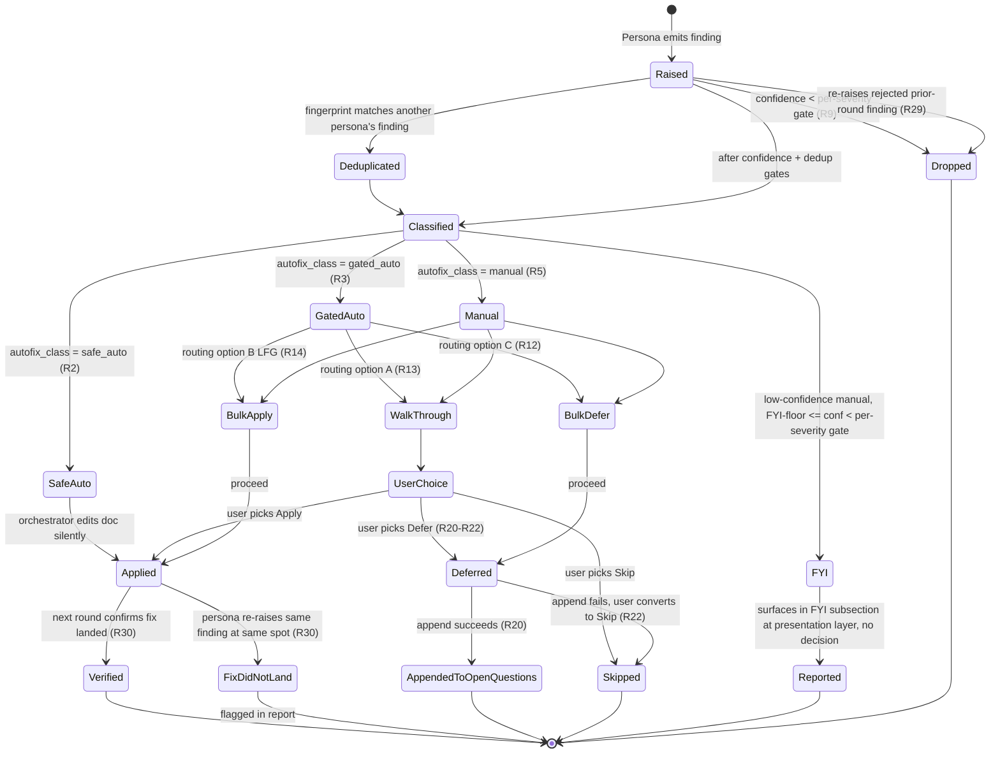
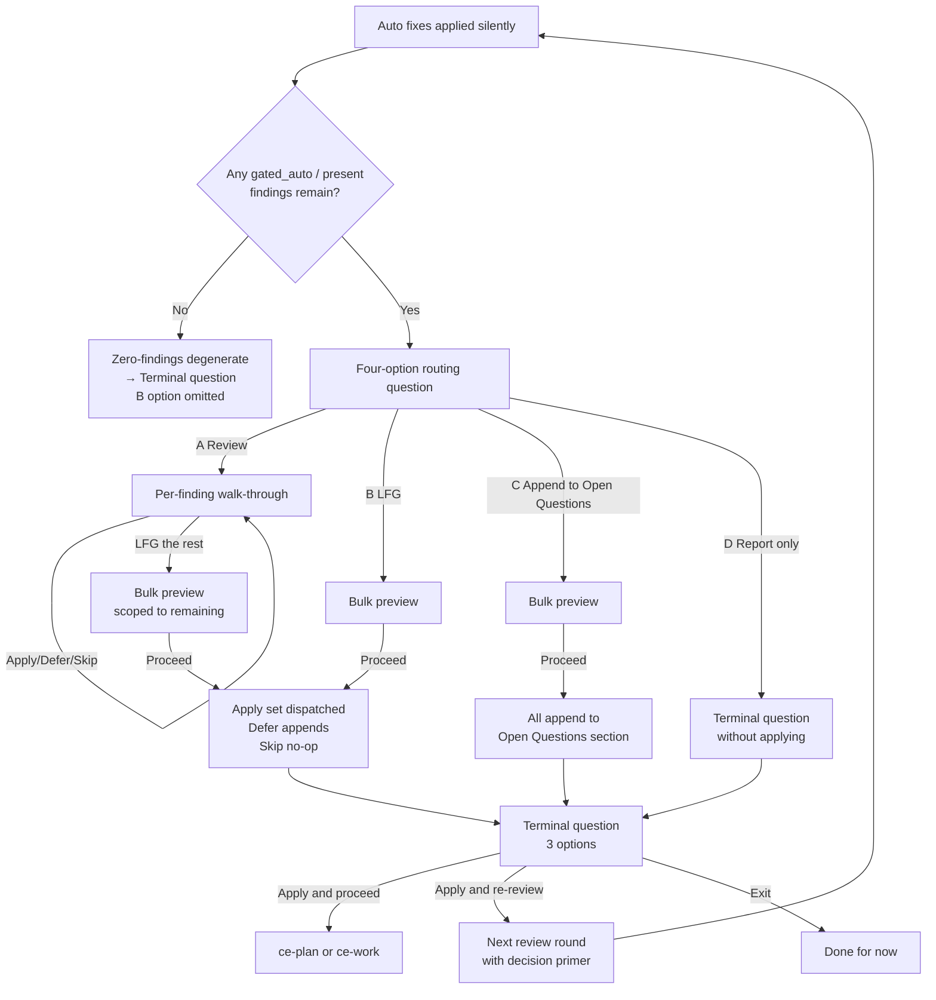

# ce-doc-review Autofix 与交互 overhaul

## 概览

Overhaul `ce-doc-review`，让它匹配 `ce-code-review`（PR #590 之后）的 interaction quality 和 auto-fix leverage。当前 ce-doc-review 在存在一个明确修复时仍把太多 findings 呈现为“needs user judgment”，会在低 confidence 下挑小毛病，并以一个 binary question 结束，导致用户明明想 apply fixes and move on，却被迫 re-review。本计划将 autofix classification 从二元（`safe_auto` / `manual`）扩展为三个 tiers（`safe_auto` / `gated_auto` / `manual`），使用与 ce-code-review 对齐的名称；提高并按 severity 加权 confidence gate；从 `ce-code-review` port per-finding walk-through + bulk-preview + routing-question pattern；添加 in-doc deferral；引入 multi-round decision memory；重写 `learnings-researcher` 以处理 domain-agnostic institutional knowledge；并扩展 `ce-compound` frontmatter `problem_type` enum，以吸收 `best_practice` overflow。**Advisory-style findings**（值得呈现但不值得决策的低 confidence observations）在 presentation layer 渲染为 `manual` bucket 下独立的 FYI subsection，而不是单独的 schema tier。

该计划分阶段 ship，让风险较低的 foundation work（enum expansion、agent rewrite）先落地并稳定，再 port interaction model。每个 implementation unit 都是 atomic，可作为自己的 PR ship。

## 问题框架

完整 problem framing 见 origin document。简而言之，一次真实 review 暴露了 **14 个全部路由到 `manual` 的 findings**，其中包括 5 个 confidence 只有 0.55–0.68 的 P3、3 个 competent implementer 会独立得出的具体 mechanical fixes，以及 1 个没有唯一正确答案的主观观察。按修订规则，同一 review 会产生 4 个 auto-applied fixes、1 个 FYI entry、4 个 real decisions 和 5 个 dropped items；用户只需处理 4 项，而不是 14 项。

## 需求追踪

来自 origin document 的 38 条 requirements。完整定义在那里；此处列出用于 traceability。

- **Classification tiers：** R1–R5（三个 tiers：添加 `gated_auto`；保留 `safe_auto` / `manual`；advisory-style findings 成为 manual 的 presentation-layer FYI subsection，而不是 distinct enum value）
- **Classification rule sharpening：** R6–R8（带 safeguard 的 strawman-aware rule、consolidated promotion patterns、shared framing-guidance block）
- **Per-severity confidence gates：** R9–R11（P0 0.50 / P1 0.60 / P2 0.65 / P3 0.75；移除 residual promotion；low-confidence manual findings 进入独立 FYI subsection，不直接 dropped）
- **交互模型：** R12–R16（4-option routing、per-finding walk-through、bulk preview、tie-break）
- **Terminal question：** R17–R19（三选项拆分：apply-and-proceed / apply-and-re-review / exit）
- **In-doc deferral：** R20–R22（append 到 `## Deferred / Open Questions` section）
- **Framing quality：** R23–R25（observable consequence、why-the-fix-works、保持紧凑）
- **横切要求：** R26–R27（AskUserQuestion pre-load、headless preservation）
- **多轮 memory：** R28–R30（cumulative decision primer、suppression、fix-landed verification）
- **learnings-researcher agent rewrite：** R36–R42（domain-agnostic、`<work-context>`、dynamic category probe、optional critical-patterns read）——受益于 `/ce-plan` 的现有使用
- **Frontmatter enum expansion：** R43（添加 `architecture_pattern`、`design_pattern`、`tooling_decision`、`convention`）

**Dropped from scope：** R31–R35（把 learnings-researcher integration 到 ce-doc-review）。理由见 Key Technical Decisions 和 Alternative Approaches Considered。**In scope：** R36–R42（learnings-researcher domain-agnostic rewrite，Unit 2）和 R43（frontmatter enum expansion，Unit 1）；即使 learnings-researcher 不从 ce-doc-review dispatch，这两项仍会受益于 `/ce-plan` 的现有使用。

## 范围边界

- 不引入 external tracker integration。Document-review 的 Defer analogue 是 in-doc section。
- 不改变 persona activation/selection logic。7 个 personas 及其 conditional activation signals 保持不变。
- 不添加 `requires_verification` 或 batch fixer subagent。Document fixes inline apply。
- 不处理 iteration-limit guidance。“After 2 refinement passes, recommend completion” 保持。
- 不跨 interactive sessions 持久化 decision primers（匹配 `ce-code-review` walk-through state rules）。
- 不重新设计 frontmatter schema dimensions。仅 enum expansion，不在 `problem_type` 旁新增 `learning_category` field。

### 推迟到单独任务

- Frontmatter validation test。添加 enforce `problem_type` enum membership 的 pre-commit 或 CI check 很有价值（今天 `correctness-gap` slipped through），但属于 additive，可作为 follow-up ship。
- 更新 frontmatter `component` enum。它非常 Rails-focused，针对 non-Rails work 扩展会有收益，但超出本 overhaul 范围。

## 上下文与调研

### 相关代码与模式

**Port 来源 targets（`ce-code-review`）：**
- `plugins/compound-engineering/skills/ce-code-review/references/walkthrough.md`：per-finding walk-through（terminal output block + blocking question split、固定顺序 options、`(recommended)` marker、LFG-the-rest escape、N=1 adaptation、统一 completion report）
- `plugins/compound-engineering/skills/ce-code-review/references/bulk-preview.md`：grouped Apply/Filing/Skipping/Acknowledging preview，带 `Proceed` / `Cancel`
- `plugins/compound-engineering/skills/ce-code-review/references/subagent-template.md:51-73`：personas 的 framing-guidance block
- `plugins/compound-engineering/skills/ce-code-review/SKILL.md:75`：AskUserQuestion pre-load directive
- `plugins/compound-engineering/skills/ce-code-review/SKILL.md:477`（stage 5 step 7b）：recommendation tie-break order `Skip > Defer > Apply > Acknowledge`

**目标 surfaces（`ce-doc-review`）：**
- `plugins/compound-engineering/skills/ce-doc-review/SKILL.md`：orchestrator
- `plugins/compound-engineering/skills/ce-doc-review/references/subagent-template.md`：framing-guidance block 落在这里
- `plugins/compound-engineering/skills/ce-doc-review/references/synthesis-and-presentation.md`：tier routing、confidence gate、decision primer 和 headless envelope updates
- `plugins/compound-engineering/skills/ce-doc-review/references/findings-schema.json`：`autofix_class` enum expansion
- `plugins/compound-engineering/agents/document-review/ce-*.agent.md`：7 个 persona files（基本不变）

**Caller contracts（调用方契约）：**
- `plugins/compound-engineering/skills/ce-brainstorm/SKILL.md:188-194` — 在 requirements doc 上 interactive invocation
- `plugins/compound-engineering/skills/ce-brainstorm/references/handoff.md:29,56,65` — 在 menus 附近 surface residual P0/P1，并提供 re-review
- `plugins/compound-engineering/skills/ce-plan/references/plan-handoff.md:5-17` — phase 5.3.8；通常 interactive，pipeline 中使用 `mode:headless`

**Schema surfaces（schema 触点）：**
- `plugins/compound-engineering/skills/ce-compound/references/schema.yaml`（canonical）和 `yaml-schema.md`（human-readable）— `problem_type` enum definitions + category mapping
- `plugins/compound-engineering/skills/ce-compound-refresh/references/schema.yaml` 和 `yaml-schema.md` — **duplicate** copies，必须同步更新
- `plugins/compound-engineering/skills/ce-compound/SKILL.md` — author steering language
- `plugins/compound-engineering/skills/ce-compound-refresh/SKILL.md` — refresh steering language

**待重写 agent：**
- `plugins/compound-engineering/agents/research/ce-learnings-researcher.agent.md` — domain-agnostic rewrite

**Test surfaces（测试 surfaces）：**
- `tests/pipeline-review-contract.test.ts:279-352` — 断言 ce-doc-review 在 pipeline mode 中以 `mode:headless` 调用。需要为 headless envelope 中的新 tier visibility 扩展。
- `tests/converter.test.ts:417-438` — OpenCode 3-segment → flat name rewrite for ce-doc-review agent refs。不受影响。
- ce-doc-review 自身没有 dedicated test file。添加一个在 scope 内（Unit 8）。

### 组织内 learnings

来自 `docs/solutions/` 的 7 条直接适用 learnings：

- `docs/solutions/best-practices/ce-pipeline-end-to-end-learnings.md` — **Mandatory read.** 该 learning 来自本计划要 port 的 `ce-code-review` PR #590 redesign，记录了 bulk-preview 与 walk-through 的区别、4-option `AskUserQuestion` cap 作为结构约束、"one flag 承载 two semantic meanings" 的风险，以及 "接受 research-agent architectural recommendations 前先抽样 10-20 个 real artifacts" 的规则。
- `docs/solutions/skill-design/compound-refresh-skill-improvements.md` — Six-item skill-review checklist（no hardcoded tool names、no contradictory phase rules、no blind questions、no unsatisfied preconditions、no shell in subagents、autonomous-mode opt-in）。其中 "borderline cases get marked stale in autonomous mode" template 会影响 headless runs 中 `advisory` findings 的行为。
- `docs/solutions/skill-design/research-agent-pipeline-separation.md` — 将 `learnings-researcher` 分类为 ce-plan-owned（HOW / implementation-context）。**这推动了从 scope 中彻底移除 R31–R35 的决定：**不要以任何形式（always-on 或 conditional）从 ce-doc-review dispatch，而是让该 agent 留在 ce-plan pipeline lane。ce-doc-review 不 dispatch 它。想要 institutional memory 的用户应调用 ce-plan。
- `docs/solutions/skill-design/pass-paths-not-content-to-subagents.md` — 默认传 path；prompt phrasing 曾造成 7× tool-call 差异。它与 Unit 2 的 learnings-researcher rewrite 相关：`<work-context>` input 应传 paths 和 compressed context，而不是 full documents。
- `docs/solutions/skill-design/beta-skills-framework.md` + `beta-promotion-orchestration-contract.md` + `ce-work-beta-promotion-checklist.md` — major overhauls 的 Beta-skill pattern。本工作评估后拒绝采用（见下方 Alternative Approaches）。
- `docs/solutions/skill-design/git-workflow-skills-need-explicit-state-machines.md` — **本计划的高严重度约束。** 将 tier/confidence/deferral 建模为 explicit state machine；在每个 transition boundary 重新读取 state。它直接塑造 Unit 4（synthesis pipeline）的结构。
- `docs/solutions/skill-design/discoverability-check-for-documented-solutions.md` — enum 扩展时，同一 PR 中更新 instruction-discovery surface（schema reference、learnings-researcher prompt、AGENTS.md）。它塑造 Unit 1 和 Unit 2。

### 外部参考

不需要 external research：这项工作是 internal plugin refactoring，且有强 local patterns（ce-code-review post-PR #590 是 canonical reference）。

## 关键技术决策

- **Port ce-code-review walk-through / bulk-preview pattern，而不是发明新 pattern。** 相同 menu shape、相同 tie-break rule、相同 AskUserQuestion pre-load pattern。体验过 ce-code-review 新 flow 的用户会觉得 ce-doc-review 一致。**Tier naming 与 ce-code-review 对齐**（`safe_auto`、`gated_auto`、`manual`），保持 cross-skill mental model 一致。
- **三个 tiers，而不是四个：advisory 是 display treatment，不是 enum value。** ce-code-review 有四个 tiers（添加 `advisory`），因为 code reviews 有有意义的“report-only, release/human-owned”类别（rollout notes、residual risk、learnings）。Document reviews 很少产生这种形态；FYI observations 通常只是低 confidence 且不需要 decision 的 manual findings。收敛到 three tiers + FYI-subsection presentation 可以减少一个 schema value，同时不丢失面向用户的“needs decision”与“FYI, move on”区别。Cognitive load 更低，schema 更简单。
- **与 ce-code-review 的 interaction-surface convergence 是有意的，但 skills 仍保持分离。** 计划完成后，ce-doc-review 和 ce-code-review 共享 interaction mechanics（walk-through shape、bulk preview、routing question、tie-break order），但评估内容确实不同：personas 不同（docs 的 coherence/feasibility/scope-guardian vs code 的 correctness/security/performance）、inputs 不同（prose vs diff）、failure modes 不同。共享 interaction scaffold，保留 distinct review content。合并成一个 skill 会削弱二者今天各自提供的 focused-review value。
- **不 fork `ce-doc-review-beta`，直接 ship。** 见 Alternative Approaches。
- **完全不从 ce-doc-review dispatch `learnings-researcher`。** 该 agent 归 ce-plan 拥有（按 `research-agent-pipeline-separation.md` 属于 implementation-context）。当 ce-doc-review 在 ce-plan 内运行时，agent 已经运行，其 output 已在 plan 中。当 ce-doc-review 在 ce-brainstorm 内运行时，context 是 WHY（product-framing），不是 HOW（implementation），运行 implementation-context agent 会违反 pipeline。当 ce-doc-review standalone 运行时，personas 已覆盖 coherence、feasibility 和 scope；institutional memory 是 nice-to-have，会增加 dispatch cost 而价值不成比例。想为 doc 使用 institutional memory 的用户应调用 `/ce-plan`，那里该 lookup 是 first-class pipeline stage。
- **把 R1–R8 classification changes 放进 shared subagent template**，而不是每个 persona。一次 file edit 即传播到全部 7 个 personas。匹配 `ce-code-review` 发布同类 quality upgrade 的方式。
- **把 R9–R11 confidence gates 保留在 synthesis**（`synthesis-and-presentation.md` step 3.2），而不是 personas 中。Personas 保留现有 HIGH/MODERATE/<0.50 calibration。
- **Multi-round primer（R28）不传 diff。** 已修复 findings 会 self-suppress（evidence 消失）；regressions 作为普通 findings 浮现；rejected findings 使用 pattern-match suppression。diff 会增加 prompt weight，但不改变 agent 能检测的内容。
- **Enum expansion values 进入 knowledge track**，不是 bug track。四个新 values（`architecture_pattern`、`design_pattern`、`tooling_decision`、`convention`）按 `schema.yaml:12-31` 的 two-track schema 都属于 knowledge-track。
- **同一 commit 中更新 `ce-compound` 和 `ce-compound-refresh` 的 duplicate schema files。** 它们是有意 duplicated；divergence 是 known pitfall。
- **将 tier/confidence/deferral 建模为 explicit state machine**（按 `git-workflow-skills-need-explicit-state-machines` learning）。state diagram 见 High-Level Technical Design。

## 开放问题

### 规划期间已解决

- **Beta fork 还是 phased ship？** 不开 beta，采用 phased ship。这个 overhaul 很大，但可以干净分阶段；每个 phase 都能独立测试；callers 通过保留的 headless envelope contract（R27）保持兼容。
- **是否从 ce-doc-review dispatch learnings-researcher？** 不。已从 scope 中移除（R31–R35 removed）。该 agent 归 ce-plan 拥有；需要 institutional memory 的用户应调用 ce-plan，因为那里把它作为 first-class pipeline stage。Unit 2 仍会把该 agent 重写为 domain-agnostic，这会直接改善 ce-plan 的现有用法。
- **multi-round primer 是否携带 diff？** 不。Decision metadata 已足够。
- **docs 的 Defer 目标放哪里？** 写入文档内的 `## Deferred / Open Questions` section，而不是 sibling file。见 origin document R20。

### 推迟到实现阶段

- **现有多少 `best_practice` entries 会映射到每个新 enum value？** Research 显示约 11 个 candidates；最终 mapping 在 migration 时确定。
- **AskUserQuestion menus 中 `gated_auto` / `manual` labels 的准确措辞。** origin document R12–R13 有 draft wording；实现时基于 harness rendering 验证最终措辞。
- **subagent-template framing-guidance block 的准确行数预算。** 目标约 40-50 行；按需调整，以保持低于约 150 行的 `@` inclusion threshold。
- **扩展 `tests/pipeline-review-contract.test.ts` 还是新增 `tests/ce-doc-review-contract.test.ts`。** Unit 8 根据 assertion overlap 决定。

## 高层技术设计

> *此处展示 intended approach，并为 review 提供方向性 guidance，不是 implementation specification。实现 agent 应把它视为 context，而不是要照抄的 code。*

### Finding lifecycle state machine（finding 生命周期状态机）

根据 `git-workflow-skills-need-explicit-state-machines` learning，tier/confidence/deferral 的交互构成一个必须显式建模的 state machine；只靠 prose-level carry-forward 会悄悄失效。



此图只建模 ce-doc-review persona findings。Learnings-researcher findings（R31–R35）不在 scope 内；ce-doc-review 不 dispatch 该 agent（见 Key Technical Decisions 和 Alternative Approaches Considered）。

需要在 synthesis 中显式验证的 transitions（不要只作为 prose carry forward）：

- Classified → 四个 buckets 之一（tier routing，step 3.7 rewrite）
- Rejected-in-prior-round → Dropped（R29 suppression，new synthesis step；上一轮已拒绝的 finding 被丢弃）
- Applied → Verified 或 FixDidNotLand（R30，new synthesis step）
- Auto / GatedAuto → Applied（独立路径；Auto 静默执行，GatedAuto 通过 walk-through 或 bulk）

### 三个交互 surfaces



walk-through、bulk preview 和 routing question 是同名 `ce-code-review` references 的 port，并带 ce-doc-review specific adaptations（Defer = in-doc append；无 batch fixer subagent；terminal question 路由到 pipeline stages，而不是 PR/push）。

## 实现单元

- [ ] **Unit 1：Frontmatter enum 扩展 + migration**

**目标：** 向 `problem_type` enum 添加四个 knowledge-track values（`architecture_pattern`、`design_pattern`、`tooling_decision`、`convention`），更新两份 duplicate schema files，迁移现有 `best_practice` overflow entries，修复一个 `correctness-gap` schema violation，并更新 instruction-discovery surfaces，让新 values 可被发现。

**需求：** R43

**依赖：** 无（foundation）

**文件：**
- 修改：`plugins/compound-engineering/skills/ce-compound/references/schema.yaml`
- 修改：`plugins/compound-engineering/skills/ce-compound/references/yaml-schema.md`
- 修改：`plugins/compound-engineering/skills/ce-compound-refresh/references/schema.yaml`
- 修改：`plugins/compound-engineering/skills/ce-compound-refresh/references/yaml-schema.md`
- 修改：`plugins/compound-engineering/skills/ce-compound/SKILL.md`（把 author-steering language 引向 narrower values）
- 修改：`plugins/compound-engineering/skills/ce-compound-refresh/SKILL.md`（refresh steering language）
- 修改：`plugins/compound-engineering/AGENTS.md`（命名 `problem_type` values 的 discoverability line）
- 迁移：`docs/solutions/` 下约 8–11 个适合 narrower value 的现有 `best_practice` entries（candidate list 见 repo-research report；若没有合适的 narrower value，有些 entries 可以保留 `best_practice`；最终 count 是一个小范围，不是固定数字）
- 迁移：`docs/solutions/workflow/todo-status-lifecycle.md` (`correctness-gap` → valid enum value)

**方法：**
- 在两份 schema.yaml files 的 knowledge track 下添加四个 values
- 在两份 yaml-schema.md files 中添加四个 category mappings（`architecture_pattern → docs/solutions/architecture-patterns/` 等）
- 保持 `best_practice` valid，但将其记录为 fallback，而不是 default
- ce-compound SKILL body 中的 author-steering language 应命名这些新 values，并给出 one-line descriptions，让 authors 在适用时选择 narrower value
- Category directory 首次使用时创建，不要预先创建 empty dirs
- Migration pass：按 research findings 重新分类约 11 个现有 `best_practice` entries，并把 `todo-status-lifecycle.md` 从 `correctness-gap` 移到有效 enum value

**遵循模式：**
- `schema.yaml` 现有 two-track structure（bug / knowledge）
- `yaml-schema.md` 现有 "Category Mapping" section format
- ce-compound 现有 author-steering prose，用于命名 problem types

**测试场景：**
- 正常路径：带 `problem_type: architecture_pattern` 的 fixture knowledge-track doc 可 parse 并 validate
- 正常路径：带 `problem_type: design_pattern` 的 fixture knowledge-track doc 可 parse 并 validate
- 边界情况：带 `problem_type: best_practice` 的 doc 仍可 validate（backward compat）
- 边界情况：带 unknown value（例如 `problem_type: xyz-invalid`）的 doc 被 flagged
- 集成：在分类适当 learning 时，ce-compound steering guidance 在 output 中命名新 values

**验证：**
- 两份 schema files 都包含全部 4 个新 values 和 category mappings
- `docs/solutions/` 下所有适合 narrower value 的 `best_practice` entry 都已重新分类（final count 是约 8–11 个 candidates 中真正适合 narrower tier 的子集；有些可合法保留为 `best_practice`）
- `docs/solutions/workflow/todo-status-lifecycle.md` 携带 valid enum value
- AGENTS.md 引用新 categories，使未来 agents 能发现它们

---

- [ ] **Unit 2：learnings-researcher domain-agnostic 重写**

**目标：** 重写 `learnings-researcher` agent，使其将 `docs/solutions/` 视为 domain-agnostic institutional knowledge。接受 structured `<work-context>` input，用 dynamic probing 替代 hardcoded category tables，将 keyword extraction 扩展到 bug-shape taxonomy 之外，并使 `critical-patterns.md` read 变为 optional。

**需求：** R36, R37, R38, R39, R40, R41, R42

**依赖：** 仅 taxonomy-aware output framing 依赖 Unit 1。dynamic category probe 本身没有 schema dependency（它在 runtime 读取 `docs/solutions/` subdirectories），因此 Unit 2 可并行起草；只有最终 author-visible framing 受益于 Unit 1 的 enum 先落地。

**文件：**
- 修改：`plugins/compound-engineering/agents/research/ce-learnings-researcher.agent.md`
- 测试：当前没有 agent-specific test。如需验证跨平台 dispatch contract，可在 `tests/fixtures/` 下扩展或新增 fixture；若并不轻量，则推迟到 Unit 8。

**方法：**
- 重写 opening identity/framing：使用 “domain-agnostic institutional knowledge researcher”（而不是 bug-focused）
- 用 structured `<work-context>` block（description + concepts + decisions + domains + optional domain hint）替代 `feature/task description` input format
- 用 dynamic probe 替代 hardcoded category-to-directory table：invocation time 列出 `docs/solutions/` 下的 subdirectories，并使用 discovered set
- 扩展 keyword extraction taxonomy：现有四个 dimensions 加 Concepts、Decisions、Approaches、Domains
- 让 Step 3b（critical-patterns.md read）以 file existence 为条件
- 将 output framing 从 "gotchas to avoid during implementation" 改写为 "applicable past learnings" / "related decisions and their outcomes"
- 更新 Integration Points，包含 `/ce-plan` 和 standalone use（按本计划 Key Technical Decisions，ce-doc-review 明确不是 caller；rewrite 的 consumer 是 `/ce-plan`）

**执行说明：** 重写后，对当前 codebase learnings 抽样 3-5 次真实 invocations，验证 domain-agnostic rewrite 能为 non-code queries（例如 skill-design questions、workflow questions）产生 relevant output。按 ce-pipeline learnings doc：“sample real artifacts before accepting research-agent architectural recommendations.”

**遵循模式：**
- `ce-code-review` shared subagent template（`references/subagent-template.md`），用于新的 `<work-context>` block shape
- Existing `learnings-researcher.md` grep-first filtering strategy（Step 3）— 保留它，它已经足够高效
- `docs/solutions/skill-design/research-agent-pipeline-separation.md` classification，用于让该 agent 留在自己的 pipeline-stage lane

**测试场景：**
- 正常路径：用 code-bug work-context invoke → 返回与现有 behavior 匹配的 bug-relevant learnings
- 正常路径：用 skill-design work-context invoke → 返回 skill-design learnings（过去会以较弱 matches lump 到 `best_practice` 下）
- 边界情况：`docs/solutions/` 为空或不存在 → fast-exit 返回 "No relevant learnings"，无 errors
- 边界情况：`docs/solutions/patterns/critical-patterns.md` 不存在 → agent 无 warning 继续
- 边界情况：`<work-context>` 无 domain hint → agent fallback 到跨所有 discovered categories 的 general keyword extraction
- 集成：converter tests（`tests/codex-writer.test.ts:329` 及 siblings）仍通过；agent dispatch string 保持，仅 inner prompt 改变

**验证：**
- 在 skill-design question 上运行 agent，返回结果指向 `docs/solutions/skill-design/` entries，而不是来自 `best-practices/` 的 miscategorized matches
- hardcoded category table 已移除；agent 在 invocation time probe `docs/solutions/`
- Output framing 不再包含 "gotchas to avoid during implementation" 或 code-bug-biased language
- 缺失 `critical-patterns.md` 不导致 errors 或 warnings
- Cross-platform converter tests 仍通过
- **ce-plan-side validation per #14 review feedback:** 对 rewritten agent 运行 ce-plan 现有 Phase 1.1 dispatch flow（任选一个 in-repo plan target），并验证 (a) agent output 可被 ce-plan 当前 synthesis step 消费且无 errors，(b) Codex、Gemini 和 Claude converters 的 dispatch-string/contract 保持，(c) representative code-implementation query 的 output shape 匹配或优于 rewrite 前 relevance。在 PR description 中简短记录 comparison，便于 ce-plan owners audit regression check。

---

- [ ] **Unit 3：ce-doc-review subagent template 升级：framing、classification rule、tier expansion**

**目标：** 升级 shared ce-doc-review subagent template，加入 observable-consequence-first framing guidance block、strawman-aware classification rule、consolidated auto-promotion patterns，以及与 ce-code-review 命名对齐的新 three-tier `autofix_class` enum。这是把 improved output 传播到全部 7 个 personas 的单文件变更。

**需求：** R1, R2, R3, R4, R5, R6, R7, R8

**依赖：** 无（与 Units 1-2 并行）

**文件：**
- 修改：`plugins/compound-engineering/skills/ce-doc-review/references/subagent-template.md`
- 修改：`plugins/compound-engineering/skills/ce-doc-review/references/findings-schema.json`（rename + expand `autofix_class` enum）
- 测试：（推迟到 Unit 8：针对 template structure 的 contract test assertion）

**方法：**
- 将 `findings-schema.json` 中的 `autofix_class` enum 从 `[auto, present]` rename and expand 为 `[safe_auto, gated_auto, manual]`。这与 ce-code-review 的前三个 tiers 完全匹配。不采用 ce-code-review 的第四个 `advisory` tier；low-confidence FYI findings 在 presentation layer 渲染为 `manual` bucket 下的独立 FYI subsection（由 Unit 4 处理）。
- 在 subagent template 中添加 tier definitions，每个按 R2–R5 提供 one-sentence descriptions 和 examples。三个 tiers：`safe_auto`（静默 apply，一个明确正确 fix）；`gated_auto`（concrete fix，用户确认）；`manual`（需要 user judgment）。
- 按 R6 添加 strawman-aware classification rule："a 'do nothing / accept the defect' option is not a real alternative — it's the failure state the finding describes. Count only alternatives a competent implementer would genuinely weigh." 包含 positive/negative example pair。
- **Strawman safeguard per #11 review feedback:** 任何通过 strawman-dismissal of alternatives 被分类为 `safe_auto` 的 finding，都必须在 `why_it_matters` 中命名 dismissed alternatives。当 alternatives 只要存在（即使 reviewer 认为它们 weak），finding 默认进入 `gated_auto`（walk-through 中 one-click apply），而不是 silent `safe_auto`。`safe_auto` 只保留给真正 single-option fixes（typo、wrong count、stale cross-reference、missing mechanical step）。
- **Persona exclusion of `## Deferred / Open Questions` section per #8 review feedback:** template 指示 personas 从 review scope 中排除任何 `## Deferred / Open Questions` section 及其 subheadings；这些 entries 是 prior rounds 的 review output，不是被 review 文档的一部分。这样防止 round-2 feedback loop，即 personas 把 deferred section 标为 new finding，或引用其文本作为 evidence。
- 按 R7 将 auto-promotion patterns consolidation 为显式 rule set：factually incorrect behavior、missing standard security/reliability controls、codebase-pattern-resolved fixes、framework-native-API substitutions、mechanically-implied completeness additions。
- 按 R8 添加 framing-guidance block：observable-consequence-first、why-the-fix-works grounding、2-4 sentence budget、required-field reminder、positive/negative example pair（仿照 `ce-code-review` 在 `subagent-template.md:51-73` 的 block）。
- 尊重约 150 行的 `@` inclusion threshold；如果 template 超过它，则在 SKILL.md 中切换为 backtick path reference（鉴于当前 52 行 + 约 40-50 行 addition，不太可能）。

**遵循模式：**
- `ce-code-review` subagent template（`subagent-template.md:51-73`）中的 framing-guidance block structure
- Existing subagent template `<output-contract>` section，用于放置 new rules

**测试场景：**
- 正常路径：persona agent 接收新 template，并产生带四个 valid `autofix_class` values 之一的 findings
- 边界情况：只有 strawman alternatives（例如 "accept the defect"）的 finding 被分类为 `safe_auto`，不是 `manual`
- 边界情况：过去因“there's more than one way to fix it”而会被归为 `manual` 的 finding，当 fix concrete 且 non-primary options 是 strawmen 时，现在归为 `gated_auto`
- 边界情况：FYI-grade observation（主观、无需 decision）被分类为 `manual`，但因为 confidence 低于 per-severity gate 且高于 FYI floor，在 presentation layer 路由到 FYI subsection
- 集成：全部 7 个 personas 产生的 output 都能通过 expanded `findings-schema.json` validate，无 schema violations

**验证：**
- Template 包含 framing-guidance block、classification rule 和 consolidated auto-promotion patterns
- `findings-schema.json` enum 包含全部 4 个新 values
- Subagent template 保持在约 150 行以下，并继续通过 `@` inclusion 加载

---

- [ ] **Unit 4：Synthesis pipeline（综合 pipeline）：per-severity gates、tier routing、auto-promotion、state-machine discipline**

**目标：** 重写 synthesis pipeline，正确路由四个新 tiers，应用 per-severity confidence gates，移除 residual promotion 并改用 cross-persona agreement boost，同时显式化 tier/confidence/deferral state transitions（按 git-workflow state-machine learning）。这是 load-bearing synthesis change。

**需求：** R9, R10, R11 + synthesis updates for R2–R5 tier routing

**依赖：** Unit 3 (new `autofix_class` enum must exist before synthesis routes to it)

**文件：**
- 修改：`plugins/compound-engineering/skills/ce-doc-review/references/synthesis-and-presentation.md`
- 创建：`tests/fixtures/ce-doc-review/seeded-plan.md` — test-fixture plan doc，植入覆盖 tier shapes 的 seeded findings（见方法中的 validation gate）

**方法：**
- Step 3.2（confidence gate）：用 per-severity table 替代 flat 0.50（P0 ≥0.50、P1 ≥0.60、P2 ≥0.65、P3 ≥0.75）。未通过 gate 但高于 FYI floor（0.40）的 low-confidence manual findings，不 dropped，而是在 presentation layer 的 FYI subsection 中 surface；这样保留 observational value，同时不强制 decisions。
- Step 3.4（residual promotion）：删除。替换为 gate 之后应用的 cross-persona agreement boost（+0.10，上限 1.0），匹配 `ce-code-review` stage 5 step 4。Residual concerns 只在 Coverage 中 surface。
- Step 3.5（contradictions）：保留；为 three-tier routing 适配 terminology。
- Step 3.6（pattern-resolved promotion）：按 R7 consolidated promotion patterns 扩展。
- Step 3.7（route by autofix class）：重写为 three tiers。`safe_auto` → silent apply。`gated_auto` → walk-through，Apply 为 recommended。`manual` → 带 user-judgment framing 的 walk-through，或在 low-confidence 时进入 FYI subsection。
- **R30 fix-landed matching predicate per #10 review feedback:** 判断 round-2 persona finding 是否是在相同 location re-raise round-1 Applied finding 时，使用现有 dedup fingerprint（`normalize(section) + normalize(title)`）并加上 evidence-substring overlap check。Section renames 视为 “different location”，当作 new finding。需要在 synthesis step 中明确指定，避免 implementer 自行发明 predicate。
- **Validation gate per #3 + #7 review feedback:** merge Unit 4 前，用新 synthesis pipeline 运行两个 artifacts，并在 PR description 中记录结果：
  1. **seeded test-fixture plan doc**：在 `tests/fixtures/ce-doc-review/seeded-plan.md` 下创建，植入覆盖各 tier 的 known issues（目标 seed：约 3 个 safe_auto candidates、约 3 个 gated_auto candidates、约 5 个 manual candidates、约 5 个 confidence 0.40–0.65 的 FYI-tier candidates、约 3 个 confidence 0.55–0.74 的 drop-worthy P3s）。这是 rigorous validation；`docs/plans/` 中的现有 plans 已经 review 过，会让 pipeline 看起来 falsely clean。
  2. **brainstorm doc**（`docs/brainstorms/2026-04-18-ce-doc-review-autofix-and-interaction-requirements.md`）：它曾通过 OLD pipeline 做 document-review；在 NEW pipeline 下 re-run 是有效 before/after comparison。

**数字通过标准（soft, not absolute；软性而非绝对）：**
  - Seeded fixture：3 个 seeded safe_auto candidates 中 ≥2 个 silent apply；3 个 seeded gated_auto 中 ≥2 个出现在 walk-through bucket，并带 `(recommended)` Apply；3 个 0.55–0.74 的 drop-worthy P3s 全部被 per-severity gate dropped；5 个 FYI candidates 中 ≥3 个在 FYI subsection surface；manual-shaped seeds 上 zero false auto-applies。
  - Brainstorm re-run：旧 pipeline applied 的 P0/P1 findings 不 regress（即新 pipeline 不 drop 旧 pipeline 认为 important 的内容）；total user-facing decision count（gate 后的 gated_auto + manual）应显著低于旧 pipeline。

  如果某个 seed classification 落在 intended tier 之外，merge 前必须 investigate；这可能说明 threshold 或 strawman-rule calibration 有问题。
- 添加显式 state-machine narration，并引用 High-Level Technical Design 中的 diagram。每个 transition（"Raised → Classified"、"Classified → SafeAuto" 等）都是 synthesis prose 中的 named step，而不是 implied carry-forward。
- **Headless envelope extension lands here per #12 sequencing fix:** 本 unit 是第一个在 headless mode 产生 `gated_auto` findings 的 unit，因此 envelope 必须在 shipping 前支持新 bucket headers。扩展 `synthesis-and-presentation.md:93-119` 的 headless output，在现有 `Applied N safe_auto fixes` count 和 `Manual findings` section 旁加入 `Gated-auto findings` 和 `FYI observations` sections。保留 existing bucket structure，使只读取旧 buckets 的 callers 继续工作（forward-compat；ce-brainstorm 和 ce-plan 在 menus 附近 surface P0/P1 residuals 的行为不变）。Unit 8 之后添加该 envelope 的 contract test。

**遵循模式：**
- `ce-code-review` stage 5 merge pipeline（`SKILL.md:456-484`），用于 confidence-gate、dedup、cross-reviewer agreement boost structure
- Existing `synthesis-and-presentation.md` step numbering — preserve step IDs，避免 churn cross-references

**测试场景：**
- 正常路径：confidence 0.60 的 P3 finding 被 per-severity gate dropped（在当前 0.50 flat gate 下它会 survive）
- 正常路径：confidence 0.52 的 P0 finding 通过 gate
- 正常路径：两个 personas 标记同一 issue 得到 +0.10 boost，使其中一个从 0.55（低于 P1 gate）提升到 0.65（高于 gate）
- 边界情况：confidence 0.45 的 low-confidence `manual` finding（高于 0.40 FYI floor、低于 severity gate）在 FYI subsection surface，不 dropped
- 边界情况：只有 strawman alternatives 的 `gated_auto` finding 按 R7 consolidated patterns auto-promoted 到 `safe_auto`；但若存在 ANY alternatives（即使 weak），按 strawman safeguard 默认 `gated_auto`
- 边界情况：contradiction handling：两个 personas 对同一 finding 给出 opposing actions，带双方 perspectives 路由到 `manual`
- 集成：路由 origin document 中的 calibration-example case（14 findings → 4 manual + 3 gated_auto + 1 safe_auto + 1 FYI + 5 dropped）产生合理 bucket distribution
- 集成：seeded-fixture test（`tests/fixtures/ce-doc-review/seeded-plan.md`）满足 Approach section 中的 numeric pass criteria；seeded safe_auto/gated_auto/manual/FYI candidates 落入 intended tiers；drop-worthy P3s 被 dropped；manual-shaped seeds 上 no false-auto
- 集成：brainstorm-doc re-run（`docs/brainstorms/2026-04-18-ce-doc-review-autofix-and-interaction-requirements.md`）显示 meaningful decision-count reduction，且不 regress previously-applied P0/P1 fixes

**验证：**
- Confidence gate 是 per-severity，并记录在 synthesis step 3.2
- residual-promotion step 已移除；cross-persona agreement boost 是替代机制
- finding lifecycle 中每个 state transition 都有 named synthesis step
- 路由 origin document 的 real-world example 能复现预期的 14→4 decisions split

---

- [ ] **Unit 5：Interaction model（交互模型）：routing question + per-finding walk-through + bulk preview**

**目标：** 从 `ce-code-review` port per-finding walk-through、bulk preview 和 four-option routing question，并为 ce-doc-review 适配（无 batch fixer、无 tracker integration）。这是最大的 behavioral change，也是大多数 user-visible UX improvement 所在。

**需求：** R12, R13, R14, R15, R16, R26

**依赖：** Unit 4 (routing uses new tiers and confidence-gated finding set)

**文件：**
- 创建：`plugins/compound-engineering/skills/ce-doc-review/references/walkthrough.md`
- 创建：`plugins/compound-engineering/skills/ce-doc-review/references/bulk-preview.md`
- 修改：`plugins/compound-engineering/skills/ce-doc-review/SKILL.md`（顶部添加 Interactive mode rules section 和 AskUserQuestion pre-load directive）
- 修改：`plugins/compound-engineering/skills/ce-doc-review/references/synthesis-and-presentation.md`（Phase 4 presentation hand off 到 walkthrough.md；添加 routing question stage）

**方法：**
- 在 `SKILL.md` 顶部添加 “Interactive mode rules” section，仿照 `ce-code-review/SKILL.md:73-77`。包含 `AskUserQuestion` pre-load directive 和 numbered-list fallback rule。
- 通过适配 `ce-code-review/references/walkthrough.md` 创建 `walkthrough.md`。**Tier alignment:** ce-doc-review 原样使用 ce-code-review 前三个 tier names：`safe_auto`、`gated_auto`、`manual`，因此 port 时不 rename。ce-code-review 的第四个 `advisory` tier 在 ce-doc-review walk-through 中没有等价物；advisory-style findings 渲染为 presentation-layer FYI subsection（Unit 4 concern），不是 walk-through option。**从 source 保留：** terminal-block + question split、four-option menu shape（Apply / Defer / Skip / LFG-the-rest）、`(recommended)` marker、LFG-the-rest escape、N=1 adaptation、unified completion report、post-tie-break recommendation rendering。**从 source 移除：** fixer-subagent-batch-dispatch（按 scope boundary，ce-doc-review 无 batch fixer）、`[TRACKER]` label substitution logic、tracker-detection tuple（`named_sink_available`、`any_sink_available`、confidence-based label substitution）、`any_sink_available: false` 时的 render-time Defer→Skip remap、`.context/compound-engineering/ce-code-review/{run_id}/{reviewer_name}.json` artifact-lookup paths（ce-doc-review agents 不写 run artifacts）、advisory-variant `Acknowledge` option（这里无 advisory tier）。**替换：** "file a tracker ticket" → "append to Open Questions section"（Unit 6 实现 append mechanic）。
- 通过适配 `ce-code-review/references/bulk-preview.md` 创建 `bulk-preview.md`：保留 grouped buckets、Proceed/Cancel options、scope-summary header。适配 bucket labels（`Applying (N):`、`Appending to Open Questions (N):`、`Skipping (N):`）。删除 `Acknowledging (N):` bucket；无 advisory tier 意味着无 Acknowledge action。移除 tracker-label substitution。
- 更新 `synthesis-and-presentation.md` Phase 4：auto-fixes apply 后，如果仍有任何 `gated_auto` / `manual` findings，就 route 到新的 routing question。Option A 加载 `walkthrough.md`，options B 和 C 加载 `bulk-preview.md`。Option D = report only。对 per-finding recommendations 使用 R16 tie-break order（`Skip > Defer > Apply > Acknowledge`）。

**执行说明：** 从 AGENTS.md 原样 port Interactive Question Tool Design rules（交互问题工具设计规则）：third-person voice、front-loaded distinguishing words、≤4 options。implementation 时在 rendering surface 验证每个 menu label；harness label truncation 是 known failure mode（ce-pipeline learnings doc §5）。

**遵循模式：**
- `ce-code-review/references/walkthrough.md` — structural template
- `ce-code-review/references/bulk-preview.md` — structural template
- `ce-code-review/SKILL.md:73-77` — Interactive mode rules section
- `plugins/compound-engineering/AGENTS.md` → "Interactive Question Tool Design" section — menu design rules
- 上方 High-Level Technical Design 中的 state machine

**测试场景：**
- 正常路径：3 个 `gated_auto` findings + 1 个 `manual` finding → routing question 提供全部 4 个 options；选择 A 进入 walk-through；每个 finding 逐一呈现，并标记 recommended action
- 正常路径：N=1（正好一个 pending finding）→ walk-through wording 去掉 "Finding N of M"，并 suppress LFG-the-rest option
- 正常路径：用户在 8 个 findings 的第 2 个选择 LFG-the-rest → bulk preview scoped 到 findings 3-8，header 标注 "2 already decided"
- 边界情况：所有 findings 都是 low-confidence `manual`（仅 FYI subsection）→ 跳过 routing question（没有 gated_auto / present-above-gate remain），直接流向 terminal question，无 walk-through；FYI content 仍在 report 中 render
- 边界情况：从 LFG-the-rest 进入的 bulk-preview Cancel 返回 current finding，而不是 routing question
- 边界情况：option B / C 的 routing Cancel 返回 routing question 且无 side effects
- 集成：recommendation tie-break（R16）：两个 personas 对同一 finding 标出 conflicting actions（Apply / Skip）；walk-through 用 `(recommended)` 标记 post-tie-break value（Skip）；R15-conflict context line 在 question stem 中 surface disagreement

**验证：**
- `walkthrough.md` 和 `bulk-preview.md` 存在且内容已适配
- SKILL.md 有包含 AskUserQuestion pre-load 的 Interactive mode rules section
- Synthesis Phase 4 在 auto-fixes 后 route 到 walkthrough/bulk-preview references
- Menus 通过 Interactive Question Tool Design review（third-person、≤4 options、self-contained labels）

---

- [ ] **Unit 6：In-doc Open Questions deferral 与 append mechanic**

**目标：** 实现 Defer action 的 in-doc append mechanic。当用户对某个 finding 选择 Defer 时，将 entry append 到被 review 文档末尾的 `## Deferred / Open Questions` section。

**需求：** R20, R21, R22

**依赖：** Unit 5 (walk-through's Defer option is where this fires)

**文件：**
- 创建：`plugins/compound-engineering/skills/ce-doc-review/references/open-questions-defer.md`
- 修改：`plugins/compound-engineering/skills/ce-doc-review/references/walkthrough.md`（引用 Unit 5 walkthrough.md 中的 Defer mechanic）

**方法：**
- 创建 `open-questions-defer.md`，描述：
  - Detection：doc 末尾是否已有 `## Deferred / Open Questions` section？
  - 缺失时创建 heading
  - Subsection structure：`### From YYYY-MM-DD review`（timestamped to the review invocation；即使同一 doc 多次运行，也创建 per-review grouping）
  - Entry format per R21：title、severity、reviewer attribution、confidence、`why_it_matters` framing。排除 `suggested_fix` 和 `evidence`（它们存在 run artifact 中，如果有 artifact，则在相关处包含 pointer）
  - Append location：doc 末尾、existing content 之后。如果 doc 有 trailing horizontal rule 或 separator，则加在其上方以避免 visual drift。
- Failure handling per R22：document read-only / path issue / write failure → inline surface Retry / Fallback-to-completion-report-only / Convert-to-Skip sub-question。无 silent failure。
- 用户选择 Defer 时，Walkthrough.md 引用此文件；walkthrough 本身不重新实现 append logic。

**遵循模式：**
- `ce-code-review/references/tracker-defer.md` — **仅**用于 failure-path sub-question structure（Retry / Fallback / Convert to Skip）。不要带入 tracker-detection、sink-availability 或 label-substitution logic：这些都不适用于 in-doc append。

**测试场景：**
- 正常路径：doc 没有 Open Questions section → append 创建 `## Deferred / Open Questions` heading 和带 deferred entry 的 `### From YYYY-MM-DD review` subsection
- 正常路径：doc 末尾已有 Open Questions section → append 加入新的 `### From YYYY-MM-DD review` subsection（保持 prior review entries 可区分）
- 正常路径：同一 review session 中两个 Defer actions → 两个 entries 都落到同一个 `### From YYYY-MM-DD review` subsection 下
- **Shadow path（mid-doc heading）per #13 review feedback：** doc 中间已有 `## Deferred / Open Questions` heading（不在末尾）→ append 找到它，并在 existing location 下落入，不在末尾创建 duplicate section
- **Shadow path（same-title collision）per #13：** 同一天 round 2 defer 的 finding title 与同一 `### From YYYY-MM-DD review` subsection 下已有 round-1 entry 匹配 → append 对 title idempotent（跳过 duplicate entry），并在 completion report 中记录 no-op
- **Shadow path（frontmatter-only doc）：** doc 有 frontmatter 但无 body content → append 在 frontmatter block 后创建 heading，而不是 byte 0
- **Shadow path（concurrent editor writes）：** append 前立即从 disk re-read doc，以减少 user-in-editor concurrent-write collisions 的窗口；记录 append 前后 mtime，如 write 期间变化则 abort + surface retry
- 边界情况：doc read-only → append fails，向用户提供 Retry / Fall-back-to-report-only / Convert-to-Skip；Convert-to-Skip 在 completion report 中记录 Skip reason
- 边界情况：doc 有 trailing `---` 或其他 separator → append 落在其上方
- 集成：walk-through round 1 的 deferred entries 在 round 2 运行时对 doc 可见；decision primer（Unit 7）正确识别它们为 prior-round decisions；personas 按 subagent template instruction（Unit 3）将该 section 排除在 review scope 外

**验证：**
- `open-questions-defer.md` 存在，并描述 append mechanic + failure handling
- Walk-through 的 Defer option 正确调用该 mechanic
- Deferred findings 跨 reviews 累积到 timestamped subsections 下
- 无 silent failures；每个 failure 都 inline surface，并带 user-actionable options

---

- [ ] **Unit 7：Terminal question restructure 与 multi-round decision memory**

**目标：** 将当前 Phase 5 binary question（`Refine — re-review` / `Review complete`）替换为三选项 terminal question，分离 “apply decisions” 和 “re-review”，并引入 multi-round decision primer，把 prior-round decisions 带入后续 rounds。

**需求：** R17, R18, R19, R28, R29, R30

**依赖：** Unit 5 (walkthrough captures the decisions the primer carries forward), Unit 6 (Defer decisions contribute to the primer)

**文件：**
- 修改：`plugins/compound-engineering/skills/ce-doc-review/SKILL.md`（Phase 2 dispatch 传入 cumulative primer）
- 修改：`plugins/compound-engineering/skills/ce-doc-review/references/synthesis-and-presentation.md`（Phase 5 terminal question + R29 suppression rule + R30 fix-landed verification）
- 修改：`plugins/compound-engineering/skills/ce-doc-review/references/subagent-template.md`（persona instructions to honor the primer：suppress re-raising rejected findings, respect fix-landed verification context）

**方法：**
- 按 R17 将 Phase 5 terminal question 替换为三个 options：`Apply decisions and proceed to <next stage>`（有 fixes applied 时 default / recommended）、`Apply decisions and re-review`、`Exit without further action`。`<next stage>` text 根据 document type 选择：requirements docs 用 `ce-plan`，plan docs 用 `ce-work`。
- R19 zero-actionable-findings degenerate case：跳过 option B（re-review），只提供 "Proceed to <next stage>" / "Exit"。**Label adapts:** 当没有 decisions 要 apply（zero-actionable case，或 routing path 中所有 finding 都是 Acknowledge/Skip）时，去掉 "Apply decisions and" prefix；label 应匹配系统实际动作。只有至少一个 Apply queued 时，label 才保留 "Apply decisions and proceed to <next stage>"。
- R18 rendering rule：terminal question 与 mid-flow routing question 是 distinct，不要 merge。
- Multi-round decision primer（多轮 decision primer）per R28–R30：
  - orchestrator 在单个 session 内跨 rounds 维护 in-memory decision list（rejected findings 带 title/evidence/reason；applied findings 带 title/section）
  - 作为 subagent template variable bindings 的一部分，传给 round 2+ 中每个 persona
  - **Primer structure per #9 review feedback:** primer 是单个 text block，注入 `<review-context>` block 顶部的 `{decision_primer}` slot。Shape：
    ```
    <prior-decisions>
    Round 1 — applied (N entries):
    - {section}: "{title}" ({reviewer}, {confidence})
    Round 1 — rejected (N entries):
    - {section}: "{title}" — {Skipped|Deferred} because {reason or "no reason provided"}
    </prior-decisions>
    ```
    Round 1（无 primer）渲染为空 `<prior-decisions>` block，或完全省略该 block；这是 implementation-detail choice，取决于 calibration 期间哪种更便于 personas 阅读。subagent template 获得匹配的 `{decision_primer}` slot。
  - Persona-level suppression rule per R29：不要 re-raise title 和 evidence pattern-match 某个 rejected finding 的 finding，除非 current doc state 让 concern materially different
  - Synthesis-level fix-landed verification per R30：对每个 applied finding，确认 referenced section 中不再出现 specific issue。如果 persona 在同一 location re-surface 相同 finding（按 Unit 4 matching predicate：same section fingerprint + evidence-substring overlap），在 report 中标为 "fix did not land"，而不是当作 new。
- **Caller-context handling per #6 review feedback:** interactive-mode nested invocations（ce-brainstorm → ce-doc-review、ce-plan → ce-doc-review）依靠 model 读取 conversation context 来正确解释 terminal question，而不是显式 `nested:true` argument。Rationale：caller conversation 对 sub-skill orchestrator 可见，因此当用户在 ce-plan 的 5.3.8 flow 内选择 "Proceed to <next stage>" 时，agent 不会触发 nested `/ce-plan` dispatch，而是把控制权交回 caller flow，后者继续自己的逻辑。standalone invoked 时，"Proceed to <next stage>" dispatch appropriate next skill。`mode:headless` 保持显式，因为 headless 是 deterministic programmatic behavior；interactive-mode caller-context 则由 model orchestration 处理。**ce-brainstorm 或 ce-plan 不需要 caller-side change。** 如果这种 implicit handling 在实践中不可靠，再 follow-up 添加显式 `nested:true` flag。
- 按 scope boundary，cross-session persistence out of scope。

**执行说明：** 将 decision-primer flow 建模为 state machine diagram 的一部分。每个 round-2-persona-dispatch transition 都显式读取 primer；这不是 prose-level 的“personas should remember”假设。

**遵循模式：**
- `ce-code-review/SKILL.md` Step 5 final-next-steps，用于 mode-driven terminal question structure（但将 PR/push verbs 适配为 pipeline-stage verbs）
- High-Level Technical Design 中的 state machine diagram：每个 prior-round-decision transition 都已命名

**测试场景：**
- 正常路径：round 1 用户 apply 2 个 findings 并 skip 1 个；round 2 persona re-raise 被 skipped 的 finding → synthesis 按 R29 dropped，并在 Coverage 中 note
- 正常路径：round 1 用户 apply 一个 finding；round 2 persona 不 re-raise（fix 因 evidence 消失而 self-suppressed）→ synthesis 报告 "fix verified"
- 正常路径：round 1 用户 apply 一个 finding；round 2 persona 在同一 location re-raise 它（fix 实际未落地）→ synthesis 在 final report 中标记 "fix did not land"
- 正常路径：round 1 有 fixes applied 后出现 terminal question → 三个 options；用户选择 "Apply and proceed" → hand off 到 ce-plan 或 ce-work
- 边界情况：auto-fixes 后 zero actionable findings → terminal question 有 2 个 options（re-review suppressed）
- 边界情况：用户在 round 1 defer 一个 finding（R22）；round 2 persona re-raise same concern → 按 R29 suppressed（defer 对 suppression 而言算 rejection）
- 边界情况：触发 re-review → round 2 decision primer 包含 round 1 的所有 decisions；flow 带 primer 重新进入 Phase 2 dispatch，传给 personas
- 集成：multi-round primer state 仅 in-memory；退出 session 即丢弃；同一 doc 上的新 session 是 fresh round 1

**验证：**
- Terminal question 有三个 options（zero-actionable case 中为两个）
- Round-2 dispatch 将 cumulative primer 传给每个 persona
- R29 suppression drops re-raised rejected findings，并带 Coverage note
- R30 fix-landed verification 标记未落地 fixes
- 不实现 cross-session persistence（由 boundary 验证）

---

- [ ] **Unit 8：Framing polish 与 contract test extension**

**目标：** 将 framing quality rules（R23–R25）统一应用到 Units 3–7 尚未更新的所有 user-facing surfaces，并扩展 `pipeline-review-contract.test.ts`，锁定 new-tier envelope shape。（headless-envelope extension 本身按 #12 sequencing fix 提前落地，见下方。）

**需求：** R23, R24, R25, R27（R27 的 envelope shape 按 sequencing fix 在 Unit 4 落地；本 unit 为它添加 contract test）

**依赖：** Units 3, 4, 5, 6, 7

**文件：**
- 修改：`plugins/compound-engineering/skills/ce-doc-review/references/synthesis-and-presentation.md`（R23–R25 framing rules applied across output surfaces）
- 修改：`tests/pipeline-review-contract.test.ts`（扩展以 assert new tiers 在 headless envelope 中 distinct appear）
- 考虑：如果 assertions 无法干净放进 pipeline-review-contract，则新增 `tests/ce-doc-review-contract.test.ts`；implementation 时决定。

**方法：**
- **R23–R25 framing rules:** 应用于每个 user-facing surface：walk-through terminal blocks、bulk-preview lines、Open Questions entries、headless envelope。Observable-consequence-first、why-the-fix-works grounding、2-4 sentence budget。由于 subagent template（Unit 3）中的 framing-guidance block 已在 source 处 shaping persona output，本 pass 关注 presentation surfaces 是否能无稀释地 carry framing forward（例如 walk-through terminal block 不应把 persona 的 `why_it_matters` 重新包装成 code-structure-first prose）。
- **Test extension:** `pipeline-review-contract.test.ts:279-352` 当前断言来自 ce-brainstorm 和 ce-plan 的 `mode:headless` invocation。扩展为断言 new tiers 在 headless output 中 distinct appear，同时不破坏 existing pattern matches。只做 structural assertions，不锁 exact prose，避免未来 wording improvements 被 test ossify。也断言两个 callers 的 `nested:true` flag invocation（Unit 7 landing）。
- Output 中无 "Past Solutions" section；learnings-researcher 不从 ce-doc-review invoked（见 Key Technical Decisions）。
- **Sequencing per #12 review feedback:** actual headless envelope extension（new tier bucket headers）在 Unit 4 PR 中落地，而不是本 unit。Rationale：Unit 4 是第一个在 headless mode 中产生 non-`safe_auto` / non-`manual` findings 的 unit。如果 Unit 4 在 envelope 更新前 ship，callers（`mode:headless` 的 ce-plan）会看到 `gated_auto` findings 被 demote 到 legacy buckets，或以 callers 无法 parse 的 shape emit。将 envelope change 与 Unit 4 一起落地，保持每个 phase independently consumable。

**遵循模式：**
- `ce-code-review` headless envelope（`SKILL.md:510-572`）structure — grouped by `autofix_class`、metadata header、per-finding detail lines
- `synthesis-and-presentation.md:93-119` 中现有 ce-doc-review headless output

**测试场景：**
- 正常路径：headless mode run 覆盖全部 3 个 tiers 的 findings → envelope 依序包含 distinct `Applied N safe_auto fixes` count、`Gated-auto findings` section、`Manual findings` section，以及存在时的 `FYI observations` subsection
- 正常路径：headless mode 只应用 safe_auto fixes → envelope 显示 count，并省略 finding-type sections
- 正常路径：headless mode 完全没有 findings → envelope 收敛为 "Review complete (headless mode). No findings."
- 边界情况：headless mode 只有 FYI-subsection content → envelope 只显示该 subsection，没有需要 decision 的 buckets
- 集成：ce-plan phase 5.3.8 headless invocation 在 new envelope 下继续工作；new tier sections 对 caller 可见，以支持 residual-P0/P1 surfacing decisions（`plan-handoff.md:13`）
- 集成：`nested:true` flag 被尊重；设置时，terminal question 省略 "Proceed to <next stage>" option，并可通过 contract test 验证
- 集成：单个 finding 的 framing 在 walk-through terminal block、bulk-preview line、Open Questions append entry 和 headless envelope 中保持一致；通过 review test fixture doc 在四个 surfaces 上的 output 验证

**验证：**
- 所有 user-facing surfaces 都达到 R23–R25 framing bar
- Pipeline contract test 已扩展并通过（覆盖 new-tier envelope + `nested:true` caller-hint behavior）
- ce-doc-review 中没有 learnings-researcher dispatch code（通过 grep 验证）

## 系统级影响

- **交互图：** `ce-brainstorm` Phase 3.5 + Phase 4 handoff re-review paths、`ce-plan` Phase 5.3.8 + 5.4 post-generation menu、LFG/SLFG pipeline invocations、direct user invocation。它们都消费 `"Review complete"` terminal signal；本工作不改变该信号。**不需要 caller-side diff：** terminal question 的 "Proceed to <next stage>" hand-off 由 agent 根据可见 conversation state 做 context interpretation：在另一个 skill flow 内调用时，它把控制权交回 caller；standalone 调用时，它 dispatch next stage。如果 implicit handling 实践中不可靠，再 follow-up 添加显式 `nested:true` token。
- **错误传播：** Defer（Unit 6）中的 append failures 必须 inline surface，并提供 retry/fallback/skip options。Headless mode failures（例如 persona timeout）必须返回 partial results 和 Coverage note，绝不阻塞整个 review。
- **状态生命周期风险：** Multi-round decision primer（Unit 7）只存在于内存中。User exits mid-session → primer discarded → next session is fresh round 1。In-doc Open Questions mutations（Unit 6）持久化到磁盘；在修改后的 doc 上重新运行 ce-doc-review 时，会把这些 mutations 视为 doc state 的一部分。
- **API surface parity：** Headless envelope（R27）是 machine-readable contract。添加 new tiers 会改变 envelope content，但不改变 terminal signal 或 `mode:headless` invocation shape。对现有 callers backward-compatible；forward-compatible 要求 callers 能处理 new tier sections（ce-brainstorm 和 ce-plan 当前都在 menus 附近 surface P0/P1 residuals；该行为无需更改）。
- **集成覆盖：** mocked tests 无法证明 cross-layer behaviors；针对 ce-plan 5.3.8 headless invocation flow，用 realistic plan doc 做 end-to-end tests，能捕获 tier-envelope compatibility issues。
- **不变的 invariants：**
  - Persona activation/selection logic（7 个 persona files 的 conditional triggers）
  - 面向 callers 的 `"Review complete"` terminal signal
  - Headless mode 的 structural contract（mutate-then-return with structured text；callers own routing）
- Cross-platform converter behavior（跨平台 converter 行为：OpenCode 3-segment name rewrite、dispatch-string preservation）
  - `ce-code-review` 本身：本 plan 只触碰 ce-doc-review，不触碰 ce-code-review

## 已考虑的替代方案

- **作为 parallel skill 发布 `ce-doc-review-beta`。** learnings-researcher 曾推荐该路径，因为 ce-doc-review chained into brainstorm→plan flows。**拒绝原因：** 该 overhaul 可以分阶段；每个 phase 的 blast radius 有边界（Units 1-2 完全不触碰 ce-doc-review contract；Units 3-7 按 R27 保留 headless envelope）；beta fork 会让 surface area 翻倍（两个 skill directories、mirrored references、后续 promotion PR）。Phased single-track ship 每周风险更低，并能更早交付 user value。如果后续某个 phase 比预期更危险，再在那个点 fork 到 beta，而不是 upfront。
- **给 learnings-researcher 添加最小 `review-time` mode flag，而不是做 domain-agnostic rewrite。** 较小补丁是添加 `review-time` invocation context hint，用来调整 keyword extraction 和 output framing。**拒绝原因：** 这会累积 special cases，而不是修复 root mismatch。`ce-compound` 和 `ce-compound-refresh` 已经捕获 non-code learnings；agent taxonomy 应该反映这一点。Full rewrite 移除 drift；mode flag 会把 drift 固化。
- **从 ce-doc-review dispatch learnings-researcher（原 R31–R35）。** 曾考虑 always-on dispatch，也考虑 conditional dispatch（ce-plan 是 caller 时 skip）。**两者都拒绝。** 该 agent 归 ce-plan 拥有（按 `research-agent-pipeline-separation.md` 属于 implementation-context）；从 ce-doc-review 运行它，在 ce-brainstorm 和 standalone contexts 中是 pipeline violation，在 ce-plan context 中是 redundant dispatch。Conditional-dispatch 添加了脆弱的 "is the caller ce-plan?" detection logic，而且是在解决本可避免的问题。想让 doc 使用 institutional memory 的用户可以调用 `/ce-plan`，那里 lookup 是 first-class pipeline stage。完全不从 ce-doc-review dispatch 能保持 clean pipeline-stage ownership，并移除复杂度。
- **添加与 `problem_type` 正交的 `learning_category` field。** 长期看更干净，但需要迁移所有 existing entries，并教 authors 同时选择两个字段。**拒绝原因：** enum expansion 的 migration 最小、authoring flow 稳定，并能直接吸收 `best_practice` overflow。
- **在 multi-round decision primer 中传 diff。** 这会给 personas 每轮 before/after comparison。**拒绝原因：** fixed findings 会 self-suppress（evidence gone），regressions 会作为正常 current-state findings 浮现，rejected findings 通过 pattern-match suppression 处理。diff 增加 prompt weight，却不改变 agent 可检测的内容。

## 风险与依赖

| 风险 | 可能性 | 影响 | 缓解措施 |
|------|-----------|--------|------------|
| Caller flows 因 headless envelope shape 改变而 break | Low | High | R27 保留 existing envelope structure；Unit 8 扩展 `pipeline-review-contract.test.ts`，assert new tiers distinct appear 且不破坏 existing match patterns；merge 前对 updated skill 跑 ce-brainstorm 和 ce-plan end-to-end |
| Strawman-aware classification rule (R6) 过于激进，auto-apply 用户想 review 的 fixes | Medium | Medium | Framing-guidance block 包含 conservative positive/negative example pair；对任何会改变 doc meaning 的 concrete fix，tiers 通过 `gated_auto` walk-through 保留 user control；against origin document real-world example 的 calibration 是必需 validation step |
| Per-severity confidence gates drop genuinely valuable P3 findings | Low | Low | P3 gate at 0.75 是 conservative；low-confidence `manual` findings 的 FYI floor（0.40）让值得注意的 observations 仍在 gate 下方 surface；如果 real-world calibration 显示 drop 过多，threshold 是单一数字改动 |
| Multi-round primer 因 personas 不可靠 suppress 而 re-raise same findings | Medium | Medium | Synthesis-level enforcement (R29) 是 authoritative；无论 persona 是否 suppressed，orchestrator 都会 drop re-raised rejected findings。Persona-level suppression 是 hint；orchestrator 是 gate。 |
| Finding counts 很高时，尽管有 `LFG the rest` escape，walk-through UX 仍有摩擦 | Low | Medium | Walk-through 的 LFG-the-rest option 在初始 calibration 后限制摩擦；bulk-preview Proceed 提供 atomic commit point；N=1 adaptation 干净处理 degenerate case |
| ce-compound / ce-compound-refresh 的 duplicate schema files drift | Low | High | Unit 1 在同一 commit 中显式更新两者；future divergence detection 是 follow-up test opportunity（deferred item） |
| learnings-researcher rewrite regress ce-plan 现有用法 | Medium | High | Unit 2 execution note 要求 merge 前抽样 3-5 次 real invocations；cross-platform converter tests assert dispatch-string preservation；`<work-context>` 是 additive，旧 calling conventions 继续工作，因为 agent 会 probe structured input，并在缺失时 fallback 到 free-form description |
| Dynamic category probe 遇到 directory structure 异常的 repo | Low | Low | Probe fall through 到 "no categories detected, do broad search across docs/solutions/"；hardcoded table miss 时，这已经是 agent 当前 behavior |

## 文档与运行说明

- 不需要额外 runtime infrastructure；这是 plugin skill change，不涉及 user data，也不涉及 external APIs。
- Unit 1 落地后，使用 `ce-compound` 的 existing authors 会在 steering language 中看到 new enum options；编写 new solution docs 的 authors 可以立即选择 narrower value。
- Unit 2 落地后，`/ce-plan` 用户会看到 agent output 反映更广的 taxonomy（non-code learnings 更合适地 surface）。
- Units 5–7 落地后，interactive ce-doc-review 用户会在下一次 review 中看到 new routing question、walk-through 和 terminal question。该 flow 镜像用户已有的 `ce-code-review` experience，学习曲线低。
- Units 5–6 新增 `references/` files 后，需要更新 `plugins/compound-engineering/README.md` reference-file counts table。`bun run release:validate` 会捕获 drift。
- AGENTS.md discoverability updates（Unit 1）需要包含四个 new `problem_type` values，让读取 AGENTS.md 的 agents 知道 narrower categories 可用。

## 分阶段交付

每个 unit 都可以作为独立 PR ship。推荐顺序：

### Phase 1 — Foundation（基础，Units 1, 2）
- Unit 1（enum expansion + migration，enum 扩展与迁移）
- Unit 2（learnings-researcher rewrite，learnings-researcher 重写）

这些改动各自都有价值且低风险。即使 ce-doc-review changes 尚未落地，它们也会改善 `/ce-plan` 的现有用法。

### Phase 2 — Classification + Synthesis（分类与 synthesis，Units 3, 4）
- Unit 3（subagent template upgrade + findings-schema tier expansion，subagent template 升级与 findings-schema tier 扩展）
- Unit 4（synthesis pipeline per-severity gates + tier routing，synthesis pipeline 的 per-severity gates 与 tier routing）

依赖 Unit 1 的 enum values 可用（不依赖 Unit 2；Unit 2 是面向 ce-plan 的 parallel Phase 1 deliverable）。在 Phase 2 内，Unit 3 必须先于 Unit 4 完成，因为 Unit 4 的 synthesis routing 依赖 Unit 3 的 tier definitions。它会改变 ce-doc-review 的 internal shape，但保留 headless envelope contract。

### Phase 3 — Interaction Model（交互模型，Units 5, 6, 7）
- Unit 5（routing question + walk-through + bulk preview，路由问题、逐条演练与批量预览）
- Unit 6（in-doc Open Questions deferral，文档内 Open Questions defer）
- Unit 7（terminal question + multi-round memory，终端问题与多轮 memory）

这是最大的 UX surface change。由于 headless contract 保持不变，callers 不变；interactive users 会看到 `ce-code-review` flow 的 port。

### Phase 4 — Integration + Polish（集成与 polish，Unit 8）
- Unit 8（跨所有 surfaces 做 framing polish，扩展 pipeline-review-contract test）

最终 polish pass。Headless envelope extension 本身会更早落地（按 #12 sequencing fix，在 Unit 4 的 PR 中），因此 callers 永远不会观察到“new tiers 已产生但 envelope 无法承载它们”的中间状态。Unit 8 通过 contract test 锁定 envelope shape，并完成 framing-polish sweep。

## 来源与参考

- **Origin document（来源文档）：** `docs/brainstorms/2026-04-18-ce-doc-review-autofix-and-interaction-requirements.md`
- **Pattern source（模式来源，ce-code-review PR #590）：** https://github.com/EveryInc/compound-engineering-plugin/pull/590
- 相关代码：
  - `plugins/compound-engineering/skills/ce-code-review/references/walkthrough.md`
  - `plugins/compound-engineering/skills/ce-code-review/references/bulk-preview.md`
  - `plugins/compound-engineering/skills/ce-code-review/references/subagent-template.md`
  - `plugins/compound-engineering/skills/ce-code-review/SKILL.md`
  - `plugins/compound-engineering/skills/ce-doc-review/SKILL.md`
  - `plugins/compound-engineering/skills/ce-doc-review/references/synthesis-and-presentation.md`
  - `plugins/compound-engineering/skills/ce-doc-review/references/subagent-template.md`
  - `plugins/compound-engineering/skills/ce-doc-review/references/findings-schema.json`
  - `plugins/compound-engineering/agents/research/ce-learnings-researcher.agent.md`
  - `plugins/compound-engineering/skills/ce-compound/references/schema.yaml`
  - `plugins/compound-engineering/skills/ce-compound/references/yaml-schema.md`
  - `plugins/compound-engineering/skills/ce-compound-refresh/references/schema.yaml`
- 相关 institutional learnings：
  - `docs/solutions/best-practices/ce-pipeline-end-to-end-learnings.md`
  - `docs/solutions/skill-design/compound-refresh-skill-improvements.md`
  - `docs/solutions/skill-design/research-agent-pipeline-separation.md`
  - `docs/solutions/skill-design/pass-paths-not-content-to-subagents.md`
  - `docs/solutions/skill-design/git-workflow-skills-need-explicit-state-machines.md`
  - `docs/solutions/skill-design/discoverability-check-for-documented-solutions.md`
  - `docs/solutions/skill-design/beta-skills-framework.md`
- 相关 tests：
  - `tests/pipeline-review-contract.test.ts:279-352`
  - `tests/converter.test.ts:417-438`
