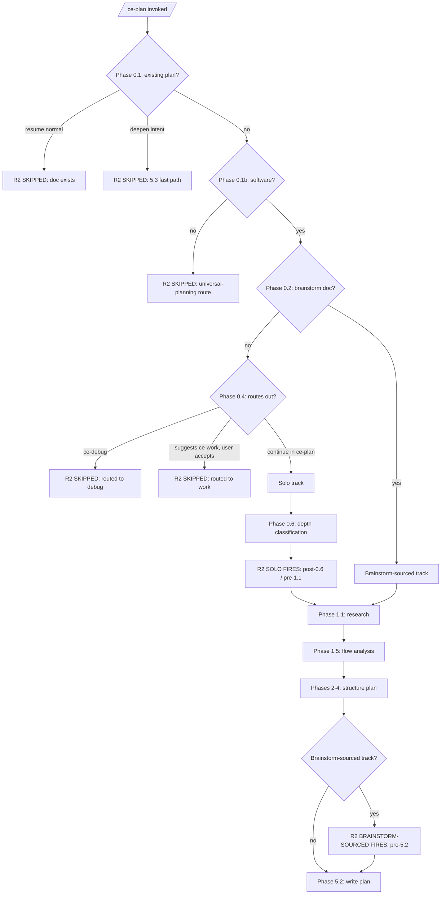

# feat: 通过 synthesis summaries 在 ce-brainstorm 和 ce-plan 中更早 surface scope

## 概览

向 ce-brainstorm 和 ce-plan 添加 synthesis-summary mechanism，在 doc-write 前向用户展示 agent 的 interpretation（Stated / Inferred / Out-of-scope）。这解决了 scope under-visibility，也就是 artifact bloat 和 downstream rework 的 upstream cause。此外，在 ce-plan 中添加简短 anti-expansion posture，在 implementation time 通过将 tangential cleanup 路由到 deferred items 来强化 scope discipline。

本 plan 不引入 new mode、flag 或 user-facing classification question。Density-control tools（calibrated exemplars、brevity passes）明确 deferred；见 Scope Boundaries。因此本 iteration 测试 upstream scope discipline 是否能在 downstream 消解 density problems，然后再决定是否添加直接针对 symptom 的 tools。

---

## 问题框架

Issue #676 报告的是症状：300+ line brainstorms、defensive artifacts、brownfield codebases 中 persistent 1000+ line PRs。Originating brainstorm 梳理了因果层级：scope under-visibility 是 upstream cause，artifact density 和 PR diff size 是 downstream symptoms。

ce-brainstorm 和 ce-plan 都会把 user input + agent inference synthesis 成 interpretation，但用户直到 doc 落地才看到这个 synthesis。用户在 dialogue 中同意了许多单独事项，却从未看到整体；agent 做了大量 inferences（尤其是 solo invoke ce-plan 时，Phase 0.4 bootstrap 设计上很 brief），然后针对未验证 scope 写文档。Write-time surprise 意味着 rework，而 downstream 看起来就是 artifact bloat 和 oversized diffs。

**先修复 cause，symptoms 才会减轻。如果没有减轻，density-control tools 会成为 follow-up；但现在把它们和 cause fix 一起 ship，会让 attribution 纠缠、为可能不需要的 value 增加 maintenance surface，并且在验证 cause fix 是否能消解问题之前就追逐 symptoms。**

---

## 需求追踪

- R1. ce-brainstorm synthesis summary（all tiers，post-Phase 2 / pre-Phase 3）。Headless mode 省略 "Inferred" list。
- R2. ce-plan synthesis summary，感知 invocation context：
  - Solo invocation：Phase 0.4 bootstrap 之后 / Phase 1 research 之前
  - Brainstorm-sourced invocation：Phase 1 research 之后 / Phase 5.2 plan-write 之前
  - Headless mode 在两个 variants 中都省略 "Inferred" list
- R3. Anti-expansion clause 将 scope creep 和 tangential refactors 路由到 deferred items

**Origin actors：** A1（ce-brainstorm agent - 由 U1 修改）、A2（ce-plan agent - 由 U2、U3、U4 修改）、A3（end-user developer - all units 中的 observable behavior change）。

**来源验收示例：**
- AE1（covers R1）- 在 U1 test scenarios 中引用
- AE2（covers R2 solo）- 在 U2 test scenarios 中引用
- AE3（covers R2 brainstorm-sourced）- 在 U3 test scenarios 中引用

---

## 范围边界

- 不添加 new mode、flag、command 或 user-facing classification question
- 不改变现有 Lightweight/Standard/Deep tier classification
- 不添加 diff-size budgets 或 PR-size gates（Goodhart concerns）
- 不修改 ce-work 或其 handoff
- 不在 ce-plan solo synthesis 内 duplicate ce-brainstorm dialogue（R2 solo 是 synthesis checkpoint，不是 brainstorm-style interview）
- 不触碰 auto-deepening（Phase 5.3）- 保留为 load-bearing depth
- 不为 headless-mode embedded synthesis 引入 automated validation（human PR reviewer 是 safety net；documented limitation）
- 不扩展 ce-doc-review 来 validate synthesis sections

### 推迟到 Follow-Up Work

- **Depth-calibration mechanisms.** `references/` 中的 calibrated tier exemplars、defensive sections（ce-brainstorm Outstanding Questions / Deferred to Planning）和 template-tail sections（ce-plan Sources & References / Operational Notes）的 brevity passes、tier-aware observable output。这些是直接针对 output density 的 density-control tools。在 working hypothesis 下，scope under-visibility 是 upstream cause，density 应自然跟随 disciplined scope。只有当 post-rollout signals（见 Validation）显示本 iteration ship 后 density problems 仍存在时才 revisit。
- **Validation methodology and fixture matrix.** 真实 validation 来自 post-rollout user feedback。如果 post-rollout signals 支持更深 validation，则 fixture matrix（每个 tier x invocation x mode cell N>=3 trials）作为 follow-up。
- **Frontmatter test extension.** 一个 `tests/frontmatter.test.ts` 风格的 assertion，确认 synthesis-summary references 存在于 expected locations。等实际 regression 发生后再 deferred。

---

## 上下文与调研

### 相关代码和模式

**ce-brainstorm 结构** (`plugins/compound-engineering/skills/ce-brainstorm/SKILL.md`)：
- Phase 1.3 dialogue（lines 168-182）是 "prose, not menus"（line 175）：R1 open prose 的 direct precedent
- Phase 2（approaches）：lines 184-210；line 210/212 boundary 是 R1 insertion point
- Phase 3（capture）：lines 212-216，delegates 到 `references/requirements-capture.md`
- **No pipeline-mode handling exists today**：R1 在该 skill 中引入 pattern

**ce-plan 结构** (`plugins/compound-engineering/skills/ce-plan/SKILL.md`)：
- Phase 0.1 fast paths：lines 62-79（resume / deepen-intent）；R2 不得在这里 fire
- Phase 0.2 brainstorm doc detection：lines 89-98；区分 solo 与 brainstorm-sourced
- Phase 0.3 origin doc consumption：lines 100-117；必须处理 first section 是新 synthesis 的 brainstorm doc（Phase 0.3 compatibility check，由 U3 负责）
- Phase 0.4 planning bootstrap：lines 119-142（lines 139-142 route to ce-debug or recommend ce-work）；如果 Phase 0.4 routes out，R2 solo 不得 fire
- Phase 0.6 depth assessment：lines 158-166；R2 solo insertion point 位于 Phase 0.6 与 Phase 1.1（line 168）之间
- Phase 1（research）：lines 168-281
- Phase 5.2 plan-write：line 765；R2 brainstorm-sourced 在这之前 fire
- Phase 5.3 auto-deepening：lines 783-827（保持不变）
- Existing pipeline-mode callouts: lines 781, 798, 847 - 都使用短语 *"If invoked from an automated workflow such as LFG, SLFG, or any `disable-model-invocation` context"*。**SLFG no longer exists as a skill**（已验证 - 无 `plugins/compound-engineering/skills/slfg/`）；这些 references stale，U2 包含 small cleanup，将三处 lines 中的 SLFG 移除。

**Skill-isolation enforcement（skill 隔离约束）**（`AGENTS.md` "File References in Skills"）：
- SKILL.md 只能引用自身 directory tree 内的 files
- Synthesis-summary content 必须在 ce-brainstorm 和 ce-plan 之间 duplicate；无 shared file
- 现有 `visual-communication.md` 在两个 skills 之间 duplicated 且 skill-tailored - direct precedent

**Open prose feedback precedent（开放 prose feedback 先例）:** ce-brainstorm Phase 1.3 rigor probes 是 "prose, not menus"（line 175）。Interaction Rule 5(a) 明确允许 open-prose responses，当 option sets 会 bias answer 时。R1/R2 prompt sites 需要 inline cite 该规则，防止未来被 "fix" 回 menu。

### 机构经验

- `docs/solutions/best-practices/ce-pipeline-end-to-end-learnings.md` §2 - 每个 pipeline stage 捕获不同类别 issue。Synthesis 在 artifact 写入前捕获 scope errors；doc-review 在 artifact 写入后捕获 contradictions。需在 SKILL.md 中明确，防止未来 "deduplication"。
- `docs/solutions/skill-design/compound-refresh-skill-improvements.md` - explicit headless detection 优于 auto-detection；"no blind user questions"；platform-agnostic interactive prompt phrasing。
- `docs/solutions/skill-design/research-agent-pipeline-separation.md` - WHAT（brainstorm）vs HOW（plan）separation 支撑 R2 的 two-variant timing。
- `docs/solutions/skill-design/git-workflow-skills-need-explicit-state-machines.md` - 在添加 new phases 但没有 explicit state-machine review 时有 "whack-a-mole regressions" risk。对本 work high-severity；通过 U1、U2、U3 中 explicit guards 处理。
- `docs/solutions/skill-design/pass-paths-not-content-to-subagents.md` - phrasing 比 meta-rules 更重要；standalone-fallback pattern（R2 brainstorm-sourced 对 pre-R1 brainstorms graceful handling）。

---

## 关键技术决策

- **Working hypothesis：scope under-visibility is the upstream cause; density is downstream.** Post-rollout signals（见 Validation）才是真正 validation。如果 real-user feedback 显示即使有 synthesis discipline，density problems 仍持续存在，density-control tools 才成为 follow-up。
- **Two distinct synthesis-summary mechanisms (R1, R2), not one shared one.** ce-brainstorm 在 write 前已有 substantial dialogue；其 summary 更短，作为 synthesis confirmation + transition checkpoint。ce-plan 在 solo mode 中 pre-write interview minimal；其 summary 更早触发（pre-research）且更 elaborate。相同 Stated/Inferred/Out structure，但各 skill 的 timing 和 shape 不同。
- **R2 timing is asymmetric by invocation context.** Solo R2 在 *pre-research* fire，因为如果 scope 错了，research effort 会浪费。Brainstorm-sourced R2 在 *pre-write* fire，因为 brainstorm doc 已 validate WHAT，而 plan-time decisions 在 research 中 emerge。
- **State-machine guards explicit in SKILL.md, not implicit.** R2 不在 Phase 0.1 fast paths（resume / deepen-intent）或 Phase 0.4 routes out（ce-debug、ce-work、universal-planning）时 fire。每个 guard 都是 SKILL.md 中 stated conditional，以防 regression。
- **Synthesis is always embedded** as the first section of the doc，interactive 和 headless 都如此。Self-describing artifact 供 human PR reviewers 使用。**Headless mode omits the "Inferred" list** - pipelines（LFG 和任何其他 `disable-model-invocation` caller）会在无 human review 下 consume doc，因此将 un-validated agent inferences 作为 authoritative propagate 不安全；保留 Stated 和 Out-of-scope（用户给出的 input，以及 agent deliberately excluded 的 scope）。
- **Pipeline propagation limitation is documented.** 即使省略 Inferred，headless runs 仍会不经 correction propagate synthesis。Plan 不引入 automated downstream validation - failure mode 留给最终读取 code 的 human PR reviewer。Future maintainers 不应期待不存在的 safety net。
- **R1/R2 use open prose, not AskUserQuestion.** 在 SKILL.md inline cite Interaction Rule 5(a)。
- **Headless detection is implicit caller-context**，措辞与现有 ce-plan precedent 相同（但移除 SLFG - 见 U2）：*"If invoked from an automated workflow such as LFG or any `disable-model-invocation` context."*
- **Soft-cut fires on circularity, not iteration count.** Track 用户每轮 touched 哪些 items；当同一 item 被 revised twice 时 soft-cut fires。修正错误 synthesis 的不同 aspects（例如先 Stated 后 Inferred）正是该机制应支持的。
- **Self-redirect support without explicit fork.** 用户若意识到自己在 wrong skill（例如 "this is too big, brainstorm first"），可从 synthesis self-redirect。Agent stops、suggests alternative，并 offer to load it in-session。
- **Phased delivery: Phase A (ce-brainstorm) lands first; Phase B (ce-plan) follows.** Phase A structurally simpler - 在更小 surface 中验证 synthesis mechanism，再进入拥有 two timing variants 的更复杂 ce-plan flow。
- **Pre-Phase-A gate: Phase 0.3 compatibility check.** Phase A 修改 `requirements-capture.md`，将 synthesis embed 为 first section。ce-plan Phase 0.3（origin-doc carry-forward）必须 graceful handle new structure；如果不行，fix 与 R1 一起进入 Phase A。
- **Density-control tools deferred.** Calibrated exemplars 和 brevity passes 直接针对 output density；在 working hypothesis 下，它们是在解决 scope discipline 可预防的 symptom。若 speculative 地与 cause fix 一起 ship，会 entangle attribution，并为可能不需要的 value 增加 maintenance surface。
- **已否决：diff budgets**（Goodhart failure mode）。
- **Rejected：extend-over-invent posture（已否决：优先扩展而非新建的姿态）**（曾是早期 R3）。Plan revision 中 pressure-tested：一个 "default to extending existing code" bias 可能在 existing code 正是问题时延续 bad patterns（扩展 500-line god-function 会更糟；继续粘在 mixed-concerns module 上会 preserve mess）。R2 的 brainstorm-sourced synthesis 已经将 extend-vs-invent 作为用户可见且可修正的 plan-time decision surface，因此该 bias 冗余。R3（anti-expansion）处理 legitimate scope-creep concern；architectural extend-vs-invent judgment 仍由 agent 判断，并在 material 时通过 R2 synthesis surface 给用户。如果 post-rollout signals 显示 invention-bias 是真实问题，用 process-level framing（"the synthesis must explicitly state extend-vs-invent reasoning per major component"）revisit，而不是 conclusion-level bias。

---

## 开放问题

### 推迟到实现阶段

- [Affects U1, U2, U3][Technical] synthesis-summary prompt templates 的 exact wording。按 `pass-paths-not-content-to-subagents`，phrasing matters；implementation 时 iterate。
- [Affects U2, U3][Technical] `ce-plan/references/synthesis-summary.md` 是一个同时包含 solo 和 brainstorm-sourced templates 的 file，还是两个 files。Default: 一个 file，含两个 clearly-labeled sections。
- [Affects U2][Technical] solo R2 prompt 使用 `AskUserQuestion`（blocking）还是 chat-output-with-natural-interrupt（visibility-first）。Tradeoff：blocking 更可靠但增加 friction。Planning 时决定。

---

## 高层技术设计

> *这说明 intended R1/R2 firing rules，是给 review 的 directional guidance，不是 implementation specification。*

R1 对 ce-brainstorm 所有 tiers 无条件 fire，除了 Phase 0.1b non-software（universal-brainstorming）route。R2 有更多 state-machine branching：



Solo R2：full-breadth synthesis（problem frame、intended behavior、success criteria、in/out scope），包含 explicit "Inferred" list，因为 Phase 0.4 bootstrap 会产生 substantial inference。Brainstorm-sourced R2：只覆盖 plan-time decisions（哪些 files/modules to touch、哪些 patterns extended vs. left alone、test scope、refactor scope）。Brainstorm-validated WHAT assumed。

两个 variants：open prose feedback、soft-cut on circularity（not iteration count）、always-embed in plan doc、headless skips prompt and omits Inferred list。

---

## 实施单元

- U1. **ce-brainstorm R1 synthesis summary（synthesis 摘要，Phase 2.5）**

  **目标：** 在 `ce-brainstorm/SKILL.md` 中插入新的 Phase 2.5，在 doc-write 前 surface synthesis（Stated / Inferred / Out-of-scope），覆盖 all tiers 并处理 pipeline-mode。这是 `ce-brainstorm` 中第一次引入 pipeline-mode pattern。

  **需求：** R1

  **依赖：** None

  **文件：**
  - 修改：`plugins/compound-engineering/skills/ce-brainstorm/SKILL.md` - 在当前 line 210（Phase 2 prose 结束）与当前 line 212（`### Phase 3: Capture the Requirements`）之间插入新 `### Phase 2.5: Synthesis Summary`
  - 修改：`plugins/compound-engineering/skills/ce-brainstorm/references/requirements-capture.md` - 适配 new synthesis section 作为 rendered doc first section（template + ID/layout rules）
  - 新增：`plugins/compound-engineering/skills/ce-brainstorm/references/synthesis-summary.md` - template、framing、Stated/Inferred/Out structure rules、soft-cut handling、headless behavior

  **方法：**
  - Phase 2.5 对所有 tiers fire，包括 Lightweight（transition checkpoint value）
  - Stated/Inferred/Out three-bucket structure；items 可在 meaningfully both 时出现在两个 buckets
  - Open prose feedback prompt（在 SKILL.md inline cite Interaction Rule 5(a)）
  - Soft-cut 在 circularity 时 fire（同一 item revised twice），而不是按 iteration count。Track 每轮用户 touched 哪些 items。
  - 始终将 synthesis embed 为 requirements doc first section - interactive AND headless。**Headless mode omits the "Inferred" list**（保留 Stated and Out）。
  - Pipeline-mode handling：skip prompt，以 headless shape embed synthesis。Conditional opening 逐字来自 `ce-plan/SKILL.md:781`（按 U2 cleanup 移除 SLFG）：*"If invoked from an automated workflow such as LFG or any `disable-model-invocation` context,"* - action clause skill-tailored: *"skip the user prompt and embed the synthesis as the first section of the requirements doc, omitting the Inferred list."*
  - 在 Phase 0.1b non-software（universal-brainstorming）route 上完全 skip Phase 2.5
  - Self-redirect：如果用户说 "this is too small, just /ce-work it" 或类似内容，agent stops ce-brainstorm、suggests alternative skill、offer to load in-session
  - 修改 `references/requirements-capture.md`，expect synthesis section as rendered doc first section

  **Execution note：** 按 `git-workflow-skills-need-explicit-state-machines.md` 做 state-machine review。U1 认为 complete 前，walk through 8 cells（4 tiers x {interactive, headless}）。

  **Technical design：** *(Synthesis prompt template，方向性指导；actual phrasing 在 implementation 时编写。)*

  ```
  Based on our dialogue and approach selection, here's the scope I'm proposing for the requirements doc:

  Stated (from your input and our dialogue):
  - [item]

  Inferred (gaps I filled with assumptions):
  - [item — explicit so you can correct]

  Out of scope (deliberately excluded):
  - [item]

  Does this match your intent? Tell me what to add, remove, redirect, or that I got wrong — or just confirm to proceed.
  ```

  **遵循的模式：**
  - `ce-plan/SKILL.md:781,798,847`（pipeline-mode wording precedent - verbatim conditional clause，skill-tailored action clause）
  - `ce-brainstorm/SKILL.md:175`（Phase 1.3 rigor probes 是 "prose, not menus" - same justification）
  - `plugins/compound-engineering/skills/ce-plan/references/deepening-workflow.md:206-211`（Interactive Finding Review Accept/Reject/Discuss pattern 是 soft-cut blocking question 的 closest precedent）

  **测试场景：**
  - **覆盖 AE1。Happy path Lightweight x interactive：** small task 上的 /ce-brainstorm - synthesis fires（paragraph + brief lists），user confirms or revises，embedded as first section
  - **覆盖 AE1。Happy path Standard x interactive：** medium task 上的 /ce-brainstorm - synthesis fires（paragraph + lists），embedded post-revision
  - **覆盖 AE1。Happy path x headless：** LFG context 下 ce-brainstorm - no prompt，synthesis embedded with Inferred omitted
  - **边界情况 circularity soft-cut：** User revises the same Inferred item twice - soft-cut blocking question fires（proceed-as-revised vs. stop-and-redirect）
  - **边界情况 multi-bucket revision：** User revises Stated, then Inferred（different items）- proceeds without soft-cut
  - **边界情况 unparseable response：** User responds with a clarification question - agent treats as clarification，re-prompts
  - **边界情况 self-redirect：** User says "this should just be a quick fix" - agent stops，suggests `/ce-work`
  - **边界情况 Stated/Out overlap：** 用户 explicit said 但 agent inferred should be excluded 的 item - appears in both buckets
  - **边界情况 universal-brainstorming route：** Non-software brainstorm - Phase 2.5 skipped entirely
  - **集成：** Synthesis embedded as first section；`requirements-capture.md` template accommodates it

  **验证：**
  - Phase 2.5 出现在 `ce-brainstorm/SKILL.md` 当前 line 210 和 212 之间
  - `synthesis-summary.md` reference file 存在，并包含 template 和完整 guidance
  - Pipeline-mode language 存在（LFG only，SLFG dropped）；Inferred-omission rule 存在
  - Phase 2.5 中存在 Interaction Rule 5(a) citation
  - State-machine review 已记录（8 cells confirmed）

- U2. **ce-plan R2 solo synthesis summary（solo synthesis 摘要，Phase 0.7）+ SLFG cleanup**

  **目标：** 插入新的 Phase 0.7，在 solo invocation 中 pre-research surface synthesis，避免在 scope 错误时浪费 sub-agent dispatch。包含 explicit state-machine guards。顺带清理 ce-plan/SKILL.md 中 stale SLFG references（SLFG skill 已不存在；cleanup 很小，且 U2 已 touch 该文件）。

  **需求：** R2（solo branch）

  **依赖：** None mechanically（可与 U3 parallel；二者共享 `synthesis-summary.md`）

  **文件：**
  - 修改：`plugins/compound-engineering/skills/ce-plan/SKILL.md` - 在当前 line 166（Phase 0.6 结束）和当前 line 168（`### Phase 1: Gather Context`）之间插入新 `### Phase 0.7: Solo-Mode Scope Summary`；同时从 lines 781, 798, 847 现有 pipeline-mode references 中 drop "SLFG"
  - 新增：`plugins/compound-engineering/skills/ce-plan/references/synthesis-summary.md` - template 覆盖 solo 和 brainstorm-sourced 两个 variants（U3 会扩展 brainstorm-sourced section）

  **方法：**
  - 仅当以下条件满足时 fire：
    - Phase 0.2 未找到 upstream brainstorm doc（solo invocation）
    - AND Phase 0.4 stayed in ce-plan（未 route to ce-debug、ce-work 或 universal-planning）
    - AND Phase 0.5 cleared（无 unresolved blockers）
    - AND 不在 Phase 0.1 fast paths（resume normal、deepen-intent）上
  - 每个 guard 都是 SKILL.md 中 explicit conditional
  - Stated/Inferred/Out structure，覆盖 full breadth: problem frame、intended behavior、success criteria、in/out scope
  - Interactive mode 中 "Inferred" list 尤其 load-bearing - Phase 0.4 bootstrap 牵涉 substantial inference
  - Open prose feedback（引用 Interaction Rule 5(a)）
  - Soft-cut 基于 circularity，而不是 iteration count
  - 始终 embed in plan doc as first section。**Headless mode 省略 "Inferred" list.**
  - Pipeline-mode handling：conditional opening 逐字来自 line 781（移除 SLFG）；action clause skill-tailored: *"skip the user prompt and embed the synthesis as the first section of the plan doc, omitting the Inferred list."*
  - Self-redirect to /ce-brainstorm：stop ce-plan，suggest，并 offer to load in-session
  - **SLFG cleanup (folded edit):** `ce-plan/SKILL.md` lines 781, 798, 847 当前引用 "LFG, SLFG, or any `disable-model-invocation` context." SLFG 已不再是 skill。删除 "SLFG" - 保留 "LFG" 和 "any `disable-model-invocation` context."

  **Execution note：** State-machine review。U2 完成前，walk through 6 firing cells（3 tiers x {interactive, headless}）加 4 non-firing categories（resume、deepen、route-to-ce-debug、route-to-ce-work）。

  **遵循的模式：**
  - `ce-plan/SKILL.md:781`（pipeline-mode wording - verbatim conditional，with SLFG removed）
  - U1（ce-brainstorm R1 - 按 skill-isolation duplicate `synthesis-summary.md` content，并提供 ce-plan-tailored variant guidance）

  **测试场景：**
  - **覆盖 AE2。Happy path Lightweight x interactive solo：** thin one-line input 的 /ce-plan - synthesis 在 pre-research fire，并带 explicit "Inferred" list
  - **覆盖 AE2。Happy path Standard x interactive solo：** substantial prior conversation、无 brainstorm doc 的 /ce-plan - synthesis fires with conversation-aware Stated/Inferred split
  - **覆盖 AE2。Happy path x headless solo：** LFG 下无 brainstorm 的 /ce-plan - no prompt，synthesis embedded with Inferred omitted
  - **负向 resume path：** existing-plan path 上的 /ce-plan - Phase 0.7 SKIPPED
  - **负向 deepen path：** 带 "deepen" intent 的 /ce-plan - Phase 0.7 SKIPPED
  - **负向 route-to-ce-debug：** symptom-without-root-cause 的 /ce-plan - Phase 0.4 routes to ce-debug；Phase 0.7 SKIPPED
  - **负向 brainstorm-sourced path：** 带 matching brainstorm doc 的 /ce-plan - Phase 0.7 SKIPPED（defers to U3's variant）
  - **边界情况 self-redirect：** User says "this is bigger than I thought" - agent suggests /ce-brainstorm
  - **边界情况 circularity soft-cut：** 与 U1 pattern 相同
  - **验证 post-cleanup：** ce-plan/SKILL.md lines 781, 798, 847 不再包含 "SLFG"

  **验证：**
  - Phase 0.7 出现在 SKILL.md lines 166 和 168 之间
  - 全部四个 guards 在 SKILL.md 中 explicit（resume、deepen、route-out、brainstorm-sourced）
  - Pipeline-mode language 存在，且 LFG-only（SLFG removed everywhere it appeared）
  - Interaction Rule 5(a) citation 存在
  - State-machine review 已记录（10 cells confirmed）

- U3. **ce-plan R2 brainstorm-sourced synthesis summary（Phase 5.2 之前）+ Phase 0.3 compatibility check**

  **目标：** 当 ce-plan 带 upstream brainstorm doc invocation 时，在 Phase 5.2 plan-write 前插入 synthesis。Surface brainstorm 未 validate 的 plan-time decisions（file scope、pattern extension、test scope、refactor scope）。负责 Phase 0.3 carry-forward compatibility check。

  **需求：** R2（brainstorm-sourced branch）

  **依赖：** U2（共享 `synthesis-summary.md` references file - U3 扩展 brainstorm-sourced section）。**Phase 0.3 compatibility check portion runs pre-Phase-A**（见 Phased Delivery）。

  **文件：**
  - 修改：`plugins/compound-engineering/skills/ce-plan/SKILL.md` - 插入到当前 line 765（`#### 5.2 Write Plan File`）之前。Section heading: `#### 5.1.5 Brainstorm-Sourced Scope Summary`.
  - 修改：`plugins/compound-engineering/skills/ce-plan/references/synthesis-summary.md` - 扩展 brainstorm-sourced variant template
  - 可能修改：`plugins/compound-engineering/skills/ce-plan/SKILL.md` Phase 0.3（lines 100-117）- 仅当 compatibility check 发现 incompatibility 时（见下）

  **方法：**
  - 仅当以下条件满足时 fire：
    - Phase 0.2 找到 upstream brainstorm doc（brainstorm-sourced invocation）
    - AND 不在 Phase 0.1 fast paths 上
  - Synthesis 聚焦 plan-time decisions：
    - 要 touch（以及不 touch）哪些 files/modules
    - 哪些 patterns 是 extended，哪些是 introduced new
    - Test scope - 哪些 existing-but-untested code 对此 work in/out of test scope
    - Refactor scope - 哪些 adjacent cleanup 放到 deferred items vs. active diff
  - Brainstorm-validated WHAT assumed，不重复 restate
  - Graceful fallback：如果 origin brainstorm doc 缺少 R1 synthesis section（older brainstorms、hand-written ones），R2 brainstorm-sourced 正常运行 - 其 content independent of origin synthesis presence。SKILL.md 中加 one-liner note。
  - 与 U2 相同 Stated/Inferred/Out structure、open prose、soft-cut on circularity、always-embed、pipeline-mode handling（headless omitted Inferred）。
  - **Phase 0.3 compatibility check（本 unit owns, runs pre-Phase-A）:** 阅读 ce-plan SKILL.md Phase 0.3（lines 100-117），确认 origin-doc-consumption path 能 handle first section 是新 synthesis summary 的 brainstorm doc - 要么 section-agnostic，要么显式 surface/skip。**此 check 必须在 Phase A merges 前完成**，因为 Phase A 会修改 `requirements-capture.md`，将 synthesis embed 为 first section。如果 check 显示 incompatibility，相关 Phase 0.3 fix 与 R1 一起 folded into Phase A，不 deferred 到 Phase B。

  **Execution note：** U3 完成前，state-machine walk through 6 cells（3 tiers x {interactive, headless}）。

  **遵循的模式：**
  - U2（solo R2 - 相同 mechanism，不同 content focus）
  - `ce-plan/SKILL.md:765`（Phase 5.2 file-write - insertion point reference）

  **测试场景：**
  - **覆盖 AE3。Happy path interactive：** 带 matching brainstorm doc 的 /ce-plan - synthesis 在 post-research、pre-write fire；user can revise plan-time scope
  - **覆盖 AE3。Happy path x headless：** LFG 下 brainstorm-sourced /ce-plan - no prompt，synthesis embedded with Inferred omitted
  - **边界情况 origin lacks R1 section：** hand-written 或 pre-R1 brainstorm 的 /ce-plan - graceful fallback runs as normal
  - **边界情况 scope expansion request：** User says "wait, also touch the audit logging" - agent revises synthesis，surfaces，proceeds
  - **负向 solo path：** 无 brainstorm 的 /ce-plan - Phase 5.1.5 SKIPPED（defers to U2）
  - **负向 resume / deepen：** existing-plan paths 上的 /ce-plan - Phase 5.1.5 SKIPPED
  - **集成：** Phase 5.1.5 在 Phase 5.1 review 之后、Phase 5.2 write-file 之前运行
  - **Pre-Phase-A：** Phase 0.3 compatibility check completed；verification outcome（passes as-is，or fix folded into Phase A）记录在 Phase A PR description 中

  **验证：**
  - Phase 5.1.5 出现在 SKILL.md line 765 前
  - Graceful-fallback note 存在
  - Pipeline-mode language 与 U2 一致（LFG-only，Inferred omitted in headless）
  - State-machine review 已记录（6 cells）
  - Phase 0.3 compatibility check 在 Pre-Phase-A 完成；outcome documented

- U4. **ce-plan R3 anti-expansion posture（anti-expansion 姿态）**

  **目标：** 将 anti-expansion clause（R3）作为 posture guidance 加入 `ce-plan/SKILL.md` - 是 Phase 3.6 的简短 addition，不是 new phase 或 audit table。将 tangential cleanup 和 scope expansions 路由到 deferred items。

  **需求：** R3

  **依赖：** None mechanically

  **文件：**
  - 修改：`plugins/compound-engineering/skills/ce-plan/SKILL.md` - 将 R3 加入 Phase 3.6（lines 404-412）或 Planning Rules（约 line 720）

  **方法：**
  - 用一段话扩展现有 planning-time/implementation-time separation guidance：tangential refactors AND scope expansions（"while we're here, we could also..."）进入 Scope Boundaries 中现有 `Deferred to Follow-Up Work` subsection，而不是 active Implementation Units。Touched files 中 spotted cleanup -> deferred。Adjacent improvements -> deferred。Scope-adjacent nice-to-haves -> deferred。
  - 将其 framed 为 R2 synthesis discipline 的 posture reinforcement，而不是 new enforcement。R2 已经向用户 surface scope；R3 设置默认：scope-creep 属于 deferred items，而不是 active diff。
  - 保持 concise。无 required audit table；无 new phase。抵制加入 extend-vs-invent bias - 该 decision 是 agent judgment，并在 material 时通过 R2 synthesis surface 给用户。

  **Pre-authoring cross-check（required）：** Authoring 前阅读 Phase 3.6（lines 404-412）、Planning Rule 4（line 38）和 Deferred to Follow-Up Work subsection（lines 528-535），确认 new paragraph 是 extend，而不是 restate 或 contradict existing text。Phase 3.6 已明确将 "Refactors that may become unnecessary once implementation starts" 作为 deferred example；R3 必须 reinforce 它，而不是 duplicate。

  **遵循的模式：**
  - Phase 3.6（lines 404-412）和 Planning Rules（lines 720-730）中 existing posture instructions
  - Phase 4.2 Core Plan Template（lines 528-535）中 `Deferred to Follow-Up Work` subsection precedent

  **测试场景：**
  - **Happy path：** adjacent cleanup opportunity 的 /ce-plan（例如 touched file 附近有 `// TODO`）- plan defers to `Deferred to Follow-Up Work`，而不是放进 active Implementation Units
  - **边界情况：** User explicitly asks for refactor - R3 不 override user intent；explicit ask makes refactor in-scope
  - **负向：** genuinely scoped work 的 plans（无 adjacent cleanup discovered）- R3 不 manufacture deferred items；section 没有要 defer 的内容时保持 empty

  **验证：**
  - R3 instruction 出现在 Phase 3.6 或 Planning Rules 中
  - 对 existing `Deferred to Follow-Up Work` subsection 的 references 正确
  - 未添加 new required phase 或 audit table
  - 未引入 extend-over-invent bias（architectural extend-vs-invent decisions remain agent judgment, surfaced via R2 synthesis）

---

## 系统级影响

- **Interaction graph（交互图）:** R1 首次在 ce-brainstorm 中引入 pipeline-mode handling。`lfg/SKILL.md` 以 `disable-model-invocation: true` 运行，并当前直接调用 ce-plan - 如果未来任何 pipeline 调用 ce-brainstorm，R1 的 pipeline-mode handling 会变成 load-bearing。今日无此 pipeline；R1 是 forward-compatible scaffolding。
- **API surface parity（API surface 对等）:** `requirements-capture.md` template 被修改，以适配 synthesis section as first section。ce-plan Phase 0.3（origin-doc carry-forward）必须 graceful handle new structure - 由 U3 在 pre-Phase-A 验证。
- **Error propagation（错误传播）:** 如果 `synthesis-summary.md` missing 或 malformed，SKILL.md wiring 必须 loud fail，而不是 silently writing without synthesis。
- **State lifecycle risks（状态生命周期风险）:** R1/R2 添加三个 new state-machine edges（ce-brainstorm 中 Phase 2.5；ce-plan 中 Phase 0.7 和 Phase 5.1.5）。每个都有 explicit guards（skip on resume/deepen、skip on route-out、skip on universal-planning）。每个 phase merge 前都必须按 `git-workflow-skills-need-explicit-state-machines.md` 做 state-machine review。
- **Unchanged invariants（不变不变量）:** ce-work 的 plan-consumption logic；auto-deepening（Phase 5.3）；ce-doc-review/ce-code-review 中 `mode:headless` argument-parsing；tier classification；frontmatter schema。

---

## 风险与依赖

| 风险 | 缓解措施 |
|------|------------|
| 添加 Phase 2.5 / 0.7 / 5.1.5 时出现 state-machine regressions - `git-workflow-skills-need-explicit-state-machines.md` 中的 "whack-a-mole" pattern | 每个 unit merge 前 walk all firing/non-firing cells（U1 8 个，U2 10 个，U3 6 个）。在 SKILL.md 中显式写出 guards，而不是 implicit。 |
| Synthesis summary 本身变成 bloat | Tier-aware shape：Lightweight 是 one paragraph；Standard/Deep 添加 lists。Soft-cut on circularity（not iteration count）。Always-embed 但 content 小。 |
| Headless synthesis 错误并未经 correction propagate through pipelines | **Mitigated, not eliminated:** R1/R2 在 headless mode omit "Inferred" list，使 un-validated agent inferences 不会作为 authoritative propagate。保留 Stated 和 Out（用户给出的 input；deliberately excluded scope）。Residual failure mode 会不经 correction 通过 pipelines 传播，直到 human PR reviewer 阅读 resulting code。这是 conscious accepted risk；在 SKILL.md 中记录，避免 future maintainers 期待不存在的 safety net。 |
| Synthesis-summary content 的 cross-skill duplication 随时间 drift | Skill-isolation rule 已记录；`visual-communication.md` precedent 说明 duplication 可通过 reviewer attention 保持 coherent。未来 ce-brainstorm 与 ce-plan content 发生 drift 是一个真实 signal，说明某个 skill needs diverged，而不是 bug。 |
| ce-brainstorm pipeline-mode handling novel（该 skill 中首次出现） | 使用 ce-plan precedent 的 exact wording（with SLFG dropped）。Pipeline-mode 是 forward-compatible scaffolding；如果它未来 fire，behavior 匹配 ce-plan precedent。 |
| Open-prose feedback 被 future maintainer "fixed" 回 AskUserQuestion | 在每个 prose-prompt point inline cite Interaction Rule 5(a)。Justification 记录在 skill 本身，而不只在 commit messages。 |
| R2 brainstorm-sourced 在 origin malformed 或 missing synthesis section 时 fire | Graceful fallback：R2 brainstorm-sourced content independent of origin synthesis section presence。SKILL.md 中加 one-liner。 |
| Working hypothesis（scope discipline upstream -> density follows downstream）错误 | 真实 validation 来自 post-rollout signals（见 Validation）。如果 signals 显示 density problems persist，depth-calibration mechanisms 成为 follow-up。判断错误的风险较小（我们 ship smaller change；follow-up additive）。 |

---

## 验证

**Direct validation（直接验证，pre-merge）:** 通过 `bun test` 做 structural assertions、manual walk through every state-machine cell per phase（见 Phase A 和 Phase B），以及 Phase 0.3 compatibility check（由 U3 负责，pre-Phase-A 运行）。

**Post-rollout signals（发布后信号，对 causal claim 的真实验证）:** brainstorm 明确指出，PR-diff-size 和 rewrite-frequency reductions 是 upstream scope discipline 预期产生的 downstream consequences，需由 real-user feedback 验证，而不是 pre-implementation gates。需要观察的 signals：

- **Synthesis-correction rate:** R1/R2 prompts 中用户 revise（而不是 silently approve）synthesis 的比例。**Healthy range:** early weeks 15-50%。30+ invocations 中 persistent rate <10% 表明 synthesis prompt 变成 ritual；调查是否需要改变 tier-specific behavior。Persistent rate >70% 表明 synthesis 与 intent 持续 misaligned；调查 prompt phrasing。
- **Self-redirect rate:** solo R2 prompts 中用户 redirect to /ce-brainstorm 的比例。**Healthy range:** 5-20%。更高表示用户经常 picked wrong skill - 在 ce-plan Phase 0.4 bootstrap 中 surface as recommendation。
- **Same-task PR-diff trend:** 对 pre-/post-rollout 任务 workload 可比的用户，观察 PR-diff distribution。#676 中 original signal（jrdncstr 持续 1000+ line PRs）是 canonical case。Directional improvement 即为 win。
- **Time-to-doc-write:** 从 `/ce-brainstorm` invocation 到 written brainstorm doc 的 median time，pre-/post-rollout。R1 增加 synthesis step；如果 median time 超过约 2x，friction cost 可能超过 scope-accuracy benefit。
- **Density signal:** 如果 post-rollout artifacts 即使有 synthesis discipline，仍持续出现 defensive Outstanding Questions / Deferred to Planning padding 或 placeholder template-tail content，则 working hypothesis incomplete，depth-calibration mechanisms（deferred - 见 Scope Boundaries）成为 follow-up。

**Validation methodology（验证方法，post-rollout 团队动作）:** Phase A ship 后，在 30/60/90-day intervals review session logs 和 PR data，观察上方 signals。如果 30 天 signals favorable，ship Phase B；如果 mixed，hold Phase B 并 revisit prompt design；如果 negative，则 revert 或 scope down。

---

## 分阶段交付

### Pre-Phase-A：Phase 0.3 compatibility check（兼容性检查）

由 U3 负责。**Phase A merges 前**运行。Phase A 修改 `requirements-capture.md`，将 synthesis embed 为每个 brainstorm doc 的 first section；如果 ce-plan Phase 0.3 不能 graceful consume new structure，Phase A 会 ship broken consumer compatibility。阅读 ce-plan SKILL.md Phase 0.3（lines 100-117），验证其 graceful handling unknown first sections（section-agnostic behavior，或 explicit surface/skip）。如果 incompatible，fix folded into Phase A alongside R1。

### Phase A：ce-brainstorm（U1）

- One PR（一个 PR）
- Pre-merge（merge 前）：Phase 0.3 compatibility verification completed（见上）
- 手动 validate across 8 cells（4 tiers x {interactive, headless}）
- `bun test` passes；`bun run release:validate` passes

### Phase B：ce-plan（U2 + U3 + U4）

Phase A validated 后 atomically land。

**Intra-phase sequencing（阶段内顺序）:** **U2 must be authored before U3** - U2 creates `synthesis-summary.md`；U3 extends it。**U4 is independent**，可与 U2 或 U3 parallel。

- One PR（一个 PR）或 tightly-coupled small series
- 手动 validate across 16 cells（3 tiers x 2 invocation contexts x 2 modes + 4 non-firing categories）
- `bun test` passes；`bun run release:validate` passes

### 为什么按这个顺序

- Phase A structurally simpler - 先在更小 surface 中 validate synthesis mechanism
- Phase B 的 R2 有 two timing variants 和更多 state-machine guards（resume / deepen / route-out）- 先验证 R1 可降低 compound risk
- Phase 0.3 compatibility check 移到 pre-Phase-A，确保 producer change ship 前 consumer compatibility 已验证

---

## 文档与运维说明

- **No release-version bump in routine PR.** 按 `plugins/compound-engineering/AGENTS.md`，release-please owns plugin version。
- **Routine PR 不写 CHANGELOG entry。** Release-please 生成 changelog。
- **Commit prefix:** `feat:`（引入 new visibility behavior）。Per-unit scopes: U1 用 `feat(ce-brainstorm): ...`；U2、U3、U4 用 `feat(ce-plan): ...`。
- **每次 merge 前的 validation commands**: `bun test`, `bun run release:validate`。
- **Per `plugins/compound-engineering/AGENTS.md` "Validating Agent and Skill Changes":** behavioral changes 需要 skill-creator 的 eval workflow，因为 plugin agent and skill definitions 在 session start cache。
- **No legacy-cleanup registry update needed.** 此 work adds files，不 remove。
- **Beta sync check:** ce-brainstorm 和 ce-plan 都没有 `-beta` counterpart。无需 sync decision。

---

## 来源与参考

- **来源文档：** `docs/brainstorms/2026-04-24-surface-scope-earlier-requirements.md`
- **相关 issue：** [GitHub Issue #676](https://github.com/EveryInc/compound-engineering-plugin/issues/676)
- **修改的 skill files：**
  - `plugins/compound-engineering/skills/ce-brainstorm/SKILL.md`
  - `plugins/compound-engineering/skills/ce-brainstorm/references/requirements-capture.md`
  - `plugins/compound-engineering/skills/ce-plan/SKILL.md`
- **新增的 skill files：**
  - `plugins/compound-engineering/skills/ce-brainstorm/references/synthesis-summary.md`
  - `plugins/compound-engineering/skills/ce-plan/references/synthesis-summary.md`
- **Repo conventions（仓库约定）：**
- `AGENTS.md`（root）：commit conventions、skill-isolation rule
- `plugins/compound-engineering/AGENTS.md`：references inclusion conventions、AskUserQuestion design rules
- **组织内 learnings：**
  - `docs/solutions/best-practices/ce-pipeline-end-to-end-learnings.md`
  - `docs/solutions/skill-design/compound-refresh-skill-improvements.md`
  - `docs/solutions/skill-design/research-agent-pipeline-separation.md`
  - `docs/solutions/skill-design/git-workflow-skills-need-explicit-state-machines.md`
  - `docs/solutions/skill-design/pass-paths-not-content-to-subagents.md`
