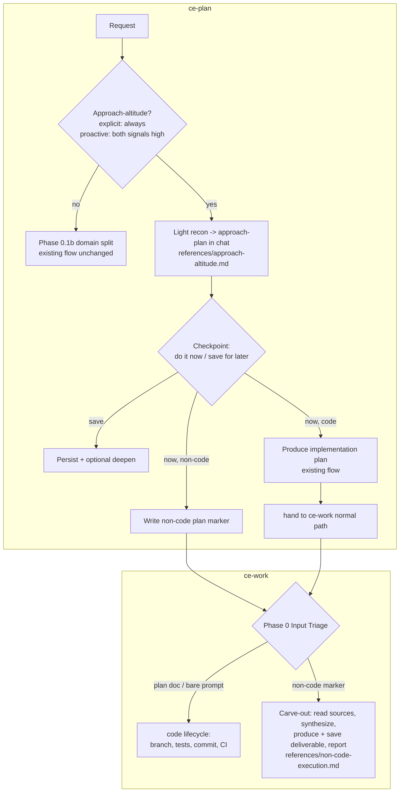

# feat: ce-plan approach altitude：把 plan-for-a-plan 作为一等形态

## Summary

为 `ce-plan` 添加 "approach altitude" 能力：面对 hard problem 时，先上提一层，产出 grounded *deliverable 将如何被制作* 的 plan，再 commit 到 deliverable。入口可以是 explicit（"plan for a plan"，始终遵守），也可以很少见地 proactive offer（仅当 method-uncertainty 与 cost-of-getting-it-wrong 都高时）。Approach-plan chat-first（file-optional、可 deepen）；checkpoint 时用户选择现在执行或保存到以后。Non-code execution route 到新的 lightweight `ce-work` carve-out，跳过 code lifecycle；code execution 仍走 `ce-work` 正常路径。三块内容都直接进入 stable（无 beta）；conservative trigger 是唯一 safety mechanism，并通过专门的 `skill-creator` eval 验证。

---

## Problem Frame

用户会要求 `ce-plan` 产出一个 *intermediate* plan：先说明 agent 将如何 approach 一个 hard problem，然后再执行它。Canonical case（origin: "Margolis"）是：交给 agent 一本 PDF 书和一段两小时 transcript，要求它先给出 "how you'll read the book, mine the transcript, and produce a great document" 的 thoughtful plan，并明确不要现在写最终 document。今天这会失败：`ce-plan` 的 non-software path 只有 plan-seeking vs. answer-seeking 二分，没有 *approach plan now -> deliverable later* 的槽位；第二阶段也没有 home（`ce-work` code-only）；approach-plan 也不会基于用户 inputs grounding。修复方式是一层新的 `ce-plan` altitude，以及 `ce-work` 中一个 minimal non-code execution home。

---

## Requirements

来自 origin（`origin: R1-R16`），按 concern 分组。这些是 code review 要验证的 contracts。

**Recognition and triggering**

- R1. `ce-plan` 识别 explicit approach-plan request，并始终遵守，不受 proactive heuristic gate 限制；它停在 approach，不开始 deliverable。（origin R1）
- R2. `ce-plan` 只有在 method-uncertainty 和 cost-of-getting-it-wrong 都高时才 proactive offer approach-plan；任一低时保持沉默，正常 plan/do。（origin R2）
- R3. Proactive offer 是一句 lightweight、dismissible line，命名触发 signal，绝不是 blocking ceremony。（origin R3）
- R4. 能力是 domain-general：software 和 knowledge-work 都可使用，不关心 executor 是 human 还是 agent。（origin R4）
- R16. Approach-altitude 与已有三种 in-chat approach mechanics（answer-seeking 的 plan-of-attack、scoping synthesis、deepening pass）保持 distinct；firing rules 不重叠、不重复。（origin R16）

**Approach-plan production**

- R5. 产出 approach-plan 前，agent 对 provided inputs 做 light recon（skim/sample，不 deep-read）；full ingestion defer 到 execution。（origin R5）
- R6. Offer/no-offer decision 是基于 request shape 和 input metadata 的 cheap heuristic；用户接受后才支付 recon cost。（origin R6）
- R7. Approach-plan chat-first 且 file-optional；用户可 persist 和 deepen。（origin R7）

**Checkpoint and execution routing**

- R8. Approach-plan 后，用户在 checkpoint 决定现在执行或保存到以后。（origin R8）
- R9. Code execution 留在 `ce-work` 正常路径；`ce-plan` 永远不写 code。（origin R9）
- R10. Non-code deliverable execution route 到 `ce-work` non-code carve-out，或交给任何 agent 执行 portable plan。（origin R10）
- R11. `ce-plan` 自己不 execute deliverable；它产出 approach-plan 并 hand off。（origin R11）

**`ce-work` non-code carve-out**

- R12. `ce-work` input triage 识别 non-code plan，并 route 到跳过 code lifecycle 的分支（无 branch/worktree、Test Discovery、commit/PR/CI）。（origin R12）
- R13. Carve-out 执行 production plan：read sources、synthesize、produce/save deliverable，并 report 落点。（origin R13）
- R14. Carve-out 是 code path 旁的 minority-case branch，不扰动 code path。（origin R14）

**Portability**

- R15. Approach-plan / production-plan 保持 agent-agnostic，不把 `ce-work`-specific choreography 写进 body，所以任何 agent 都能执行。（origin R15）

---

## Key Technical Decisions

- **KTD1 — Approach-altitude gate 位于 Phase 0.1 与 Phase 0.1b 之间。** Recognition 必须在 `ce-plan` software/non-software split 前触发，保证 domain-general（R4）；但必须在 Phase 0.1 resume/deepen fast paths 后触发，避免拦截 "deepen the plan" 或 resume-existing-plan。没有 approach-language 且 not-both-signals-high 的 answer-seeking request 必须原样穿过 gate，到达 domain split；这就是 R16 需要 explicit non-interception guard 的原因。

- **KTD2 — Distinct signal word + mechanical two-part proactive test。** Explicit recognition 只 key on approach-language（"plan for a plan"、"plan the approach"、"don't do it yet -- plan how you'll do it"），不复用 "deepen" / "strengthen" / scope-synthesis vocabulary。Proactive offer 只由 method-uncertainty AND cost-of-getting-it-wrong 两段测试触发，不靠 examples 过拟合 wording。

- **KTD3 — Conditional/late-sequence body 抽到新 reference，load-bearing recognition + routing 保持 inline。** Recon、approach-plan composition、checkpoint sub-flow 只在 approach-altitude 进入后发生，属于 conditional late-sequence body，放到 `references/approach-altitude.md`；recognition gate（R1/R2）和会 *fire next skill* 的 checkpoint routing（R8/R10）必须留在 `SKILL.md`，因为 references 可能被跳过。

- **KTD4 — 通过随 plan travel 的 explicit marker 做 non-code handoff。** `ce-plan` 用 explicit metadata marker 标记 approach/production plan，`ce-work` triage 读取它。Marker 在 plan 每次 persist 时写入，包括 "save for later" 和 "do it now / non-code" 两条路径，因此稍后交给 `ce-work` 仍能正确 route。结构推断（例如没有 implementation units/files）太 fragile，会误判 thin code plans；因此 R15 的 portability 意味着任何 agent 可执行 *marked* plan，而不是 `ce-work` 猜测 unmarked plan。

- **KTD5 — Carve-out 是 "Plan document" path 内部的 routing fork。** 检测 frontmatter marker 必须先有文件并读取它，因此它位于 `ce-work` "Plan document" vs. "Bare prompt" fork 之后：marked non-code plan 进入 knowledge-work execution path；unmarked plan 继续 code path；bare prompt 完全不受影响。Knowledge-work path 跳过 branch/worktree、task-list-from-units、Test Discovery 和 `shipping-workflow.md`。如果 knowledge-work deliverable 合理需要产出 code，那个 sub-step route 回 code path。

- **KTD6 — Conservative gate 是唯一 safety mechanism，所以用 `skill-creator` eval 验证。** 这次不走 beta，因此 gate quality 就是 risk control。Eval 作为 borderline classifier 校准：textbook-offer、textbook-silent、绝不能触发的 negative control（AE2），以及 N>=3 的 genuinely-ambiguous borderline cases，关注 variance 而不是 rate-shift。Behavioral skill changes 不能在 authoring session 中验证，因为 SKILL.md 会在 session start cache；eval 通过 fresh session 的 `skill-creator` 运行。

- **KTD7 — Approach-plan 和 recon output 中不出现 process exhaust。** Chat-first approach-plan 应输出 value，而不是 recon audit log（"I skimmed the PDF, then sampled the transcript..."）。遵循已有 Veil-of-value / no-process-exhaust rule。

---

## High-Level Technical Design

新部件插入两个 existing skill spines，并通过 marker contract 连接。

**Testing model。** U1-U5 修改 skill prose（Markdown），没有 per-function unit tests。Behavioral validation 是 U6 的 `skill-creator` eval matrix；mechanical guards 是 `tests/frontmatter.test.ts` 和 `bun run release:validate`。每个 prose unit 的 Test scenarios 列出它必须满足的 behaviors；U6 才是实际执行这些 behaviors 的地方。

---

## Implementation Units

### U1. Approach-altitude recognition gate（inline，位于 domain split 之前）

- **Goal:** 在 `ce-plan` `SKILL.md` 中加入 load-bearing recognition gate，让 approach-altitude 在 domain split 前以 explicit（始终）或 proactive（少见）方式进入。
- **Requirements:** R1, R2, R3, R4, R16（partial）
- **Dependencies:** none
- **Files:** `plugins/compound-engineering/skills/ce-plan/SKILL.md`
- **Approach:** 在 Phase 0.1b 之前插入新 Phase 0 step。两种入口：(a) explicit recognition 使用 distinct approach-language，ungated，始终停在 approach；(b) proactive offer 只由 method-uncertainty AND cost-of-getting-it-wrong 两段测试触发，并渲染为 single dismissible line，不是 blocking menu。进入后通过 backtick stub 加载 `references/approach-altitude.md`。Inline 命名 bad outcome：new-hammer nag。
- **Test scenarios:** AE1 explicit 请求进入 approach-altitude 并停住；AE2 method 明确的 plain request 不触发；AE3 heavy disparate inputs + vague outcome 只 offer 一次且被拒绝后不重复询问。通过 U6 eval 验证。
- **Verification:** U6 `skill-creator` eval 通过；gate text 位于 Phase 0.1b 之前，并在 `SKILL.md` 中完整存在。

### U2. `references/approach-altitude.md`：recon、approach-plan、checkpoint、routing

- **Goal:** 编写 conditional body：two-stage grounding、chat-first approach-plan、file-optional persist + deepen、checkpoint，以及 execution routing，包括 non-code marker 的 write side。
- **Requirements:** R5, R6, R7, R8, R9, R10, R11, R15
- **Dependencies:** U1
- **Files:** `plugins/compound-engineering/skills/ce-plan/references/approach-altitude.md`；`plugins/compound-engineering/skills/ce-plan/SKILL.md`（stub only）
- **Approach:** Light recon skim/sample inputs，用 specifics ground approach，但明确不 full read；给每种 input type 方向性 bounds。Inputs 缺失时 graceful degrade 为 provisional/ungrounded proposal。Approach-plan chat-first、file-optional、deepenable，且不包含 process exhaust。Checkpoint 使用 blocking question tool；先问 now-vs-later，再按需问 code-vs-non-code。Routing：code -> 进入 existing flow 产出 implementation plan 并 hand to `ce-work` normal；non-code -> 写 explicit marker、persist 到 `docs/plans/`，并 fire `ce-work` carve-out。
- **Test scenarios:** AE4 software approach-plan -> implementation plan + `ce-work`；knowledge-work approach-plan -> carve-out。Recon 应 grounded 且 bounded；save-for-later plan 保持 portable。
- **Verification:** `SKILL.md` stub 能加载该 reference；non-code marker write 与 U4 读取一致。

### U3. 与三种 existing approach mechanics 保持 non-overlap（R16）

- **Goal:** 给 answer-seeking plan-of-attack、Phase 0.7 / 5.1.5 scoping synthesis、deepening pass 画清边界，避免 approach-altitude 与它们混淆。
- **Requirements:** R16
- **Dependencies:** U1, U2
- **Files:** `plugins/compound-engineering/skills/ce-plan/SKILL.md`；`plugins/compound-engineering/skills/ce-plan/references/approach-altitude.md`
- **Approach:** 按 distinguishing property 加 guards：answer-seeking 是 non-blocking、丢弃 scaffold、产出 chat answer；approach-altitude 是 domain-general、停在 checkpoint、可 persist/deepen。Scoping synthesis 是已 committed deliverable 的 scope checkpoint；approach-altitude 是 deciding whether to commit 的 altitude checkpoint。Deepening 作用于 existing artifact；approach-altitude 在 artifact 前发生。
- **Test scenarios:** Non-software answer-seeking question 仍进 answer-seeking；normal software plan request 仍走 scoping synthesis；"deepen the plan" 仍触发 deepening fast path；approach-altitude 不会同时触发三者。
- **Verification:** U6 eval 覆盖 disjointness cases。

### U4. `ce-work` non-code carve-out（读取 marker + knowledge-work execution path）

- **Goal:** 在 `ce-work` Phase 0 triage 中添加读取 non-code marker 的分支，执行 production plan 并跳过 code lifecycle。
- **Requirements:** R12, R13, R14
- **Dependencies:** U2（marker field name，是 blocking contract dependency）
- **Files:** `plugins/compound-engineering/skills/ce-work/SKILL.md`；`plugins/compound-engineering/skills/ce-work/references/non-code-execution.md`
- **Approach:** 在 "Plan document" path 内部加入 marker detection，先识别文件并读取 frontmatter，再判断 `execution: knowledge-work`。Marked non-code plan route 到 knowledge-work execution；unmarked plan 保持 existing code path；bare prompt untouched。Detection + route inline；execution body 放进新 reference。Carve-out 跳过 branch/worktree、task-list-from-units、Test Discovery、`shipping-workflow.md`。
- **Test scenarios:** AE5 marked plan 跳过 branch/test/commit/CI，读取 sources、synthesize、写出并定位 deliverable。普通 code plan / bare prompt 行为不变。Marker 与 U2 一致。
- **Verification:** Eval 证明 code path 不变，carve-out 能产出并定位 deliverable。

### U5. Parallel-surface sync：传播到 `ce-work-beta` 并更新 skill docs

- **Goal:** 保持 parallel surfaces 一致：把 carve-out 传播到 `ce-work-beta`，并修正过时的 skill docs。
- **Requirements:** R12, R13, R14（parity）；documentation accuracy
- **Dependencies:** U4
- **Files:** `plugins/compound-engineering/skills/ce-work-beta/SKILL.md`；`docs/skills/ce-plan.md`；`docs/skills/ce-work.md`
- **Approach:** 将 U4 carve-out 传播到 `ce-work-beta`，保留 beta 的 Codex-delegation delta 不动。更新 `docs/skills/ce-work.md`，移除 software-only claims；更新 `docs/skills/ce-plan.md`，加入 approach-altitude 作为新能力。
- **Verification:** `docs/skills/ce-work.md` 不再声明 software-only；`docs/skills/ce-plan.md` 描述 approach-altitude；`ce-work-beta` carve-out 与 stable `ce-work` 保持一致。

### U6. Validation：mechanical checks + `skill-creator` trigger eval

- **Goal:** 验证全部变化：mechanical guards 加上作为 gate safety net 的 behavioral eval。
- **Requirements:** R1-R16，重点是 R2/R3 trigger
- **Dependencies:** U1-U5
- **Files:** `tests/frontmatter.test.ts`（运行，不一定编辑）；`package.json` `release:validate` script（运行）
- **Approach:** 运行 `bun test tests/frontmatter.test.ts` 和 `bun run release:validate`。然后通过 fresh session 的 `skill-creator` eval 验证 behavioral matrix：textbook should-offer、textbook should-stay-silent、negative control never-offer、N>=3 borderline variance，以及 AE1/AE4/AE5 和 U3 disjointness behaviors。
- **Verification:** Mechanical checks 绿；eval 显示 negative control 不触发，borderline variance 足够低，可进入 stable。

---

## Scope Boundaries

**Deferred to Follow-Up Work**

- 根据真实使用调校 proactive trigger calibration。
- 如果 conservative gate 仍过于 eager，再考虑 config flag。
- Carve-out produced deliverable 的 git/save behavior 只约束到 "write + report location"，commit vs. plain write 留给具体需求。

**Outside this change's identity**

- `ce-plan` 写或运行 code。Code 始终属于 `ce-work`。
- 完整 non-software `ce-work` mode。Carve-out 有意 minimal，不是 co-equal knowledge-work execution engine。
- 没有 checkpoint 就 auto-execute deliverable。Hold 是 feature 本身。
- 重命名 `ce-plan` 来反映 non-plan output。当前接受 naming oddness。

---

## Risks & Dependencies

- **New-hammer over-firing（最高风险）。** 无 beta safety net；conservative gate 是唯一 guard。Mitigation：KTD2 mechanical test + KTD6 eval，使用 N>=3 negative control 测 variance。
- **R16 boundary drift。** 四种 in-chat "approach" surfaces 并存是最大 destabilization risk。Mitigation：U3 per-mechanic guards、distinct signal word、cross-phase firing trace。
- **SKILL.md caching。** Load-bearing recognition 和 checkpoint route 必须 inline，否则会静默失效。Mitigation：KTD3 保持 inline，references 只承载 conditional body。
- **Carve-out 扰动 code path。** Mitigation：explicit marker + isolated branch；U4/U6 验证 code path unchanged。
- **In-session validation impossible。** Prose behavior 因 caching 不能在 authoring session 验证；U6 eval 依赖 fresh session 的 `skill-creator`。
- **`ce-work-beta` drift。** Mitigation：U5 同步传播，避免 stable/beta diverging surfaces。

---

## Open Questions

**Deferred to implementation**

- Non-code plan marker 的 exact frontmatter field name 和 value vocabulary，由 U2 选择并由 U4 原样读取。
- 每种 input type（PDF、transcript、codebase）的 "light recon" 精确 bound。
- 新 pre-0.1b gate step 的 precise placement label/number。

---

## Sources / Research

- `plugins/compound-engineering/skills/ce-plan/SKILL.md`：boundary statements、Core Principles、Phase 0.1b domain split、scoping synthesis、deepening。
- `plugins/compound-engineering/skills/ce-plan/references/universal-planning.md`：plan-seeking vs. answer-seeking disposition、answer-seeking plan-of-attack、Veil-of-value。
- `plugins/compound-engineering/skills/ce-work/SKILL.md`：Phase 0 Input Triage、code-assuming branch/worktree、Test Discovery / commits。
- `plugins/compound-engineering/skills/ce-work/references/shipping-workflow.md`：carve-out 必须跳过的 commit -> PR -> CI lifecycle。
- `plugins/compound-engineering/skills/ce-work-beta/SKILL.md`：beta-sync target。
- `plugins/compound-engineering/AGENTS.md`：SKILL.md caching、extraction rule、blocking-question + interaction rules、stable/beta sync conventions。
- `docs/solutions/best-practices/ce-pipeline-end-to-end-learnings.md`：distinct signal word、rubber-stamp guard、contract tests assert structure。
- `docs/solutions/skill-design/post-menu-routing-belongs-inline.md`：load-bearing routing 必须 inline 并 fire skill。
- `docs/solutions/skill-design/safe-auto-rubric-calibration.md` 和 `ce-doc-review-calibration-patterns.md`：borderline-classifier eval，variance over rate-shift，N>=3。
- Origin requirements：`docs/brainstorms/2026-06-04-ce-plan-approach-altitude-requirements.md`。
