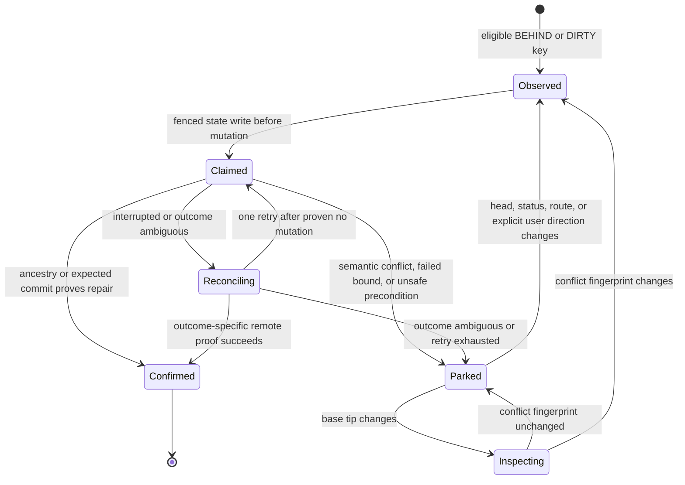
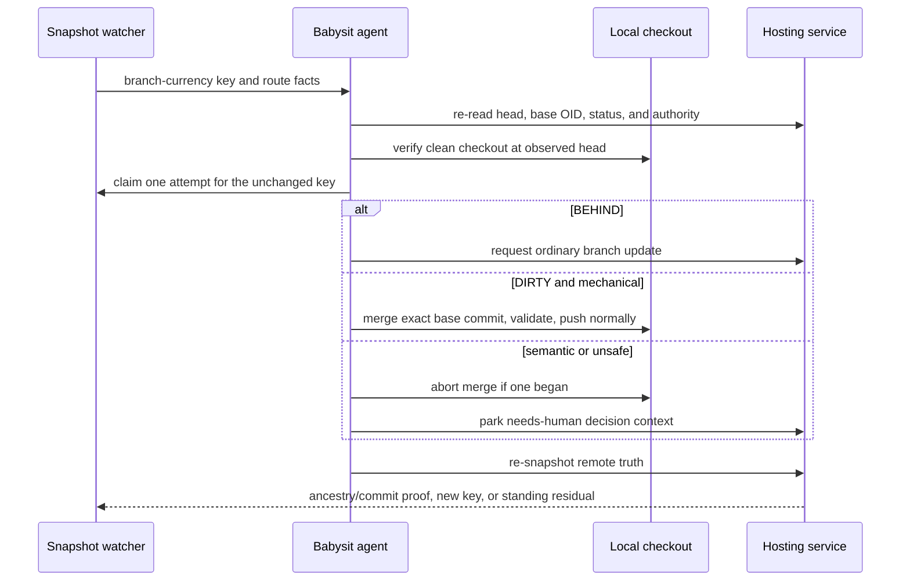
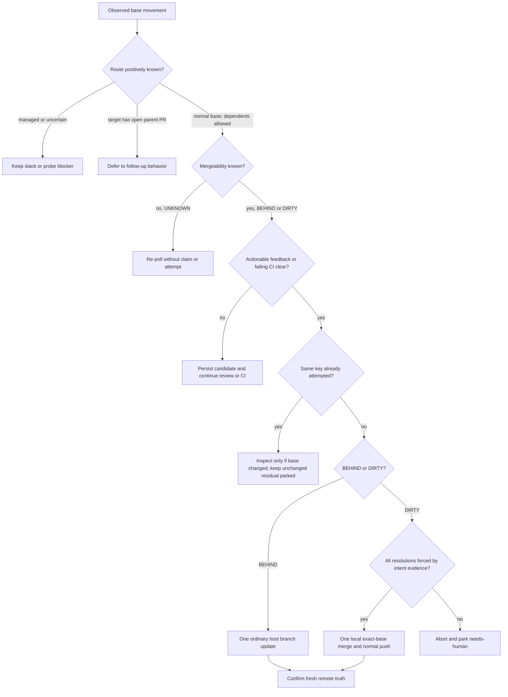

# Babysit Moving-Base Recovery - Plan

## Goal Capsule

- **Objective:** Make `ce-babysit-pr` notice and safely repair an independent PR that falls behind or conflicts with its moving base while the watch is otherwise quiet.
- **Authority hierarchy:** Preserve the PR's established intent and repository contracts; automate only convergent branch maintenance; park any resolution that would choose or discard behavior.
- **Stop conditions:** Stop automatic branch maintenance when state freshness, push authority, route classification, a clean worktree, or a mechanically determined resolution cannot be proven. A parked branch-currency item remains a merge-readiness blocker.
- **Execution profile:** Extend the deterministic snapshot/watch state machine, then tighten the skill's mutation protocol and validate both mechanical invariants and model-interpreted conflict judgment.
- **Tail ownership:** This change owns independent PRs following a normal base branch. Managed stacks remain owned by their manager, and manual dependency chains remain follow-up work.

---

## Product Contract

### Summary

`ce-babysit-pr` already permits routine base updates and mechanical conflict resolution in prose, but its deterministic watcher does not wake solely because an independent PR becomes `BEHIND` or `DIRTY`. The fix makes branch currency a first-class attention stream, bounds autonomous repair to one attempt for an unchanged remote state, and reopens work only when the head, base tip, currency status, route classification, or conflict identity materially changes, or when the user explicitly directs it to reopen. Mechanical reconciliation continues automatically; semantic choices become a durable `needs-human` residual with a concise explanation.

### Problem Frame

A long babysit session can span several merges to the target branch. Today `pr-snapshot` includes `merge_state_status` in change detection, but `_wake_reason` has no branch-currency route, so an otherwise quiet PR can remain behind or conflicted until unrelated review or CI activity wakes the agent. The existing prose also lacks durable per-state attempt bookkeeping, which makes a fresh invocation liable either to retry the same conflict indefinitely or to suppress legitimate work after the base advances again.

### Requirements

#### Detection and lifecycle

- R1. The snapshot engine exposes branch currency as a first-class attention item for a positively identified independent PR whose remote status is stably `BEHIND` or `DIRTY`; `UNKNOWN` or incomplete mergeability re-polls without creating or consuming an attempt.
- R2. Each currency observation is identified by the host-qualified base repository and ref, base-tip OID, PR head SHA, currency status, and route classification; a parked conflict also carries a semantic fingerprint of conflicted paths plus their stage blob identities, explicitly excluding the raw base-tip OID.
- R3. The watcher emits a `branch-currency` wake after actionable review feedback and failing CI are clear; passive in-progress checks do not delay a base update that will invalidate them, while managed, ambiguous, and probe-error routes never fall through to this wake.
- R4. An unchanged currency observation receives at most one autonomous head-changing repair attempt across watcher restarts. A new base tip permits non-mutating inspection, but a parked semantic conflict reopens for autonomous repair only when its conflict fingerprint, PR head, status, or route changes, or the user explicitly directs it.

#### Autonomous repair boundary

- R5. `BEHIND` uses the hosting service's ordinary branch-update operation only when updating the branch is the remaining path to merge readiness.
- R6. `DIRTY` may be repaired locally only when the exact observed base commit can be merged into a fresh, clean checkout of the observed PR head and every conflict has one answer fixed by current PR intent, tests, or an authoritative generated source.
- R7. Any conflict that selects product behavior, API or security semantics, test expectations, deliberate deletion or preservation, or another reasonably disputable intent becomes `needs-human` with decision context rather than an automatic commit.
- R8. Branch-currency maintenance never rebases, force-pushes, restructures a stack, conflates host branch-update capability with direct Git push authority, or merges the PR without separate authorization.

#### Recovery and reporting

- R9. Branch maintenance follows claim -> act -> confirm: the agent revalidates the remote key immediately before mutation and confirms success only when remote ancestry or the expected validated commit proves the intended repair landed.
- R10. The engine writes an invocation-fenced `claimed` transition before mutation. An interrupted or ambiguous claim reconciles the remote head and local merge state before deciding whether to confirm success, safely abort, park, or use the single proven-no-mutation retry.
- R11. A parked unchanged currency item does not busy-wake, remains a hard readiness blocker, and is reactivated only by a changed conflict identity, PR head, status, route, or explicit user direction; unrelated base movement may inspect but does not erase the parked decision.
- R12. Final status names the observed base-movement condition, whether automatic maintenance succeeded or was bounded, and any user decision needed to proceed.

### Acceptance Examples

| State | Expected behavior |
|---|---|
| Independent PR becomes `BEHIND` while actionable review feedback or failing CI remains | Record the currency item, finish higher-priority work, then reassess the new head/base state before any branch update. Passive in-progress checks do not delay the update. |
| Independent PR is otherwise ready and `BEHIND` | Claim the exact currency key, request one ordinary branch update, and confirm the new remote head before continuing. |
| Independent PR is `DIRTY` and both sides edit imports or generated output with one repository-determined result | Merge the exact base commit, apply the mechanically determined resolution, validate, push normally, and confirm remote truth. |
| Independent PR is `DIRTY` and both sides deliberately change the same behavior | Abort the local merge, park the item as `needs-human`, and explain the competing intents and the decision required. |
| The same parked `DIRTY` key is observed after a fresh invocation | Keep watching other streams without another automatic merge attempt. |
| The base advances after a parked conflict while the head and `DIRTY` status text remain unchanged | Preview the new conflict paths and stage blobs without mutating; keep the semantic residual parked when its fingerprint is unchanged, and reopen one attempt only when that identity materially changes. |
| A main-based PR has open child PRs but no open parent PR | Treat the target as a normal-base PR; dependents do not transfer ownership of the target's branch currency. |
| The PR is managed by a stack tool or route detection is uncertain | Preserve the existing stack/probe blocker; do not run ordinary branch maintenance. |
| GitHub reports mergeability as `UNKNOWN` while recomputing | Re-poll without a currency wake, claim, or attempt consumption. |
| `BEHIND` host-update capability is true but direct push authority is unknown | The host update path may proceed; the local `DIRTY` path remains fail-closed because the two capabilities are independent. |

### Scope Boundaries

**In scope**

- Independent PRs whose base is a normal branch, including forks only when checkout and non-force push authority are positively established.
- Deterministic snapshot facts, wake routing, durable attempt/disposition state, and interrupted-attempt reconciliation.
- Skill prose, contract tests, user-facing skill documentation, and behavioral evaluation for the mechanical-versus-semantic boundary.

### Deferred to Follow-Up Work

- Proactive branch-currency wakes for manual dependency chains, where the base is another PR and a repair can change downstream validation order.
- Manager-specific refresh or restack operations for confirmed managed stacks.
- Broader non-convergence trajectory work beyond the existing fixed invocation budget and per-currency-key attempt bound.

**Outside this change**

- Automatic semantic conflict choices, rebase, force-push, stack restructuring, or implied permission to merge.
- A fixed lifetime count of base updates; legitimate long watches may observe many distinct base generations.

---

## Planning Contract

### Key Technical Decisions

- KTD1. Treat routine branch maintenance as pre-authorized only when it preserves established intent. `(session-settled: user-directed — chosen over requiring user intervention for every base movement: routine main-branch movement should not stall a long babysit session when the reconciliation is mechanically determined.)`
- KTD2. Add branch currency as a third deterministic attention stream rather than adding more prose around `merge_state_status`. The current watcher otherwise has no event that can wake a quiet `BEHIND` or `DIRTY` PR.
- KTD3. Separate the remote observation key from a parked semantic-conflict fingerprint. The base-tip OID detects every new generation, while conflicted paths plus their stage blob identities exclude unrelated base movement and keep the same semantic decision sticky.
- KTD4. Bound automation to one accepted or begun mutation per unchanged currency observation, not a wall-clock timeout or lifetime counter. After an invocation-fenced pre-mutation claim, allow at most one retry only for a transient failure conclusively proven not to have mutated remote or local state; ambiguous outcomes reconcile without resubmission, and the existing invocation budget remains the global cost backstop.
- KTD5. Keep deterministic facts upstream and semantic judgment in the agent. The snapshot engine decides that branch currency exists and whether the route is eligible; the agent decides whether a conflict resolution is mechanically forced by evidence.
- KTD6. Limit this change to positively independent PRs. Managed stacks remain manager-owned, probe uncertainty remains blocked, and manual dependency chains are deferred because their downstream effects differ from trunk movement.
- KTD7. Make remote confirmation, not local command success, the completion signal. This preserves the repository's existing claim -> act -> confirm discipline and makes interruption recovery possible.
- KTD8. Delay branch mutation behind actionable feedback and failing CI fixes, but not passive in-progress checks that the branch update will invalidate. `BEHIND` becomes actionable when the update can unblock readiness; any intervening head movement invalidates the old currency claim.
- KTD9. Model authority per operation. `BEHIND` uses a host branch-update capability and expected-head guard; `DIRTY` requires separate positive proof that the authenticated Git route can push normally to the exact head ref. Unknown on either path fails closed only for that path.

### Assumptions

- The hosting service exposes the base ref OID for the PR; the installed GitHub CLI already accepts `baseRefOid`, and other host-specific uncertainty must fail closed.
- GitHub mergeability is asynchronous. `UNKNOWN` is observation uncertainty, never evidence that the PR is clean, behind, or conflicted.
- An explicit user request may reopen the same parked key, but an ordinary fresh invocation or unrelated base-tip change does not erase the parked semantic disposition.
- Mechanical conflict resolution is an evidence threshold, not a file-type allowlist. Lockfiles, imports, generated files, tests, and prose can each be semantic or mechanical depending on intent evidence.
- The current fixed invocation budget is sufficient as the terminal time limit. This feature does not add an arbitrary number of minutes after which branch state is called stale.

### High-Level Technical Design

The diagrams are directional. They define lifecycle and ordering, not implementation syntax.

#### Currency-item lifecycle

#### Claim, mutation, and confirmation sequence

#### Eligibility and authority decision

### Sequencing and Constraints

1. Add and migrate deterministic remote facts and currency-item state before introducing a new wake reason.
2. Add wake precedence, attempt disposition, and reactivation behavior before enabling mutation prose.
3. Tighten the runtime action protocol and conflict authority boundary against the tested state contract.
4. Update docs and run fresh-context behavioral evaluation after deterministic gates prove the engine behavior.

Pre-mutation validation must confirm the route, exact remote head and base key, correct local PR-head checkout, and clean worktree. The `BEHIND` path separately proves host branch-update capability and uses its expected-head guard. The `DIRTY` path separately proves an authenticated ordinary push route to the exact head ref; unknown authority parks that path. A local conflict preview computes the semantic fingerprint from conflicted paths and their stage blob identities before mutation, then fetches and merges the exact base-repository commit rather than assuming `origin/main`. The engine writes the exact observation as `claimed` under the existing invocation fence before either mutation. Only a transient failure conclusively proven to have changed neither remote nor local state gets one retry; an ambiguous outcome reconciles without resubmission.

---

## Implementation Units

### U1. Add remote base identity and currency-item state

- **Goal:** Give the deterministic engine enough remote facts and durable state to distinguish a stuck attempt from legitimate later base movement.
- **Requirements:** R1, R2, R4, R9, KTD2, KTD3, KTD7, KTD9.
- **Files:** `skills/ce-babysit-pr/scripts/pr-snapshot`, `tests/ce-babysit-pr-snapshot.test.ts`.
- **Approach:** Fetch and emit host-qualified base repository/ref information, the base-tip OID, mergeability certainty, and a host branch-update capability with `true`, `false`, or `unknown` outcomes. Derive a `branch_currency` record for manager-absent targets with no open parent PR and a positively identified normal base; open dependents do not make the target ineligible. Extend the invocation-fenced mark surface with explicit currency transitions carrying the exact observation key: `claimed`, `confirmed`, `needs-human`, and reopened `open`. The `needs-human` transition may attach the semantic-conflict fingerprint computed later by U3. Migrate older state conservatively so previously unseen currency remains actionable.
- **Test scenarios:** An old state file gains safe defaults; repeated `BEHIND` or `DIRTY` with the same head/base keeps one observation; `UNKNOWN` re-polls without an item or attempt; a changed base OID rekeys even when head/status are unchanged; an unchanged semantic fingerprint preserves a park; a changed head invalidates the old item; a normal-base target with dependents remains eligible; managed, open-parent, and uncertain routes do not; host branch-update capability covers positive, denied, and unknown outcomes.
- **Verification:** Snapshot fixtures expose complete base identity and stable item keys without changing existing review, CI, review-signal, or invocation-budget behavior.
- **Dependencies:** None.

### U2. Add bounded branch-currency wake and reconciliation lifecycle

- **Goal:** Wake on actionable base movement without busy loops, duplicate attempts, or stale mutation.
- **Requirements:** R3, R4, R9, R10, R11, KTD4, KTD7, KTD8.
- **Files:** `skills/ce-babysit-pr/scripts/pr-snapshot`, `tests/ce-babysit-pr-snapshot.test.ts`, `tests/ce-babysit-pr-contract.test.ts`.
- **Approach:** Add `branch-currency` after actionable review and failing CI in wake precedence, include currency residuals in readiness and blocker identity, and persist claimed, confirmed, and parked outcomes for the exact observation. The claim transition is an atomic locked-state write made before the external call or local merge starts. Re-entry into `claimed` always reconciles remote and local evidence; it never submits directly. Mark the mutation consumed only when host acceptance or local merge start is observed. A transient error with conclusive no-mutation proof may transition back for one retry after bounded backoff; every ambiguous outcome remains in reconciliation. Preserve global max-runtime precedence and invocation fencing.
- **Test scenarios:** An otherwise-ready independent `BEHIND` or `DIRTY` PR wakes; actionable review or failing CI wins precedence; passive in-progress checks do not delay an otherwise-ready `BEHIND` update; a claimed unchanged observation cannot begin two mutations; a crash after claim but before mutation reconciles as no mutation; a crash after host acceptance or local merge start cannot duplicate; a parked semantic fingerprint does not re-wake after unrelated base movement; a changed fingerprint or head reopens; a stale invocation cannot transition currency state; max-runtime prevents starting a late mutation; exactly one retry is allowed after proven no mutation; ambiguous recovery never resubmits.
- **Verification:** Deterministic watch fixtures prove exactly-once-per-key attention, standing-residual suppression, material-change reopening, and no regression in existing wake reasons.
- **Dependencies:** U1.

### U3. Tighten the runtime branch-maintenance protocol

- **Goal:** Let the awake agent autonomously converge routine base movement without gaining authority to choose intent.
- **Requirements:** R5-R10, R12, KTD1, KTD5-KTD9.
- **Files:** `skills/ce-babysit-pr/SKILL.md`, `skills/ce-babysit-pr/references/watch-loop.md`, `tests/ce-babysit-pr-contract.test.ts`.
- **Approach:** Replace the opportunistic branch-currency prose with the new item lifecycle and explicit pre-mutation checks. Define mechanical resolution through positive intent evidence and reasonable-disagreement bounds. For `BEHIND`, use the host operation only with positive branch-update capability and confirm that the resulting head contains the observed base OID and clears the current currency gate. For `DIRTY`, use a non-mutating exact-base preview to compute conflicted paths and stage blob identities, prove the separate ordinary push route to the exact head ref, merge only from a verified clean PR-head checkout, validate proportionally, push normally, and confirm the remote head equals or contains the validated merge commit. Unrelated remote movement invalidates the claim rather than confirming it. Abort local merge state and park with the semantic fingerprint plus competing-intent evidence whenever the resolution is semantic, unbounded, stale, unauthorized, or incomplete.
- **Test scenarios:** A clean behind update with host capability proceeds; host capability denied or unknown parks only that path; a mechanically forced conflict with positive direct-push proof proceeds; a conflict with two plausible behaviors parks with path/blob identity, options, and a lean; a fork with positive direct-push proof proceeds while denied or unknown proof parks; base or head movement between claim and mutation cancels the stale action; unrelated remote head movement cannot confirm repair; an interrupted local merge reconciles or aborts safely; no route rebases or force-pushes.
- **Verification:** Contract tests pin the new wake reason, ordering, exact-base and clean-checkout constraints, semantic tripwire, abort path, remote confirmation, and prohibited operations.
- **Dependencies:** U2.

### U4. Document and behaviorally evaluate the authority boundary

- **Goal:** Make the user-facing behavior clear and prove that fresh agents apply the mechanical-versus-semantic distinction consistently.
- **Requirements:** R6-R8, R11, R12.
- **Files:** `docs/skills/ce-babysit-pr.md`, `skills/ce-babysit-pr/SKILL.md`, skill-creator evaluation artifacts in OS temp.
- **Approach:** Update the skill page from a two-stream description to include branch currency, its per-observation bound, sticky semantic residuals, and cautious `needs-human` outcome. Use `skill-creator` for one fresh-context mechanically forced case and one semantic-conflict case, repeating only an ambiguous result; keep fork, stack, interruption, and moving-base lifecycle facts in deterministic tests.
- **Test scenarios:** The mechanical case auto-resolves and the semantic case parks with understandable decision context. Any false-mechanical classification fails the gate, requires tightening the authority tripwire, and must pass a fresh rerun before release; managed stacks, rebase, force-push, unauthorized merge, and residual readiness remain deterministic contract checks.
- **Verification:** Behavioral results contain zero autonomous semantic resolutions and match the deterministic state contract; user-facing docs accurately describe the new third attention stream.
- **Dependencies:** U3.

---

## Verification Contract

- **Targeted engine proof:** The `ce-babysit-pr` snapshot and contract test files cover observation identity, path/blob conflict fingerprints, `UNKNOWN` re-polling, wake precedence, pre-mutation claim fencing, migration, reactivation, crash reconciliation, stack exclusion, root PRs with dependents, host-update capability, direct-push proof outcomes, outcome-specific confirmation, the single proven-no-mutation retry, and budget expiry.
- **Full mechanical gate:** The repository's full Bun test suite passes after the targeted tests.
- **Release and plugin gates:** `release:validate` and strict plugin validation pass because runtime skill content and user-facing skill documentation change.
- **Behavioral gate:** `skill-creator` runs one fresh-context mechanically forced conflict and one semantic-conflict evaluation, repeating only ambiguous results. Zero false-mechanical classifications are allowed; any such result blocks release until the tripwire is tightened and a fresh rerun passes. The eval reads the current worktree skill source, not a session-cached installed copy.
- **Regression gate:** Existing review, CI, stale-review-signal, stack, blocked-external, merge-ready, max-runtime, and no-merge-without-authorization tests remain green.

---

## System-Wide Impact

- **Autonomy:** Babysitting gains a reliable third maintenance stream, but its authority remains narrower than product editing: it may preserve established intent, never select it.
- **State compatibility:** Persistent watcher state needs a conservative migration so current watches do not lose review/CI dispositions or falsely suppress a newly observable currency item.
- **Cross-host behavior:** Base repository identity and push authority cannot assume `origin`, GitHub.com, or a same-repository PR.
- **Cost and latency:** The watcher adds no new polling loop. Base-tip identity joins the existing snapshot, and one attempt per remote key prevents restart-driven churn.

---

## Risks & Dependencies

- **Stale host mergeability:** Hosting services can report `UNKNOWN` before and after a branch update. Detection re-polls without claiming, while confirmation tolerates bounded propagation without treating local command success as remote completion.
- **Concurrent movement:** A reviewer, user, bot, or base merge can move head or base during repair. The exact-key precondition must cancel stale work before mutation, and outcome-specific ancestry or commit proof must prevent unrelated movement from confirming success.
- **Semantic rerolls:** An active base can advance without changing a parked conflict. A non-mutating conflict fingerprint keeps the semantic disposition sticky until the disagreement itself changes.
- **False mechanical classification:** File type alone is unsafe. The behavioral gate must exercise conflicting intent evidence and reasonable disagreement, not only trivial generated-file cases.
- **Fork and remote topology:** A local `origin/main` assumption can merge the wrong commit or push to the wrong repository. The snapshot carries base-repository identity; the runtime proves host branch-update capability and direct Git push authority independently.
- **CI churn:** Updating a branch restarts checks and may restart review bots. Demand-driven `BEHIND` handling and review/CI precedence reduce unnecessary head movement.

---

## Definition of Done

- The deterministic watcher wakes on eligible independent `BEHIND` and `DIRTY` states without relying on unrelated review or CI events.
- One unchanged currency observation can cause at most one accepted or begun mutation attempt across fresh invocations; unrelated base movement does not re-roll an unchanged semantic conflict.
- Successful repair is proven by outcome-specific remote ancestry or commit evidence, while ambiguous or semantic repair is safely aborted and parked with decision context.
- Managed stacks, manual dependency chains, probe uncertainty, unproven fork authority, rebase, force-push, stack restructuring, and unauthorized merge remain outside the ordinary branch-maintenance path.
- U1-U4 satisfy their stated verification, including repeated fresh-context behavioral evaluation.
- Targeted tests, the full test suite, release validation, and strict plugin validation pass.
- Documentation matches runtime behavior, and abandoned or superseded implementation attempts are absent from the final diff.

### Per-unit completion

- **U1:** Snapshot output and persisted state carry stable remote base identity, mergeability certainty, host-update capability, and currency transitions, classify root PRs with dependents correctly, and migrate old state safely.
- **U2:** Wake, claim, reconciliation, parking, and material-change reopening are deterministic and tested.
- **U3:** Runtime prose and contract guards enforce exact-state mutation, intent-preserving autonomy, and safe abort/report behavior.
- **U4:** User docs and repeated behavioral evals demonstrate the boundary on fresh agents.

---

## Sources & Research

- `skills/ce-babysit-pr/SKILL.md` and `skills/ce-babysit-pr/references/watch-loop.md` already permit independent base updates and mechanical conflict resolution, which establishes the intended product boundary.
- `skills/ce-babysit-pr/scripts/pr-snapshot` owns remote snapshot facts, `_wake_reason`, blocker dedup, invocation fencing, and claim -> act -> confirm dispositions; it currently has no branch-currency wake and does not fetch the base OID.
- `docs/solutions/skill-design/git-workflow-skills-need-explicit-state-machines.md` requires fresh state at mutation boundaries and explicit expected failure states.
- `docs/solutions/skill-design/watch-loops-need-a-blocked-external-terminal-state.md` supports representing incomplete host facts as first-class engine state rather than prose inference.
- `docs/solutions/workflow/stale-local-base-contamination.md` supports merging a freshly resolved remote base commit rather than trusting a local branch name.
- `docs/plans/babysit-non-convergence-detection.md` distinguishes moving-base churn from non-convergence and treats counters as triggers or backstops, not verdicts.
- `skills/ce-resolve-pr-feedback/references/evaluation-rubric.md` provides the evidence and reasonable-disagreement threshold used to separate convergent fixes from intent-changing decisions.
