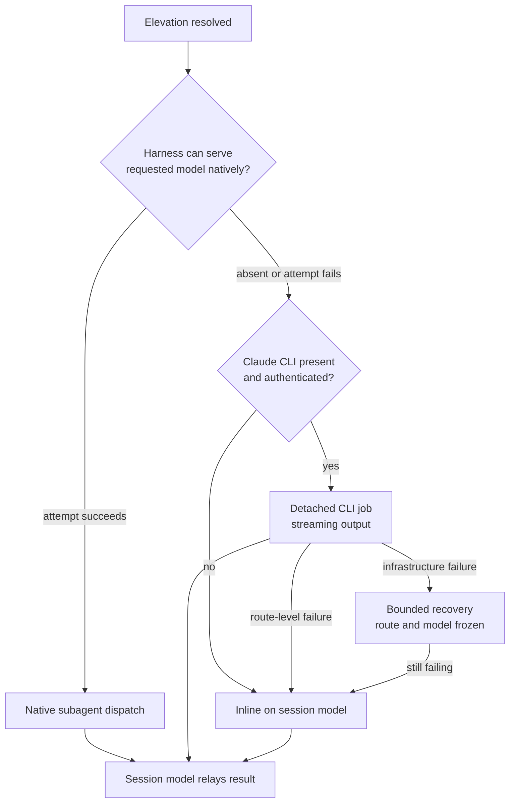
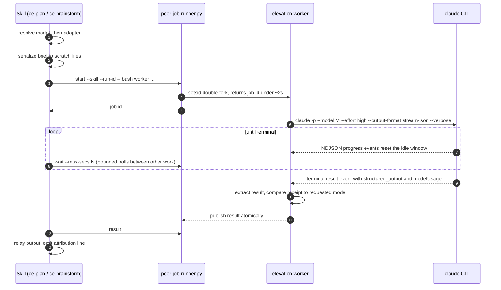

# Cross-Harness Model Elevation for Planning Skills - Plan

## Goal Capsule

- **Objective:** Let a user on any supported harness send the single reasoning-heaviest step of `ce-plan` and `ce-brainstorm` to a model their harness can reach, rather than only on Claude Code. The reachable set is whatever the host serves natively plus whatever the Claude CLI can serve.
- **Product authority:** User preference is the justification. No quality benchmark against the host harness's own top model is required, and none exists.
- **Open blockers:** Whether the cursor-agent adapter can express read access with writes and shell denied. Every other adapter has a shipped precedent (see Dependencies).

---

## Product Contract

### Summary

`ce-plan` and `ce-brainstorm` dispatch one reasoning-heavy step to a user-chosen model from any harness, where the choice is reachable through the host's native dispatch or the Claude CLI. Planning elevates the interpret-findings-and-author step; brainstorming elevates approach generation. Everything else — dialogue, research, orchestration — stays on the session model.

### Problem Frame

Elevation ships today as a Claude-Code-only feature. Its original scope note argued the problem was absent elsewhere because Codex users already sit on their harness's top model, which is included in their subscription. That reasoning establishes only that a Codex user can reach *Codex's* top model. It does not address a user who wants a specific model — Fable, say — while working in Codex or Cursor.

Two open issues ask for exactly that. Issue #1093 requests a configurable planner/advisor delegate. Issue #1115 asks for a Claude peer with an optional Fable model pin from a non-Claude host. The gap is real and user-reported.

The constraint that made this look infeasible does not hold. A local plugin invoking a CLI the user already installed and authenticated, at their direction, is that purchaser's ordinary use; the plugin never handles credentials and is never in the request path.

### Key Decisions

- **Model choice is a user preference, not a quality claim.** The feature exists so a user who wants a particular model can have it. Nothing in the design asserts one model produces better plans than another, and no comparative benchmark gates the work.

- **Never auto-select.** Elevation fires only from an explicit in-prompt request or an explicit config key. No defaults, no heuristics, no inference from task shape.

- **Config keys are named for the capability, not the model.** `plan_model` and `brainstorm_model` take a model alias as their value. A boolean named for one model cannot express a different choice and does not survive the next model.

- **Native dispatch is preferred, but capability is proven by attempt, not by self-report.** A harness that can serve the requested model itself should do so rather than shelling out to a second CLI. This repo has a documented finding that an agent's description of its own capabilities is unreliable, so the resolution order tries native first and falls through on failure. A wrong self-assessment costs one failed attempt instead of a wrong outcome. A loud failure and a receipt naming a different model family both trigger fallthrough; a run with no receipt at all proceeds and is reported as unverified rather than blocked.

- **The elevated call verifies its brief rather than trusting it.** It gets repo read access and more than one turn on both adapters. A single stateless call with a fixed packet forecloses the behavior that makes a high-reasoning model worth dispatching: catching that the brief itself is wrong.

- **A progress-reset idle window is the primary supervision signal; the wall-clock cap becomes a backstop.** A cap long enough for the slowest legitimate run cannot detect a stall early, so the idle window carries detection. The cap is raised rather than removed, because the two guard different failures: the idle window catches a stalled model, the cap catches a failed idle detector. This requires a streaming output format, since a buffered one makes a healthy run and a wedged one byte-identical.

- **Recovery never substitutes a model.** Prose recovery is allowed for dispatch-infrastructure failure with the route and model frozen. Silently completing on a different model would produce a plan the user believes came from their chosen model.

### Requirements

**Activation and configuration**

- R1. `plan_model` and `brainstorm_model` are read from the shared local config and take a model alias as their value.
- R2. An in-prompt model request overrides the config value for that run, including selecting a different model than the one configured.
- R3. Elevation does not fire without an explicit in-prompt request or an explicit config key.
- R4. In pipeline runs there is no prompt, so resolution is config-only.
- R5. `plan_use_fable`, `brainstorm_use_fable`, and `fable_nudge` stop resolving. The setup health check reports a present old key as removed and, where one exists, names its replacement.

**Dispatch**

- R6. The skill resolves an adapter in a fixed order: native in-harness dispatch, then the Claude CLI, then inline on the session model. A native dispatch whose serving-side receipt names a different model family than the one requested falls through to the next adapter; an absent receipt is recorded as unverified and does not fall through.
- R7. The elevated call receives repo read access and may take multiple turns on every adapter. Write and shell access are denied by CLI flags on the Claude CLI route, and by instruction on the native route, where the subagent primitive exposes a model override but no per-dispatch tool restriction.
- R8. The elevated call receives its working context as file paths it reads itself, never as a re-narrated prose summary.
- R9. Off-host dispatch runs as a detached job. No tool call spans the elevated call's runtime.
- R10. Only the named step is elevated. Dialogue, research, and orchestration remain on the session model, and the session model relays the result.
- R20. Context handed to the elevated call under R8 — repo files and scratch research or dialogue files — is framed as untrusted data the elevated model must not treat as instructions, and the session model validates the returned output before folding it into the run under R10.

**Supervision and failure handling**

- R11. A progress-reset idle window is the primary supervision signal for the elevated call. The reused job runner's wall-clock cap is raised to a bound well above any legitimate run so it never fires in normal operation and serves only as a backstop against a failed idle detector.
- R12. The off-host call uses a streaming output format so the idle window observes genuine progress.
- R13. A dispatch-infrastructure failure earns a bounded recovery attempt with the route and model frozen.
- R14. A route-level failure degrades to the session model without retry.
- R15. Every failure path produces a plan. Elevation is never a correctness dependency.
- R21. Each of the job runner's terminal states maps to exactly one recovery class: never-started and unreadable are dispatch-infrastructure; timeout and exit-zero-without-result are route-level; a byte-cap or supervisor kill of a job that had emitted progress is dispatch-infrastructure.
- R22. The runner's output byte cap is raised or made non-fatal on the streaming route, so a healthy high-volume run is not reaped as a failure.

**Transparency**

- R16. When elevation fires, the run surfaces one line naming the model, the route, and why it fired — configured key or explicit request. The line names the model as served when a receipt confirms it, and otherwise as requested with an explicit unverified marker, on every route including native.
- R17. The transparency line is suppressed when elevation did not fire, and when the session model already is the model a configured key requested. An explicit in-prompt request always produces a line, including when the session model already matches.
- R18. When elevation was requested but unavailable, the run says the step ran on the session model instead, names which precondition was unmet — no native support, CLI absent, or CLI not authenticated — and states what would make the requested model reachable.

**Documentation**

- R19. The configuration documentation states that setting either key causes every harness the user runs these skills in to attempt the configured model.

### Key Flows

- F1. Configured elevation on a native-capable harness
  - **Trigger:** User runs `ce-plan` with `plan_model` set and no model mention in the prompt.
  - **Steps:** Skill resolves the model from config; attempts native dispatch with a model override; native dispatch succeeds; the elevated step runs with repo read access; the session model relays the result and continues.
  - **Outcome:** Plan authored by the configured model, one transparency line naming model, route, and the config key.
  - **Covered by:** R1, R3, R6, R7, R10, R16

- F2. In-prompt elevation on a harness without native support
  - **Trigger:** User asks for a specific model in the prompt on a harness that cannot serve it.
  - **Steps:** In-prompt intent resolves the model and overrides any config value; native dispatch is attempted and fails; the Claude CLI adapter starts a detached job; the orchestrator polls; the result folds back into the run.
  - **Outcome:** Plan authored by the requested model over the CLI route, transparency line naming the CLI route.
  - **Covered by:** R2, R6, R8, R9, R11, R12, R16

- F3. Requested but unreachable
  - **Trigger:** Elevation resolves, but no adapter can serve the model — CLI absent, not authenticated, or dispatch fails at route level.
  - **Steps:** Adapter resolution exhausts; the step runs inline on the session model.
  - **Outcome:** Plan authored on the session model, one line stating elevation was unavailable.
  - **Covered by:** R6, R14, R15, R18

### Acceptance Examples

- AE1. Prompt overrides config to a different model
  - **Covers R2.**
  - **Given** `plan_model` is set to one model,
  - **When** the user names a different model in the prompt,
  - **Then** the run elevates to the model named in the prompt.

- AE2. Subject-matter mention is not activation
  - **Covers R3.**
  - **Given** no config key is set,
  - **When** the prompt asks to design a feature whose subject happens to be a model name,
  - **Then** no elevation fires and no transparency line appears.

- AE3. Copied config on a harness with no reachable adapter
  - **Covers R6, R15, R18.**
  - **Given** a config key is set and neither a native path nor an authenticated CLI is available,
  - **When** the skill reaches the elevated step,
  - **Then** the step runs on the session model, the run completes, and one line states elevation was unavailable.

- AE4. Long productive run is not reaped
  - **Covers R11, R12, R22.**
  - **Given** an off-host elevated call that runs well past the job runner's previous default cap while continuing to emit progress events,
  - **When** the supervisor evaluates it,
  - **Then** the job continues to completion, and neither the idle window nor the output byte cap terminates it.

- AE5. Recovery does not change the model
  - **Covers R13.**
  - **Given** a dispatch-infrastructure failure before any job started,
  - **When** the recovery attempt runs,
  - **Then** it targets the same route and model, and a further failure degrades to the session model rather than to a substitute model.

- AE6. Session model already is the requested model
  - **Covers R17.**
  - **Given** the session already runs on the requested model,
  - **When** elevation resolves,
  - **Then** no dispatch occurs and no transparency line appears.

### Scope Boundaries

- Grok host support (issue #1115) is a separate issue-linked plan that follows this one.
- Cost or usage-credit disclosure is out. Users choose their model; the plugin does not narrate billing.
- The `ce-brainstorm` integration-check consult stays unwired, as in the current design.
- Implementation delegation (issue #1093) is out. This plan covers the planning and brainstorming reasoning step only.

### Dependencies / Assumptions

- Repo read access with writes and shell denied is already demonstrated on the claude, codex, and grok-cli peer adapters in `skills/ce-code-review/scripts/cross-model-adversarial-review.sh`, which keeps Read deliberately and denies mutators and shell. Wholesale tool stripping is `ce-doc-review`'s route, not peer routes generally.
- The off-host adapter reuses the existing detached job runner rather than introducing a new lifecycle mechanism.
- The Claude CLI's streaming output format composes with schema-constrained output, verified during brainstorming on version 2.1.215.
- Buffering behavior is a per-CLI implementation detail, not a stable contract. See `docs/solutions/skill-design/cli-output-buffering-for-progress-detection.md`.
- Effort tier for the elevated call stays at the level the existing peer route uses.

### Outstanding Questions

**Resolve before planning**

- Can the cursor-agent adapter express repo read access with write and shell denied? The claude, codex, and grok-cli routes already demonstrate the shape; cursor-agent is the one adapter where it is unproven.

**Deferred to planning**

- Whether the off-host worker is a bundled script per skill or a thinner invocation, given the no-cross-skill-import rule makes every shared file a duplicated, parity-tested copy.
- How the existing model-leak parity test is retargeted. Model names still need not appear in always-loaded skill bodies, so the test likely narrows rather than disappears.
- Whether the served-model receipt survives on the terminal event of a streamed response. If it does not, transparency and stall detection conflict and the trade-off returns to the user.
- Which harnesses can serve models natively today. The resolution order does not enumerate them, so this affects documentation rather than the contract.

### Sources / Research

- `skills/ce-plan/references/reasoning-elevation.md` and its byte-identical copy under `skills/ce-brainstorm/` — the current elevation engine, its host gate, and the file-handoff rule.
- `skills/ce-code-review/scripts/cross-model-adversarial-review.sh` — peer route argv construction, the served-model receipt, and the two supervision paths.
- `skills/ce-code-review/scripts/peer-job-runner.py` — detached job lifecycle, idle and byte caps.
- `docs/solutions/skill-design/cli-output-buffering-for-progress-detection.md` — why a streaming format is required for progress detection.
- `docs/solutions/skill-design/detached-job-lifecycle-for-delegated-work.md` — why delegated work must outlive a harness tool call.
- `docs/solutions/skill-design/cross-harness-cross-model-tool-invocation.md` — why capability is settled by execution rather than self-report.
- `docs/solutions/skill-design/dispatch-script-failure-degrade-outcome-not-boundary.md` — the recoverable-versus-terminal failure split.
- `docs/plans/2026-07-09-002-feat-claude-code-fable-elevation-plan.md` — the original Claude-Code-only scope and its stated rationale.
- Issues #1093 and #1115 — the user-reported demand for model choice across harnesses.

---

## Planning Contract

**Product Contract preservation:** unchanged. All R/F/AE IDs and text carried forward as written.

### Key Technical Decisions

- KTD1. **The host gate inverts from suppression to adapter selection.** The shipped engine gates on host *before* reading config so no model string reaches a non-Claude harness. That property is now unwanted: the prose must load everywhere and the gate's only job is choosing an adapter. This is a rewrite of `references/reasoning-elevation.md`'s opening contract, not an extension of it.

- KTD2. **A thin bundled worker per skill, driven by the existing job runner.** `peer-job-runner.py` execs an arbitrary worker argv, so it is reused unchanged. The elevation worker keeps only the generic half of the review worker — traps, heartbeat kernel, reap, the **`run_codex_cmd` `$PEERLOG` byte-growth idle loop**, receipt extraction, bounded failure evidence — and drops persona briefs, diff embedding, findings schema, and multi-provider selection. The worker retains `run_codex_cmd`, not `run_timeout_cmd`: it is the only supervision function that resets an idle window on model progress, which is what R11 designates the primary signal. `run_timeout_cmd` enforces only the hard ceiling and would leave a wedged run unsupervised until that cap. Keeping `run_codex_cmd` also means the shared heartbeat-parity regex, whose lookahead expects that function, needs no change (see U5). Estimated ~200 lines against the review worker's 737. Rejected: constructing argv in skill prose with no bundled worker, which has no precedent here and returns the fallback ladder to model-executed text.

- KTD3. **The off-host call streams.** `--output-format stream-json --verbose` is required, because `--output-format json` writes nothing until completion and makes a healthy long run byte-identical to a wedged one. `--verbose` is mandatory under `--print` or the invocation exits 1. Verified this session: `--json-schema` composes with `stream-json`, and `modelUsage` is present on the terminal `{"type":"result"}` event, so the served-model receipt R16 depends on survives the streaming path.

- KTD4. **Model choice is a free-form string, validated by outcome rather than by an allowlist.** Maintaining a list of servable model ids goes stale every time a provider ships or renames one. R16 and R18 make the actual outcome visible per run instead. Note `validate_model_override`'s existing pattern `claude:claude-*` matches a full id like `claude-fable-5` but not a bare alias.

- KTD5. **`fable_nudge` is removed, not renamed.** Its purpose was discoverability for a Claude-Code-only feature. With model choice now a documented cross-harness key, a shown-once nudge plus its per-user marker file is carrying cost for a solved problem.

- KTD6. **The existing no-model-name assertion is kept and re-labeled for what it checks.** It searches SKILL.md for one specific legacy model token; its real guarantee is that that legacy name has not returned to an always-loaded body. Its comment is rewritten to state exactly that, and to drop the old off-host-suppression rationale so the next reader does not restore the removed gate to satisfy it. It is **not** described as a general model-agnosticism guard — a single-token search cannot verify that claim, and a common word contains the token, so the check is documented as the narrow legacy-name guard it is.

### High-Level Technical Design

Off-host dispatch lifecycle. The orchestrator never holds a tool call open for the model's runtime.

### Assumptions

- The Claude CLI is the only off-host adapter in this plan. Widening to the other peer routes is a follow-up.
- `peer-job-runner.py` is reused byte-identical; no changes to its supervision logic beyond the env-var settings each caller passes.
- Native dispatch cannot express a per-dispatch tool restriction on any harness in the repo today, so R7's write and shell denial is instruction-level there (already reflected in R7).

### Sequencing

U1 establishes the config surface every other unit reads. U3 builds the worker and must precede U2, which consumes its receipt and terminal-state surfaces. U2 rewrites the engine and is the largest behavioral change. U4, U5, and U6 depend on the surfaces U1-U3 create.

---

## Implementation Units

### U1. Config surface: new keys in, old keys out

- **Goal:** `plan_model` and `brainstorm_model` become the documented configuration surface; `plan_use_fable`, `brainstorm_use_fable`, and `fable_nudge` are removed.
- **Requirements:** R1, R4, R5, R19
- **Dependencies:** none
- **Files:** `skills/ce-setup/references/config-template.yaml`, `.compound-engineering/config.local.example.yaml`, `tests/skills/ce-setup-check-health.test.ts`
- **Approach:** Replace the three commented fable keys with two model-valued keys. The comment must disambiguate that the key selects the model for the heavy authoring step only, and state the cross-harness consequence R19 requires. The template and the committed example are compared by whole-file `diff` in `check-health`, so they must stay byte-identical.
- **Patterns to follow:** the existing commented-key style in `config-template.yaml`; `cross_model_peer` as the precedent for a symbolic, model-valued key.
- **Test scenarios:**
  - Template and committed example remain byte-identical, so `check-health`'s `example_cfg` diff stays clean.
  - Template contains `plan_model` and `brainstorm_model`.
  - Template contains none of `plan_use_fable`, `brainstorm_use_fable`, `fable_nudge` — mirroring the existing `not.toContain("work_delegate_")` retirement assertion.
- **Verification:** `bun test` passes and the retirement assertions fail if any old key is reintroduced.

### U2. Rewrite the elevation engine

- **Goal:** `references/reasoning-elevation.md` becomes a host-independent activation contract with adapter selection, replacing the Claude-gated suppression contract.
- **Requirements:** R2, R3, R6, R7, R8, R10, R13, R14, R15, R16, R17, R18, R20
- **Dependencies:** U1, U3 — the engine's receipt handling and recovery-class routing consume surfaces the worker defines, so U3 lands first
- **Files:** `skills/ce-plan/references/reasoning-elevation.md`, `skills/ce-brainstorm/references/reasoning-elevation.md`, `skills/ce-plan/SKILL.md`, `skills/ce-brainstorm/SKILL.md`
- **Approach:** Activation resolution (prompt intent, then config, then pipeline config-only) moves ahead of the host check and runs on every harness. The host check becomes adapter selection. Add the untrusted-data framing for handed-over context (R20), the receipt rule on native dispatch (R6), the per-adapter denial strengths (R7), and the three transparency behaviors (R16, R17, R18). The engine consumes the worker's recovery-class routing (R21, owned and tested in U3) rather than redefining it. The two copies stay byte-identical. The SKILL.md hook lines lose their Claude-only framing and their env-var naming, which also removes the looser-outer-gate defect. **Remove the existing "if a prompt names an unrecognized model, proceed on the session model without comment" clause** — R18 now governs that case and requires the run to state which precondition was unmet; leaving the silent-proceed clause in place would contradict R18.
- **Execution note:** the two copies are parity-tested; edit one and copy rather than hand-editing both.
- **Patterns to follow:** `ce-code-review/references/cross-model-review.md` for announce-line construction and route-versus-model vocabulary.
- **Test scenarios:**
  - Covers AE1. A prompt naming a different model than the configured key resolves to the prompt's model.
  - Covers AE2. A model name appearing as subject matter does not activate elevation.
  - Covers AE3. With a config key set and no adapter available, the run completes on the session model and states elevation was unavailable.
  - Covers AE6. When the session model already matches a configured key, no dispatch and no attribution line occur.
  - The two reference copies remain byte-identical.
  - Neither SKILL.md contains a hardcoded model name.
- **Verification:** parity tests pass; a skill-prose contract test asserts the greppable activation-precedence and adapter-order tokens are present.

### U3. Elevation worker and job-runner copies

- **Goal:** a bundled worker per skill that runs the off-host call as a detached job and returns a validated result.
- **Requirements:** R9, R11, R12, R21, R22
- **Dependencies:** U1
- **Files:** `skills/ce-plan/scripts/elevation-dispatch.sh`, `skills/ce-brainstorm/scripts/elevation-dispatch.sh`, `skills/ce-plan/scripts/peer-job-runner.py`, `skills/ce-brainstorm/scripts/peer-job-runner.py`
- **Approach:** Copy `peer-job-runner.py` byte-identical. The worker keeps the generic half of `cross-model-adversarial-review.sh` — traps, `log`/`skip`, the heartbeat kernel, `reap`/`on_term`, **`run_codex_cmd`** (the `$PEERLOG` byte-growth idle loop, not `run_timeout_cmd`), `bounded_failure_evidence` — and adds a single-route argv builder, receipt extraction against the terminal event's `modelUsage`, and result extraction from the last NDJSON line. The retained idle loop is what implements R11's primary supervision signal; `run_timeout_cmd` (hard cap only) would leave a stalled run undetected. Note the heartbeat writes to the script's stderr, not `$PEERLOG`, so it keeps the outer job-runner idle window satisfied without masking the worker's own `$PEERLOG` idle detection. Callers pass a raised `CE_PEER_HARD_SECS` per R11 and a raised or non-fatal `CE_PEER_LOG_MAX_BYTES` per R22. Include an `--emit-adapter` style hook so argv is testable without a model call.
- **Execution note:** the heartbeat block is byte-parity-tested across workers; copy it verbatim rather than paraphrasing.
- **Patterns to follow:** `cross-model-adversarial-review.sh:447-476` (heartbeat), `:478-510` (`run_codex_cmd` idle loop), `:154-183` (receipt extraction), `:247-258` (`--emit-adapter` hook).
- **Test scenarios:**
  - The emitted argv contains `--output-format stream-json`, `--verbose`, `--model`, and `--effort`, and contains none of the write-enabling flags.
  - A stub worker that emits progress then a terminal result publishes a result and reaches a terminal state.
  - A stub worker that emits nothing to `$PEERLOG` past the idle window is reaped and classified.
  - A stub worker that emits only heartbeat lines to stderr but nothing to `$PEERLOG` is still reaped by the worker's own idle window — the heartbeat does not mask a stalled model.
  - Covers AE4. A stub that keeps growing `$PEERLOG` past the previous default hard cap is not reaped by either the wall-clock or byte-cap reaper.
  - Covers AE5. A dispatch-infrastructure failure before any job id yields a recovery attempt with the same route and model; a further failure degrades to the session model.
  - Recovery-class mapping (R21): a `never-started` and an `unreadable` outcome each route to a bounded recovery attempt; a `timeout` and an `exit-zero-without-result` each route to degrade-without-retry; a byte-cap or supervisor kill of a job that had already grown `$PEERLOG` routes to recovery.
  - A receipt naming a different model family is surfaced as a mismatch; an absent receipt is surfaced as unverified.
- **Verification:** worker tests run against stub binaries on a sandboxed PATH; no live model call in CI.

### U4. Key-aware retired-key reporting in check-health

- **Goal:** `check-health` reports a present removed key and names its replacement.
- **Requirements:** R5
- **Dependencies:** U1, U2 — landing the removal warning before the engine reads the new keys would tell users their key is gone while nothing yet honors its replacement
- **Files:** `skills/ce-setup/scripts/check-health`, `tests/skills/ce-setup-check-health.test.ts`
- **Approach:** `check-health` performs only file-level checks today and never parses the config body. Add the first key-aware check: scan active (non-commented) keys in the user's `config.local.yaml` for the three removed names and emit a `warn` naming the replacement. Keep it a warning, not an error — a stale key is not a broken install.
- **Patterns to follow:** the existing `warn()` helper and the `legacy_cfg` check's detect-then-report split.
- **Test scenarios:**
  - A temp repo whose config sets `plan_use_fable: true` produces a warning naming `plan_model`.
  - A commented `# plan_use_fable: true` produces no warning.
  - A config with only the new keys produces no warning.
  - A missing config file produces no warning and no error.
- **Verification:** the script is executed against temp repos, following the existing check-health test harness.

### U5. Parity and contract test updates

- **Goal:** the parity guards cover the new files and the re-purposed assertion.
- **Requirements:** R7, R16
- **Dependencies:** U2, U3
- **Files:** `tests/peer-job-runner-parity.test.ts`, `tests/reasoning-elevation-parity.test.ts`
- **Approach:** Add `ce-plan` and `ce-brainstorm` to the runner-parity consumer list and the new workers to the heartbeat-parity list. The heartbeat extraction regex ends with a lookahead on `run_codex_cmd()`; because the elevation worker retains that function (U3, KTD2), the shared regex needs no change and keeps comparing the full heartbeat block — including teardown — across all five copies. Rewrite the model-name assertion's comment to state its actual guarantee (the legacy name has not returned to an always-loaded body), dropping the off-host-suppression rationale.
- **Test scenarios:**
  - All five `peer-job-runner.py` copies are byte-identical.
  - All five heartbeat kernels are byte-identical under the relaxed regex.
  - Both `reasoning-elevation.md` copies are byte-identical.
  - Neither planning SKILL.md contains a hardcoded model name.
- **Verification:** `bun test` passes; deliberately perturbing one copy fails the relevant assertion.

### U6. Documentation

- **Goal:** the user-facing docs describe model choice and its cross-harness consequence.
- **Requirements:** R19
- **Dependencies:** U1, U2
- **Files:** `docs/skills/ce-plan.md`, `docs/skills/ce-brainstorm.md`, `README.md`
- **Approach:** Replace the Claude-Code-only framing with the two keys, the prompt override, and a prominent statement that a configured key is attempted in every harness the user runs these skills in. Remove the nudge documentation.
- **Test scenarios:** `Test expectation: none -- documentation-only unit with no behavioral change.`
- **Verification:** `bun run release:validate` stays in sync; no skill added or removed.

---

## Verification Contract

| Gate | Command | Applies to | Done signal |
|---|---|---|---|
| Test suite | `bun test` | U1-U6 | All pass, including new parity and worker tests |
| Release metadata | `bun run release:validate` | U1, U6 | In sync |
| Plugin schema | `bun run plugin:validate` | U2 | Strict marketplace and plugin validation pass |
| Behavioral eval | `skill-creator` eval on both skills | U2 | Activation, override, negative-intent, and unavailable-adapter cases behave as specified on Claude Code and on Codex |

Behavioral changes to skill prose cannot be proven by `bun test` — the plugin caches skill definitions at session start, so use `skill-creator` rather than in-session skill invocation.

---

## Definition of Done

- A user on Codex or Cursor with `plan_model` set gets that model for plan authoring, or a clear statement of which precondition was unmet.
- A user on Claude Code sees no behavior change unless they set a key or name a model in the prompt, with one intended exception: a user whose only configuration is a removed key loses elevation until they migrate, and the health check tells them so.
- An in-prompt model request overrides a configured key, including to a different model.
- Elevation never fires without an explicit key or prompt request.
- Every failure path completes the run on the session model with a stated reason.
- A run reports which model was requested and, when a receipt exists, which model served.
- The removed keys produce a health-check warning naming their replacement.
- `bun test`, `bun run release:validate`, and `bun run plugin:validate` pass.
