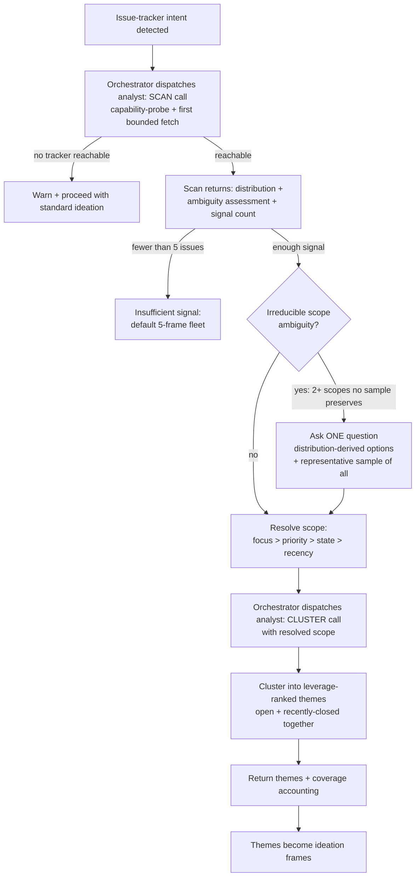

# Cross-Tracker Issue Ideation - Plan

## Goal Capsule

- **Objective:** Generalize `ce-ideate`'s issue-tracker lens from GitHub-only to any tracker (GitHub, Linear, Jira), and add a scoping approach that keeps large trackers clusterable without interrupting the user unless the tracker is genuinely ambiguous.
- **Product authority:** User (Trevin), via a `ce-pov` verdict the user routed and accepted, then refined across dialogue and two `oracle` cross-model rounds.
- **Open blockers:** None blocking planning. Jira is covered at the prose floor but has not been exercised against a live instance (see Scope Boundaries).

## Product Contract

### Summary

Refactor the issue-intelligence lens into a tracker-agnostic clustering core fed by a capability-probe fetch layer, and give the agent a goal-plus-floor for scoping — surface the highest-leverage systemic issue classes over a deliberately varied, non-exhaustive slice — rather than a deterministic fetch-and-cap algorithm. Add one optional scoping question that fires only on irreducible ambiguity, and make coverage disclosure a hard invariant.

### Problem Frame

The lens today only ingests GitHub issues (`gh` / GitHub MCP), yet `ce-ideate`'s own docs advertise a Linear example with no ingestion path (flagged in PR #1188 review). Beyond the missing trackers, real trackers are large and unevenly curated: a live Linear workspace pulled during this brainstorm returned 216+ open issues (`hasMore: true`) with 44% carrying no priority at all, spread across Backlog/Triage/Ready/In-Review states. The existing GitHub path caps at ~100 open, priority-labels-first, and never discloses what it left out — so on a tracker like that it silently clusters a priority-biased slice and presents the themes as if they were the whole picture. That bias then propagates: issue themes become ideation frames, so a skewed sample skews the ideas.

### Key Decisions

- **Structural scoping funnel over a minimal priority-first cap** (session-settled: user-approved — chosen over "generalize the fetch adapter only, keep ~100-cap priority-first for all trackers": priority-first ranking biases themes on trackers where priority is largely unset, as the live Linear data shows).
- **Goal + floor over a deterministic algorithm** (session-settled: user-directed — chosen over hand-authored per-tracker normalization tables: the value of the lens is a smart agent reading the tracker's real states/labels at runtime; over-determinizing is brittle and throws that away). Determinism is reserved for genuine invariants (coverage accounting, read-only, single-tracker-per-run).
- **North star is highest-leverage classes, not largest** (session-settled: user-approved — chosen over "largest systemic classes" via an `oracle` round: leverage = prevalence + severity + recurrence/worsening + breadth; a small class that keeps reopening beats a big class of cosmetic dupes).
- **The one question fires only on irreducible ambiguity** (session-settled: user-directed — chosen over "ask on any overflow" and "never ask": most large trackers auto-scope silently; the question is reserved for genuinely split scopes a varied sample can't preserve).
- **Closed issues are recurrence AND momentum signal** (session-settled: user-directed — broadened from "recurrence only": a class being actively closed may be self-resolving, lowering its leverage, or churning-and-reopening, raising it).
- **Saturation is defined across deliberately varied slices** (session-settled: user-approved — chosen over "themes stop changing within one sample stream" via an `oracle` round: naive saturation self-confirms if the next batch comes from the same recent/best-labeled corner).

### Requirements

**Tracker adapter**

- R1. The issue-intelligence lens splits into a tracker-agnostic clustering core (open-first, closed-as-signal, 3-8 systemic themes, counts-from-real-data accuracy) and a capability-probe fetch layer covering GitHub, Linear, and Jira, described as capability *categories* (e.g. "the tracker's CLI or MCP"), never hardcoded binaries.
- R2. The lens auto-detects the available tracker access method at runtime; it operates on one tracker per run and is read-only (never writes labels, comments, or status back).
- R3. When no tracker access method is reachable, the lens degrades — warns and proceeds with standard (non-issue) ideation — and never hard-errors or dead-ends the run.

**Two-axis state model**

- R4. The lifecycle axis (open vs closed) is treated as native on every tracker (GitHub `state`/`state_reason`; Linear `type` completed/canceled; Jira `statusCategory` Done + resolution).
- R5. The workflow-state axis is treated as asymmetric: first-class and typed on Linear/Jira (`type` / `statusCategory`), but label-inferred and optional on GitHub, degrading to priority + recency when GitHub carries no workflow labels. The agent maps the tracker's actual states/labels to live-demand-vs-noise at runtime using the real state list — the skill gives orienting prose (drop duplicate/canceled; weight triage/backlog/ready as live demand), not a fixed per-tracker enum.
- R6. The lens reads open and recently-closed issues together. Open issues define the active classes; recent closes contribute two signals — recurrence (same class open and closed = keeps coming back) and momentum (active closing = self-resolving or fragile-and-churning). Closed-only classes do not mint primary themes, though the agent may note a heavily-churned-then-quieted area as context.

**Scoping goal and funnel**

- R7. The lens's stated goal is to surface the highest-leverage systemic classes of issues — where a focused investment resolves a whole category of pain at once — with enough texture to ideate on them. Leverage means prevalence + severity + recurrence/worsening + breadth, not sheer class size.
- R8. Scoping composes signals in order — focus hint, then priority (when populated), then workflow-state, then recency — to assemble a working set. The working-set ceiling is bounded by the clustering payload/evidence budget as well as ticket count; there is no separate universal count-probe step and no fixed 100-150 threshold.
- R9. Coverage is deliberately non-exhaustive over eligible issues and works over a slice deliberately varied across the tracker's strata. Depth is judged by saturation across those varied slices — stop when the leading theme structure holds up after probing materially different strata, and when there is enough texture to ideate — expressed as prose direction for agent judgment, not a scoring formula.
- R10. When the run analyzes "everything," it uses stratified sampling across state / priority / recency bands with a minimum-per-stratum floor, not recency-only sampling.

**The one scoping question**

- R11. The lens asks at most one optional interactive scoping question, fired only on irreducible ambiguity (two or more coherent, materially-different scopes that no single varied sample preserves within budget). Its options are derived from the actual distribution and always include "analyze a representative sample of everything" so the user can decline to narrow. It respects `ce-ideate`'s low-question grain (≤3 questions total; "Surprise me" always available).
- R12. The skill prose explicitly frames this question as a grounding / subject-scoping question (structurally like `ce-ideate` Phase 0.2's subject gate), distinct from the forbidden Phase 0.4 solution-constraint questions.

**Coverage accounting (the deterministic invariant)**

- R13. Every issue-lens run discloses coverage as distinct fields — fetched / eligible / analyzed / excluded (with reason) / unknown-remainder — carried in the output contract, not the goal prose. When only a lower bound is known (e.g. Linear `hasMore: true`, or a pagination cap), it states `>N` and labels theme counts as "of the analyzed set," never as the whole tracker.

**Skill-body and docs updates**

- R14. `docs/skills/ce-ideate.md` is corrected so no example implies unsupported ingestion: the Linear example and the GitHub-only phrasing become cross-tracker-per-capability (resolves the PR #1188 review).
- R15. The Phase 0.6 cost-transparency line and any issue-tracker phrasing in the `ce-ideate` skill body are reworded tracker-agnostic; the `divergent-ideation` issue-tracker frame counts are revisited and changed only if the new flow requires it.

### Acceptance Examples

- AE1. **Covers R11, R13.** **Given** a tracker with 216+ open issues split roughly evenly across three large active projects that a single varied sample can't fairly represent, **when** the issue lens runs with no focus hint, **then** it asks exactly one question offering the three project slices plus "representative sample of everything," and whatever the user picks, the report discloses fetched/eligible/analyzed/excluded/unknown-remainder.
- AE2. **Covers R11.** **Given** a large tracker whose issues are dominated by one clear systemic class, **when** the issue lens runs, **then** it auto-scopes silently and asks no question.
- AE3. **Covers R3.** **Given** a repo with no reachable tracker access method, **when** issue-tracker intent is detected, **then** the lens warns that issue analysis is unavailable and continues with standard ideation rather than aborting.
- AE4. **Covers R6.** **Given** a class with many open issues and a burst of recent closes on the same theme, **when** themes are ranked, **then** the recurrence/churn raises its leverage; **given** a class whose issues are being closed faster than new ones open, **then** its leverage is lowered as self-resolving.
- AE5. **Covers R13.** **Given** a Linear fetch that returns `hasMore: true`, **when** the report states volume, **then** it reports `>N` open rather than an exact count and does not present theme counts as tracker-wide.

### Scope Boundaries

- Jira rides the same prose floor as GitHub and Linear but has not been exercised against a live instance; v1 verifies GitHub and Linear against real surfaces (`gh`, `orca linear`) and notes Jira as floor-only. Full Jira validation is deferred, not excluded.
- No aggregating multiple trackers in one run (single tracker per run).
- No writing back to the tracker (read-only).
- No new config key for tracker selection — access is auto-detected.
- The clustering methodology itself (themes-not-tickets, 3-8 theme target, recurrence interpretation) is retained, not redesigned.

### Outstanding Questions

Deferred to planning:

- Whether GitHub workflow-state should optionally read a GitHub Projects v2 Status field when a repo clearly uses one, or stay labels-only for v1.
- Where the adapter seam physically lives relative to the current single `issue-intelligence-analyst.md` persona (one persona with a tracker-detection preamble vs. a thin per-tracker fetch section) — an authoring decision, not a product one.
- Exact wording of the coverage-disclosure fields in the report contract.

### Sources / Research

- `skills/ce-ideate/references/agents/issue-intelligence-analyst.md` — current GitHub-only analyst; the clustering core, closed-as-recurrence logic, and accuracy rules to retain.
- `skills/ce-ideate/references/divergent-ideation.md` — issue-tracker frame override (4 frames) that consumes the themes.
- `skills/ce-ideate/SKILL.md` — Phase 0.2/0.4 question grain, Phase 0.6 cost line, issue-tracker intent detection.
- `docs/skills/ce-ideate.md` — the docs page carrying the unsupported Linear example (PR #1188).
- Live Linear proof point (Esper Labs, 2026-07-19): 216+ open, 44% no priority; workflow states carry a canonical `type` ∈ {backlog, unstarted, started, completed, canceled}, confirming state normalization keys on category, not display name.

---

## Planning Contract

**Product Contract preservation:** Product Contract unchanged — R1-R15, acceptance examples, and scope boundaries are enriched, not edited.

### Key Technical Decisions

- KTD1. **The orchestrator (SKILL.md), not the analyst subagent, owns the one scoping question** (session-settled: user-approved — chosen over keeping the question inside the analyst: the analyst runs as a fire-and-forget subagent in parallel with other grounding, and a blocking user question can't fire cleanly from inside a parallel subagent). For issue-tracker mode, Phase 1 uses the two-call analyst protocol (KTD7): the orchestrator triggers a scan call that returns the distribution, fires the optional ambiguity question on that distribution, then triggers the cluster call with the resolved scope. The analyst owns fetching, clustering, and coverage accounting across both calls; the orchestrator owns only the question.
- KTD2. **GitHub workflow-state is labels-only for v1** (session-settled: user-approved — chosen over reading a GitHub Projects v2 Status field: Projects v2 is a separate GraphQL surface most repos don't use). GitHub's workflow-state layer degrades to priority + recency when labels carry no workflow signal.
- KTD3. **The analyst stays one self-contained persona file** (session-settled: user-approved — chosen over splitting per-tracker fetch into sibling files: the repo requires each skill to reference only files within its own directory, and the converter copies each skill as an isolated unit). Shape: a capability-probe preamble, a tracker-agnostic clustering core, and a small per-tracker fetch section within the single file.
- KTD4. **Scoping is goal-plus-floor prose, not a deterministic algorithm** (session-settled: user-directed — inherits the brainstorm Key Decision). The agent reads the tracker's real states/labels at runtime and maps them itself; the skill gives orienting prose, not per-tracker enums.
- KTD5. **Coverage accounting is the single deterministic invariant** and lives in the analyst's output contract (not the goal prose): fetched / eligible / analyzed / excluded / unknown-remainder, with `>N` lower-bound reporting.
- KTD6. **Behavioral changes validate via `skill-creator` eval, not a new `bun test` suite** (repo convention: plugin skill prose is model-interpreted and cached at session start, so it is not CI-unit-testable). Only docs/inventory sync and `release:validate` / `plugin:validate` are mechanical gates here. Eval covers Claude and Codex per the repo's cross-host default.
- KTD7. **The orchestrator/analyst seam is a two-call protocol, not a duplicated fetch.** KTD1 needs the orchestrator to act on the distribution, but the fetch machinery lives in the analyst persona (KTD3) and SKILL.md cannot reference files outside its own tree — so the orchestrator dispatches the analyst twice: (1) a **scan call** that runs the capability-probe + first bounded fetch and returns the distribution, an ambiguity assessment, and a signal count, with no clustering; (2) a **cluster call**, dispatched with the resolved scope, that clusters and returns themes + coverage accounting. The scan call *is* the working first fetch, not a throwaway count-probe (R8 preserved) — the cluster call reuses its working set and re-fetches only a narrowed slice when the user narrows. The analyst owns the coverage-accounting fields across both calls, anchored on the scan call's observed lower bound (`hasMore`), so counts reflect the true tracker size, not just the resolved slice.

### High-Level Technical Design

The issue-tracker path's new Phase 1 shape (orchestrator-owned question over the two-call analyst protocol, per KTD1 + KTD7):

---

## Implementation Units

### U1. Generalize issue-tracker intent detection and cost transparency

- **Goal:** Make `ce-ideate`'s issue-tracker wording tracker-agnostic so no example implies GitHub-only ingestion.
- **Requirements:** R1, R2, R15.
- **Dependencies:** none.
- **Files:** `skills/ce-ideate/SKILL.md`
- **Approach:** Reword the Phase 0.2 issue-tracker-intent detection (around `SKILL.md:123-129`) so trigger phrasing names the tracker category generically ("issues in your tracker", `open issues`, `issue themes`) rather than only `github issues`, and note single-tracker-per-run and read-only. Reword the Phase 0.6 cost-transparency example (`SKILL.md:234`) from "issue intelligence" to tracker-neutral wording. Verify the 4-frame issue-tracker count (`SKILL.md:211`) is unchanged.
- **Patterns to follow:** existing Phase 0.2 detection prose; the repo rule to reference capability *categories*, not hardcoded binaries.
- **Test scenarios:** `skill-creator` eval — Given `/ce-ideate open issues about auth` in a repo with a Linear remote, When intent is classified, Then issue-tracker intent fires (not treated as generic ideation) and no GitHub-only assumption is stated. `Covers R1.`
- **Verification:** `bun run release:validate`; a grep of `SKILL.md` shows no remaining GitHub-only phrasing in the issue-tracker sections.

### U2. Add the orchestrator-owned scoping gate to Phase 1 issue-tracker dispatch

- **Goal:** Insert the scan-call → ambiguity-gate → optional-one-question → cluster-call flow into the orchestrator (per KTD1 + KTD7).
- **Requirements:** R3, R8, R9, R11, R12.
- **Dependencies:** U3 (the analyst's scan mode produces the distribution this gate reads).
- **Files:** `skills/ce-ideate/SKILL.md`
- **Approach:** Restructure the Phase 1 issue-intelligence dispatch (around `SKILL.md:299-304`) so, for issue-tracker mode, the orchestrator triggers the analyst **scan call**, reads its returned distribution, and fires the single scoping question only on irreducible ambiguity (2+ coherent scopes no representative sample preserves), then triggers the **cluster call** with the resolved scope. Options derive from the actual distribution and always include "analyze a representative sample of everything." State explicitly in prose that this is a grounding/subject-scoping question like Phase 0.2, not a Phase 0.4 constraint question, and that it counts against the ≤3-question grain with "Surprise me" preserved. Preserve the existing degradation and insufficient-signal fallbacks at the new gate: on no reachable tracker, warn and proceed with standard ideation; when the scan returns fewer than 5 issues, skip the gate and the cluster call and fall back to the default 5-frame fleet (matching current `SKILL.md:302-303` and `divergent-ideation.md`).
- **Patterns to follow:** the Interaction Method blocking-question pattern used elsewhere in `SKILL.md`; the existing "warn and proceed" and "insufficient issue signal" handling already in Phase 1.
- **Test scenarios:** `skill-creator` eval (Claude + Codex) — (1) `Covers AE1.` tracker split across 3 large projects → exactly one question with the project slices + "representative sample of everything." (2) `Covers AE2.` one dominant class → no question, auto-scope. (3) `Covers AE3.` no tracker access → warns and continues with standard ideation. (4) scan returns fewer than 5 issues → no gate, no cluster dispatch, falls back to the default 5-frame fleet. (5) total questions across 0.2/0.4 and this gate stay ≤3.
- **Verification:** eval transcripts show the question fires only in the ambiguous case and never as a Phase 0.4-style constraint question.

### U3. Refactor the analyst into a capability-probe fetch layer + tracker-agnostic clustering core

- **Goal:** Generalize `issue-intelligence-analyst.md` from GitHub-only to GitHub / Linear / Jira by capability category, and give it the two scan/cluster invocation modes (per KTD3, KTD7), keeping the clustering methodology intact.
- **Requirements:** R1, R2, R3.
- **Dependencies:** none.
- **Files:** `skills/ce-ideate/references/agents/issue-intelligence-analyst.md`
- **Approach:** Replace the GitHub-specific preconditions and fetch (current Steps 1-2) with a capability-probe preamble that detects the available access method by category — the tracker's CLI or MCP (GitHub: `gh` / GitHub MCP; Linear: Linear MCP or `orca linear`; Jira: MCP or documented CLI) — described as categories, never hardcoded binaries, and degrading (return the unavailable signal) when none is reachable. Structure the persona to support two invocation modes within the single file (KTD7): a **scan mode** (capability-probe + first bounded fetch → return the distribution, an ambiguity assessment, and a signal count, with no clustering) and a **cluster mode** (cluster the resolved scope → themes + coverage). Keep the clustering core (open-first, closed-as-signal, 3-8 themes, counts-from-real-data accuracy) unchanged. Preserve the single-file self-containment rule.
- **Patterns to follow:** the existing "MCP alias caveat" and capability-detection language already in the analyst; repo guidance on describing tracker capability by category.
- **Test scenarios:** `skill-creator` eval — (1) Linear repo (`orca linear` available) → analyst fetches Linear issues and clusters. (2) `Covers R3.` no access method → returns the documented unavailable signal, does not fabricate. (3) clustering output shape (themes, counts) is unchanged from the GitHub path.
- **Verification:** analyst prose references no bare binary as a hard precondition; GitHub, Linear, and Jira each named as a capability category.

### U4. Add the two-axis state model and closed-issue recurrence/momentum handling

- **Goal:** Teach the analyst to normalize lifecycle vs. workflow-state per tracker and to read open + recently-closed together as recurrence and momentum signal.
- **Requirements:** R4, R5, R6.
- **Dependencies:** U3.
- **Files:** `skills/ce-ideate/references/agents/issue-intelligence-analyst.md`
- **Approach:** Add orienting prose: lifecycle (open/closed) is native everywhere; workflow-state is typed on Linear/Jira (`type` / `statusCategory`) but label-inferred and optional on GitHub, degrading to priority + recency when absent (KTD2). The agent maps the tracker's real states/labels to live-demand-vs-noise at runtime (drop duplicate/canceled; weight triage/backlog/ready), not from a fixed enum. Broaden the existing closed-issue logic from recurrence-only to recurrence + momentum (active closing = self-resolving → lower leverage, or churning → higher leverage), feeding `trend_direction`; keep the guardrail that closed-only classes don't mint primary themes.
- **Patterns to follow:** the analyst's existing closed-issue-as-recurrence section and `trend_direction` field.
- **Test scenarios:** `skill-creator` eval — (1) `Covers AE4, R6.` class with many open + a burst of same-theme closes → leverage/trend raised; class closing faster than opening → lowered as self-resolving. (2) `Covers R5.` GitHub repo with no workflow labels → scoping falls back to priority + recency without error. (3) Linear states with custom names map to canonical `type` correctly.
- **Verification:** state-normalization prose keys on canonical category, not display names; closed-only-theme guardrail retained.

### U5. Add the scoping goal, leverage ranking, stratified sampling, and coverage-accounting contract

- **Goal:** Give the analyst the highest-leverage-classes goal, the non-exhaustive floor, stratified sampling, and the deterministic coverage output.
- **Requirements:** R7, R8, R9, R10, R13.
- **Dependencies:** U3.
- **Files:** `skills/ce-ideate/references/agents/issue-intelligence-analyst.md`
- **Approach:** Add the goal statement (surface highest-leverage systemic classes; leverage = prevalence + severity + recurrence/worsening + breadth, not size), the deliberately-non-exhaustive floor with saturation across deliberately-varied slices and texture-to-ideate as co-stop condition (prose, not formula — KTD4), signal composition (focus > priority-when-populated > workflow-state > recency) with a payload-budget-bounded ceiling and no separate count-probe, and stratified sampling (state/priority/recency bands, min-per-stratum floor) for the "everything" path. Add the coverage-accounting output fields (fetched / eligible / analyzed / excluded-with-reason / unknown-remainder; `>N` when only a lower bound is known; themes labeled "of the analyzed set") as a required part of the analyst's cluster-call return contract (KTD5), anchored on the scan call's observed lower bound (`hasMore` / pagination cap) so counts reflect the true tracker size, not just the resolved slice (KTD7).
- **Patterns to follow:** the analyst's existing accuracy requirement ("every number derived from actual data").
- **Test scenarios:** `skill-creator` eval — (1) `Covers AE5.` Linear fetch with `hasMore:true` → report says `>N`, not an exact count, and does not present themes as tracker-wide. (2) ranking prefers a small recurring/severe class over a large cosmetic-duplicate class. (3) the "everything" path returns strata-balanced coverage, not recency-only.
- **Verification:** the analyst return contract enumerates the five coverage fields; the goal prose contains no scoring formula.

### U6. Correct docs and inventory

- **Goal:** Remove the unsupported-Linear implication flagged in PR #1188 and align the docs with cross-tracker support.
- **Requirements:** R14.
- **Dependencies:** U1-U5.
- **Files:** `docs/skills/ce-ideate.md`, `README.md`
- **Approach:** In `docs/skills/ce-ideate.md`, change the GitHub-only phrasing (e.g., the "pulls real GitHub issues" line and the issue-tracker-intent section) and any Linear example to describe cross-tracker support per capability, so no example implies guaranteed ingestion for a tracker the run can't reach. In `README.md`, neutralize the `/ce-ideate github issues` example comment so it doesn't read as GitHub-only. Skill count and inventory rows are unchanged (no skill added or removed).
- **Patterns to follow:** existing `docs/skills/ce-ideate.md` structure; the repo's docs-sync convention.
- **Test scenarios:** none — documentation change. Test expectation: none — docs-only.
- **Verification:** `bun run release:validate` and `bun run plugin:validate` pass; grep of `docs/skills/ce-ideate.md` finds no remaining GitHub-only ingestion claim.

### U7. Validate behavior across hosts and mechanical gates

- **Goal:** Confirm the behavioral changes hold on Claude and Codex and the mechanical gates stay green.
- **Requirements:** R1-R14.
- **Dependencies:** U1-U6.
- **Files:** `skills/ce-ideate/SKILL.md`, `skills/ce-ideate/references/agents/issue-intelligence-analyst.md`
- **Approach:** Run the `skill-creator` eval scenarios from U2-U5 on both Claude and Codex per the repo's cross-host default (skill prose is model-interpreted). Run `bun test`, `bun run release:validate`, `bun run plugin:validate`, and `git diff --check` for the mechanical surface.
- **Patterns to follow:** the repo's `skill-creator` eval workflow for skill-prose changes.
- **Test scenarios:** the aggregate of U2-U5 eval scenarios, executed on Claude and Codex; mechanical suite green.
- **Execution note:** Behavioral validation is eval-based, not `bun test` — do not add a brittle string test for model-interpreted prose (KTD6).
- **Verification:** eval transcripts on both hosts show the ambiguity gate, degradation, leverage ranking, closed-issue momentum, and coverage disclosure behaving per the acceptance examples; `bun test` / `release:validate` / `plugin:validate` pass.

---

## Verification Contract

| Gate | Command | Applies to |
|---|---|---|
| Mechanical suite | `bun test` | U1-U7 |
| Release metadata + consistency | `bun run release:validate` | U1, U6, U7 |
| Plugin + marketplace schema | `bun run plugin:validate` | U6, U7 |
| Whitespace | `git diff --check` | all |
| Behavioral (Claude + Codex) | `skill-creator` eval of U2-U5 scenarios | U2, U3, U4, U5 |

## Definition of Done

- R1-R14 satisfied; R15 verified (issue-tracker frame counts unchanged).
- `issue-intelligence-analyst.md` names GitHub, Linear, and Jira by capability category, keeps the clustering core, and degrades cleanly when no tracker is reachable.
- The orchestrator/analyst seam uses the two-call scan/cluster protocol (KTD7): no capability-probe or fetch logic is duplicated into SKILL.md, the scan call is the only first fetch (no separate count-probe), and the insufficient-signal (<5 issues) fallback is preserved at the new gate.
- The orchestrator fires exactly one scoping question, only on irreducible ambiguity, always offering "representative sample of everything," within the ≤3-question grain.
- The analyst emits the five coverage-accounting fields and reports `>N` on a known lower bound.
- `docs/skills/ce-ideate.md` no longer implies unsupported ingestion (PR #1188 resolved).
- `bun test`, `bun run release:validate`, `bun run plugin:validate`, and `git diff --check` pass; `skill-creator` eval scenarios pass on Claude and Codex.
