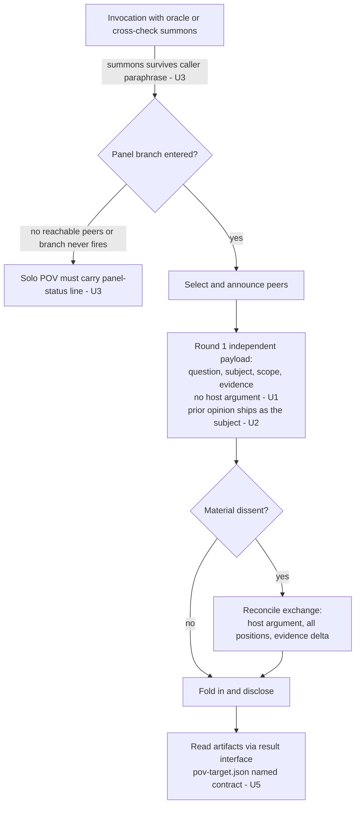

# ce-pov Oracle Panel Prompting and Disclosure - Plan

## Goal Capsule

- **Objective:** Make ce-pov's oracle panel more useful as decision support: round-1 peer payloads stop pre-arguing the host's case, a summoned panel running the current skill can never silently resolve solo (the stale-cache variant remains environmental), the "oracle a prior opinion" case becomes first-class, bounded inline grounding is licensed, and the peer result-artifact filename contract becomes explicit.
- **Authority:** This plan; then the repo's active instructions (`AGENTS.md`, especially Skill Prose Admission Rules and Applying Feedback to Skills); then `docs/solutions/skill-design/portable-agent-skill-authoring.md`.
- **Execution profile:** Prose edits to one skill plus a small script wording fix and test-pin updates. All edits are two-way doors. Behavioral changes are proven by cross-host skill-creator evals, not CI.
- **Stop conditions:** Stop and surface if an edit cannot be made without breaking a parity test (`tests/cross-model-receipt-parity.test.ts`, `tests/peer-job-runner-parity.test.ts`) — those blocks are shared with ce-code-review and ce-doc-review and must not fork. Stop if evidence emerges that a settled decision below cannot work.
- **Tail ownership:** Standalone run — implementer owns commit, PR, and eval evidence in the PR body.

---

## Product Contract

### Summary

Revise ce-pov's cross-model panel so the independent round asks a clean question (the host's argument enters at the reconcile exchange, its designed home), a summoned oracle always reports panel status, an already-formed opinion can be oracled as the subject, inline grounding is licensed within bounds, and hosts stop guessing peer artifact filenames.

### Problem Frame

A 9-run transcript analysis of real oracle-mode uses (2026-07-17 through 2026-07-21) found two failure families plus a third recurring usage pattern the panel had no defined handling for: a summons to oracle an already-formed opinion — the host's or the user's own view — which fits neither the independent nor the skeptic mode (this pattern, not a distinct harm, is what R5/U2 responds to). When the panel ran (5 runs), payloads systematically carried the host's analysis into round 1 — enumerated risk lists, decisive premises stated as fact, subject-authored advocacy, evaluative option labels — so peers partly ratified a pre-framed argument, and "full concurrence" overstated what the panel had tested. In two runs the user had to supply the correction the panel should have surfaced (a missed design category; an over-conservative recommendation). When the panel did not run (4 runs), an explicit oracle summons was silently dropped — a stale cached skill version plus invocation args that paraphrased away the word "oracle" — and the solo verdict shipped with no disclosure; in one session the user visibly believed peers had opined. Twice, hosts guessed peer artifact filenames (`pov-openai.json` where the script writes `pov-codex.json`), nearly converting successful peer runs into a false "no peers survived."

The goal is decision usefulness, not measurement purity: the protocol already tolerates stalemate as a terminal state, and reconcile rounds are the designed place for argument. The fix is sequencing and disclosure, not independence-accounting.

### Requirements

**Round-1 payload construction**

- R1. An independent-round payload carries the framed question, the subject, the read scope, and the evidence — not the host's argument. Host-authored risk enumerations, decisive premises, advocacy framing, and evaluative option labels wait for the reconcile exchange, which already shares every voice's position and reasoning.
- R2. The payload states that rejecting every supplied option, or the framing itself, is a valid position.
- R3. Inlined conversation-only material is labeled as such, and the user's stated goal — including its intensity — is carried when it bears on the decision.
- R4. The demonstrated-good mechanics stay required: point peers at working-tree files with an instruction to verify directly rather than trust the description, and request a decision-shaped answer in the active subject shape's vocabulary.

**Prior-opinion subjects**

- R5. When the subject is an already-formed position (the host's or the user's), the position ships in the payload as the subject; peers return their own verdict on the underlying question; those verdicts enter convergence. A user-supplied position gets the same handling as the host's — it is not withheld (it is the subject) and it is not capitulated to (peers still form their own view).

**Summons integrity**

- R6. An oracle/cross-check summons anywhere in the invocation context — the user's wording or a calling skill's args — enters the panel branch. A caller's paraphrase never cancels a summons (caller-neutral binding, per the `$ARGUMENTS`-is-Claude-only convention).
- R7. A POV delivered after any summons states panel status: which peers ran, or that none did and the observed reason. This rule is reachable in `skills/ce-pov/SKILL.md` itself, because a run that never loads the panel reference cannot obey a rule that lives only there.

**Grounding**

- R8. Bounded inline grounding is licensed when the load-bearing facts are already located and verified in the current context (typical for warm invocations and small Tier-1 subjects); scout dispatch remains the route for unscoped or noisy grounding. The Tier-1 prior-decision scan (`docs/solutions/`, ADRs) still runs either way.

**Mechanics and validation**

- R9. The peer artifact filename contract — `pov-<target>.json` in the round output directory, with the `grok-cli`/`grok-cursor` → `grok` collapse — is stated in the panel reference alongside an instruction to pass it as `--result-path` at job start; the script's usage text says "target," not "provider."
- R10. Behavioral prose changes are validated by paired cross-host evals (Claude and Codex); greppable contract tokens are pinned by widening existing `bun test` guards.

### Scope Boundaries

**Deferred to Follow-Up Work**

- A `docs/solutions/` capture of the 9-run analysis and the plugin-cache staleness lesson (no dedicated doc exists today; the canonical guidance sits in `AGENTS.md`). Route through `ce-compound` after this ships.
- An `--emit-result-path <route>` introspection mode in `cross-model-pov.sh` (parallel to `--emit-adapter`). The doc-plus-`--result-path` change closes the observed failure; introspection is optional hardening.
- A `references/cross-model-eval.md` spec file for ce-pov matching the ce-code-review/ce-doc-review sibling structure.

**Outside this plan's identity**

- Premise-stripping rules, frozen-POV audit mechanics, concurrence-discounting disclosures, or any rule whose only payoff is cleaner independence accounting. Explicitly rejected: the panel is decision support and stalemates are an acceptable terminal state.
- The stale-plugin-cache half of the silent-drop failure. Skills cache at session start; that is environmental, documented in `AGENTS.md` ("Validating Agent and Skill Changes"), and not fixable from skill prose.

### Sources

- Prior art: `docs/plans/2026-07-14-002-feat-ce-pov-cross-model-panel-plan.md` (the panel's original design plan).
- `docs/solutions/skill-design/dispatch-script-failure-degrade-outcome-not-boundary.md` — "state the specific loss in the coverage/availability note rather than letting it vanish as 'not run'" is direct precedent for R7; independence framed as a correctness invariant.
- `docs/solutions/skill-design/arguments-token-is-claude-only-in-skill-bodies.md` — caller-neutral input binding and reasoning over the prompt rather than token-matching; the exact mechanism for R6.
- `docs/solutions/skill-design/detached-job-lifecycle-for-delegated-work.md` — job-dir `result.json` vs run-level `pov-<target>.json` are different layers; R9 pins the run-level name only.
- `docs/solutions/skill-design/post-menu-routing-belongs-inline.md` — inline the trigger, not the content; governs where R7 and R8 text lives.
- `docs/solutions/integration-issues/portable-structured-output-schemas-across-model-clis.md` — `pov-schema.json` must stay within strict provider vocabulary; a schema rejection kills a route before inference and looks like an empty peer result.
- Sibling contract precedent: `skills/ce-code-review/references/cross-model-review.md` (names its artifact `adversarial-<provider>.json` and the exact `result --path` read command; ce-pov's panel doc has no equivalent — that asymmetry is the R9 bug).
- Eval precedent: PR #1189 (paired A/B, 2 hosts x 2 arms x 3 trials, blind grader, results table in PR body) and PR #1211 (harness-agnostic sentence plus parity string test).

---

## Planning Contract

### Key Technical Decisions

- **KTD1 — Sequencing rule, not exclusion checklists.** The payload fix is one falsifiable rule — the host's argument belongs to the reconcile exchange, round 1 carries question/subject/evidence — plus the three floor items (R2-R4), written floor-plus-goal. (session-settled: user-directed — chosen over premise-stripping/independence-accounting taxonomies: the panel is decision support, stalemates are an acceptable terminal state, and reconcile rounds are the designed home for argument.)
- **KTD2 — Prior-opinion subjects are first-class.** A new participation note defines subject-is-a-prior-position packaging rather than leaving it to improvisation between `independent` and `skeptic` modes. (session-settled: user-directed — chosen over dropping the case as over-specification: oracling an existing opinion is a primary use, for both agents and humans, versus starting unbiased.)
- **KTD3 — License-and-bound inline grounding.** SKILL.md Phase 1 gains an explicit condition under which inline verification replaces scout dispatch, keeping the prior-decision scan mandatory. (session-settled: user-directed — chosen over tightening scout enforcement or leaving the text untouched: all nine observed runs grounded inline with no observed harm, and a contract nobody follows trains the model that contracts are decorative.)
- **KTD4 — Script fixes ship in this plan.** The result-filename contract fix rides with the prose changes. (session-settled: user-directed — chosen over deferring to a separate change.)
- **KTD5 — The disclosure rule lives in SKILL.md Phase 3.** The panel reference loads conditionally; the silent-drop failure occurs precisely when it never loads. The summons-implies-panel-or-disclose rule must sit inline at the Phase 3 hook, with `cross-model-panel.md` §6 gaining only the matching "summoned but not entered" disclosure wording.
- **KTD6 — Filename fix mirrors the ce-code-review sibling pattern.** Name `pov-<target>.json` in the panel reference, instruct `--result-path` at `start` (making `done` artifact-keyed and `result <job-id>` guess-free), and fix the `pov-<provider>` wording in the script's usage header. The receipt and heartbeat blocks in `cross-model-pov.sh` are byte-parity-locked with two sibling workers — the edit stays outside those blocks.
- **KTD7 — Validation split.** Model-judged behavior (payload restraint, disclosure firing) goes to skill-creator paired evals on Claude and Codex; greppable tokens (the filename string, the disclosure stem, the reconcile-home sentence) go into existing test files by widening current pins, per the repo's right-size-new-guards rule.

### High-Level Technical Design

Where each change lands in the oracle flow:

Grounding (U4) sits before this flow in SKILL.md Phase 1 and is independent of the panel branch.

### Implementation constraints

- `tests/pov-skill-contract.test.ts` pins exact strings and ordering in SKILL.md Phase 3 and `cross-model-panel.md` §1/§4/§6 — the §4 payload-blindness pins (lines ~197-207) are the highest-collision zone. Every prose edit updates its pins in the same diff.
- `tests/scratch-root-contract.test.ts` pins the SKILL.md scratch block and two panel-doc strings; do not reword those passages.
- `tests/review-skill-contract.test.ts` requires the panel doc to keep the auth-failure execution-context sentences (whitespace-collapsed match).
- Per the Skill Prose Admission Rules: every added line must state a falsifiable constraint or counter a demonstrated tendency from the 9-run evidence; no motivational rationale.

---

## Implementation Units

### U1. Round-1 payload floor in the panel reference

- **Goal:** §4 of the panel reference states the sequencing rule and payload floor so independent rounds ask a clean question.
- **Requirements:** R1, R2, R3, R4 (KTD1)
- **Dependencies:** none
- **Files:** `skills/ce-pov/references/cross-model-panel.md`, `tests/pov-skill-contract.test.ts`
- **Approach:** Extend §4's existing exclusion sentence ("exclude ce-pov's position and every other voice's conclusion") with the sequencing rule: the host's argument — candidate-risk enumerations, decisive premises, advocacy, evaluative option labels — is reconcile-round material; round 1 carries the framed question, subject, scope, and evidence. Add the three floor items: rejection license (R2), provenance labels plus the user's goal and intensity (R3), and keep the existing point-don't-copy and verify-directly language (R4) intact. Also add one clause covering subjects the host authored in-session: present options symmetrically in the payload's own words even though the full subject document remains attached. Define round-1 "evidence" by provenance in one line — source-located facts and the user's decision-relevant need are round-1 material; host interpretations, risk rankings, and recommended consequences are not — with one worked example (e.g., "the file at path X contains Y" is round-1 evidence; "X is the risky option" waits for reconcile). Before editing §4, capture one real failing round-1 payload and confirm the host-authored text originates in the §4-constructed payload rather than upstream (SKILL.md assembly, caller args, peer-prompt construction); if it originates upstream, retarget the edit there. Write floor-plus-goal — one example, not a taxonomy; do not enumerate every pre-arguing pattern.
- **Patterns to follow:** The §4 edit sits beside the sentence it extends (local-scope rule from the authoring guide); `references/agents/pov-peer.md` already carries the peer-side independence language and should not need more than a sentence, if anything.
- **Test scenarios:**
  - `bun test` passes with §4 pins updated: the existing exclusion-sentence pin widened to also match the new sequencing sentence; one new falsifiable token pinned (e.g., the literal "reconcile" + "argument" pairing or the rejection-license sentence stem).
  - Negative check: the pinned §4 regexes fail against the pre-edit file content (proves the new pin would have caught the regression).
- **Verification:** `bun test tests/pov-skill-contract.test.ts` green; eval arm in U6 shows payload-restraint movement.

### U2. Prior-opinion-as-subject packaging

- **Goal:** The panel protocol defines what happens when the subject is an already-formed host or user position.
- **Requirements:** R5 (KTD2)
- **Dependencies:** U1 (both edit §4; land U1's shape first)
- **Files:** `skills/ce-pov/references/cross-model-panel.md`, `skills/ce-pov/references/invocation.md`, `tests/pov-skill-contract.test.ts`
- **Approach:** Add a short participation note in §1 (near the branch list) plus one §4 sentence: when the subject is a prior position, the position is the subject artifact and ships in the payload; peers answer the underlying question with their own verdict; those voices enter convergence (unlike `skeptic` mode); any fresh host meta-judgment formed after the summons is withheld per U1's sequencing rule; a user-supplied position is handled identically to a host one. In `invocation.md`, one line in the warm contract: a warm summons naming a position to oracle is this case, not a revision prompt — a follow-up summons after pushback re-enters the panel with a fresh round before any position change is emitted.
- **Patterns to follow:** §7's skeptic-mode paragraph shows the register for mode-defining prose; keep the new case in §1/§4 rather than minting a third mode.
- **Test scenarios:**
  - `bun test` passes with a new pin on the prior-position sentence stem in §1 or §4.
  - Existing skeptic-mode pins (`mode: skeptic`, no-convergence rule) still pass unchanged — the new case must not weaken them.
  - `bun test` passes with a new pin on the `invocation.md` warm-contract sentence stem (e.g., "is this case, not a revision prompt") in `tests/pov-skill-contract.test.ts`, so the invocation.md edit is covered per "every prose edit updates its pins in the same diff."
- **Verification:** `bun test tests/pov-skill-contract.test.ts` green; U6 eval scenario "oracle this opinion + my pov" produces a panel run, not capitulation.

### U3. Summons survival and panel-status disclosure

- **Goal:** A summoned oracle running the current (panel-aware) skill can never silently resolve solo. R7 does not reach the stale-cache variant, which is environmental and out of scope (see Scope Boundaries).
- **Requirements:** R6, R7 (KTD5)
- **Dependencies:** none
- **Files:** `skills/ce-pov/SKILL.md`, `skills/ce-pov/references/cross-model-panel.md`, `tests/pov-skill-contract.test.ts`
- **Approach:** At the SKILL.md Phase 3 panel hook, add the two rules inline: (a) a summons is detected by reasoning over the invocation context — the user's wording or a calling skill's args — and a caller's paraphrase never cancels it; (b) any POV delivered after a summons states which peers ran, or that none did and the observed reason. Rewrite the existing Phase 3 clause "If no panel runs, keep the solo result unchanged" so that after a summons it requires the panel-status line — the verdict content stays unchanged, a disclosure line is added — rather than authorizing an unchanged silent solo result. Preserve the pinned Phase 3 tokens and their order ("form ce-pov's own independent POV" before "finish the panel branch" before "Only then emit"). In `cross-model-panel.md` §6, extend the No-survivor bullet with the summoned-but-not-entered wording so the reference and SKILL.md agree. Frontmatter description likely needs no change (it already names the oracle panel and the pinned semantic-activation phrases). Confirm from the 9-run evidence whether any no-run case had the current panel-aware skill loaded and failed on paraphrase alone (the only case R7 reaches); if none did, state in R7/U3 that R7 prevents a future paraphrase-only variant rather than curing the observed stale-cache drops, so the goal is not overstated.
- **Patterns to follow:** `docs/solutions/skill-design/arguments-token-is-claude-only-in-skill-bodies.md` for caller-neutral binding phrasing; `dispatch-script-failure-degrade-outcome-not-boundary.md` for naming the specific loss in the availability note.
- **Test scenarios:**
  - `bun test` passes with Phase 3 pins updated and one new pin on the disclosure stem (e.g., "states which peers ran").
  - Ordering assertions in the Phase 3 pin block still hold after insertion.
- **Verification:** `bun test tests/pov-skill-contract.test.ts` green; U6 eval scenario "summons present in user prompt, absent from paraphrased args" produces either a panel run or an explicit unavailability line — never a bare solo verdict.

### U4. License-and-bound inline grounding

- **Goal:** SKILL.md Phase 1 matches observed-good behavior: inline verification is legal within bounds; scouts remain the route for unscoped grounding.
- **Requirements:** R8 (KTD3)
- **Dependencies:** none
- **Files:** `skills/ce-pov/SKILL.md`, `tests/pov-skill-contract.test.ts`
- **Approach:** Amend the Phase 1 header rule ("dispatch scouts, never inline") to a condition-plus-bound: when the load-bearing facts are already located and verified in the current context — typical for warm invocations and Tier-1 subjects with pre-located claims — the host may verify them directly with bounded reads instead of dispatching scouts; unscoped or noisy grounding still dispatches. The Tier-1 prior-decision scan (`docs/solutions/`, ADRs, design docs) stays mandatory on either path. Keep the "Send scouts directly to candidate-specific current evidence" pinned token or deliberately update it and its pin together. Inline the condition and bound only; do not add procedure (post-menu-routing learning: inline the trigger, not the content).
- **Patterns to follow:** The existing tier-sensitive dispatch block (SKILL.md lines ~81-87) is the insertion neighborhood; match its register.
- **Test scenarios:**
  - `bun test` passes with the Phase 1 pin updated to the new sentence and a pin on the mandatory prior-decision-scan clause surviving the edit.
- **Verification:** `bun test tests/pov-skill-contract.test.ts` green.

### U5. Result-artifact filename contract

- **Goal:** Hosts stop guessing peer artifact filenames; `done` becomes artifact-keyed.
- **Requirements:** R9 (KTD4, KTD6)
- **Dependencies:** none
- **Files:** `skills/ce-pov/references/cross-model-panel.md`, `skills/ce-pov/scripts/cross-model-pov.sh`, `tests/skills/ce-pov-cross-model-routes.test.ts`, `tests/pov-skill-contract.test.ts`
- **Approach:** In the panel reference's §4 dispatch paragraph, name the artifact — the worker writes `<run-dir>/pov-<target>.json`, where target is the resolved route target with `grok-cli`/`grok-cursor` collapsing to `grok` — and instruct passing exactly that path as `--result-path` on `peer-job-runner.py start`, mirroring `skills/ce-code-review/references/cross-model-review.md` lines 82/84/100. In `cross-model-pov.sh`, change the usage header's `pov-<provider>.json` wording to `pov-<target>.json` and add the one-line target mapping near the host-provider key list (the line that plausibly seeded the `pov-openai.json` guess). Stay outside the byte-parity receipt and heartbeat blocks; if any shared block must change, apply identically to all three workers and their parity tests — otherwise restructure the edit to avoid it.
- **Patterns to follow:** `skills/ce-code-review/references/cross-model-review.md` (documented artifact contract); `peer-job-runner.py start --result-path` semantics (done requires the file non-empty; `result <job-id>` reads `meta.result_path` with no guessing).
- **Test scenarios:**
  - In `tests/skills/ce-pov-cross-model-routes.test.ts` (a script-execution test that already pins the runtime `pov-claude.json` output file), widen the runtime file-output assertion to cover the `pov-<target>.json` naming behavior — this test checks produced files, not markdown.
  - In `tests/pov-skill-contract.test.ts` (which already loads the panel doc), pin the panel doc's `pov-<target>.json` contract sentence and the `--result-path` instruction — the doc-string pins live here, not in the runtime routes test.
  - `bun test` parity suites (`cross-model-receipt-parity`, `peer-job-runner-parity`) and `tests/scratch-root-contract.test.ts` (pins the panel-doc strings U5 edits) pass unchanged.
- **Verification:** `bun test` green across the five test files U5 touches (`ce-pov-cross-model-routes`, `pov-skill-contract`, `cross-model-receipt-parity`, `peer-job-runner-parity`, `scratch-root-contract`); a manual read of `cross-model-pov.sh --help` output shows target wording.

### U6. Cross-host behavioral evals and doc sync

- **Goal:** Prove the prose changes moved behavior on both hosts, and sync user-facing docs.
- **Requirements:** R10 (KTD7)
- **Dependencies:** U1, U2, U3, U4
- **Files:** `docs/skills/ce-pov.md`
- **Approach:** Run skill-creator paired A/B evals (old vs new prose injected blind, per the PR #1189 pattern: 2 hosts x 2 arms x 3 trials, blind grader seeing only emitted output, results table plus honest negatives in the PR body). Update `docs/skills/ce-pov.md` where it describes panel behavior (payload sequencing, disclosure, prior-opinion support). Record the per-finding `Change|Verify|Consider | owning layer | mechanism` ledger in the PR body per Applying Feedback to Skills.
- **Execution note:** Evals run through the skill-creator workflow, not ad-hoc same-session skill invocation — plugin skills cache at session start, so in-session invocation tests pre-edit content.
- **Test scenarios (eval arms):**
  - Payload restraint: a decision brief where the host has formed risks/premises; grade whether the round-1 payload defers them to reconcile while keeping question/subject/evidence. Old arm expected to leak; new arm expected to defer.
  - Summons disclosure: invocation where the summons appears in the user turn but not the paraphrased args; grade for panel entry or an explicit panel-status line. Old arm expected to go silent solo; new arm must never.
  - Prior-opinion: "oracle this — and here's my view"; grade for a real independent round versus capitulation, and for the user position shipping as subject.
  - Grounding license: warm Tier-1 subject with pre-located claims; grade that inline verification proceeds without scout ceremony and that an emitted grounding ledger names the prior-decision sources scanned and the load-bearing claims verified (the blind grader sees only emitted output, so the scan must be in that output). Add a negative case: a warm invocation carrying an unverified conversational claim must dispatch a scout or return a grounding blocker rather than grounding inline.
  - Decision quality: reconstruct one of the two documented convergence failures (a subject with a known missed design category, or a case with a defensible less-conservative answer) and grade whether the new-prose panel surfaces the correction unprompted. A panel that concurs and still misses it is a failure, not a pass — payload deferral is the means, decision usefulness the metric.
  - No-regression (clean concurrence): a subject where the panel legitimately should concur — sound host framing, no missed category, peers genuinely agree. Grade that the new prose still reaches clean concurrence, discloses it correctly, and does not manufacture false dissent, over-dispatch scouts, or add reconcile ceremony the case doesn't warrant. Old and new arms must both concur; a new arm that turns a should-concur case into noise or paranoia is a regression, not upside.
- **Verification:** Eval results table in the PR body with both hosts, each arm carrying a predeclared per-arm pass criterion; every required predicate must pass in every new-arm trial on both hosts, and any unmet or inconclusive new-arm trial blocks the Definition of Done. `docs/skills/ce-pov.md` reflects the new behavior; honest negatives reported rather than smoothed.

---

## Verification Contract

| Gate | Command / evidence | Applies to |
|---|---|---|
| Contract pins | `bun test tests/pov-skill-contract.test.ts` | U1-U5 |
| Route/artifact pins | `bun test tests/skills/ce-pov-cross-model-routes.test.ts` | U5 |
| Parity locks | `bun test tests/cross-model-receipt-parity.test.ts tests/peer-job-runner-parity.test.ts tests/scratch-root-contract.test.ts` | U1, U3, U5 |
| Full suite | `bun test` | all |
| Release consistency | `bun run release:validate` and `bun run plugin:validate` | all (skill content changed) |
| Behavioral proof | skill-creator paired evals, Claude + Codex; per-arm pass criteria met in every new-arm trial (any miss blocks DoD); results in PR body | U1-U4 via U6 |

## Definition of Done

- All six units landed; `bun test`, `bun run release:validate`, and `bun run plugin:validate` green.
- Every prose edit maps to one observed failure or observed usage pattern from the 9-run evidence (admission-rule check) — including U2/R5, which maps to the "oracle an already-formed opinion" pattern named in the Problem Frame — and the PR body carries the per-item Change/Verify/Consider ledger plus the eval results table for both hosts.
- Test pins updated in the same diff as each prose edit; at least one new falsifiable token per behavioral rule (payload sequencing, disclosure stem, filename contract).
- Every behavioral eval arm has a predeclared per-arm pass criterion; the new-arm trials pass on both hosts, and any unmet or inconclusive new-arm trial blocks completion (honest negatives still reported). The eval set includes a decision-quality arm (panel surfaces a documented missed correction) and a grounding-ledger arm with a scout-required negative case.
- No parity-locked block diverges across the three cross-model workers.
- `docs/skills/ce-pov.md` matches shipped behavior.
- No dead-end or experimental edits left in the diff.
