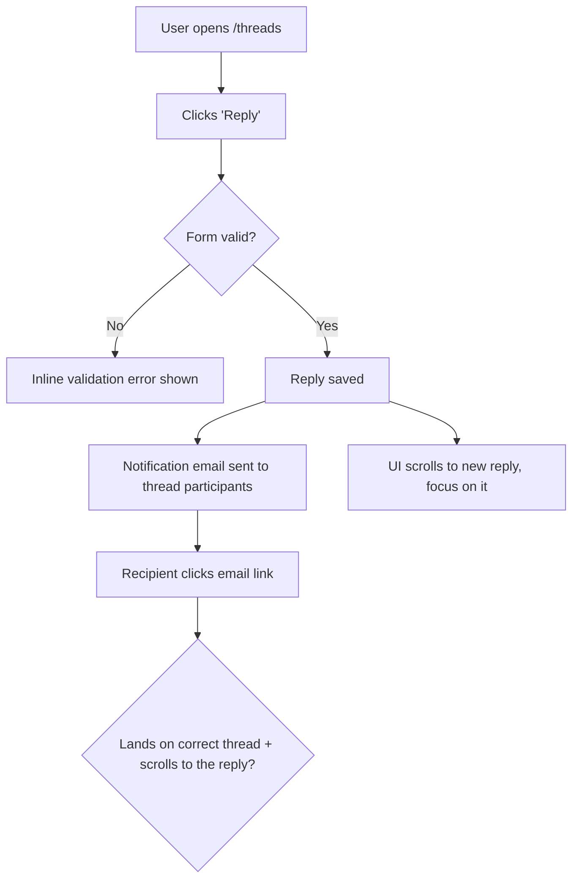

# Dogfood (Beta)（Dogfood Beta 版）

扮演一名端到端 dogfood **active branch** 的 QA engineer：理解每个变更，像用户一样在真实浏览器中测试每个变更，并自主修复 broken 的内容，直到 branch 真正 ready。

这是 **diff-scoped**，不是 whole-app exploration。你测试的是 *this branch* 相对 `main` 引入或修改的内容。（对于 full-app exploratory QA，请改用 `dogfood` skill。）

## Use `agent-browser` Only For Browser Automation（浏览器自动化只使用 `agent-browser`）

此 workflow 只通过 `agent-browser` CLI 驱动浏览器。不要使用 Chrome MCP tools（`mcp__claude-in-chrome__*`）、任何 browser MCP integration，或其他内置 browser-control tools。如果平台提供多种浏览器控制方式，始终选择 `agent-browser`。使用 direct binary，绝不要用 `npx agent-browser`（direct binary 使用快速 Rust client）。

## Prerequisites（前置条件）

- 一个你可以启动的 local dev server（`bin/dev`、`rails server`、`npm run dev` 等）。
- 已安装 `agent-browser`。检查：

  ```bash
  command -v agent-browser >/dev/null 2>&1 && echo "Ready" || echo "NOT INSTALLED"
  ```

  如果未安装，运行 `ce-setup` skill 安装 dependencies，然后 resume。没有它不要继续。

## Reusing Compound-Engineering Skills（复用 Compound-Engineering Skills）

`ce-dogfood-beta` 是一个 orchestrator。优先委托给已有 CE skills，而不是重新推导它们的行为：

| When | Skill | Why |
|------|-------|-----|
| Phase 0 isolation | `ce-worktree` | 在 isolated worktree 中运行 dogfood，让 main checkout 保持 clean。 |
| agent-browser missing | `ce-setup` | 安装 `agent-browser` 和其他 deps。 |
| failure 的 root cause 不明显 | `ce-debug` | 做系统性的 root-cause analysis，而不是 guess-and-check。 |
| Committing each fix | `ce-commit` | 保持 commit messages 一致且 scope 清晰。 |
| bug 揭示 reusable lesson | `ce-compound` | 捕获 learning，让团队 compound knowledge。 |

复用 `ce-test-browser` 的 port detection 和 dev-server startup 机制（见 Phase 3），不要重新发明。

## Workflow（工作流）

```
0. Scope        Pick the branch, get onto it (offer worktree), never touch main
1. Analyze      Diff branch vs main, understand every change
2. Map+Matrix   Map user flows as Mermaid flowcharts, then derive the test matrix as a task list
3. Serve        Detect port, start dev server, open agent-browser
4. Execute      Work the matrix one item at a time with agent-browser
5. Fix loop     On failure: fix -> add regression test -> commit -> continue
6. Report       Write durable doc to docs/dogfood-reports/ (flows, matrix, fixes, learnings, verdict)
```

### Phase 0: Scope and Get on the Right Branch（确定范围并切到正确分支）

解析 `$ARGUMENTS`：PR number、branch name，或空白（使用当前 branch）。如果存在 `--port PORT`，将其剥离。

1. 解析 target branch：
   - **PR number:** `gh pr checkout <number>`（先探测是否已有 worktree）。
   - **Branch name:** checkout 它（先探测是否已有 worktree）。
   - **Blank:** 使用当前 branch。
2. **拒绝在 `main`/`master` 上运行。** 如果解析出的 branch 是 trunk，停止并告诉用户：没有可 dogfood 的 diff。
3. **提供 isolation。** 询问是否在 git worktree 中运行，让 main checkout 不被触碰（使用平台的 blocking question tool）。如果 yes，handoff 给 `ce-worktree`；如果 no，在原地继续。
4. **如果存在 prior run，则 resume。** 查找 `docs/dogfood-reports/*-<branch-slug>-dogfood.md` 中的已有 report。如果找到一个带 unfinished scenarios 的 report，询问是 resume 还是 start fresh。要 resume，就从其 matrix 重新 hydrate task list（Pass/Fixed/Skipped 保持完成；Pending/Blocked/in-progress 变为 remaining work），并从那里继续。

### Resumability（可恢复性，随时停止并返回）

此 workflow 被设计为可以中断并 resume。两类 state 让这件事安全：

- **task list**（`TaskCreate`/`TaskUpdate`）是 live to-do：每个 matrix scenario 一个 task。开始时将每项标记为 `in_progress`，只有当它真正通过时才标记为 `completed`。
- **report doc** 位于 `docs/dogfood-reports/<YYYY-MM-DD>-<branch-slug>-dogfood.md`，是跨 session 存活的 durable checkpoint。**matrix 一存在就创建它（Phase 2 结束时）**，把每个 scenario 都列为 `Pending`，并且 **incrementally 更新**：每个 scenario 被判断后、每个 fix 被 commit 后都更新，而不是只在最后更新。

因为 tasks 是 session-scoped，而 report doc 在磁盘上，所以 report 是 resume 的 source of truth。始终保持二者同步，让之后的 run（或队友）能准确接上本次停止的位置。

### Phase 1: Analyze Changes（分析变更）

拉取相对 `main` 的完整 diff，并仔细阅读：你无法测试自己不理解的内容。

```bash
git diff --name-only main...HEAD     # what changed
git diff main...HEAD                 # how it changed
```

为每个变更建立 mental model：new features、modified behavior、new routes/views/components、touched data flows。记下任何产生 user-visible behavior 的内容：这就是 matrix 必须覆盖的内容。

**以产品 personas 和 vision 为根据。** 寻找 persona 和 vision context，让 flows 能从真实用户视角判断，而不只是“能不能用”。按顺序检查：`STRATEGY.md`（其 "Who it's for" section 会命名 primary persona 及其 job-to-be-done）、`VISION.md`，以及任何 persona docs（例如 `docs/personas/`、`PERSONAS.md`）。捕获 1-3 个 primary personas，以及每个人关心什么。如果没有，就从产品和 diff 推断一个合理 primary persona，并在 report 中说明。

### Phase 2: Map the Flows, Then Build the Matrix（先映射 flows，再构建 matrix）

整个 dogfood 的质量取决于此 phase。不要直接跳到扁平页面列表。先 **理解 diff 触及的 user flows**，再从中派生 matrix。没有 flow model 的 matrix 只会孤立测试页面，并错过 journey：例如 email “发送了”，但落到了错误 thread。

#### 2a. Map the user flows（映射 user flows，必需）

对每个 user-visible change，端到端追踪 **complete journey** 并画出来。将每个 flow 映射为 **Mermaid `flowchart`**，让 journey 在任何测试发生前就显式且可 review：entry point、每个 user action、branch points（success / validation error / empty / permission-denied）、side effects（emails、jobs、notifications），以及真实 end state。

> Email example：仅仅“an email sends”还不够。它是否发给了 *right* recipient？用户 click through 后，app 是否落到并滚动到 *right* message？内容是否合理？整个 flow 是否符合产品 vision 和 UX？flowchart 必须包含 click-through 及其 destination，不能停在“email sent”。



每个 distinct journey 产出一张 flowchart。覆盖 happy path **以及** branch points（error、empty、boundary、permission）。这些 diagrams 就是理解本身：它们会成为 matrix 的 spine，并属于 final report。

#### 2b. Derive the matrix from the flows（从 flows 派生 matrix）

遍历每张 flowchart，将每个 node 和 branch 转化为一个或多个 test scenarios。阅读 `references/test-matrix-taxonomy.md` 获取完整维度集合（journeys、functional checks、experiential checks、edge/error/empty states、accessibility、responsiveness）。同时覆盖 **functional**（"does it work?"）和 **experiential**（"does it feel right and align with the product?"）。

将 changed files 映射到具体 routes（views -> 对应 pages，components -> 渲染它们的 pages，layouts -> all pages，stylesheets -> key pages 上的 visual regression），并把这些 routes 附到会 exercise 它们的 flows 上。

**将 matrix 加载为 task list**（`TaskCreate`），每个 scenario 一个 task，这样可以跟踪进度且不会漏掉任何内容。按 flow 排序 tasks，跟随 flowcharts，而不是按文件排序。

### Phase 3: Detect Port and Start the Dev Server（检测端口并启动 dev server）

确定 port（优先级：显式 `--port` > `AGENTS.md`/`CLAUDE.md` > `package.json` dev script > `.env*` 中的 `PORT=` > 默认 `3000`）。如果 server 已在监听，复用它；否则在后台启动项目的 dev command，并等待 port 可用。这与 `ce-test-browser` 使用的机制相同：遵循其 Phase 5-6 逻辑。

```bash
agent-browser open "http://localhost:${PORT}"
agent-browser snapshot -i
```

### Phase 4: Execute the Matrix（执行 matrix）

**一次处理 task list 中的一项**。对每个 scenario，先将 task 标记为 `in_progress`，然后：

1. **Document** 你正在测试什么（journey 和 expected outcome）。
2. 用 agent-browser **Drive it**：navigate、为 interactive refs 做 snapshot、click、fill、submit，并跟随 journey 到达真实 end state：

   ```bash
   agent-browser open "http://localhost:${PORT}/<route>"
   agent-browser snapshot -i
   agent-browser click @e1
   agent-browser fill @e2 "value"
   agent-browser screenshot <scenario>.png
   agent-browser errors      # check console/page errors
   ```

3. 同时 **Judge** correctness 和 experience：right data、right destination、sensible content、无 console errors，并判断它是否感觉与产品一致。
4. **以每个 persona 的视角走一遍。** 从每个 primary persona（来自 Phase 1）的视角在脑中重跑 journey，并询问他们在哪里会感到 **paper cut**：不会让 functional test 失败、但会降低体验的小摩擦，例如令人困惑的 label、多一次点击、意外跳转、感觉缓慢的步骤、缺少反馈、copy 与该 persona 的思维方式不匹配。一个 scenario 可以 functionally `Pass`，但仍有 paper cuts。记录每个 paper cut、感受到它的 persona，以及 severity。
5. **Record** pass/fail 和任何 paper cuts，写具体。只有当 task 真正通过时才标记为 `completed`（paper cuts 会被记录，但不是 blockers：在 Phase 5 修复尖锐的，其余在 report 中呈现）。

**External-interaction flows**（OAuth、真实 email delivery、payments、SMS）无法完全 headlessly 驱动：暂停并请用户验证这一段，然后继续。

### Phase 5: Fix Loop（自主修复循环）

当 scenario 失败时，**fix it and prove it**，但先判断这个 fix 是否适合你自主完成，还是需要人类决策。

**在触碰代码前判断 fix 的大小。** 当 change 小、理解充分且低风险时 auto-fix：明确 bug、有明显正确修复、限制在少数文件内、没有 schema/architecture/product trade-off。**Do not auto-fix** 大或模糊的 change：它需要 architectural 或 schema decision、改变 product behavior 或 UX intent、横跨许多文件、有多个合理竞争方案，或你不确定“正确”答案是否明确。自主强行做大判断，比升级处理更糟。

**对于 autonomous fixes：**

1. 调查 root cause。如果不明显，使用 `ce-debug`。
2. 在代码中应用 fix。
3. **添加 automated regression test**，它在 fix 前失败、fix 后通过，确保 bug 不会回归。
4. 用清晰 message commit fix（使用 `ce-commit`）。每个 commit 一个 logical fix。
5. 在浏览器中重跑 failing scenario，确认现在通过；然后继续 matrix。
6. 如果 bug 携带 reusable lesson，用 `ce-compound` 捕获。

**对于太大、无法自主完成的 changes：** 不要实现。将它记录到 report 的 **Decisions for a human** section，包含：什么 broken、为什么它不是 safe autonomous fix、你看到的选项（带 trade-offs）以及你的推荐。在 matrix 中将 scenario 标记为 `Blocked (human decision)`，然后继续处理其余项。绝不要为了清掉一个 matrix item 而做大规模、不可逆或改变产品的 change。

持续迭代，直到每个 task 都是 `completed` 或明确 `Blocked (human decision)`。重新测试任何可能受 fix 影响的内容（注意 adjacent journeys 中的 regressions）。

### Phase 6: Write the Report Artifact（写入报告 artifact）

report doc 已在 Phase 2 结束时创建，并在过程中 incrementally 更新（见 Resumability）。当 matrix green（或每个 remaining item 都明确 blocked）时，在被测 repo 中的 `docs/dogfood-reports/<YYYY-MM-DD>-<branch-slug>-dogfood.md` **finalize** 它，然后在聊天中呈现带文件路径的简短 summary。

使用 `references/dogfood-report-template.md` 作为结构，就像 plans 和 brainstorms 从 template 捕获一样。finalized artifact 必须包含：

1. **Diff Summary** — branch 与 `main` 之间 changed 的内容。
2. **Personas** — 被评估的 primary personas（及其 source：STRATEGY.md / VISION.md / inferred）。
3. **Flows tested** — Phase 2a 的 Mermaid flowcharts，以保存 journeys。
4. **Test Matrix & Results** — 每个 scenario：测试了什么、pass/fail、发现的问题、应用的 fix、commit SHA。
5. **What was fixed** — 每个 bug、其 root cause、fix、添加的 regression test 和 commit。
6. **Paper cuts (by persona)** — 发现的 experiential friction、哪个 persona 会感受到、severity，以及 fixed 或 deferred。
7. **Decisions for a human** — 太大无法自主修复的问题：什么 broken、为什么升级处理、带 trade-offs 的选项，以及推荐。
8. **Learnings** — 值得带走的 reusable lessons（重要的 ones 喂给 `ce-compound`）。
9. **Final Status** — readiness verdict，加上仍 blocked 或需要 human verification 的任何内容。

在 doc 中使用 repo-relative paths，绝不要使用 absolute paths，这样它才能保持 portable。
