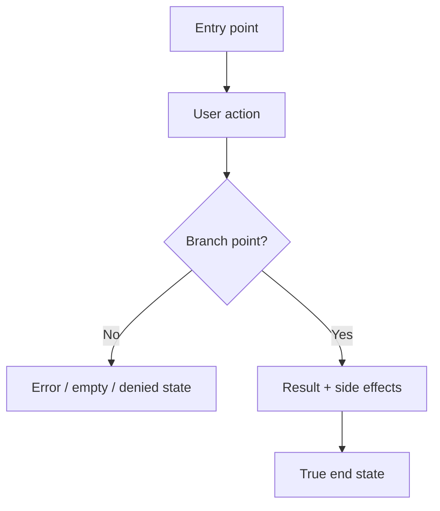

# Dogfood Report（Dogfood 报告）— <branch>

> `<branch>` vs `main` 的 diff-scoped browser QA。由 `/ce-dogfood-beta` 于 <YYYY-MM-DD> 生成。

## Diff Summary（Diff 摘要）

<branch 和 main 之间的变化：new features、modified behavior、new/changed routes、views、components、data flows。2-6 bullets。>

## Personas（用户画像）

<用于判断 flows 的 primary personas，以及每个 persona 关心什么。注明来源：STRATEGY.md "Who it's for"、VISION.md、persona doc，或没有来源时标为 "inferred"。>

- **<Persona name>** — <job-to-be-done / 他们关心什么>

## Flows Tested（已测试 Flows）

<diff 触及的每个 distinct user journey 一个 Mermaid flowchart。包含 happy path 和 branch points（validation error、empty、permission-denied）、side effects（emails、jobs、notifications），以及 true end state，包括 click-through destinations。>

## Test Matrix & Results（测试矩阵与结果）

| # | Flow | Journey / Scenario | Status | Issue | Fix | Commit |
|---|------|--------------------|--------|-------|-----|--------|
| 1 |      |                    | Pass   | -     | -   | -      |
| 2 |      |                    | Fixed  |       |     | abc123 |
| 3 |      |                    | Blocked (needs human verify) | | | |

Status values（状态值）：`Pending`、`Pass`、`Fixed`、`Skipped`、`Blocked (needs human verify)`、`Blocked (human decision)`。每个 scenario 都从 `Pending` 开始，让此表同时作为 resume checkpoint。

## What Was Fixed（修复了什么）

对每个发现并修复的 issue：

### <Short issue title（简短 issue 标题）> — `<commit>`
- **Symptom（症状）:** <用户看到什么 / browser 中什么失败>
- **Root cause（根因）:** <为什么发生>
- **Fix（修复）:** <修改了什么，repo-relative file paths>
- **Regression test（回归测试）:** <新增的 test，修改前失败 / 修改后通过>

## Console Errors（Console 错误）

<观察到的任何 console 或 network errors，以及它们是否已解决。干净时写 "None"。>

## Human Verifications（人工验证）

<External-interaction legs（OAuth、real email delivery、payments、SMS）：confirmed、pending 或 not applicable。>

## Decisions for a Human（需要人类决定）

<过大或过于 ambiguous、无法 autonomously fix 的 issues：architectural/schema changes、product/UX trade-offs、competing solutions。每个 issue 一个 block。Matrix 中将这些标记为 `Blocked (human decision)`。如果所有 issue 都已 safe auto-fixed，写 "None"。>

### <Short title（简短标题）>
- **What's broken（哪里坏了）:** <symptom / failing scenario>
- **Why escalated（为什么升级给人类）:** <为什么这不是 safe autonomous fix：scope、risk、ambiguity、product trade-off>
- **Options（选项）:** <option A（trade-offs）/ option B（trade-offs）>
- **Recommendation（建议）:** <agent 建议的方向，供 human 确认>

## Learnings（可复用经验）

<值得带入未来的 reusable lessons：patterns、gotchas、product/UX insights。将 substantial learnings 交给 `ce-compound`。>

## Final Status（最终状态）

<branch 的 overall readiness verdict。是否 ready to ship？Caveats？Outstanding blocked items？>
